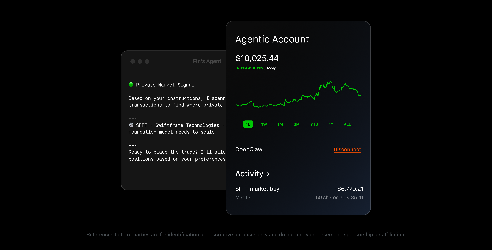

# Robinhood Just Let AI Trade Your Stocks and Swipe Your Card

_The moment MCP — a tool built for code — became infrastructure that moves money, the open question is data trust and liability_

## Executive Summary

> [!callout]
> On May 27, 2026, Robinhood formally opened two features that let an AI agent buy and sell stocks and pay with a credit card on a customer's behalf. Give an external AI like ChatGPT or Claude a natural-language instruction such as "switch me into a higher-yield portfolio," and the agent decides on its own when to buy and sell, then places the orders. It is open to all 27.5 million Robinhood customers. Where AI used to give advice, it now moves the money directly.

> The backbone is MCP, the Model Context Protocol. For nearly two years this protocol let code editors read repositories; bolted onto Robinhood's servers, it has become infrastructure that moves actual funds. This is the first large-scale release of agentic AI into regulated finance. Yet Robinhood's terms are explicit: the user bears responsibility for every trade the agent makes, and the company does not supervise or audit the agent. Five months before the launch, FINRA had already drawn a line — the moment AI moves from generating content to taking action, a firm's supervisory duty shifts.

> The thread this piece follows is a single question: for an agent to be allowed to move money in a person's place, what state must the data beneath that judgment be in? Walk through what Robinhood opened and how, where it parts ways with robo-advisors, the split that opened across the industry, and the line FINRA drew on liability — and the answer to that question gathers, all of it, as data.

### Key Figures

Sources: [CNBC](https://www.cnbc.com/2026/05/27/your-ai-agent-can-now-trade-for-you-on-robinhood-and-buy-stuff-with-your-credit-card-too.html), [Robinhood Newsroom](https://robinhood.com/us/en/newsroom/robinhood-is-now-open-to-agents/), [FINRA](https://www.finra.org/sites/default/files/2025-12/2026-annual-regulatory-oversight-report.pdf)

Four numbers carry the weight of this announcement: the customer base opened to agents, the cashback attached to agent purchases, the lead time by which regulation got ahead of the product, and where liability points. The last number matters most. Autonomy is delegated 100%, but the responsibility for outcomes stays 100% with the user.

<!-- stat-card -->
**27.5M** — customers opened to agents — The first large-scale opening of agentic AI into regulated finance

<!-- stat-card -->
**3%** — cashback on agent purchases — Earned when the AI pays via the agentic card — a design that rewards autonomous spending

<!-- stat-card -->
**5 months** — regulation's head start — FINRA's "Trade Execution Agent" definition (Dec 2025) preceded the launch (May 2026)

<!-- stat-card -->
**100%** — user liability — Every agent trade is the user's responsibility; Robinhood does not supervise or audit

## What Robinhood Did

On May 27, 2026, the headline Robinhood ran in its newsroom was "Robinhood is now open to agents." The announcement, covered the same day by CNBC, TechCrunch, and Bloomberg, has two parts. One is agentic trading: a third-party AI agent autonomously buys and sells stocks on the user's behalf. The other is the agentic credit card: an AI agent pays directly through a dedicated virtual card. Founder Vlad Tenev's line captures the nature of the announcement: "Our mission has always been to democratize finance for all, and now that mission extends to AI agents."

This was not a sudden leap. Robinhood released its analysis-and-insight tool, Cortex, first, in March 2025. Cortex only guided; it did not trade. That May an early beta of agentic trading appeared, and a year later — on May 27, 2026 — trading and the credit card went live together. It is a two-tier structure: an execution layer that acts, sitting on top of Cortex, which guides. Advice and execution, once kept apart, are now stitched into one.

The point is simple: AI buys stocks in your place, and swipes the card in your place. The user throws out an intent in natural language — "buy those sneakers if the price drops below a certain line," or "cut the volatility in this portfolio" — and the agent handles the rest. The reason this is an inflection point is that AI, until now, lived in the seat of an advisor that tells you what you might do. Now it goes past advice and pulls the trigger.

*▲ Robinhood Agentic Account UI. Left: an AI agent (Fin's Agent) analyzing market signals and reviewing a trade. Right: the isolated agentic account showing balance, activity feed, and a one-tap disconnect button. | Source: [Robinhood Newsroom](https://robinhood.com/us/en/newsroom/robinhood-is-now-open-to-agents/)*

> [!callout]
> **What changed**: the core shift is from "AI advises" to "AI moves the money directly." The moment trading and payment are handed to an agent, what you need to assign right and wrong is traceability and audit of outcomes. Who placed that order, why, and on what data — that becomes a money question immediately.

## MCP Now Moves Money

The technology behind the features is MCP, the Model Context Protocol. An open standard created by Anthropic, it lets an AI agent call external tools through a structured server interface. Robinhood stood up its own MCP server, and the trading endpoint is `agent.robinhood.com/mcp/trading`. Point an agent client at that address and the connection is done. At launch the supported clients were Claude Code, Claude Desktop, ChatGPT, Codex (OpenAI), Cursor, and Grok, and any other MCP-capable client can connect through the same link.

Here is the change worth naming. For the past two years MCP mostly let code tools read repositories and handle files. The same protocol now moves funds in real accounts. An interface that read code became an interface that moves money — that, precisely, is the technical center of gravity of this event. The standard is unchanged; what the standard touches shifted from text to assets.
