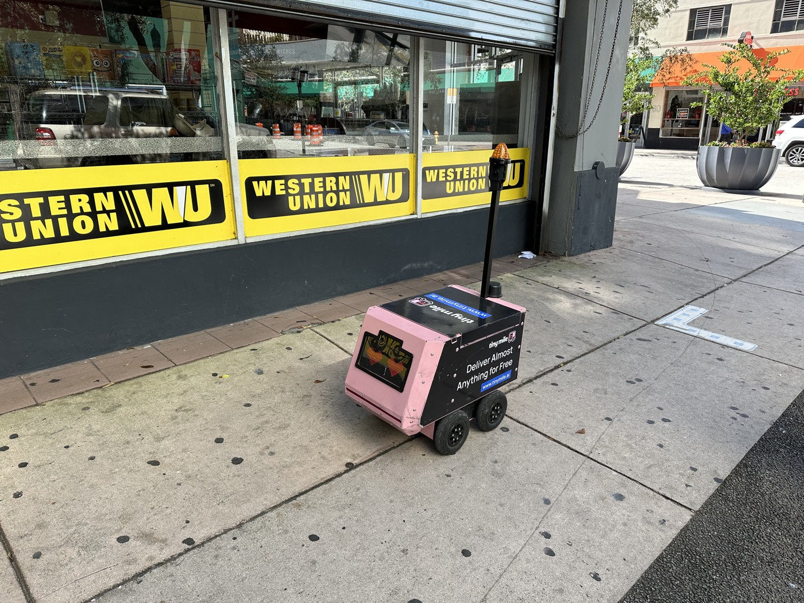
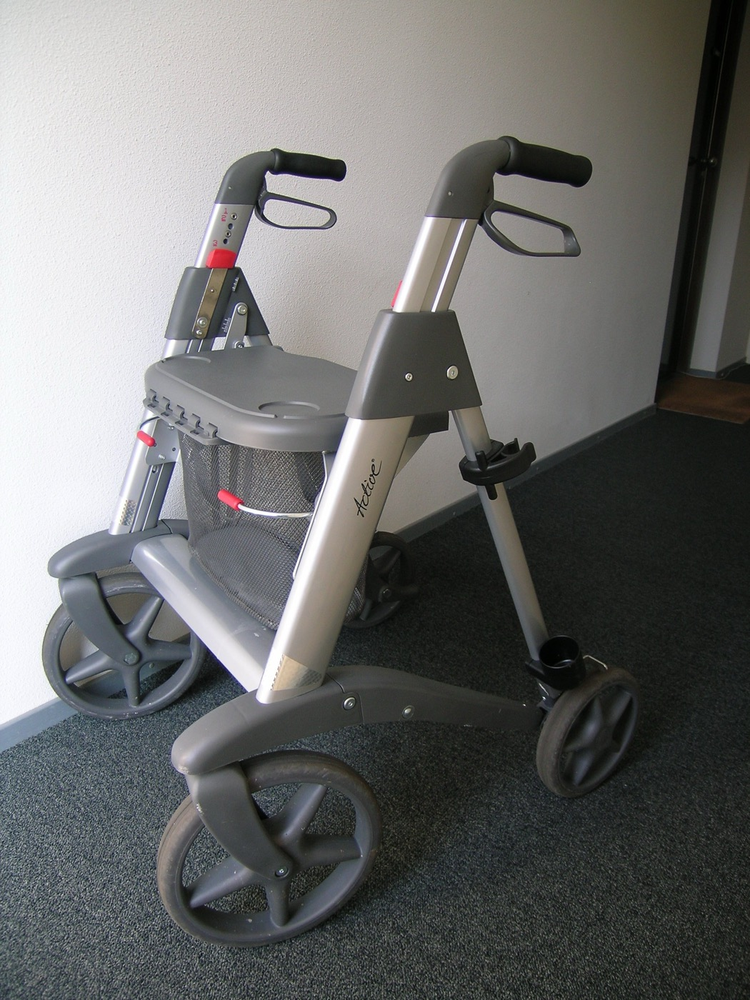

# 계단을 못 오르는 장비로 모은 데이터가 로봇이 갈 길을 정한다

_노스이스턴대 연구 — 보행보조기로 모은 도로 37.2km로 미세조정한 로봇 주행 모델은 예측 오차를 최대 24.8% 줄였다_

## Executive Summary

> [!callout]
> 이 글은 로봇 없이 로봇 주행 데이터를 모은 연구를 본다. 노스이스턴대 체험로보틱스연구소의 사르베시 프라자파티와 아난야 트리베디, 로레나 마리아 제누아, 드레이크 무어, 타슈큰 파드르, 그리고 같은 대학 코리 컴퓨터과학대의 브루스 맥스웰이 9월 17일 arXiv에 올린 논문이다. 이름은 UNI, 바퀴 달린 로봇의 주행을 가르칠 데이터를 그 로봇 없이 모으는 방식을 가리킨다.

> 장비는 어디서나 살 수 있는 네 바퀴 보행보조기에 스마트폰을 물린 것이 전부다. 이 장비는 계단을 오르지 못하고, 낮춰 놓지 않은 연석을 넘지 못하며, 제 폭보다 좁은 틈을 지나지 못한다. 그래서 수집자가 고르는 경로는 자연히 바퀴로 다닐 수 있는 길로 좁아진다. 여섯 명이 미국 세 도시에서 87회에 걸쳐 37.2km를 모았고, 이 데이터로 미세조정한 주행 모델 세 종의 궤적 예측 오차가 17.4~24.8% 줄었다. 다만 같은 조정이 모든 데이터셋에서 이득이 되지는 않았다. 기존 코퍼스 하나에서는 오히려 성능이 내려갔고, 저자들은 그 사실을 표에 그대로 실었다.

> 4절까지는 논문이 보고한 설계와 수치, 저자가 스스로 그어 둔 한계선을 따라간다. 5절에서 이 결과를 데이터셋 문서에 무엇을 적어 둘 것인가의 문제로 옮겨 읽는 대목은 이 글의 해석이다.

### 주요 수치

출처: [Prajapati, S. 외 (2026), arXiv:2609.20114v1](https://arxiv.org/abs/2609.20114)

<!-- stat-card -->
**37.2km** — 로봇 없이 모은 주행 거리 — 여섯 명이 보스턴·뉴욕·우스터에서 87회에 걸쳐 모았다. 녹화 시간으로는 10.8시간이다

<!-- stat-card -->
**250달러** — 수집 장비 값 — 스마트폰은 뺀 값이다. 조립에 30분이 들고 3D 프린팅 부품이나 전용 제작 하드웨어는 쓰지 않는다

<!-- stat-card -->
**0건** — 계단·미절단 연석 통과 — 관성센서와 깊이로 의심 구간을 추린 뒤 영상으로 다시 봤다. 확인된 통과는 없었다

<!-- stat-card -->
**17.4~24.8%** — 궤적 예측 오차 감소 — GNM·ViNT·NoMaD 세 모델을 이 데이터로 미세조정한 뒤 남겨 둔 UNI 구간에서 측정했다

## 로봇 데이터는 로봇이 있어야 모인다

보도 위를 달리는 바퀴 로봇이 늘고 있다. 마지막 구간 배달, 시설 점검, 전동 이동기기가 대표적이다. 이런 환경에서 학습으로 주행을 익히려면 그 현장에서 찍은 다양한 시연 데이터가 필요한데, 그 데이터를 모으는 일 자체가 비싸다. 로봇 플랫폼을 실어 나르고 정비하고 감독해야 하기 때문이다. 논문은 학계 연구팀이 감당할 수 있는 장소와 조건의 수가 이 요구 때문에 제한된다고 적고, 상업 플릿이 모은 데이터가 비공개로 남을 수 있다는 사정도 든다.

*▲ 보도를 달리는 배달 로봇. 이런 바퀴 로봇의 주행 데이터를 모으려면 로봇 자체를 현장마다 실어 날라야 한다 | 사진: Phillip Pessar, [Wikimedia Commons (CC BY 2.0)](https://commons.wikimedia.org/wiki/File:Robot_Delivery_Downtown_Miami_FL_20_November_2022.jpg)*

그래서 로봇을 빼고 모으려는 시도가 이어졌다. 사람이 몸에 장비를 두르고 걷는 방식이 하나다. MuSoHu와 EgoWalk가 그렇게 모았다. 웹에 올라온 보행·주행 영상에서 카메라 움직임을 되짚어 사람이 라벨을 붙이지 않고도 학습 신호를 만드는 CityWalker 같은 접근도 있다. 둘 다 로봇을 운영하는 부담을 크게 덜어 준다. 대신 CityWalker는 궤적의 배율 문제를 실제 거리를 되찾는 쪽이 아니라 정규화하는 쪽으로 넘겼다. 미터 단위가 필요한 자리에서는 그 차이가 남는다.

문제는 사람이 걸어 다닌 경로에 있다. 사람의 보행 경로에는 계단과 낮춰 놓지 않은 연석, 좁은 틈이 섞여 들어간다. 바퀴 로봇은 그런 곳을 지나지 못한다. 이 대목에서 논문이 쓴 한 문장이 연구 전체의 출발점이다. 그런 경로를 나중에 걸러 내도, 애초에 시연된 적 없는 바퀴로 갈 수 있는 대안 경로는 되살릴 수 없다.

비슷한 문제를 조작 분야가 먼저 풀었다. UMI는 사람이 손에 쥐는 프록시 그리퍼로 로봇 없이 시연을 모으면서, 작업에 중요한 물리적 제약은 그대로 남겼다. 이 방식은 공중 조작이나 접촉이 많은 촉각 작업으로도 번졌다. 저자들이 던진 물음은 이 계보를 내비게이션으로 옮긴 것이다. 단순한 물리적 프록시 하나로, 로봇 없이 모으면서 사람의 시연을 바퀴로 갈 수 있는 경로 쪽으로 기울일 수 있는가.

## 250달러짜리 보행보조기와 라이다 달린 아이폰

답으로 내놓은 장비는 소박하다. 시중에서 파는 네 바퀴 보행보조기에 흔한 거치대로 스마트폰을 물렸다. 조립에 30분쯤 걸리고, 3D 프린팅 부품도 전용 제작 하드웨어도 필요 없다. 스마트폰을 빼면 250달러 안팎이다. 수집자는 네 바퀴를 모두 땅에 붙인 채 장비를 밀고 걷는다. 그러면 계단과 미절단 연석 대신 경사로와 연석 절단부를 고르게 되고, 장비 폭보다 좁은 통로는 애초에 들어가지 못한다.

*▲ 시중에서 파는 네 바퀴 보행보조기. 여기에 스마트폰을 거치대로 물리면 수집 장비 전부다 | 사진: DirkvdM, [Wikimedia Commons (CC BY 3.0)](https://commons.wikimedia.org/wiki/File:Rollator.jpg)*

이 제약이 지침이 아니라 사물이라는 데 힘이 있다. 수집 지침은 어겨질 수 있고, 어겼는지 확인하기도 어렵다. 앞선 연구가 이미 그 사실을 보여 준다. 사람이 장비를 두르고 걷는 방식으로 모은 EgoWalk는 수집 지침을 분명히 두었는데도 로봇이 할 수 없는 동작이 시연에 섞일 수 있다고 인정했고, MuSoHu는 걸음걸이가 만드는 흔들림과 시점 차이를 한계로 짚었다. 반면 계단 앞에 선 네 바퀴는 논쟁의 여지가 없다. 아래 도식은 같은 거리를 사람이 걸을 때와 보행보조기를 밀고 걸을 때 경로가 어디서 갈라지는지를 나타낸 것이다.
