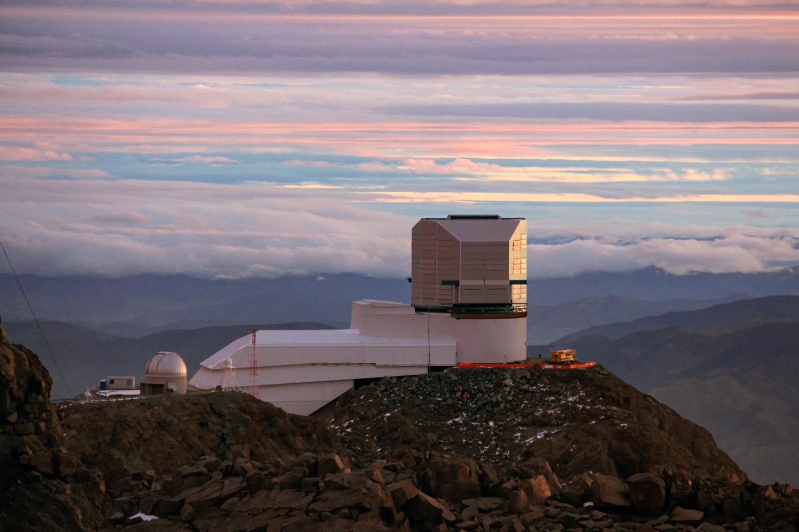

# 띄엄띄엄 찍은 사진으로 소행성이 도는 시간을 알 수 있을까?

_브라질 연구진이 베라 루빈 천문대 관측을 일부러 줄여 시험했고, 후보 140개 중 36개만 믿을 만한 자전주기를 남겼다_

## Executive Summary

> [!callout]
> 소행성은 저마다 다른 속도로 팽이처럼 돈다. 한 바퀴 도는 데 걸리는 시간을 알아내는 방법은 단순하다. 같은 소행성을 여러 번 찍어 밝기가 오르내리는 리듬을 읽으면 된다. 다만 그 리듬은 사진이 충분히 쌓였을 때만 보인다. 칠레의 베라 루빈 천문대가 2025년부터 2026년 사이 시험 가동 중에 남긴 관측은 그 조건에 한참 못 미쳤다. 대부분의 천체가 하루 이틀에 몰아서 몇십 번 찍힌 뒤 한참 잊혔다. 브라질 상파울루주립대의 발레리오 카루바 등 10명이 9월 24일 arXiv에 올린 논문은 그런 자료를 앞에 두고 질문을 뒤집었다. 사진을 더 모으는 대신, 답이 나오려면 사진이 어떻게 모여 있어야 하는지를 먼저 계산했다. 이 글은 그 계산이 무엇을 정해 두었는지를 본다.

> 연구진은 잘 관측된 소행성 하나를 골라 그 자료를 일부러 깎아냈다. 관측을 몇 개의 시간 덩어리로 나누고 그 폭을 바꿔 가며 30개만 남긴 뒤, 그래도 원래의 자전주기가 되살아나는지를 열 번씩 확인했다. 둘로 나눈 가장 빡빡한 조건에서 한 계산법은 열 번 모두 실패했고, 넷으로 늘리자 열 번 모두 성공했다. 사진 장수는 그대로였다. 다만 그 기준으로 실제 관측을 걸러 보니 초기 후보 140개 중 36개만 남았고, 통과한 36개의 평균 관측 횟수는 286회였다. 성기게 찍어도 된다는 이야기가 아니라, 어디부터가 성긴 것인지에 숫자로 금을 그은 이야기다.

> 1절부터 4절까지는 논문에 적힌 내용이다. 5절은 그 내용에서 이 글이 끌어낸 해석이다.

### 주요 수치

출처: Carruba 외, [arXiv:2609.29841](https://arxiv.org/abs/2609.29841) (Planetary and Space Science 게재 확정) 본문 5장·6장과 부록 표 C.7.

<!-- stat-card -->
**0번 → 10번** — 덩어리를 둘에서 넷으로 늘렸을 때 — 가장 좁은 창에서 푸리에 방식은 열 번 시도해 한 번도 자전주기를 되살리지 못했다. 사진 수는 30개로 같았다

<!-- stat-card -->
**36 / 140** — 신뢰 기준을 통과한 천체 — 2월과 4월 두 차례 자료의 초기 후보 140개 가운데 약 26%만 남았다. 나머지에는 주기 값을 매기지 않았다

<!-- stat-card -->
**286회** — 통과한 36개의 평균 관측 횟수 — 앞선 퍼스트룩 자료에서 믿을 만한 주기를 얻은 76개의 평균 290회와 거의 같은 값이다

<!-- stat-card -->
**2건 중 2건** — 문헌과 맞춰 본 분류의 불일치 — 기존 분류가 있어 직접 비교할 수 있었던 천체는 둘뿐이었고, 둘 다 이번 결과와 어긋났다

## 정답을 아는 소행성 하나를 일부러 깎았다

루빈 천문대는 아직 본 임무를 시작하지 않았다. 지금 쌓이는 것은 장비와 절차를 맞춰 보는 과정에서 나온 관측이고, 앞서 한 차례 공개된 퍼스트룩 자료와는 성격이 다르다. 퍼스트룩은 2025년 4월 21일부터 5월 5일까지 아홉 밤 동안 약 34만 회를 찍어 천체 2,103개를 훑은 자료다. 마지막 밤을 뺀 밤마다 60회가 넘는 촬영이 몇 시간 안에 몰렸다. 그렇게 모으고도 믿을 만한 자전주기가 나온 것은 76개였다. 천체당 관측 횟수의 중앙값은 132회였는데, 주기를 얻어 낸 76개의 평균은 290회였다. 반면 이번에 쓰인 과학검증 관측은 천체 대부분이 165회 이하로 찍혔고, 그 관측조차 두세 개의 짧은 시간대에 몰려 있다. 2월 자료에서 150회 넘게 찍힌 것은 주소행대 천체 30개와 근지구천체 2개뿐이었다. 같은 망원경의 자료인데 밀도가 다르다.

*▲ 칠레 세로 파촌 산정의 베라 루빈 천문대. 이번 논문이 다룬 성긴 관측이 여기서 나왔다 | Source: [J. Fuentes / Vera C. Rubin Observatory, NOIRLab/AURA/NSF (CC BY 4.0)](https://commons.wikimedia.org/wiki/File:A_Cloudy_Day_for_Rubin_(Rubin_dome_jfuentes-CC).jpg)*

이런 자료에서 주기를 뽑아 보고 "잘 나왔다"고 말하는 것은 쉽다. 어려운 것은 그 말이 언제 참이 아닌지를 아는 일이다. 검증하려면 정답을 아는 사례가 있어야 하는데, 성긴 자료에는 그 정답이 없다. 연구진이 택한 길은 정답을 새로 구하는 대신 이미 가진 정답을 망가뜨려 보는 것이었다.

실험대가 된 것은 2026 DO14라는 소행성이다. 259번 관측됐고, 하룻밤 사이에 한 바퀴를 다 도는 것이 잡혔다. 자전주기는 약 1.9시간, 밝기의 오르내림도 컸다. 이 논문에서 가장 잘 관측된 천체이자, 연구진 스스로 "특히 유리한 검증 사례"라고 못 박은 천체다. 지름 0.1킬로미터에 못 미치는 작은 몸으로 두 시간이 안 되는 주기로 도는 초고속 자전체이기도 하다. 2월 27일 소행성센터로 제출된 묶음은 천체 하나를 259번 찍은 것이 전부였다. 코스모스와 M49 영역을 짧은 간격으로 훑은 고빈도 관측이고, 그 하나가 2026 DO14다. 정답 노릇을 할 표본은 남은 자료에서 골라낸 것이 아니라 다른 방식으로 찍었기에 생겼다.

연구진은 이 소행성의 관측 기록을 세 가지 손잡이로 깎아냈다. 전체 관측 기간에 시간 덩어리를 몇 개 놓을 것인가(두 개, 세 개, 네 개), 그 창을 얼마나 넓게 열 것인가(반폭 0.008일에서 0.014일, 대략 12분에서 20분), 그리고 그 안에서 몇 개를 남길 것인가. 마지막 값은 30으로 고정했다. 퍼스트룩 논문이 밴드당 최소 관측 수로 삼았던 바로 그 숫자다.

> [!callout]
> 핵심은 세 손잡이 가운데 사진 장수만 고정돼 있었다는 점이다. 남기는 개수가 늘 30으로 같으니, 결과가 달라진다면 그것은 사진을 몇 장 찍었느냐 때문이 아니라 며칠에 걸쳐 몇 번 나눠 찍었느냐 때문이다. 자료를 더 모아서는 알 수 없고, 오직 가진 자료를 깎아 봐야 알 수 있는 것을 겨냥한 설계다.

깎아낸 자료마다 무작위로 열 번씩 다시 뽑아 주기를 계산했고, 원래 값의 ±10% 안에 들어오면 복원에 성공한 것으로 셌다. 열 번은 많은 횟수가 아니다. 논문도 그 점을 미리 밝힌다. 복원 비율을 정확한 확률이 아니라 대략의 눈금으로 읽어야 한다는 단서다.

## 두 계산법은 성긴 자료를 다르게 견딘다

주기를 구하는 계산법은 하나가 아니다. 이 논문은 성격이 다른 둘을 나란히 돌렸다. 하나는 고차 푸리에 방식으로, 밝기 곡선의 모양을 자유롭게 따라가도록 항의 개수를 통계 검정으로 정한다. 유연한 대신 자료가 부족하면 진짜 주기의 두 배나 절반을 정답으로 착각하기 쉽다. 다른 하나는 다중 밴드 롬-스카글 방식으로, 곡선의 모양을 2차로 고정하는 대신 네 가지 색 필터(g·r·i·z)의 밝기를 하나의 공통 주기로 묶어 한 번에 맞춘다. 자유도를 줄여 헤매지 않게 만든 쪽이다.

깎아낸 자료를 두 계산법에 각각 먹인 결과가 아래 표다. 칸의 숫자는 열 번 시도해 참값 근처로 되돌아온 횟수다.
