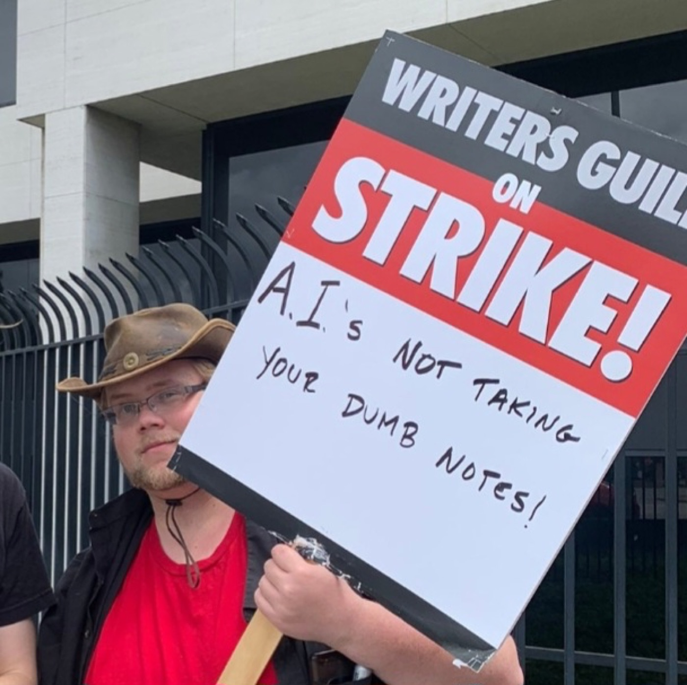
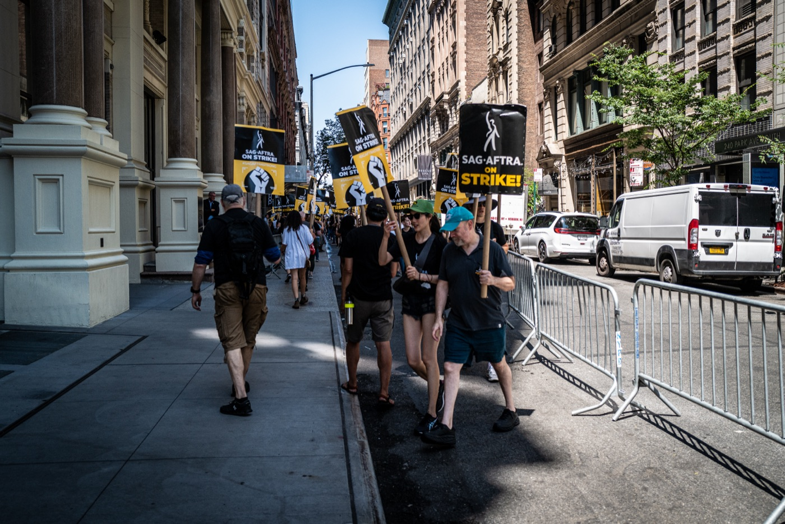
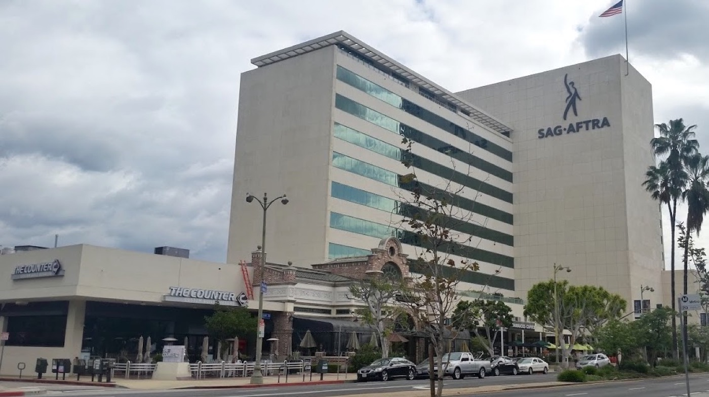

# The Hollywood Deal That Made Studios Bargain Before Using AI Actors

_SAG-AFTRA_

## Executive Summary

> [!callout]
> Hollywood's actors' union, SAG-AFTRA, has ratified its new 2026 TV and theatrical contracts by an overwhelming margin. The heart of the deal isn't the pay raise; it's the AI language. Before a studio can use a synthetic performer in a role a human would play, it has to notify the union and sit down at the bargaining table. Consent over training data, in other words, was produced by collective bargaining rather than handed down by a court. What that process actually changed, and what it left blank, is where the core question of data governance sits.

> The process has three steps: notice, bargaining, arbitration. A studio can't use the exception unless it proves a synthetic performer delivers "significant additional value" over a living actor, and if talks break down the union can seek damages through arbitration. The catch is that the contract contains no agreed definition of "significant additional value." With the standard left empty, the real call falls to studio lawyers, and when a studio licenses an actor's performance to a third party the union gets a meeting, with no consent required and no compensation floor.

> The lesson this contract leaves for data governance is that the strength of consent flows from bargaining power. SAG-AFTRA could force notice and bargaining because it represents organized actors. Roughly 88% of U.S. workers, by contrast, sit outside the umbrella of collective bargaining, with no counterpart to even notify them when their data trains an AI. Whether consent was obtained matters, but so does whether there is any power to refuse it.

Four numbers capture what this contract secured and what it left blank.

<!-- stat-card -->
**91.42%** — Member ratification — 2026 TV/theatrical contracts, 19.25% turnout

<!-- stat-card -->
**0** — Definition of "significant additional value" — Standard left empty; the call falls to the studio

<!-- stat-card -->
**88.8%** — U.S. workers outside collective bargaining — The flip side of 11.2% representation (BLS 2025)

<!-- stat-card -->
**2030** — AI strike-right moratorium expires — No strikes over AI matters until then

## The Alarm Tilly Norwood Set Off

The story starts with an actor who doesn't exist. In the summer of 2025, a British AI studio introduced an AI-generated performer named Tilly Norwood. She introduced herself on social media like an up-and-coming actor and first appeared in an AI-made comedy clip. When a producer said at an industry summit in Zurich that September that talent agencies were showing interest, the backlash erupted.

Actors responded immediately. Emily Blunt called the situation frightening and pleaded with agencies not to go down that road, while others urged the guild to boycott any agent who signed such a deal. SAG-AFTRA issued a formal statement of its own: Tilly Norwood is not an actor but the output of a computer program trained on the work of countless professional performers without permission or compensation, and it solves no problem — it only creates one, putting actors out of work with stolen performances.

*▲ An AI-themed picket sign from the 2023 Hollywood strikes. Actors' and writers' unions put AI on the labor agenda well before the Tilly Norwood episode | Source: [Wikimedia Commons (David James Henry, CC BY-SA 4.0)](https://commons.wikimedia.org/wiki/File:AI_Protest_Sign_2023_WGA_Strike.jpg)*

> [!callout]
> The line worth noting in the union's statement is the one aimed at training data. The real issue wasn't the finished AI actor but the source of, and consent for, the data used to build it. It could have become a copyright lawsuit, but SAG-AFTRA took another path: it put the question on the bargaining table when negotiations with the AMPTP opened in February 2026.

## A Process of Notice, Bargaining, and Arbitration

The deal reached in early May 2026 was ratified with 91.42% voting in favor. It carried more than $700 million in wage and benefit gains and a long-sought path to pension consolidation, but what makes it distinctive is how it handles synthetic performers. The contract sets a principle — no synthetic performers in roles a human would play — with exactly one exception: when that synthetic performer brings "significant additional value" over a living actor or that actor's digital replica.

A studio that wants to use this exception has to clear three steps. It first notifies SAG-AFTRA, then sits down at the bargaining table to prove that its use of a synthetic performer qualifies as that "significant additional value." If no agreement is reached, the union can move to arbitration and seek damages, and those damages are not capped at what a human actor would have earned for the performance. The union believes the combination of this language and the arbitration clause will push synthetic-performer use into the realm of the truly exceptional.

*▲ SAG-AFTRA members picketing in New York during the 2023 strike. The organized membership behind marches like this is what let the 2026 contract force notice, bargaining, and arbitration | Source: [Wikimedia Commons (Phil Roeder, CC BY 2.0)](https://commons.wikimedia.org/wiki/File:SAG-AFTRA_Picket_(53084039977).jpg)*

This is hard to read as a one-off experiment. SAG-AFTRA had already attached consent and disclosure requirements to digital-replica use in its 2025 video-game agreement, and in that year's broadcast agreement it pre-agreed to automatically inherit whatever AI language emerged from these TV and theatrical talks. By carrying the same clause from one contract to the next, this notice-bargain-arbitrate process looks less like a single victory than a standard hardening as it moves across sectors.

Seen from a data-governance angle, this procedure opens an unfamiliar path. Consent over training data was produced neither by an individual clicking "agree" on terms of service nor by a court settling the matter with a ruling, but along a third route. Running from notice to bargaining, and from a failed bargain to arbitration, this process looks looser than a lawsuit that ends with a single judgment. Yet because it fires again every time a new case arises, it acts less like one ruling than a standing, always-on mechanism.

## Who Sets the Standard

As tight as the process looks, there is a large hole inside it. The first thing you notice is the empty definition. The entire exception hangs on the single phrase "significant additional value," and SAG-AFTRA and the AMPTP were reported not to have written an agreed definition of it into the contract. When a standard is left empty, whoever fills it holds the real power to decide.

Erik Passoja, a former co-chair of SAG-AFTRA's emerging-technology committee, put his finger on this point. Asked who judges that value, he answered: studio lawyers. A clause meant to set a standard effectively handed the content of that standard to the other side. The process of notice and bargaining remains, but when the substance the process is meant to contest is empty, it tends to get filled against whoever has less bargaining power.

*▲ SAG-AFTRA headquarters in Los Angeles. The real power to fill the gap in "significant additional value" comes not from contract text but from the balance of power off the bargaining table | Source: [Wikimedia Commons (Shaunti Griffin, CC BY-SA 4.0)](https://commons.wikimedia.org/wiki/File:SAG-AFTRA-Building-New-Logo_-_Photo_by_Socialbilitty.jpg)*

The bigger hole is in third-party licensing. When a studio hands an actor's performance to another company to use for AI training or reuse, the studio's only obligations are written notice and a meeting to discuss it. In Passoja's framing, with no consent and no compensation floor, the union gets a meeting. A notice-bargain-arbitrate apparatus now covers first-line replacement, but the moment the data changes hands, that apparatus loses much of its force.

> [!callout]
> The last constraint is time. The union cannot strike over AI-related matters until the contract expires in 2030. The notice-bargain-arbitrate process remains, but the strongest card the union could play when that process collapses stays sealed for the life of the contract. That is why this deal is hard to read as pure victory. It is both a shield that protected actors and an unfinished compromise that left the definition of consent to the other side.

## The 88% With No Bargaining Table

SAG-AFTRA's case may look exceptional, but using union contracts as a line of defense against AI is already spreading across industries. The Writers Guild bars letting AI write scripts or using writers' work to train AI without consent, and requires written notice when literary material is handed to a third party for training. A Microsoft game-studio union secured the right to be notified and to negotiate before new AI systems are deployed, and journalists' unions have already written AI clauses into dozens of collective agreements.

There is evidence these mechanisms actually get enforced. At one news outlet, unionized staff challenged the rollout of an AI reporting tool through arbitration, and the tool was withdrawn. A contract clause didn't stay a declaration on paper; it rolled back a tool. When consent over training data moves from the grand stage of litigation to a quiet clause in a contract, that clause gains an enforceable form.

*▲ SAG-AFTRA and WGA members marching together in Los Angeles, 2023. Organized actors and writers built the power to be notified and to bargain by taking to the street like this — a line 88.8% of U.S. workers have no way to join | Source: [Wikimedia Commons (Benoît Prieur, CC0)](https://commons.wikimedia.org/wiki/File:Striking_Actors_and_Writers_in_LA_(July_2023).jpg)*

The problem is how many people can reach that line of defense. By the U.S. Bureau of Labor Statistics' 2025 count, union membership was 10.0%, and the collective-bargaining representation rate, including non-members covered, was 11.2%. Flip it over and roughly 88.8% of U.S. workers sit outside the umbrella of collective bargaining. The gap widens by sector: public-sector representation runs at 32.9% while the private sector sits at just 5.9%, and the private sector is exactly where AI is being adopted fastest.

> [!callout]
> The numbers say something plain. SAG-AFTRA could be notified and could bargain because it organized more than 160,000 actors into bargaining power. The unrepresented 88.8% have no counterpart to notify them at all. When their voice, writing, face, or code goes into AI training, there is simply no process to notify them or to bargain. The same data yields a different strength of consent depending on whether the side holding it is organized.

## Consent Is a Function of Bargaining Power

This blog has handled the question of training-data consent through two frames. One is the copyright lawsuit; the other is regulation. Litigation contests in court whether a creative work was used for training without permission, while regulation nails down as a principle that after-the-fact consent is impossible. SAG-AFTRA's contract adds a third route: consent can be produced as the output of a negotiation, not the verdict of a lawsuit or a line of statute.

The three routes carry different strengths and weaknesses. Litigation sets precedent in one stroke but is slow and expensive. Regulation applies broadly but runs into the wall of legislation. Collective bargaining gets enforced case by case, but it opens only to organized groups. The cracks SAG-AFTRA's contract left, the empty standard and the third-party-licensing hole, show exactly the limits of this third route. You can sit at the table, but if the substance to be contested on it is not clear, the balance of power decides the outcome.

So the question this episode poses for data governance holds for anyone who works with data. As much as whether consent was obtained, what matters is whether there is bargaining power to refuse it. When you audit where the data of people and creators in an AI pipeline came from, whether the original providers held organized bargaining power divides the real substance of the contract terms. The clarity of the standard and the floor on compensation both sharpen only where bargaining power exists.

Editor's Note

Pebblous has treated the source of, and consent for, training data as a matter of technology and institutions. SAG-AFTRA's contract is a case where the same problem appeared in the language of labor. Making data able to explain and defend its own lineage and consent history — giving the side that holds the data grounds to contest its share at the bargaining table — is the work Pebblous has been doing as AI-Ready Data.

## References

### Official Documents & Data

- 1.SAG-AFTRA. (2026). "[SAG-AFTRA Members Approve 2026 TV/Theatrical Contracts Tentative Agreement](https://www.sagaftra.org/sag-aftra-members-approve-2026-tvtheatrical-contracts-tentative-agreement)." SAG-AFTRA.
- 2.U.S. Bureau of Labor Statistics. (2026). "[Union Members — 2025 (USDL-26-0229)](https://www.bls.gov/news.release/union2.htm)." U.S. Bureau of Labor Statistics.

### Industry & Press

- 3.IndieWire. (2026). "[SAG-AFTRA's AI Deal Explained: What It Means for Human and Synthetic Actors](https://www.indiewire.com/news/analysis/sag-aftra-ai-deal-2026-human-actors-analysis-1235194299/)." IndieWire.
- 4.Los Angeles Magazine. (2026). "[SAG-AFTRA Approves New Contract With Expanded AI Protections in Landslide Vote](https://lamag.com/arts-and-entertainment/sag-aftra-approves-amptp-deal-with-expanded-ai-protections-in-landslide-vote/)." Los Angeles Magazine.
- 5.TheWrap. (2026). "[SAG-AFTRA's New AI Protections: What They Mean for Real and Synthetic Actors](https://www.thewrap.com/industry-news/tech/sag-aftra-ai-protections-in-new-contract-synthetic/)." TheWrap.
- 6.Variety. (2026). "[SAG-AFTRA Deal Stirs Concerns on Artificial Intelligence and Pensions](https://variety.com/2026/film/news/sag-aftra-artificial-intelligence-pensions-concerns-1236746577/)." Variety.
- 7.Allwork.Space. (2026). "[Union Contracts Emerge as One of Workers' Strongest AI Protections](https://allwork.space/2026/07/union-contracts-emerge-as-one-of-workers-strongest-ai-protections)." Allwork.Space.
