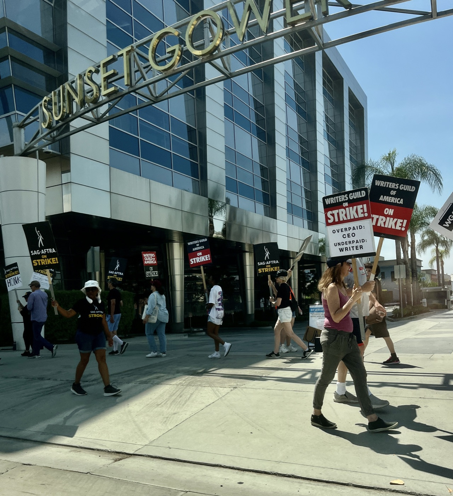

# AI 대역을 쓰기 전 배우 노조와 교섭하게 만든 할리우드 단체협약

_SAG-AFTRA 2026 계약이 건 통지·교섭·중재 의무, 그리고 그 테이블이 없는 노동자 88%_

## Executive Summary

> [!callout]
> 할리우드 배우 노조 SAG-AFTRA가 2026년 새 TV·영화 계약을 압도적 찬성으로 비준했다. 이 계약의 핵심은 임금 인상이 아니라 AI 조항에 있다. 제작사가 인간이 맡을 배역에 합성 배우를 쓰려면, 먼저 노조에 알리고 교섭 테이블에 앉아야 한다. 학습 데이터를 둘러싼 동의가 법정 판결이 아니라 단체교섭의 산출물로 만들어진 셈이다. 그 절차가 실제로 바꾼 것과 그대로 비워 둔 것에 데이터 거버넌스의 핵심 질문이 걸려 있다.

> 절차는 통지·교섭·중재 세 단계로 짜였다. 합성 배우가 살아있는 배우보다 '상당한 추가 가치'를 준다고 입증하지 못하면 예외를 쓸 수 없고, 합의가 깨지면 노조는 중재로 배상을 청구한다. 문제는 그 '상당한 추가 가치'의 합의된 정의가 계약서에 없다는 데 있다. 기준이 비어 있으니 실제 판정은 스튜디오 변호사의 몫으로 넘어가고, 스튜디오가 배우의 연기를 제3자에 라이선싱할 때는 동의도 보상 하한선도 없이 노조가 미팅 하나를 얻는 데 그친다.

> 이 계약이 데이터 거버넌스에 남기는 교훈은 동의의 강도가 협상력에서 나온다는 사실이다. SAG-AFTRA는 조직된 배우를 대표하기에 통지와 교섭을 강제할 수 있었다. 반면 미국 노동자의 약 88%는 애초에 단체교섭의 우산 밖에 있어, 자신의 데이터가 AI 학습에 쓰여도 통지받을 상대조차 없다. 동의를 받았는가만큼 중요한 질문은, 동의를 거부할 힘이 있는가다.

이 계약이 무엇을 확보했고 무엇을 비워 두었는지를 네 개 숫자로 추렸다.

<!-- stat-card -->
**91.42%** — 조합원 비준 찬성 — 2026 TV·영화 계약, 투표율 19.25%

<!-- stat-card -->
**0** — '상당한 추가 가치'의 정의 — 기준이 비어 판정은 스튜디오 몫

<!-- stat-card -->
**88.8%** — 단체교섭 밖 미국 노동자 — 노조 대표율 11.2%의 이면 (BLS 2025)

<!-- stat-card -->
**2030** — AI 파업권 유예 만료 — 그때까지 AI 사안으로는 파업 불가

## 틸리 노우드가 켠 경보

이야기의 출발점은 존재하지 않는 배우다. 2025년 여름 영국의 한 AI 스튜디오가 틸리 노우드라는 이름의 AI 생성 배우를 세상에 내놓았다. 소셜미디어에서 신인 배우처럼 자기를 소개했고, AI가 만든 코미디 영상에 처음 얼굴을 비쳤다. 그해 9월 취리히의 한 업계 서밋에서 제작자가 탤런트 에이전시들이 관심을 보이고 있다고 말한 것이 알려지자 반발이 폭발했다.

배우들의 반응은 즉각적이었다. 에밀리 블런트는 이 상황을 두렵다고 표현하며 에이전시들에 그러지 말아 달라고 호소했고, 여러 배우가 이런 계약을 하는 에이전트를 길드가 보이콧해야 한다고 목소리를 높였다. SAG-AFTRA도 공식 성명을 냈다. 틸리 노우드는 배우가 아니라 허가나 보상 없이 수많은 프로 배우의 작업물로 학습된 컴퓨터 프로그램의 산출물이며, 이것은 어떤 문제도 해결하지 않고 도둑맞은 연기로 배우를 실직시키는 문제를 만들 뿐이라는 내용이었다.

*▲ 2023년 할리우드 파업 당시 AI를 겨눈 피켓. 배우·작가 노조가 AI를 노동 이슈로 전면에 세운 것은 틸리 노우드 사태보다 앞선다 | Source: [Wikimedia Commons (David James Henry, CC BY-SA 4.0)](https://commons.wikimedia.org/wiki/File:AI_Protest_Sign_2023_WGA_Strike.jpg)*

> [!callout]
> 노조의 성명에서 눈여겨볼 대목은 학습 데이터를 겨눈 문장이다. 문제의 본질은 완성된 AI 배우가 아니라, 그 배우를 만드는 데 쓰인 데이터의 출처와 동의였다. 저작권 소송이 걸릴 수도 있는 사안이었지만, SAG-AFTRA는 다른 길을 택했다. 2026년 2월 시작된 AMPTP와의 단체교섭 테이블 위로 이 문제를 올린 것이다.

## 통지·교섭·중재라는 절차

2026년 5월 초 타결된 계약은 조합원 투표에서 찬성 91.42%로 비준됐다. 총 7억 달러가 넘는 임금·베네핏 개선과 오랜 숙원이던 연금 통합 경로가 담겼지만, 이 계약을 특별하게 만든 것은 합성 배우를 다루는 방식이다. 계약은 인간이 맡을 배역에 합성 배우를 쓰지 않는다는 원칙을 세우되, 딱 하나의 예외를 열어 두었다. 그 합성 배우가 살아있는 배우나 그 배우의 디지털 리플리카보다 '상당한 추가 가치'를 가져올 때다.

이 예외를 쓰려는 제작사는 세 단계를 밟아야 한다. 먼저 SAG-AFTRA에 통지하고, 다음으로 교섭 테이블에 앉아 자신들의 합성 배우 사용이 그 '상당한 추가 가치'에 해당한다는 것을 입증해야 한다. 합의가 이뤄지지 않으면 노조는 중재로 넘어가 손해배상을 청구할 수 있고, 그 배상액은 인간 배우가 그 연기를 했을 때 받았을 보수에만 묶이지 않는다. 노조는 이 언어와 중재 조항의 결합이 합성 배우 사용을 극히 예외적인 경우로 밀어낼 것이라고 본다.

*▲ 2023년 SAG-AFTRA 파업 당시 뉴욕 피켓 행진. 2026년 계약이 통지·교섭·중재를 강제할 수 있었던 힘은 이렇게 조직된 조합원 수에서 나온다 | Source: [Wikimedia Commons (Phil Roeder, CC BY 2.0)](https://commons.wikimedia.org/wiki/File:SAG-AFTRA_Picket_(53084039977).jpg)*

이 절차를 한 번 쓰고 마는 실험으로 보기는 어렵다. SAG-AFTRA는 2025년 비디오게임 부문 협정에서 이미 디지털 리플리카 사용에 동의와 고지 요건을 걸었고, 같은 해 방송 부문 협정에는 이번 TV·영화 교섭에서 나올 AI 조항을 자동으로 이어받기로 미리 합의해 두었다. 계약을 하나씩 옮겨 다니며 같은 조항을 심는 방식이어서, 이 통지·교섭·중재 절차는 이번 한 번의 승리가 아니라 부문을 갈아타며 굳어지는 표준에 가깝다.

이 절차는 데이터 거버넌스 관점에서 낯선 경로를 하나 연다. 학습 데이터에 대한 동의가 개인이 약관에 클릭하는 방식도, 법원이 판결로 확정하는 방식도 아닌 제3의 길에서 나왔다. 통지에서 교섭으로, 교섭이 깨지면 중재로 이어지는 이 절차는 판결 하나로 끝나는 소송보다 느슨해 보인다. 그러나 사례가 생길 때마다 반복해서 작동한다는 점에서, 한 번의 판결보다 오히려 지속적인 상시 장치에 가깝다.

## 기준을 누가 정하는가

절차가 촘촘해 보여도 그 안에는 큰 구멍이 있다. 가장 먼저 눈에 띄는 것은 정의의 공백이다. 계약의 예외 전체가 '상당한 추가 가치'라는 한 문구에 걸려 있는데, SAG-AFTRA와 AMPTP는 그 문구의 합의된 정의를 계약서에 넣지 않았다고 보도됐다. 기준이 비어 있으면 그 기준을 채우는 사람이 실질적인 결정권을 쥔다.

SAG-AFTRA의 전 신기술 위원회 공동의장을 지낸 에릭 파소자는 이 지점을 날카롭게 짚었다. 그 가치를 누가 판정하느냐는 물음에 그는 스튜디오 변호사라고 답했다. 기준을 세우기로 한 조항이 정작 그 기준의 내용을 상대방에게 맡긴 셈이다. 통지와 교섭이라는 절차는 남았지만, 절차가 다투는 실체가 비어 있으면 협상력이 약한 쪽에 불리하게 채워지기 쉽다.

*▲ 로스앤젤레스 SAG-AFTRA 본부. '상당한 추가 가치'라는 기준의 공백을 메우는 실질적 판정권은 계약서 문구가 아니라 이 협상 테이블 바깥의 힘 관계에서 나온다 | Source: [Wikimedia Commons (Shaunti Griffin, CC BY-SA 4.0)](https://commons.wikimedia.org/wiki/File:SAG-AFTRA-Building-New-Logo_-_Photo_by_Socialbilitty.jpg)*

더 큰 구멍은 제3자 라이선싱에 있다. 스튜디오가 배우의 연기를 다른 회사에 넘겨 AI 학습이나 재사용에 쓰게 할 때, 스튜디오가 지는 의무는 서면 통지와 논의를 위한 미팅뿐이다. 파소자의 정리를 빌리면, 동의도 없고 보상 하한선도 없이 노조는 미팅 하나를 얻는다. 1차 배역 대체에는 통지·교섭·중재라는 장치가 생겼지만, 데이터가 손을 바꾸는 순간 그 장치의 힘은 크게 줄어든다.

> [!callout]
> 마지막 제약은 시간이다. 조합은 AI 관련 사안으로는 2030년 계약 만료까지 파업을 할 수 없다. 통지·교섭·중재라는 절차는 남았지만, 그 절차가 결렬됐을 때 노조가 꺼낼 수 있는 가장 강한 카드는 계약 기간 내내 봉인돼 있다. 이 계약을 승리의 서사로만 읽기 어려운 이유가 여기에 있다. 배우를 지킨 방패이면서, 동의의 정의를 상대에게 맡긴 미완의 타협이기도 하다.

## 협상 테이블이 없는 88%

SAG-AFTRA의 사례가 예외적으로 보이지만, 노조 계약을 AI 방어선으로 쓰는 흐름은 이미 여러 산업으로 번지고 있다. 작가조합은 AI에 각본을 쓰게 하거나 작가 동의 없이 작품을 AI 학습에 쓰는 것을 금지하고, 문학 자료를 제3자에 학습용으로 넘길 때 서면 통지를 의무화했다. 마이크로소프트의 한 게임 스튜디오 노조는 새 AI 시스템을 도입하기 전 노조에 통지하고 협상하도록 요구했고, 기자 노조는 이미 수십 건의 단체협약에 AI 조항을 넣었다.

이 장치들이 실제로 집행된다는 증거도 있다. 한 언론사에서는 노조원 직원들이 중재를 통해 AI 리포팅 도구 도입에 이의를 제기했고, 그 도구는 실제로 철회됐다. 계약서의 조항이 종이 위 선언에 그치지 않고 도구 하나를 되돌린 것이다. 학습 데이터를 둘러싼 동의가 소송이라는 큰 무대 대신 계약서의 조용한 조항으로 옮겨 갈 때, 그 조항은 집행 가능한 형태를 얻는다.

*▲ 2023년 SAG-AFTRA·작가조합 공동 파업, 로스앤젤레스. 조직된 배우·작가는 이렇게 거리로 나가 통지받고 교섭할 힘을 만들었지만, 미국 노동자 88.8%에게는 이 대열 자체가 없다 | Source: [Wikimedia Commons (Benoît Prieur, CC0)](https://commons.wikimedia.org/wiki/File:Striking_Actors_and_Writers_in_LA_(July_2023).jpg)*

문제는 이 방어선에 접근할 수 있는 사람의 수다. 미국 노동통계국의 2025년 집계에 따르면 노조 가입률은 10.0%, 비회원까지 포함한 단체교섭 대표율은 11.2%였다. 뒤집으면 미국 노동자의 약 88.8%는 단체교섭의 우산 밖에 있다는 뜻이다. 격차는 부문별로 더 벌어진다. 공공부문 대표율이 32.9%인 반면 민간부문은 5.9%에 그치는데, AI 도입이 가장 빠른 곳이 바로 그 민간부문이다.

> [!callout]
> 숫자가 말하는 것은 분명하다. SAG-AFTRA가 통지받고 교섭할 수 있었던 이유는 16만 명 넘는 배우를 조직해 협상력을 가졌기 때문이다. 대표되지 않는 88.8%에게는 통지받을 상대방 자체가 없다. 자신의 목소리, 글, 얼굴, 코드가 AI 학습에 들어가도 그 사실을 통지받고 교섭할 절차가 아예 존재하지 않는다. 같은 데이터라도 그것을 쥔 쪽이 조직돼 있느냐에 따라 동의의 강도가 갈린다.

## 동의는 협상력의 함수다

페블러스 블로그는 그동안 학습 데이터 동의 문제를 두 가지 틀로 다뤄 왔다. 하나는 저작권 소송이고, 다른 하나는 규제였다. 창작물이 허락 없이 학습에 쓰였는지를 법정에서 다투는 소송과, 사후 동의는 불가능하다는 원칙을 규제로 못 박는 접근이다. SAG-AFTRA의 계약은 여기에 세 번째 경로를 더한다. 동의가 소송의 판결도 규제의 조문도 아니라 협상 절차의 산출물로 만들어질 수 있다는 것이다.

세 경로는 서로 다른 강점과 약점을 가진다. 소송은 한 번에 판례를 세우지만 느리고 비싸다. 규제는 넓게 적용되지만 입법의 벽에 막힌다. 단체교섭은 사례마다 반복 집행되지만, 오직 조직된 집단에게만 열린다. SAG-AFTRA의 계약이 남긴 균열, 곧 비어 있는 기준과 제3자 라이선싱의 구멍은 이 세 번째 경로의 한계를 그대로 보여 준다. 협상 테이블에 앉을 수 있어도, 그 테이블 위에서 다툴 실체가 명확하지 않으면 힘의 우위가 결과를 정한다.

그래서 이 사건이 데이터 거버넌스에 던지는 질문은 데이터를 다루는 누구에게나 유효하다. 동의를 받았는가만큼 중요한 질문은, 동의를 거부할 협상력이 있는가다. AI 데이터 파이프라인에서 인물과 창작자의 데이터가 어디서 왔는지를 감사할 때, 그 데이터의 원 제공자가 조직적 협상력을 가졌는지 여부가 계약 조건의 실질을 가른다. 기준의 명확성도, 보상의 하한선도 결국 협상력이 있는 곳에서만 또렷해진다.

Editor's Note

페블러스는 학습 데이터의 출처와 동의를 기술과 제도의 문제로 다뤄 왔다. SAG-AFTRA의 계약은 같은 문제가 '노동'의 언어로 나타난 사례다. 데이터의 계보와 동의 이력을 스스로 설명하고 지킬 수 있게 만드는 일 — 데이터를 쥔 쪽이 협상 테이블에서 자기 몫을 다툴 근거를 갖게 하는 일 — 이 페블러스가 AI-Ready Data로 해 온 작업이다.

## 참고문헌

### 공식 문서·데이터

- 1.SAG-AFTRA. (2026). "[SAG-AFTRA Members Approve 2026 TV/Theatrical Contracts Tentative Agreement](https://www.sagaftra.org/sag-aftra-members-approve-2026-tvtheatrical-contracts-tentative-agreement)." SAG-AFTRA.
- 2.U.S. Bureau of Labor Statistics. (2026). "[Union Members — 2025 (USDL-26-0229)](https://www.bls.gov/news.release/union2.htm)." U.S. Bureau of Labor Statistics.

### 업계·보도

- 3.IndieWire. (2026). "[SAG-AFTRA's AI Deal Explained: What It Means for Human and Synthetic Actors](https://www.indiewire.com/news/analysis/sag-aftra-ai-deal-2026-human-actors-analysis-1235194299/)." IndieWire.
- 4.Los Angeles Magazine. (2026). "[SAG-AFTRA Approves New Contract With Expanded AI Protections in Landslide Vote](https://lamag.com/arts-and-entertainment/sag-aftra-approves-amptp-deal-with-expanded-ai-protections-in-landslide-vote/)." Los Angeles Magazine.
- 5.TheWrap. (2026). "[SAG-AFTRA's New AI Protections: What They Mean for Real and Synthetic Actors](https://www.thewrap.com/industry-news/tech/sag-aftra-ai-protections-in-new-contract-synthetic/)." TheWrap.
- 6.Variety. (2026). "[SAG-AFTRA Deal Stirs Concerns on Artificial Intelligence and Pensions](https://variety.com/2026/film/news/sag-aftra-artificial-intelligence-pensions-concerns-1236746577/)." Variety.
- 7.Allwork.Space. (2026). "[Union Contracts Emerge as One of Workers' Strongest AI Protections](https://allwork.space/2026/07/union-contracts-emerge-as-one-of-workers-strongest-ai-protections)." Allwork.Space.
