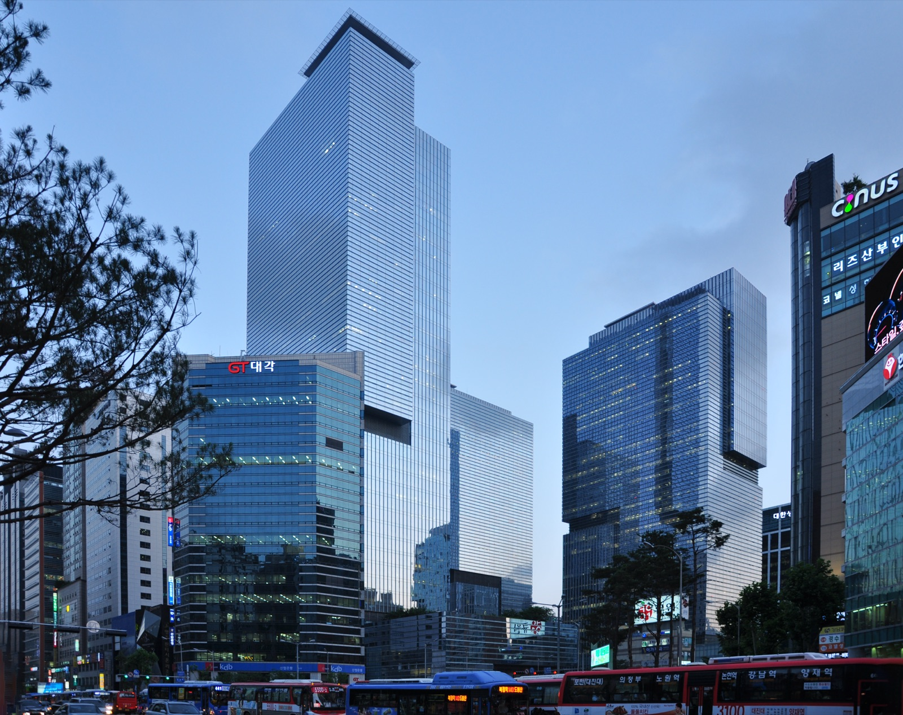

# 데이터센터와 전기를 묶어 파는 헬릭스, 삼성은 왜 지분을 살까?

_삼성 계열사 여섯 곳이 KKR이 세운 헬릭스에 10억 달러를 넣고, 데이터센터에 반도체와 냉각 설비를 공급하는 자리를 얻는다_

## Executive Summary

> [!callout]
> 2026년 9월 29일 삼성 계열사 여섯 곳이 헬릭스에 10억 달러, 약 1조 3,600억 원을 함께 넣는다고 밝혔다. 헬릭스는 사모펀드 KKR이 올해 6월에 세운 회사다. 하는 일은 데이터센터를 짓고 굴리는 것인데, 건물만 넘기지 않고 그 안에 들어갈 전기와 전기를 끌어오는 설비, 광통신망까지 한 묶음으로 넘긴다. 삼성전자가 5억 달러를 대고 삼성물산·삼성SDS·삼성SDI·삼성생명·삼성화재가 나머지 5억 달러를 나눠 댄다. 이 글은 그 묶음이 무엇이고 반도체를 팔던 회사가 왜 지분으로 들어갔는지를 본다.

> 헬릭스 최고경영자 아담 셀립스키는 회사를 출범시킨 날 CNBC 방송에 나와 발표된 데이터센터 사업의 25% 이상이 발표한 대로 굴러가지 않고 그 비중이 계속 늘고 있다고 말했다. 모자란 것은 칩이 아니라 전기와 부지다. 우드매킨지가 2025년 2분기에 집계한 대형 전력 변압기 납기는 평균 128주이고 값은 2019년보다 77% 올랐다. 다만 이번에 삼성이 산 것은 헬릭스의 지분이지 데이터센터 자체가 아니다. 계열사들이 받은 것은 공급과 시공을 맡을 자리다.

> 1절부터 4절까지는 삼성 공식 발표문과 국내외 보도에 적힌 내용이다. 5절은 그 사실을 데이터 품질의 눈으로 다시 읽은 이 글의 해석이다.

### 주요 수치

출처: [삼성 뉴스룸 발표문](https://news.samsung.com/global/samsung-to-invest-usd-1-billion-in-ai-infrastructure-company-helix), 2026년 6월 11일 CNBC 셀립스키 인터뷰, 우드매킨지 2025년 2분기 공급망 조사.

<!-- stat-card -->
**10억 달러** — 삼성 여섯 곳의 공동 투자액 — 약 1조 3,600억 원. 삼성전자가 절반을 대고 나머지 다섯 곳이 절반을 나눠 댄다

<!-- stat-card -->
**110억 달러** — 헬릭스가 확보한 자본 — 출범 때 100억 달러가 넘었고 이번 삼성 투자가 그 위에 얹혔다

<!-- stat-card -->
**25%** — 발표대로 이행되지 않는 데이터센터 사업 — 발표된 사업 넷 중 하나 이상이 예정대로 진행되지 않는다는 셀립스키의 진단

<!-- stat-card -->
**128주** — 대형 변압기 평균 대기 기간 — 주문해서 받기까지 2년 반. 값은 2019년보다 77% 올랐다. 우드매킨지 2025년 2분기 조사

## 여섯 곳이 같은 회사에 돈을 넣고 일을 나눠 맡았다

삼성전자, 삼성물산, 삼성SDS, 삼성SDI, 삼성생명, 삼성화재. 업종이 제각각인 여섯 회사가 2026년 9월 29일 같은 날 같은 곳에 돈을 넣는다고 발표했다. 받는 쪽은 헬릭스 한 곳이고 금액은 합쳐서 10억 달러다. 삼성전자가 5억 달러를 대고 나머지 다섯 곳이 남은 5억 달러를 나눈다.

*▲ 서울 서초동 삼성 타운. 이번 투자에 참여한 삼성전자·삼성물산·삼성SDS·삼성SDI·삼성생명·삼성화재 여섯 곳이 계열사 관계로 얽혀 있다. | Source: [Wikimedia Commons (Oskar Alexanderson, CC BY-SA 2.0)](https://commons.wikimedia.org/wiki/File:Samsung_headquarters.jpg)*

계열사가 여럿 참여하는 투자 자체는 드물지 않다. 이번 발표에서 눈에 띄는 대목은 돈을 댄 곳들이 각자 맡을 일까지 함께 적혀 있다는 점이다. 삼성 뉴스룸이 낸 발표문은 삼성전자 두 부문과 삼성물산, 삼성SDS, 삼성SDI가 무엇을 공급하는지를 한 줄씩 밝혀 놓았다. 여섯 곳 가운데 삼성생명과 삼성화재만은 투자자 명단에 이름이 있을 뿐 맡을 일이 적혀 있지 않다.

| 계열사 | 맡는 일 |
| --- | --- |
| 삼성전자 반도체 부문 | 데이터센터에 들어갈 최첨단 반도체 공급 |
| 삼성전자 DX 부문 | 공기 냉각과 액체 냉각 설비 |
| 삼성물산 | 데이터센터와 발전 설비의 설계·조달·시공 |
| 삼성SDS | 데이터센터 구축과 운영, GPU 클라우드 서비스 |
| 삼성SDI | 정전에 대비하는 무정전 전원 장치와 배터리 |
| 삼성생명·삼성화재 | 발표문에 역할 설명 없음. 투자에만 참여 |

칩, 냉각, 건물, 운영, 전원. 데이터센터 한 동을 세워 돌리는 데 필요한 것을 늘어놓으면 이 목록과 거의 겹치고, 여기에 금융 계열사 두 곳이 돈을 보탠다. 계열사가 각자 자기 물건을 팔러 들어간 것이 아니라, 여러 곳의 물건을 한 장의 공급 목록으로 묶어 내놓은 모양이다.

셀립스키의 반응은 삼성 발표문이 아니라 같은 날 헬릭스와 KKR이 따로 낸 발표에 실렸다. 그는 삼성의 이번 약정이 "헬릭스의 전략에 대한 강한 신뢰를 보여주는 동시에, 대규모 AI 인프라 수요에 대응하기 위해 구축해 온 장기자본 기반을 한층 강화하는 계기가 될 것"이라고 했고, "세계적인 기술 기업인 삼성은 헬릭스와 고객사에 기여할 수 있는 차별화된 역량을 갖추고 있다"고 덧붙였다. 삼성 쪽 발표문은 "헬릭스 및 파트너사들과 함께 글로벌 AI 데이터센터 인프라의 원활한 공급에 기여하고, 상호 시너지 창출을 지속적으로 추진해 나갈 계획"이라고 적었다. 두 문장이 같은 것을 다른 각도에서 말한다. 헬릭스에는 자본과 공급선이 생기고, 삼성에는 자기 물건이 들어갈 현장이 생긴다.

## 헬릭스가 파는 것은 건물이 아니라 묶음이다

헬릭스는 2026년 6월 11일에 출범했다. KKR이 주도하고 쿠웨이트투자청, 엔비디아, 미국 발전사 비스트라가 창립 투자자로 들어가 100억 달러가 넘는 자본으로 시작했다. 이번 삼성 투자를 더하면 확보 자본이 110억 달러를 넘는다. 삼성은 석 달 남짓 늦게 들어왔지만 발표문과 국내 보도는 삼성 관계사도 앞의 넷과 나란히 창립 투자자로 적는다. 최고경영자는 아마존웹서비스를 이끌었던 아담 셀립스키이고, KKR에서 인프라 투자를 총괄하는 발데마르 슐레자크가 최고투자책임자를 겸한다. KKR이 따로 두고 있는 인프라 전담 인력 170여 명도 이 회사가 끌어 쓴다.

회사가 내건 상품은 하이퍼스케일 데이터센터 하나가 아니다. 데이터센터를 개발하고 운영하는 일에 더해, 그 시설에 전기를 대는 발전 설비, 전기를 끌어오는 송배전 설비, 바깥과 연결하는 광통신망까지 한 묶음에 담아 판다. 셀립스키가 링크드인에 적은 문장이 왜 이렇게 묶었는지를 설명한다. "데이터센터·전력·커넥티비티가 너무 자주 별개 트랙으로 지어져 왔다. AI 시대의 전례 없는 인프라 구축에서 그 파편화가 업계 전체의 병목이 됐다."
