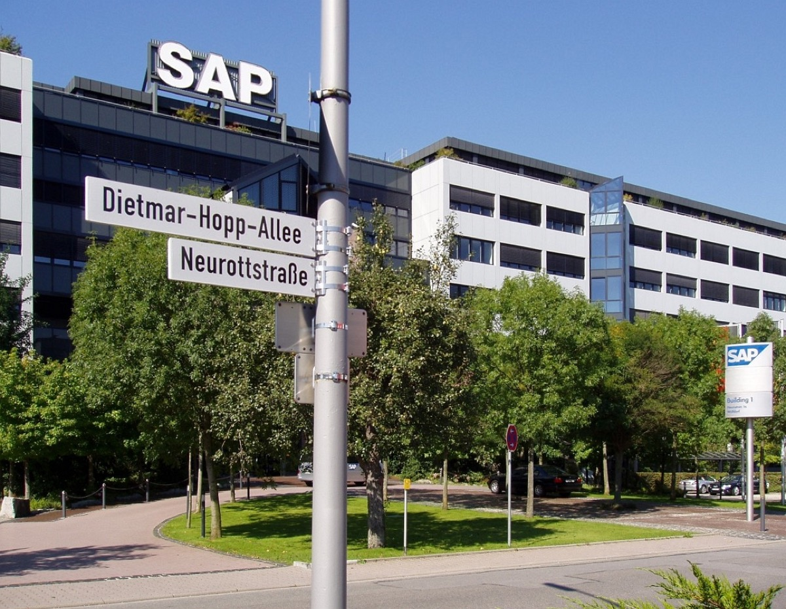

# SAP Buys TechWolf, the AI That Reads Your Skills From Your Work

_SAP agreed on 6 October to buy TechWolf, a Ghent company that infers employee skills from work records instead of asking employees to report them_

## Executive Summary

> [!callout]
> This article reads a single acquisition agreement SAP announced on 6 October 2026. The other party is TechWolf, based in Ghent, Belgium. What this company sells is not a screen an HR manager looks at but a data model it calls a context graph for work, and that model works out which skills a given employee has not from a survey or a self-report but from the records that person leaves behind in the ordinary course of the job. Neither side disclosed the terms, and the deal is expected to close in the fourth quarter subject to regulatory approval.

> The part worth noticing is the name SAP gave the model. Manoj Swaminathan, who runs product, said the graph provides an "excellent grounding layer for agent queries." The intent is to keep an HR AI from inventing its answers by tying them to that layer, and the layer is made of the trace people leave while working. TechWolf itself has written in published material that its solution is classified as high-risk under the EU AI Act. The obligations attached to that classification, though, have been pushed out to 2 December 2027.

> Sections 1 through 3 are facts published by SAP and TechWolf, along with the coverage that quotes them. One passage steps past that. Section 3's account of where the strength and the hazard of this design both come from is in no announcement. Section 4 separates what the public record confirms from what it does not, and Section 5 is this article's reading of those facts through the eyes of people who work with data.

*▲ SAP's headquarters in Walldorf, Germany, where the acquisition was announced | Source: [Wikimedia Commons](https://commons.wikimedia.org/wiki/File:SAP_AG_Headquarter_1200.jpg) (amadeusm, Public Domain)*

### Key Figures

Four of the numbers attached to this acquisition carry the frame of the article. The first is the accuracy the company claims for its inference. The second is when SAP first put money into the company. The third is the date the regulatory provision TechWolf placed itself under starts to apply, and the fourth is the only deadline in the public record for a right an employee can exercise.

Sources: [SAP press release](https://news.sap.com/2026/10/sap-to-acquire-techwolf-evidence-based-work-age-of-ai/), [TechWolf product page](https://www.techwolf.ai/product/skill-supply-data), [TechWolf Trust Center](https://trust.techwolf.ai/), [tech.eu](https://tech.eu/2026/10/06/sap-buys-techwolf-in-record-belgian-vc-backed-deal/).

<!-- stat-card -->
**~95%** — Accuracy the company states — A self-reported figure on the product page, tied to no public benchmark

<!-- stat-card -->
**2024** — The year SAP first invested — It joined a $42.75 million Series B and buys the company outright two years later

<!-- stat-card -->
**2 Dec 2027** — EU high-risk duties apply — The provision TechWolf placed itself under, with enforcement pushed back 16 months

<!-- stat-card -->
**30 days** — Window for deletion requests — The figure the trust center sets; there is no procedure for a refused correction

## What SAP Bought Is a Data Model, Not an HR Application

The announcement came out of Walldorf, Germany and Ghent, Belgium on 6 October 2026. SAP said it had entered into an agreement to acquire TechWolf and did not disclose the terms. The deal is expected to close in the fourth quarter of 2026, subject to usual closing conditions including regulatory approval. The headline on the press release carries the phrase evidence-based, and that one phrase explains most of what the acquisition is about.

What conveys the size is not a price but a superlative. By tech.eu's account, the deal is understood to be the largest acquisition of a venture-backed software company in Belgian history. That phrase is not confined to the press coverage. The letter co-founder and CEO Andreas De Neve posted on the company blog the day of the announcement uses the same sentence, and adds that it is also Belgium's largest employee liquidity event to date. Neither side disclosed a price, so this remains a description rather than a confirmed figure. The same letter says the founders, the team and the investors are contributing 3% of the equity value of the sale to the TechWolf Foundation, a newly founded charity.

TechWolf was founded in 2018 and has more than 120 employees. It has raised over $50 million, and the investor list runs from Felix Capital, Notion Capital and 20VC to ServiceNow, Workday and SAP. That last name matters. SAP took part as an investor in a $42.75 million Series B in 2024. This acquisition is not the discovery of a company from outside; it is where a relationship that has run through equity for two years ends up. The selling side's reason is speed. According to De Neve's letter, US annual recurring revenue grew from $1 million to $15 million over the last 18 months and the company still could not keep up with the demand of a market that urgently needed a solution, so it needed a bigger platform and more scale.

The operating plan after the deal is in the announcement as well. TechWolf stays an independent entity under co-founder Andreas De Neve, keeping its Ghent headquarters and its London and New York offices, and the platform remains available to SAP and non-SAP customers alike. On people, the letter is more specific. Co-founder and CTO Jeroen Van Hautte is relocating to San Francisco to open another office, and the third co-founder, Mikaël Wornoo, is leaving the company. On SAP's side, the release describes TechWolf as the expected intelligent core of the SuccessFactors portfolio. This is not the pattern of swallowing a company and dissolving it into a product. It leaves the model and the research team where they are and has SAP's own product line call that model.

*▲ The Graslei in Ghent, Belgium, where TechWolf is keeping its headquarters | Source: [Wikimedia Commons](https://commons.wikimedia.org/wiki/File:Graslei_Ghent.jpg) (Martinvl, CC BY-SA 4.0)*

The release names eight customers: HSBC, Atlas Copco Group, GSK, Ericsson, AMD, MetLife, PayPal and Booking.com. Banking and pharmaceuticals, telecom equipment and semiconductors, insurance and a travel platform, all of them employing tens of thousands of people. The market for this product is exactly that: the larger the headcount and the more tangled the roles, the less anyone can count by hand what skills a company holds.

Set against SAP's other acquisitions in 2026, a pattern shows. Reltio in March for data management, Dremio and [Prior Labs](/report/sap-prior-labs-tabular-foundation-model/en/) in May for tabular foundation models, and TechWolf in October. The first three were about turning data scattered inside an enterprise into a form a model can eat. This one widens the same move to people.

## TechWolf Reads Work Records Instead of Asking

The traditional way an enterprise finds out what skills it has is to ask. Employees pick their skills from a list, or managers rate the people on their team. The weaknesses of that method have been known for a long time. A list filled in once is never updated, two people doing the same job describe their skills in entirely different words, and self-assessment runs on a different scale for every person.

TechWolf skips the asking. It connects to the systems a customer already runs, reads the records piling up inside them, and works back from those records to skills. The inputs the product page lists are an employee's work activity, their job role, completed learning, and work systems such as Jira or Asana. HR systems including SAP SuccessFactors, Workday and Oracle are listed as connection targets too. In principle nobody has to enter anything new; what people already produced by working becomes the raw material.

The company FAQ draws the same list a little wider. ServiceNow and Teams join Jira on the work-systems side, completed learning counts as evidence only when the course description comes with the completion, and enrollments or in-progress courses do not count. The refresh cadence sits in the same document. Daily, weekly or monthly, and the customer picks. How often what SAP called a continuously updated view actually refreshes is set by the buyer.

What the company has decided not to use is written down as well. Asked whether it draws on LinkedIn or other external profile data, the company answers no: it infers skills only from data the customer organization owns. Three reasons follow. Profile data is self-reported, it creates privacy exposure, and scraping breaches LinkedIn's terms. On the question of which records may be used, the vendor has already drawn one line, and one of the reasons it gives for drawing it is the law.

The model built this way is the context graph for work. The SAP press release says it operates at three levels. The first is the work itself, broken down to the tasks inside a job. The second is the skills people have and apply. The third is the external labor market. Those three levels are then mapped against the customer's business strategy. The stated purpose is that the leaders responsible for hiring, reskilling and redeployment work from better information.

Going down to tasks rather than job titles is the core choice in this model. Two companies mean different things by data analyst, and so do two people inside one company. Break the work into tasks and you can group people who do the same thing under different titles, and you can watch which tasks grew and which shrank over time. The third level, the external labor market, holds the result against a yardstick from outside the company. It is where a skill recorded in a name that only means something internally gets attached to whatever the market calls it. By the company's own account that outer layer is 1.5 billion job postings gathered over the past nine years, and the ontology holding the relationships between skills runs to more than 30,000 entries.

On accuracy the figure the company puts forward is about 95%. That value is a self-reported count on a TechWolf product page, and which population it was measured on, against what ground truth, is not public. It is not that the company hides evaluation. In December 2025 it released WorkRB, a public benchmark for AI that deals with jobs and skills, and its AI page lists seven papers published in academic journals. What is missing is a link from the 95% figure to either of them. This article treats the number as a claim the company makes and nothing more.

The diagram below puts the whole path on one page: records go in, a graph comes out, and that graph holds up an HR agent's answers. The dashed band along the bottom is what Section 4 examines.

▲ Original Pebblous diagram | Source: compiled from the SAP press release and TechWolf's product pages and trust center

## Inside the Grounding Layer an Agent Leans On

In the SAP press release, the sentence carrying the reason for the acquisition belongs to Manoj Swaminathan, president and chief product officer for SAP Autonomous Suite.

"TechWolf's proprietary context graph for skills and work provides an excellent grounding layer for agent queries regarding work and skills planning and talent management."

A grounding layer is a familiar idea to anyone who has worked with generative AI. It means laying down a floor of facts the model has to look at before it answers, so that it does not make the answer up on its own. Swaminathan added that this layer makes token usage more efficient, lowers the cost of deploying workforce agents, and will make Joule more intelligent in scenarios such as skills-based hiring, workforce planning and role redesign. That is also why the release puts evidence-based in its headline.

So this acquisition is not one more piece of HR software. What SAP bought is the floor its own agents stand on when they are asked a question about a person. When an agent answers "is there anyone inside the company who could take this role" or "where should the reskilling of this team start", the answer cannot go beyond what the graph has written down. As long as the answer rests on the grounding layer, what is written there is the ceiling of the answer.

> [!callout]
> The strength and the hazard of this design come from the same place. The answer is tied to a fact, and when that fact is wrong, the wrong answer looks just as factual. Skill inference works back from what a person did to what a person can do, and working backwards always rests on an assumption.

What co-founder De Neve added to the announcement points at the demand side. Organizations everywhere, he said, are trying to figure out how AI is reshaping work and what their workforce needs to look like because of it. At a moment when companies feel they have to rebuild the shape of their workforce, whoever holds the input to that judgment gets paid for it. And the input is, in the end, the working record of one employee after another.

In the same release De Neve calls what his company has spent eight years building the "evidence layer." The buyer names that spot a grounding layer and the seller names it an evidence layer, and they are pointing at the same thing. Why SAP in particular is something he set down in his letter the same day. Most evidence of how work gets done today sits in operational systems alongside the data in HR systems, and many of the world's largest companies run those operations on SAP. So, he wrote, the company needs "as much access to systems of work as possible." That is a seller explaining an acquisition in terms of reach. It also means the next step in widening that layer is not HR records but the records of how a company's work actually runs.

SAP's agents are not the only ones standing on this graph, either. The same letter notes that many customers already use TechWolf inside agents like ChatGPT, Claude and Copilot. This graph about people is already serving as the floor under answers well outside one company's product fence.

## How Does Someone Fix a Skill the Model Got Wrong?

### 4.1. What the Company Has Published

Something has to be said fairly first. TechWolf is not a company that left this question blank. The product page features a tool called Skill Assistant, which shows employees the skill profile generated for them and lets them validate, update or add skills in real time. The trust center's list runs long: ISO/IEC 27001 and ISO/IEC 42001 certification, a SOC 2 report, a choice of data residency in Europe or the United States, environments isolated per customer, documented retention schedules and automated deletion. Data subject rights, erasure included, are processed within 30 days.

The principles are published too. The AI Charter on the product site is laid out in four steps: models go through audits to prevent discrimination, decisions are explainable rather than black-box, data protection is built into every model, and research and open-source contributions come before restrictive patents. In October 2024 the company announced it had joined the European Commission's AI Pact and signed nine pledges, technical and non-technical, and built its responsible AI strategy with Ian Brown, formerly Professor of Information Security and Privacy at the University of Oxford. The same announcement carries a bias testing toolbox for customers, built first for New York City's local law against discrimination in hiring. It is right to record what has been filled in before turning to what has not.

ISO/IEC 42001 is the standard for artificial intelligence management systems. Announcing the certification from Kiwa in January 2025, TechWolf wrote in its own words that its solution is classified as high-risk according to Annex III, Section 4. That is not a regulator pointing at the company. It is the company stating its own position first, which is rare among vendors in this field.

### 4.2. The Principle Is Written Down, the Procedure Is Not

On the principle side the record is dense rather than thin. The trust center states there are "clear escalation paths for challenging or uncertain cases", and that "Users can understand how and why decisions are made." Both sentences aim straight at what this article is asking. What does not follow is who the path goes to, within how many days, in what form it ends, and whether the records the inference rested on are actually shown to the person. Whether that one skill line keeps feeding hiring, reskilling and redeployment decisions while the dispute runs is in none of the documents either.

There is one answer written plainly, and it moves the question somewhere else. The company FAQ sets out the question of who validates the AI's suggestions, the employee or their manager, and answers that the default is the employee. Skill Assistant, embedded in Teams or Slack, is the channel. The next sentence of the same answer attaches a condition. A stricter manager-first route is available as a governance choice the customer makes at rollout. Whether you get to touch your own skill line first is therefore not a property of the product but a setting your employer bought. The sentence on the product page saying employees own their skills and the sentence saying managers and HR teams approve and adjust skill data in the console are not a contradiction. They are two settings of the same product.

If that sounds minor, consider what inference is. If every Jira ticket someone carried for the past six months was maintenance, it may not be that the person cannot do design work but that no design work came their way. Gaps from parental leave or sick leave, stretches where a reorganization changed the role, jobs that are done in ways that leave no record, all stand in the same place. An absence of records and an absence of ability look identical in the data.

| Question | What the public record answers |
| --- | --- |
| Can I see my own skill profile? | Yes. Employees review and update it through Skill Assistant (product page) |
| Who validates my skills first? | The default is the employee. But a stricter manager-first route is available as a governance choice the customer makes at rollout (FAQ) |
| What if I ask for my data to be deleted? | Such requests are processed within 30 days (trust center) |
| Will it show me the evidence for a skill it assigned? | The principle is there. Users can understand how and why decisions are made (trust center). Which records are offered as evidence is not written down |
| Where do I appeal if my correction is refused? | The principle is there. There are clear escalation paths for challenging cases (trust center). Where that path actually leads is not written down |
| Is the value still used in HR decisions while I dispute it? | Not confirmed anywhere in the public record |

▲ The range confirmed in TechWolf's product pages and FAQ, trust center and AI Charter, and the SAP press release | Contract documents that are not public may answer some of these; only what has been published is read here

### 4.3. How Far Does the Law Reach?

Article 16 of the GDPR gives a person the right to have inaccurate personal data about them corrected. It also covers having incomplete data completed, and one of the means it names is adding a supplementary statement. Where an input fact is wrong, this provision works immediately. A course recorded as completed that was never completed, a project attached to someone who never worked on it.

The awkward part is the inference itself. The Court of Justice of the European Union has held that an exam script and the examiner's comments are personal data of the candidate, while also holding that the right to rectification cannot be used to correct the content of the answers after the fact. The reasoning is that an assessment records a judgment made at a moment in time and is not a misstatement of fact. Skill inference has the same character. When someone disagrees with a model's judgment that they have a given skill, the first thing to settle is whether that is an error to be corrected or an opinion to be contested. The supplementary statement Article 16 guarantees belongs in exactly that spot, and how a product implements the spot is decided by design, not by law.

The EU AI Act is more direct. Point 4 of Annex III puts AI used in employment and the management of workers in the high-risk category, and subparagraph (b) covers allocating tasks based on individual behaviour or personal traits, and monitoring and evaluating performance and behaviour. A structure that infers skills from work activity and uses them as input to deployment decisions is the shape that provision is aimed at. As noted above, TechWolf itself placed its solution under that provision.

*▲ The Berlaymont building in Brussels, seat of the European Commission, which oversees the EU AI Act's high-risk provisions | Source: [Wikimedia Commons](https://commons.wikimedia.org/wiki/File:Berlaymont_building_2022.jpg) (Sarra Benyaich / S'ARTIST PHOTOGRAPHY, CC BY 2.0)*

Classification as high-risk brings obligations with it. Article 26(7) requires employers to inform workers' representatives and the affected workers before putting a high-risk system to use at work. Article 86 gives a person the right to a clear and meaningful explanation of the role of the AI system in a decision and of the main elements of that decision, where the decision is taken on the basis of output from an Annex III high-risk system and produces legal effects or similarly significantly affects them. This is where the row in the table that held only a principle, the one asking whether the evidence for a skill is shown, could turn from a promise into a duty.

The clock, though, is still stopped. The Digital Omnibus Regulation (EU) 2026/1744, which entered into force on 27 July 2026, moved the date the obligations for Annex III high-risk systems start to apply from 2 August 2026 to 2 December 2027, a delay of 16 months. The stated reasons are that harmonised standards and national authority designations fell behind. So a skill inference system being rolled out across European enterprises right now is passing through a stretch where it is classified as high-risk and the duties attached to that classification do not yet apply.

TechWolf is the party that raised this stretch first. A post on the company blog in January 2026 is titled "The AI Act is delayed. Your risk isn't." The text says most AI applications in HR tech fall squarely under the high-risk category, and that the company chose to prepare for full compliance rather than wait for the standards to be finalised. The explanation is that the management system ISO/IEC 42001 asks for overlaps heavily with the quality management system the AI Act mandates, so the governance engine was built before the law required it. A delay is not the same as neglect.

What can be brought forward voluntarily and what cannot are two different things, though. What a vendor can put in place early is its own management system. Rights that land in a person's hands, like the notification under Article 26(7) or the explanation right under Article 86, cannot be handed over by anyone else before the date arrives. The gap seen between principle and procedure opens in the same shape in the law.

## Why Pebblous Is Watching This Acquisition

In Korea the door onto this question opens a little differently. The Framework Act on Artificial Intelligence, in force since January 2026, defines high-impact AI and names as one of its domains judgments or evaluations that significantly affect an individual's rights and obligations, such as hiring and loan screening. A recruiting AI that filters applicants falls inside that sentence. Inferring the skills of people already employed and using them as input to deployment and reskilling, however, does not line up exactly with the shape the provision spells out. An amendment bill adding job placement, work assignment and personnel management of workers to the high-impact scope has been introduced in the National Assembly, as reported, and the introduction itself marks the spot as empty in the current text.

*▲ South Korea's National Assembly, where an amendment widening the AI Framework Act's high-impact scope has been proposed | Source: [Wikimedia Commons](https://commons.wikimedia.org/wiki/File:National_Assembly_(Parliament)_Building_in_Seoul_Korea.jpg) (Joongwon Lee, SKKU DOA, CC BY-SA 4.0)*

Held against the EU, which put the management of workers into Annex III point 4(b) separately, the difference is plain. A Korean company adopting a product like TechWolf's can draw a line saying it will not be used in hiring and leave itself room outside the current provision. That does not change the character of the judgments the product makes about people. In the stretch where the boxes of the rules and the shape of the technology do not match, what gets recorded ends up being decided by whoever adopts the system.

The premise Pebblous returns to when it talks about AI-Ready Data is that the context in which data was produced has to be recorded alongside it. This acquisition moves that premise onto data about people. For a skill line written into a grounding layer to be usable as grounds, it needs to carry which records it came from and when it was last refreshed. Only then can anyone point at the place to fix when it is wrong. An inference with its provenance erased is a claim rather than grounds, even when it happens to be right.

There is one more thing. The fact that someone contested the line is data too. Who objected to what and when, whether it was accepted, and if it was not, on what reasoning, all have to remain if there is to be material for fixing the model. A system where objections do not survive has no input from which to learn where it goes wrong. That is why designing a correction procedure is a data quality problem as much as a matter of protecting rights.

This thought is not original to this article. TechWolf itself wrote, in the post announcing its AI Pact membership, that giving employees real ownership "further increases the validity of our data." The same post goes further: past the many claims of unbiased AI, it is now time for vendors to prove they do what they say. And yet the same company's product page still says it eliminates bias and uses the phrase unbiased data. A gap like that, between the text that declares principles and the text that sells the thing, exists at nearly every company in this field. Which is all the more reason for records rather than claims to be what remains.

Reduce what SAP bought to a sentence and it is a company's memory of its people. Before asking whether that memory is accurate, the question to ask is whether it is built so that it can be corrected.

Thank you for reading this far. The facts recorded here were cross-checked against the SAP press release, TechWolf's published materials and the coverage quoting them, and documents that are not public may say otherwise. If you know of further material on the items marked as not confirmed in the public record, we would be glad to hear about it. And we would suggest checking what your own organization's HR systems have inferred about the people in them right now, and whether those people can see it.

## References

### Primary Announcements — SAP and TechWolf

- 1.SAP News. (2026). "[SAP to Acquire TechWolf, Giving Enterprises Evidence-Based View of Work in the Age of AI](https://news.sap.com/2026/10/sap-to-acquire-techwolf-evidence-based-work-age-of-ai/)."
- 2.De Neve, A. (2026). "[A New Chapter](https://www.techwolf.ai/resources/blog/a-new-chapter-sap-to-acquire-techwolf)." TechWolf Blog.
- 3.TechWolf. "[Frequently Asked Questions](https://www.techwolf.ai/faqs)."
- 4.TechWolf. "[Trust Center](https://trust.techwolf.ai/)."
- 5.TechWolf. "[AI Charter](https://www.techwolf.ai/product/ai-charter)."
- 6.TechWolf. "[Skill Governance](https://www.techwolf.ai/product/skill-governance)."
- 7.TechWolf. "[Skill Supply Data](https://www.techwolf.ai/product/skill-supply-data)."
- 8.TechWolf. (2025). "[Inside TechWolf's AI Engine: The 5 Layers Driving Skills Intelligence](https://www.techwolf.ai/resources/blog/inside-techwolfs-ai-engine-the-5-layers-driving-skills-intelligence)." TechWolf Blog.
- 9.TechWolf. (2025). "[Introducing WorkRB: The Open-Source Benchmark for Work AI](https://www.techwolf.ai/resources/blog/introducing-workrb-an-open-benchmark-for-ai-in-the-work-domain)." TechWolf Blog.
- 10.TechWolf. (2026). "[The AI Act Is Delayed. Your Risk Isn't.](https://www.techwolf.ai/resources/blog/eu-ai-act-a-15-month-retrospective-for-hr-tech-leaders)" TechWolf Blog.
- 11.TechWolf. (2024). "[How the EU AI Act Will Impact HR Tech & AI Compliance](https://www.techwolf.ai/resources/blog/how-will-the-new-eu-ai-act-impact-your-hr-tech-techwolf-signs-new-ai-pact-to-help-organisations-deal-with-upcoming-challenges)." TechWolf Blog.

### Industry Coverage

- 12.tech.eu. (2026). "[SAP Buys TechWolf in Record Belgian VC-Backed Deal](https://tech.eu/2026/10/06/sap-buys-techwolf-in-record-belgian-vc-backed-deal/)."

### Legislation and Case Law

- 13.European Parliament and Council. (2016). "[Regulation (EU) 2016/679 (GDPR), Article 16 — Right to Rectification](https://eur-lex.europa.eu/eli/reg/2016/679/oj)."
- 14.Court of Justice of the European Union. (2017). "[Peter Nowak v Data Protection Commissioner, Case C-434/16](https://eur-lex.europa.eu/legal-content/EN/TXT/?uri=CELEX:62016CJ0434)." Judgment of 20 December 2017.
- 15.European Parliament and Council. (2024). "[Regulation (EU) 2024/1689 (Artificial Intelligence Act)](https://eur-lex.europa.eu/legal-content/EN/TXT/?uri=CELEX:32024R1689)." Annex III(4)(b), Articles 26(7) and 86.
- 16.European Parliament and Council. (2026). "[Regulation (EU) 2026/1744 (Digital Omnibus on AI)](https://eur-lex.europa.eu/legal-content/EN/TXT/?uri=OJ:L_202601744)." In force 2026-07-27.
- 17.National Assembly of the Republic of Korea. (2026). "[Framework Act on the Development of Artificial Intelligence and the Establishment of a Foundation of Trust (Korea AI Basic Act)](https://www.law.go.kr/lsInfoP.do?lsiSeq=268543)." Article 2(4).
