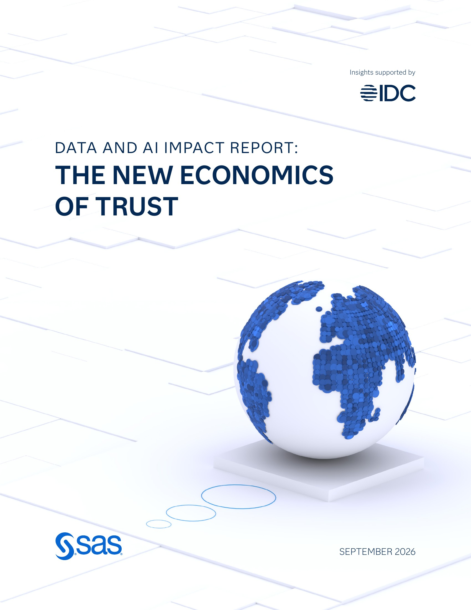
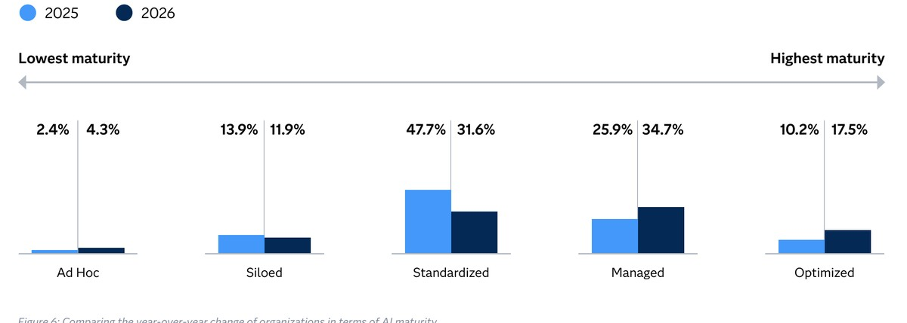

# SAS, 한국 기업 AI 신뢰 격차 줄고 데이터 품질은 제자리

_SAS 조사에서 한국 기업의 AI 신뢰 격차는 28.9점에서 1.5점으로 줄었고, 그 절반 넘는 몫은 기대가 내려온 결과다_

## Executive Summary

> [!callout]
> 이 글은 SAS가 2026년 9월 30일 공개한 '데이터 및 AI 영향력 보고서: 새로운 신뢰의 경제학'에서 한국 기업 부분을 읽는다. 국내 보도가 먼저 집은 숫자는 신뢰 격차다. 기업이 AI를 얼마나 믿는지와 그 AI를 실제로 얼마나 관리하고 있는지의 차이가 한 해 사이 28.9점에서 1.5점으로 줄었다. 거의 사라진 셈이다.

> 그런데 두 숫자가 모두 가운데로 움직여 만난 결과다. 관리 역량은 45점에서 57.1점으로 12.1점 올랐고, 같은 기간 체감 신뢰는 73.9점에서 58.6점으로 15.3점 내려왔다. 좁혀진 27.4점 가운데 더 큰 몫을 낸 쪽은 신뢰다. 격차가 작아졌다는 문장은 한국 기업이 AI를 믿을 만하게 만들었다는 뜻과 AI를 전보다 덜 믿게 됐다는 뜻을 함께 담고 있다.

> 1절부터 4절까지는 SAS 보고서와 이를 전한 국내 보도에 적힌 수치다. 5절은 그 수치를 데이터를 다루는 사람의 눈으로 다시 읽은 이 글의 해석이다.

### 주요 수치

한국 기업에 붙은 숫자는 네 개로 추릴 수 있다. 앞의 두 개는 격차가 왜 작아졌는지를 말하고, 뒤의 두 개는 그 격차 안에서 무엇이 아직 비어 있는지를 말한다.

출처: [지디넷코리아(2026-09-30)](https://zdnet.co.kr/view/?no=20260930174541), [디지털데일리(2026-09-30)](https://www.ddaily.co.kr/page/view/2026093010332767258).

<!-- stat-card -->
**1.5점** — 한국 기업의 AI 신뢰 격차 — 1년 전 28.9점이었다. 체감 신뢰에서 관리 역량을 뺀 값이다

<!-- stat-card -->
**15.3점** — 체감 신뢰가 내려온 폭 — 73.9점에서 58.6점으로. 같은 기간 역량이 오른 12.1점보다 크다

<!-- stat-card -->
**1.9%** — 데이터 품질 관리를 의무로 둔 한국 기업 — 모든 AI 프로젝트에 품질 관리 절차를 빠짐없이 적용하는 비율이다

<!-- stat-card -->
**42.6%** — 에이전틱 AI를 도입한 한국 기업 — 스스로 판단하고 행동하는 AI를 이미 쓰고 있는 비율이다

## 1.5점은 무엇과 무엇의 차이인가

SAS가 9월 30일 내놓은 보고서의 이름은 '데이터 및 AI 영향력 보고서: 새로운 신뢰의 경제학'이다. 올해가 2년 차 조사이고, 시장조사기관 IDC의 리서치 인사이트를 바탕으로 한다. 응답자는 28개국 2,699명이다. 자기 회사의 데이터·AI 사업을 알거나 결정에 영향을 주는 사람들이고, 은행·보험·생명과학·공공 네 분야가 중심이다.

*▲ 이 글이 읽는 SAS·IDC 공동 조사 보고서 표지 | Source: [SAS 공식 페이지](https://www.sas.com/en_us/gc/data-and-ai-impact-report.html)*

이 조사가 '신뢰 격차'라 부르는 것은 두 점수의 뺄셈이다. 한쪽은 기업이 자기 회사의 AI를 얼마나 믿는가, 곧 체감 신뢰다. 다른 쪽은 그 AI를 실제로 얼마나 관리하고 있는가, 곧 관리 역량이다. 관리 역량은 다섯 가지 항목을 100점 만점으로 매겨 묶는다. 데이터 품질 및 거버넌스, 모델 거버넌스 및 감독, 설명 가능성 및 공정성, 책임 있는 AI 정책, 감사 및 책임성이다.

한국 기업의 두 점수를 연도별로 놓으면 뺄셈이 그대로 맞는다. 지난해는 체감 신뢰 73.9점에서 관리 역량 45점을 빼 28.9점이었다. 올해는 체감 신뢰 58.6점에서 관리 역량 57.1점을 빼 1.5점이다. 믿는 만큼 관리하고 있느냐는 물음에 작년에는 29점어치 모자랐고, 올해는 1.5점어치 모자란다.

관리 역량 쪽에는 보고서가 그어 둔 선이 하나 더 있다. 다섯 항목의 평균이 80점 이상인 기업을 SAS는 '신뢰할 수 있는 AI 리더'로 친다. 한국 기업의 올해 57.1점은 그 선에서 22.9점 아래다. 1년 동안 12.1점을 올려 놓고도 아직 선 안쪽으로는 들어오지 못했다.

> [!callout]
> 이 숫자가 말하지 않는 것도 분명하다. 격차는 두 점수의 거리일 뿐 높이가 아니다. 1.5점이라는 결과는 체감 신뢰와 관리 역량이 모두 50점대 후반에서 만났다는 뜻이지, 둘 다 높은 자리에서 만났다는 뜻이 아니다.

## 내려온 숫자가 올라온 숫자보다 크다

격차가 27.4점 좁혀지는 동안 두 점수가 각각 얼마나 움직였는지를 따로 보면 그림이 갈린다. 관리 역량은 45점에서 57.1점으로 12.1점 올랐다. 체감 신뢰는 73.9점에서 58.6점으로 15.3점 내렸다. 좁혀진 거리의 절반을 넘는 몫이 내린 쪽에서 나왔다.

▲ 출처: SAS '데이터 및 AI 영향력 보고서'(2026-09-30) 한국 수치를 지디넷코리아·디지털데일리 보도에서 옮겼다.

내린 쪽을 나쁜 소식으로만 읽을 필요는 없다. 체감 신뢰가 73.9점이던 해에 관리 역량이 45점이었다면, 그 73.9점은 근거보다 앞서 나간 숫자였다. 1년 동안 AI를 실제로 돌려 본 기업이 자기 시스템을 다시 평가해 58.6점을 매겼다면, 낮아진 것은 역량이 아니라 기대다.

이 조사에서 같은 방향이 전 세계 수치로도 나온다. AI의 자율성이 커질수록 신뢰는 오히려 내려간다. 사람이 쓰는 글이나 그림을 만들어 주는 생성형 AI에 대한 신뢰는 76%인데, 스스로 판단하고 행동하는 에이전틱 AI에 대한 신뢰는 66%로 떨어진다. 맡기는 몫이 커질수록 믿음은 줄어든다.

다만 써 본 쪽의 마음이 늘 한 방향으로 움직이는 것은 아니다. 갤럽이 서른일곱 나라의 개인에게 물은 조사에서는 [쓰는 빈도가 오를수록 신뢰도 같이 올랐고, 걱정의 정점도 사용자 집단 안에 있었다](/report/ai-daily-use-worry-gallup-2026-09/ko/). 이번 SAS 조사가 재는 것은 개인이 AI를 어떻게 느끼는가가 아니라 조직이 자기 회사 AI에 매긴 점수다. 두 결과를 겹쳐 읽을 때 섞지 않는 편이 낫다.

## 감독 체계만 올랐고 데이터 품질은 멈춰 있다

오른 12.1점 안쪽도 고르지 않다. 관리 역량을 이루는 다섯 항목 가운데 국내 보도가 점수를 밝힌 것은 네 개다. 한 항목만 크게 뛰었고, 한 항목은 1년 내내 그 자리에 있었으며, 나머지 둘은 조금 오르는 데 그쳤다.

| 항목 | 2026년 점수 | 전년 대비 |
| --- | --- | --- |
| 책임 있는 AI 정책 | 59.5점 | 변화 없음 |
| 모델 거버넌스 및 감독 | 55.8점 | 9.3점 상승 — 항목 중 최대 |
| 설명 가능성 및 공정성 | 54.6점 | 소폭 상승 |
| 데이터 품질 및 거버넌스 | 53.9점 | 소폭 상승 |
| 감사 및 책임성 | 국내 보도에 없음 | — |

▲ 한국 기업 기준. 출처: 디지털데일리(2026-09-30), 데이터넷(2026-09-30). 다섯 항목 이름은 SAS 보고서의 신뢰성 지수 구성과 같다.

표에서 점수가 비어 있는 다섯째 칸은 감사 및 책임성이다. AI가 내린 판단을 나중에 되짚어 누가 승인했고 어떤 데이터가 쓰였는지 밝힐 수 있는가를 묻는 항목이다. 보고서가 수익과 함께 이름을 부르는 세 항목에 이 칸이 들어가는데, 한국 점수는 국내 보도에서 찾지 못했다. 네 칸만 놓고 읽는 것은 이 글의 한계다.

크게 오른 한 칸은 모델 거버넌스 및 감독이다. AI 모델을 누가 승인하고, 누가 지켜보고, 문제가 생기면 어떤 절차로 멈추는지를 정해 두는 일이다. 9.3점은 네 항목 가운데 가장 큰 폭이고, 관리 역량 전체가 12.1점 오른 데에 이 칸이 크게 기여했다고 볼 수 있다. 한국 기업이 1년 동안 실제로 만든 것은 주로 이 감독 체계다.

정작 그 체계가 감독해야 할 대상 쪽은 거의 그대로다. 데이터 품질 및 거버넌스는 53.9점으로 네 항목 가운데 가장 낮고, 설명 가능성 및 공정성은 54.6점이다. 두 항목 다 소폭 상승에 그쳤다. 모델을 승인하고 감독하는 규정은 생겼는데, 그 모델이 무엇을 먹고 어떤 근거로 답을 냈는지를 다루는 칸은 50점대 중반에서 움직이지 않았다.

책임 있는 AI 정책 59.5점이 1년 내내 변화 없음으로 적힌 것도 같은 그림의 일부로 읽힌다. 네 항목 가운데 점수가 가장 높은데 올해 전혀 움직이지 않았다. 문서로 쓰는 일은 작년에 어느 정도 끝냈고, 그 뒤로는 손대지 않았다는 쪽에 가깝다.

## 에이전틱 AI 도입이 데이터 점검을 앞질렀다

점수 바깥에 이 조사에서 가장 날카로운 수치 두 개가 따로 있다. 하나는 도입률이다. 스스로 판단하고 행동하는 에이전틱 AI를 이미 도입한 한국 기업이 42.6%다. 다른 하나는 검증률이다. 모든 AI 프로젝트에 데이터 품질 관리 절차를 의무로 적용하는 한국 기업은 1.9%에 그친다.

두 수치는 같은 모집단에서 나왔지만 재는 대상이 다르다. 앞쪽은 얼마나 많이 쓰고 있는가이고, 뒤쪽은 예외 없이 지키는 절차를 갖췄는가다. 그래서 둘을 나눠 배수로 말하는 것은 과장이다. 다만 나란히 놓으면 순서는 보인다. 자율적으로 움직이는 AI를 들여놓는 일이 먼저 일어났고, 그 AI가 쓸 데이터를 빠짐없이 점검하는 절차를 세운 곳은 아직 열에 하나에도 못 미친다.

비어 있는 자리가 무엇인지는 전 세계 응답에서 드러난다. 조사에 답한 사용자의 97.2%는 적어도 어떤 경우에는 AI가 내놓은 권고를 그대로 따르지 않고 직접 고친다. 이유로 지목된 것은 AI가 왜 그렇게 판단했는지를 보여 주지 못한다는 점이다. 또 에이전틱 AI가 요구하는 수준으로 데이터 기반을 완전히 갖춘 기업은 전 세계에서 17.5%뿐이고, 보고서는 이 부족이 성과를 끌어내린다고 적는다.

*▲ 전 세계 기업의 데이터 인프라 성숙도 단계별 비율(2025 vs 2026) — 가장 높은 '최적화' 단계는 17.5%뿐이다 | Source: SAS, ['Data and AI Impact Report: The New Economics of Trust'](https://www.sas.com/en_us/gc/data-and-ai-impact-report.html)(2026)*

데이터 기반과 의무화가 같이 움직인다는 것도 같은 조사에 적혀 있다. 데이터 기반을 최적화한 기업은 데이터 품질과 설명 가능성 통제를 의무로 걸어 둘 가능성이 여섯 배 높았다. 규정을 먼저 만들어서 기반이 따라온 것인지, 기반이 있어서 규정을 걸 수 있었던 것인지까지 이 수치로는 가릴 수 없다. 다만 한국의 1.9%를 규정만의 문제로 읽기는 어렵다.

> [!callout]
> AI의 판단을 사람이 되짚으려면 두 가지가 남아 있어야 한다. 무엇을 보고 그렇게 답했는지, 그리고 그 재료가 믿을 만한지다. 앞쪽은 설명 가능성 54.6점이, 뒤쪽은 데이터 품질 53.9점과 1.9%라는 의무화 비율이 가리키는 자리다. 넷 중 가장 많이 오른 칸이 모델 감독이라는 것은, 한국 기업이 감독할 체계를 먼저 세우고 감독할 재료는 나중으로 미뤘다는 뜻으로 읽힌다.

이중혁 SAS코리아 대표가 발표에서 한 말도 같은 순서를 가리킨다. "AI 확장을 실질적인 비즈니스 성과로 이어가려면 거버넌스 구축과 발맞춰 AI의 판단 근거를 설명하고, 정확성과 재현성을 갖춘 데이터 기반을 완성하는 것이 중요한 과제"라는 것이다. 관리 체계를 만드는 일과 데이터 기반을 완성하는 일을 나란히 가야 할 두 축으로 뒀다.

## 페블러스가 이 조사를 주목하는 이유

이 조사가 유독 길게 다루는 것은 신뢰와 돈의 관계다. 신뢰할 수 있는 AI에 투자한 기업은 AI 사업에서 높은 투자 수익을 봤다고 답한 비율이 62%였고, 그렇지 않은 기업은 4%였다. 보고서는 이를 15배 차이로 적는다. 다만 같은 보고서가 매출 성장과 비용 절감, 고객 경험을 포함한 13개 성과 지표에서 잰 차이는 평균 1.85배다. 15배는 '높은 수익을 봤다'고 답한 비율의 차이이고, 1.85배가 실제 이익의 크기에 더 가깝다. 데이터 기반을 최적화한 기업은 높은 수익을 기대한다고 답할 가능성이 네 배 높았다.

이 수치들이 가리키는 쪽은 점수판 전체가 아니라 그 안의 특정한 칸이다. 보고서가 이름으로 부르는 것은 거버넌스와 데이터 품질, 그리고 감사 가능성이다. 이 셋에서 가장 앞선 기업군은 AI 사업에서 최소 두 배의 수익을 봤고, 하위 기업군에서 같은 답을 한 곳은 스무 곳 중 한 곳에 못 미쳤다. 한국 기업이 올해 올린 칸은 셋 중 거버넌스 하나다. 데이터 품질은 53.9점으로 네 항목 가운데 가장 낮은 자리에 그대로 있고, 감사 가능성은 점수조차 확인되지 않는다.

데이터를 다뤄 본 조직이라면 이 순서가 낯설지 않다. 규정과 승인 절차는 비교적 빨리 세워진다. 담당자를 정하고, 결재선을 긋고, 점검 주기를 적어 두면 문서가 완성된다. 그런데 모델이 어떤 데이터를 먹었고 그 데이터가 어디서 왔으며 어떤 상태였는지를 남기는 일은 시스템을 고쳐야 하는 작업이다. 그래서 늘 뒤로 밀린다. 모델 거버넌스 9.3점 상승과 데이터 품질 소폭 상승은 그렇게 미뤄진 순서를 점수로 적은 것이다.

뒤로 밀리던 쪽을 먼저 잡은 사례도 있다. 싱가포르는 [신뢰를 선언이 아니라 증빙 체계로 세우는 길](/report/singapore-ai-trust-infrastructure-2026/ko/)을 택해 정책과 인프라와 검증을 한 줄로 이었다. 서울시는 고가치 데이터 100개를 고르면서 [AI가 바로 쓸 수 있게 미리 손보는 일](/blog/seoul-ai-ready-data-top100/ko/)을 개방 앞 단계에 넣었다. 둘 다 감독 규정을 늘린 사례가 아니라 감독할 재료 쪽을 고친 사례다.

*▲ 'AI 고가치 데이터셋 TOP100' 선정안을 심의한 서울특별시청 — 데이터를 공개하기 전에 AI가 바로 쓸 수 있는 상태로 손보는 단계를 넣었다 | Source: [이투데이](https://www.etoday.co.kr/news/view/2622216)*

페블러스가 AI-Ready Data를 이야기할 때 되풀이하는 말이 있다. 검증되지 않은 데이터 위에서는 감독도 검증이 아니다. 모델을 누가 승인했는지는 알 수 있어도, 그 모델이 무엇을 근거로 답했는지는 재료 쪽에 기록이 없으면 되짚을 수 없다. 에이전틱 AI를 쓰는 기업이 42.6%인데 모든 프로젝트에 품질 관리를 거는 곳이 1.9%라면, 되짚을 재료가 회사 안에 아직 없다는 뜻이다.

그래서 이 조사가 독자에게 남기는 질문은 하나다. 우리 회사가 AI를 덜 믿게 된 것과 데이터를 더 잘 다루게 된 것 중, 올해 점수를 올린 쪽은 어디인가. 둘 다 격차를 줄이지만 다음 해에 남는 것은 다르다. 기대를 낮춰 생긴 여유는 한 번 쓰면 사라지고, 재료를 고쳐 생긴 여유는 쌓인다.

여기까지 읽어 주셔서 감사하다. 보고서의 한국 수치는 [지디넷코리아](https://zdnet.co.kr/view/?no=20260930174541)와 [디지털데일리](https://www.ddaily.co.kr/page/view/2026093010332767258) 보도에서, 전 세계 수치와 조사 방법은 [SAS 공식 페이지](https://www.sas.com/en_us/gc/data-and-ai-impact-report.html)에서 확인할 수 있다. 여러분의 조직에서 데이터 품질 점검이 모든 AI 프로젝트에 걸려 있는지, 아니면 중요한 프로젝트에만 걸려 있는지 한번 세어 보시고 알려 주시면 좋겠다.

## 참고문헌

### 국내 보도

- 1.지디넷코리아. (2026). "[韓 기업, 'AI 신뢰 격차' 감소세…다음 과제는 데이터 품질](https://zdnet.co.kr/view/?no=20260930174541)." 2026-09-30.
- 2.디지털데일리. (2026). "[한국 기업 AI 신뢰 격차 1년 새 28.9점→1.5점…데이터 품질·설명 가능성은 과제](https://www.ddaily.co.kr/page/view/2026093010332767258)." 2026-09-30.
- 3.데이터넷. (2026). "[韓 기업 AI 신뢰 격차 크게 줄어 ··· 데이터 품질·설명 가능성 과제](https://www.datanet.co.kr/news/articleView.html?idxno=214794)." 2026-09-30.
- 4.전자신문. (2026). "[SAS "韓 기업, AI 안전성 신뢰 높아져…감독 강화 효과"](https://www.etnews.com/20260930000451)." 2026-09-30.

### SAS 공식 자료

- 5.SAS Institute Inc. (2026). "[Organizations with trustworthy AI practices are 15 times more likely to see strong ROI, per study findings](https://www.sas.com/en_sg/news/press-releases/2026/september/idc-data-ai-impact-report.html)." Press release, 2026-09-30.
- 6.SAS Institute Inc. (2026). "[Data and AI Impact Report: The New Economics of Trust](https://www.sas.com/en_us/gc/data-and-ai-impact-report.html)." IDC 리서치 인사이트 지원.

### 해외 비교 사례

- 7.europawire. (2026). "[SAS research finds UK organisations accelerating enterprise AI adoption while business returns trail trust](https://news.europawire.eu/sas-research-finds-uk-organisations-accelerating-enterprise-ai-adoption-while-business-returns-trail-trust/eu-press-release/2026/10/02/17/12/04/181760/)." 2026-10-02.
- 8.Global Government Forum. (2026). "[Government organisations over-relying on unproven AI, global study finds](https://www.globalgovernmentforum.com/government-organisations-over-relying-on-unproven-ai-global-study-finds/)." 2026-04-27.
