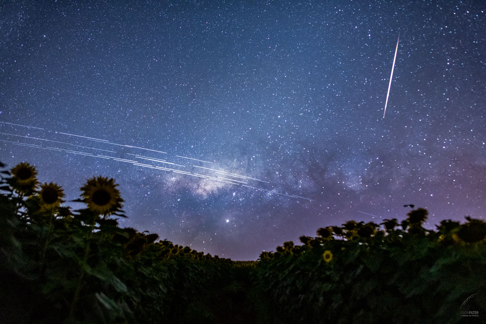

# 3,200만 건으로 잰 인공위성의 천체 사진 오염 확률

_IAU 밝기 기준을 넘는 물체가 한 변 10도 시야의 10초 노출에 찍힐 확률은 15%였다_

## Executive Summary

> [!callout]
> 한 변 10도짜리 하늘을 10초 동안 찍으면 그 한 장에 인공 물체가 들어올 확률이 15%다. 위성이 천체 사진에 흰 줄을 남긴다는 이야기는 오래됐고, 이 15%는 그 일이 얼마나 자주 일어나는지를 관측치로 센 값이다. 국제천문연맹 산하 다크앤콰이어트스카이 보호센터(IAU CPS)와 체코과학원 연구진이 로봇 관측소 한 곳이 2025년 한 해에 기록한 밝기 측정 3,200만 건을 정리해 9월 초 arXiv에 올렸다.

> 출발점은 밀도다. 국제천문연맹이 정한 밝기 상한인 7.0등급보다 밝은 인공 물체가 하늘 1제곱도당 0.00076개꼴로 떠 있다. 앞의 15%는 이 밀도에 시야 크기와 노출 시간을 얹어 나온 값이다. 다만 밤 시간 전체를 평균한 값이어서, 하늘 대부분이 햇빛을 받는 박명 무렵에는 더 높고 지구 그림자가 하늘을 덮는 자정 무렵에는 낮다.

> 3절까지는 논문이 실제로 잰 것과 유보한 것을 따라간다. 4절에서 덧붙이는 데이터 쪽 대응은 논문에 없는 이 글의 해석이다.

### 주요 수치

출처: Mallama, Karpov, Cole, [The Impact of Artificial Space Objects on Optical Astronomy as Determined from 32 Million Photometric Observations](https://arxiv.org/abs/2609.02951), arXiv:2609.02951(2026) 표 3·표 4·9절 · [IAU CPS](https://cps.iau.org/) 집계(2026년 9월 6일 확인)

<!-- stat-card -->
**15%** — 한 변 10도 시야·10초 노출 — 7등급보다 밝은 인공 물체가 그 한 장에 들어올 확률

<!-- stat-card -->
**59%** — 맨눈으로 볼 확률 — 빛공해 없는 하늘에서 시야 주변부 고리에 위성이 걸릴 확률

<!-- stat-card -->
**2:1 → 50:1** — 위성 대 로켓 개체수 비 — 2020년을 경계로 위성은 3배 늘고 로켓은 7분의 1로 줄었다

<!-- stat-card -->
**233만 기** — 계획 단계 콘스텔레이션 위성 — FCC·ITU 라이선스 신청에 적힌 수, 논문이 가정한 100만 기의 두 배

## 한 변 10도 시야를 10초 열면 15%

천문학에서 밝기는 등급으로 잰다. 숫자가 작을수록 밝고, 1등급 차이가 밝기 2.5배쯤 된다. 국제천문연맹은 2024년 성명에서 위성의 밝기 상한을 존슨 V등급 7.0으로 제시했다. 고도 550km까지가 그 기준이고, 그보다 높이 도는 물체는 고도에 따라 상한이 완화된다. 상한을 고도로 환산하는 식을 그대로 적용하면 1,380km에서 8.0등급이 되는데, 지구를 도는 물체 대부분이 그 아래에 있다. 같은 성명은 위성이 맨눈에 보이지 않아야 한다는 권고도 담았고, 빛공해가 적은 곳에서 맨눈이 닿는 한계가 6.0등급이다. 6과 7과 8, 이 세 숫자가 이 연구의 기준선이다.

상한을 정해 두었다고 지켜지는 것은 아니다. 이 논문의 저자 가운데 두 명이 2025년 왕립천문학회 월보에 먼저 실은 연구는 스타링크·원웹·블루버드와 중국의 첸판·궈왕 다섯 콘스텔레이션의 밝기를 재서, 이 위성들이 사실상 전부 7등급 상한을 넘고 대부분은 6등급 상한마저 넘는다고 보고했다. 그러니 이번 논문이 세는 것은 상한을 넘는 물체가 있느냐가 아니다. 이미 넘어 있는 물체들이 사진 한 장에 얼마나 자주 들어오느냐다.

*▲ 스타링크 위성 여러 기가 남긴 궤적이 사진 한 장을 가로지른다 | Source: [Egon Filter, Wikimedia Commons (CC BY 4.0)](https://en.wikipedia.org/wiki/File:StarlinkTrails_Filter_1080.jpg)*

재료는 러시아 북위 43.65도, 동경 41.43도에 있는 미니메가토르토라(MMT9) 로봇 관측소의 공개 데이터베이스다. 2014년부터 돌아간 이 관측소는 채널 아홉 개로 하늘을 훑으며 초당 열 번씩 밝기를 기록한다. 이 관측소가 내놓는 등급은 국제천문연맹이 상한을 정할 때 쓴 존슨 V 등급과 0.1등급 안에서 맞는다고 저자들은 밝혔다. 재는 잣대와 규제하는 잣대가 같은 눈금 위에 있다. 연구진은 2025년 한 해 동안 북미항공우주방위사령부 카탈로그에 등재된 물체 11,241개에 대해 쌓인 등급 3,200만 건을 뽑아냈다. 채널 하나의 시야가 99제곱도이고 2025년 전체 관측 시간이 2,230만 초다. 여기에 1초마다 열 번씩 찍는다는 조건까지 곱하면 이 데이터가 훑은 하늘의 총량이 221억 제곱도가 된다.

밝기 분포의 봉우리는 8.5등급에 있다. 그보다 어두운 쪽이 줄어드는 것은 장비 감도가 만든 선택 효과이고, 밝은 쪽이 줄어드는 것은 큰 물체가 실제로 적기 때문이다. 저자들은 MMT9가 8등급까지는 매우 안정적으로, 9등급까지는 자주, 10~11등급도 이따금 잡아낸다고 적었다. 8등급보다 어두운 궤적은 대체로 천체 사진을 망치지 않으므로 이 정도 감도면 충분하다고 보았다.

하늘 총량으로 관측 건수를 나누면 밀도가 되는데, 6.0등급보다 밝은 관측이 840만 건이라 밀도는 1제곱도당 0.00038개, 7.0등급 기준으로는 1,680만 건에 0.00076개, 8.0등급 기준으로는 2,430만 건에 0.00110개다. 이 값은 하늘 어느 한 순간을 찍은 스냅숏에 가깝다. 저자들은 채널들의 시야가 겹치는 구역에서는 같은 위성이 두 채널에 함께 기록될 수 있다는 점을 덧붙여 두었다.

여기에 물체가 하늘을 가로지르는 속도를 얹어야 확률이 나온다. 그런데 하늘에는 고도가 제각각인 물체가 수천 개 떠 있어서, 저자들은 계산이 가능해지도록 두 가지를 정해 놓고 시작했다. 대형 콘스텔레이션의 고도는 스타링크의 350~475km에서 원웹의 1,200km까지 걸쳐 있지만 수가 가장 많은 쪽이 스타링크라 고도를 500km로 잡았고, 천문학자가 되도록 천정 가까이를 겨눈다는 점을 들어 고도각을 90도로 놓았다. 두 선택 모두 물체가 하늘을 더 빠르게 가로지르는 쪽 조건이다. 그렇게 정한 겉보기 속도가 초당 0.88도이고, 연구진은 시야 주위에 격자를 깔아 각 칸에서 물체가 노출 시간 안에 시야로 들어올지를 1,000번씩 모의했다. 그렇게 얻은 값이 아래 표다.

| 시야 한 변(도) | 1초 | 2초 | 5초 | 10초 |
| --- | --- | --- | --- | --- |
| 1 | 0.2% | 0.2% | 0.5% | 0.9% |
| 2 | 0.5% | 0.6% | 1.1% | 2.0% |
| 5 | 2.3% | 2.8% | 4.0% | 6.0% |
| 10 | 8.4% | 9.3% | 11.4% | 15.1% |

7.0등급보다 밝은 인공 물체가 노출 중에 시야로 들어올 확률(논문 표 4). 시야는 한 변의 길이이므로 10도는 100제곱도짜리 화면을 뜻한다. 같은 조건에서 기준을 8.0등급까지 넓히면 최댓값이 21.2%로 오른다. 표의 값은 밤 시간 전체의 평균이다. 출처: arXiv:2609.02951.

표를 세로로 읽는 것과 가로로 읽는 것의 차이가 크다. 노출을 1초에서 10초로 열 배 늘려도 확률은 8.4%에서 15.1%로 두 배가 채 안 되게 오른다. 시야를 한 변 1도에서 10도로 늘리면 0.9%에서 15.1%로 열여섯 배가 넘게 뛴다. 연구진이 표 밖의 값을 어림하려고 적어 둔 근사식에서도 시야는 1.6제곱, 노출은 0.4제곱으로 들어간다. 넓게 찍는 서베이 망원경이 오래 찍는 망원경보다 이 문제에 더 취약하다.

두 방향 모두 곧이곧대로 비례하지 않는 데는 저자들이 밝힌 이유가 있다. 노출을 길게 열어도 시야에서 멀리 떨어진 물체는 그 시야를 스칠 수 있는 방향의 폭이 좁아 들어올 가능성이 낮다. 그래서 확률은 노출 시간이 늘어난 만큼 따라 오르지 못한다. 시야 쪽은 한 변이 아니라 넓이를 놓고 봐야 한다. 한 변을 열 배로 늘리면 넓이는 백 배가 되는데 확률은 열여섯 배에 그치는 이유를, 저자들은 새로 들어오는 바깥쪽 물체일수록 겉보기 속도가 느려 노출이 닫히기 전에 시야까지 오지 못하기 때문이라고 적었다.

모든 관측이 한 곳에서 이루어졌기 때문에 이 표본이 모든 궤도군을 고르게 담지는 못한다. 연구진이 논문에 스스로 적어 둔 한계다. 그리고 MMT9 공개 데이터베이스에는 러시아 물체가 빠져 있어, 카탈로그를 스무 개당 하나꼴로 표집해 국적 비율을 구한 뒤 보정 계수를 곱하는 방식으로 채워 넣었다.

## 왜 2020년 이후 발사분이 더 밝은가

하늘에 떠 있는 인공 물체는 세 종류로 나뉜다. 카탈로그 이름에 RB가 붙은 로켓 몸체, DEB가 붙은 잔해, 그리고 나머지 위성이다. 연구진은 2020년 초를 대형 콘스텔레이션 시대의 시작으로 잡고 그 전후로 발사된 물체를 갈라 세었다. 국적 보정을 위해 뽑은 표본 1,460개가 그 셈의 바탕이다.

표본 안에서 위성은 세 배로 늘었고 로켓과 잔해는 각각 7분의 1로 줄었다. 로켓 하나에 위성을 수십 기씩 실어 올리는 방식이 굳었기 때문이다. 발사 한 번이 하늘에 남기는 로켓 몸체는 그대로인데 위성 수만 뛰었으니, 개체수 비는 산술만으로도 뒤집힌다.
