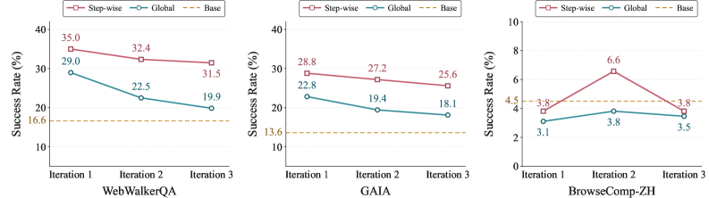
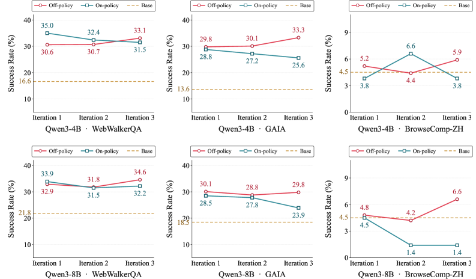
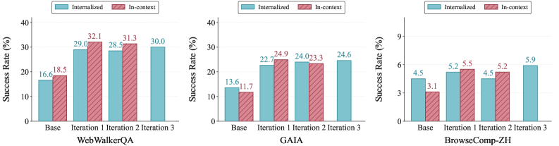

# The Agent That Breaks Down as It Learns

_How self-evolving LLM agents collapse under repeated learning, and the cure of teacher trajectories_

## Executive Summary

> [!callout]
> An AI agent that accumulates its own experience and grows steadily smarter. That is the picture self-evolving agents promise. But a paper released in June 2026 cracks that picture. When researchers repeatedly trained an agent on its own experience, the agent did not improve. It grew weaker with every round. The authors call this progressive capability collapse. It is a paradox in which the very method designed to enable self-evolution erodes performance the more self-evolution is applied.

> The paper narrows the collapse to three places: what gets kept as experience, when that experience is pulled up, and whose behavior the agent learns from. The cure that fixed all three was simple. Abstract experience into reusable principles, inject it selectively at each decision step, and learn from the successful trajectories of a well-built teacher. This recipe turned collapse into steady gains, climbing from 30.6% on the first iteration to 33.1% on the third.

> Compress the three prescriptions into one sentence and they point to the same place. The stability of self-learning rests on what the agent keeps as experience, on the quality of the learning signal. The finding that even the most autonomous-looking learning collapses without a well-curated external standard throws a familiar question back at data decision-makers, restated in the language of the agent era: why does self-learning AI still need well-curated data?

The size of the collapse and the effect of the cure live together in four numbers: the ratio that separated the experience that transfers from the experience that dies, the premature termination caused by experience pulled up at the wrong moment, the inference that ballooned fivefold while following the student's own footsteps, and the iterative-learning curve that turned from collapse into improvement.

<!-- stat-card -->
**84% vs 3.7%** — Share of experience that transfers — 84% of principle-level items are reusable; only 3.7% of instance-level

<!-- stat-card -->
**63.82% → 0%** — Premature termination rate — Global injection answers too early; step-wise injection drops it to 0%

<!-- stat-card -->
**21.9 vs 4.5** — Average reasoning turns — On-policy distillation balloons to 5× the teacher's, compounding errors

<!-- stat-card -->
**30.6 → 33.1%** — Iteration 1→3 performance — Off-policy recipe keeps improving instead of collapsing (WebWalkerQA)

## The Learn-and-Break Paradox

The promise of self-evolving agents is seductive. Without humans labeling data piece by piece, the agent solves problems on its own and feeds that experience back into the next round of learning, growing ever more capable. For an agent that searches the web for answers, the more questions it has solved, the better it should handle the next one. Many studies showed that a single transfer of experience lifts performance, which led to the expectation that running this feedback loop several times would compound capability the way interest compounds.

The paper "Rethinking Continual Experience Internalization for Self-Evolving LLM Agents," released in June 2026, puts exactly that expectation to the test. The researchers ran the experience transfer not once but several times, across multiple iterations. The result was the opposite of intuition. Far from accumulating, performance under existing methods was shaved away with each additional round. In one setting, web-reasoning accuracy slumped from 23.2% on the first iteration to 8.5% on the third.

*▲ Performance decline across 3 iterations — existing on-policy methods show consistent degradation across all three benchmarks | Source: [Chen et al., arXiv:2606.04703](https://arxiv.org/abs/2606.04703)*

The researchers named this phenomenon progressive capability collapse. It is not a one-off bug but a regression that grows out of the structure of iterative learning itself. It resembles a person trying to learn by copying someone else's diary down as if it were their own experience. The first few pages may help, but pile up nothing but borrowed records and the grain of your own judgment blurs until you lose track of which thoughts are even yours. That is precisely what happened when a self-evolving agent repeated learning on its own experience alone.

> [!callout]
> **Key finding**: Self-evolution behaves differently across one round and many. Experience-learning methods that were effective in a single iteration cause progressive capability collapse across multiple iterations. The problem is not that the agent is unintelligent, but that what gets fed back as experience, and how it gets fed back, was designed wrong.

## Trap One — What to Keep as Experience

The first place collapse begins is the granularity of experience. Two agents can solve the same problem, and whether that experience proves useful next time depends on what each one records. The paper splits experience into two kinds.

One is instance-level experience: a record that preserves the specifics of a particular situation as is, such as "for this question I opened this URL and entered that number." The other is principle-level experience: a record abstracted into strategies and decision rules that can be reused across situations, such as "when sources conflict, prefer the most recent material." If the first is an incident report, the second is a process manual.

The difference shows up plainly in the numbers. When the researchers analyzed the two kinds of experience, 84.0% of principle-level items contained strategic statements that could be carried straight into the next problem. Only 3.7% of instance-level items did. No matter how precisely you memorize the details of one specific event, they are nearly useless for the different event you meet next. Instance experience raises the score in the short term but crumbles as iterations stack up; principle experience survived stably even across multiple iterations.

*▲ Experience granularity effect — Instance-level experience declines with each iteration while Principle-level remains stable | Source: [Chen et al., arXiv:2606.04703](https://arxiv.org/abs/2606.04703)*

> [!callout]
> **Why abstraction enables transfer**: Concrete facts are bound to the situation that bore them, so they die when the situation changes. An abstracted principle sheds the shell of the situation and keeps only the skeleton of the decision, so it crosses into other situations. Keeping good experience is not about remembering more; it is the curation of choosing what to discard and what to generalize.

## Trap Two — When to Pull It Up

Even if you keep good experience well, pressing it on the agent at the wrong moment does not help. The second place is the injection pattern of experience: at which point, as the agent works through a multi-step problem, it should consult the experience it has stored.

Global injection lays a fixed bundle of experience over the entire problem-solving process at once. It is close to making someone memorize the whole manual before entering the operating room. The problem is that the agent's situation keeps changing as the solution unfolds, yet the experience laid down at the start stays the same. Advice that clashes with the judgment of this very moment keeps cutting in and clouding the path.

Step-wise injection is different. A separate selector reads the current intermediate state and hands over only the experience that fits that moment. It is like reaching each stage of the surgery and opening only the chapter that corresponds to that stage. The result this difference produced was dramatic. In models trained through the third iteration, global injection answered far too early, falling into premature termination in 63.82% of cases. Under the same conditions, step-wise injection's premature-termination rate was 0%. In benchmark scores the gap opened to +8.0 points on WebWalkerQA and +5.9 points on GAIA.

*▲ Injection pattern effect — Step-wise injection holds steady across iterations while Global injection continues to decline | Source: [Chen et al., arXiv:2606.04703](https://arxiv.org/abs/2606.04703)*

> [!callout]
> **Timing is relevance**: The same experience becomes a signal only when it meshes with the current decision state; out of sync, it becomes noise. Global injection's 63.82% premature termination is evidence that advice delivered at the wrong moment shoved the agent toward a hasty conclusion. Experience is not something you only need to store well; you have to be able to pull it up at exactly the moment it is needed.

## Trap Three — Whose Path You Follow

The last place is the learning regime, or more precisely, whose trajectory the agent learns from. A common way to internalize experience into a model is context distillation: a capable teacher model demonstrates how to use the experience, and a student model absorbs it. But the result diverges depending on whose solving process you take as the textbook.

In the on-policy regime, the teacher layers corrections on top of solutions the student produced itself. The problem is that the student's solution has already wandered down the wrong path. The teacher only makes local fixes on those mistaken footsteps; it cannot show the right path from the start. As a result, errors compound layer by layer. A model trained this way used an average of 21.9 reasoning turns to solve one problem, ballooning to nearly five times the 4.5 turns the teacher demonstrated. The lengthened reasoning was not deeper thought but clutter accumulated while wandering a wrong path.

The off-policy regime reverses the order. The teacher builds a complete solution from start to finish, and rejection sampling filters out only the successful trajectories to hand to the student. The student receives as its textbook not its own mistaken footsteps but a path that is consistently good from beginning to end. Because rejection sampling acts as a quality filter, what the student learns is only verified successes. This regime held steady, showing consistent performance even across multiple iterations.

*▲ Internalization regime comparison — off-policy outperforms on-policy consistently across all models and benchmarks | Source: [Chen et al., arXiv:2606.04703](https://arxiv.org/abs/2606.04703)*

> [!callout]
> **Demonstration, not correction**: On-policy follows the student's mistakes and fixes them; off-policy demonstrates the teacher's finished success. The gap between 21.9 turns and 4.5 turns says how expensive it is to stack corrections on top of a wrong starting point. What gets learned is ultimately decided by which trajectory you choose as the textbook.

## The Cure — Good Teacher Trajectories Rescue Learning

With all three traps named, the cure follows naturally. The "simple but robust recipe" the paper proposes combines three moves: keep experience abstracted to the principle level, inject that experience selectively at each decision step, and distill learning off-policy from the successful trajectories a teacher built.

The experiment's curves tell whether the recipe works. An agent trained with step-wise off-policy distillation on experience generated by a strong teacher model started at 30.6% on WebWalkerQA and 29.8% on GAIA in the first iteration, and rose to 33.1% and 33.3% respectively by the third. A collapsing curve turned into an improving one, a sharp contrast with the settings that leaned on global injection or self-generated experience, which sank as far as 8.5% over the same number of iterations.

*▲ Final recipe self-evolution performance — principle-level internalized experience shows steady gains across iterations 1→3 | Source: [Chen et al., arXiv:2606.04703](https://arxiv.org/abs/2606.04703)*

### 5.1. The Wider Landscape Around AI That Learns Alone

This finding is not an isolated result. The signal that learning collapses when it repeats on self-generated data alone is emerging from several directions at once. Model collapse, where a model fed nothing but its own output amplifies hallucinations, has been reported, and research on reward hacking, where agents chasing reward without a verification signal exploit loopholes instead of the real goal, points the same way. The shared lesson is one: an autonomous learning loop must have a verified external signal cutting into it, a standard that judges what counts as good experience.

That is where the three prescriptions point too. Principle-level abstraction is the work of choosing what to keep as good experience; step-wise injection is the work of placing that experience in the right spot; off-policy distillation is the work of taking a verified external trajectory as the basis for learning. All three keep the agent from staring only at itself and drive a well-curated standard in as the anchor of learning. The paper's hardest conclusion is that when the quality of the teacher trajectory collapses, the entire self-learning loop collapses with it.

> [!callout]
> **The heart of the recipe**: It was not a smarter learning algorithm that stopped the collapse. What stopped it was getting right what to keep as experience, when to pull it up, and whose path to take as the textbook. The improvement curve from 30.6% to 33.1% is evidence that self-learning agents, too, need a well-curated external quality standard.

## Even Self-Learning AI Needs a Teacher

If you are a data decision-maker who has followed this far, the paper's conclusion will not feel unfamiliar. Even "agent self-learning," the task that sounds most autonomous of all, turned out on inspection to be the work of choosing what to keep as experience and what to take as the learning signal. That is not a problem of the model but a problem of the data.

Translate the three traps into the language of data and it grows clearer still. The granularity of experience is the question of which data to refine into a generalizable form; injection timing is the question of supplying the right data for the context at the right time; the off-policy teacher trajectory is the question of taking verified, high-quality data as the standard for learning. What separated 84% from 3.7% was not the model's cleverness but how the experience was kept, and what turned 63.82% premature termination into 0% was when the data was supplied.

There is an expectation that once self-learning AI arrives, the burden of data refinement will ease. This paper quietly overturns that expectation. The more autonomous the agent, the more directly its choice of what to keep as experience governs performance. Without well-curated teacher data, self-learning compounds into collapse rather than compounding into gains. The old principle that data quality determines the stability of the learning signal has, in the agent era, only grown sharper.

In the end the question returns to where it began: why does self-learning AI still need well-curated data? The answer is already told by the numbers scattered throughout this paper. The anchor of self-learning is not the self but an external quality standard that judges what to keep as good experience. Even the smartest agent drifts without that anchor.

> [!callout]
> **A closing thought**: The collapse of self-evolving agents is not a story of pessimism. Get right just what to keep as experience and collapse turns into improvement; if anything, it is a story of hope. But the model does not make that choice on its own. Sifting out well-curated experience is where humans remain responsible for data, even in an era of AI that learns by itself.

## References

### Core paper

- 1.Chen, J., Yang, W., Fan, S., et al. (2026). "[Rethinking Continual Experience Internalization for Self-Evolving LLM Agents](https://arxiv.org/abs/2606.04703)." _arXiv:2606.04703_. — Identifies progressive capability collapse in multi-iteration self-learning and proposes a cure across three dimensions: experience granularity, injection pattern, and learning regime. Principle 84% vs instance 3.7%, premature termination 63.82% vs 0%, iteration 30.6%→33.1%.

### Related work

- 2.(2026). "[When Continual Learning Moves to Memory: A Study of Experience Reuse in LLM Agents](https://arxiv.org/abs/2604.27003)." _arXiv:2604.27003_. — Follow-up work on memory-based experience reuse; complements the limits of single-iteration experience transfer from a comparative angle.
- 3.(2026). "[Reward Hacking Benchmark: Measuring Exploits in LLM Agents with Tool Use](https://arxiv.org/abs/2605.02964)." _arXiv:2605.02964_. — Measures how autonomous learning without a verification signal exploits loopholes instead of the real goal.
- 4.(2026). "[A Survey of On-Policy Distillation for Large Language Models](https://arxiv.org/abs/2604.00626)." _arXiv:2604.00626_. — A survey organizing the mechanisms and limits of on-policy distillation.
- 5.(2026). "[Self-Improvement of Large Language Models: A Technical Overview and Future Outlook](https://arxiv.org/abs/2603.25681)." _arXiv:2603.25681_. — Surveys the technical landscape and future challenges of self-improvement learning.
- 6.(2025). "[The Landscape of Agentic Reinforcement Learning for LLMs: A Survey](https://arxiv.org/abs/2509.02547)." _arXiv:2509.02547_. — A survey mapping the broader landscape of agentic reinforcement learning.
