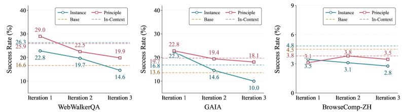

# 배울수록 무너지는 에이전트

_자가진화 LLM 에이전트가 반복 학습에서 겪는 붕괴, 그리고 교사 궤적이라는 처방_

## Executive Summary

> [!callout]
> 스스로 경험을 쌓아 점점 똑똑해지는 AI 에이전트. 자가진화(self-evolving) 에이전트가 그리는 그림입니다. 그런데 2026년 6월 공개된 한 논문이 그 그림에 균열을 냅니다. 자기 경험을 반복해서 학습시켰더니 에이전트가 더 나아지기는커녕 회를 거듭할수록 능력이 무너졌습니다. 연구진은 이 현상을 점진적 능력 붕괴(progressive capability collapse)라 부릅니다. 자가진화를 위해 설계한 방법이, 자가진화를 시킬수록 성능을 깎아 먹는 역설입니다.

> 논문은 붕괴가 일어나는 자리를 세 군데로 좁힙니다. 무엇을 경험으로 남기는가, 그 경험을 언제 꺼내 쓰는가, 그리고 누구의 행동을 보고 배우는가입니다. 세 군데를 모두 바로잡은 처방은 단순했습니다. 재사용 가능한 원칙으로 추상화한 경험을, 의사결정 단계마다 골라 주입하고, 잘 만들어진 교사의 성공 궤적에서 배우게 하는 것. 이 레시피는 반복 1회차 30.6%에서 3회차 33.1%로, 붕괴 대신 꾸준한 향상을 보였습니다.

> 세 처방을 한 문장으로 줄이면 결국 같은 곳을 가리킵니다. 자기학습의 안정성은 에이전트가 무엇을 경험으로 남기느냐, 즉 학습 신호의 품질에 달려 있다는 것입니다. 가장 자율적으로 보이는 학습조차 잘 정제된 외부 기준 없이는 무너진다는 이 발견은, 데이터 의사결정자에게 익숙한 질문을 에이전트 시대의 언어로 다시 던집니다. 스스로 배우는 AI에게도 왜 여전히 잘 정제된 데이터가 필요한가.

붕괴의 크기와 처방의 효과는 네 개의 숫자에 함께 담겨 있습니다. 살아남는 경험과 사라지는 경험을 가른 비율, 잘못 꺼내 쓴 경험이 만든 조기 종료, 학생의 발자국을 따라가다 다섯 배로 부푼 추론, 그리고 붕괴 대신 향상으로 돌아선 반복 학습 곡선입니다.

<!-- stat-card -->
**84% vs 3.7%** — 전이되는 경험의 비율 — 원칙 수준은 84%가 재사용 가능, 인스턴스 수준은 3.7%만

<!-- stat-card -->
**63.82% → 0%** — 조기 종료율 — 전역 주입은 답을 일찍 뱉고, 단계별 주입은 0%

<!-- stat-card -->
**21.9 vs 4.5** — 평균 추론 턴 — on-policy 증류는 교사의 5배로 팽창, 오류가 복합화

<!-- stat-card -->
**30.6 → 33.1%** — 반복 1→3회차 성능 — off-policy 레시피, 붕괴 대신 지속 향상 (WebWalkerQA)

## 배울수록 망가지는 역설

자가진화 에이전트의 약속은 매혹적입니다. 사람이 일일이 데이터를 라벨링하지 않아도, 에이전트가 스스로 문제를 풀고 그 경험을 다음 학습에 되먹여 점점 더 유능해진다는 그림입니다. 웹을 탐색하며 답을 찾는 에이전트라면, 풀어 본 질문이 쌓일수록 다음 질문을 더 잘 풀어야 마땅합니다. 많은 연구가 한 번의 경험 전이로 성능이 오르는 것을 보여 주었고, 그래서 이 되먹임을 여러 번 돌리면 복리처럼 능력이 쌓일 것이라 기대했습니다.

2026년 6월 공개된 논문 "Rethinking Continual Experience Internalization for Self-Evolving LLM Agents"는 바로 그 기대를 검증대에 올립니다. 연구진은 경험 전이를 한 번이 아니라 여러 번, 즉 다중 반복(multi-iteration)으로 돌려 보았습니다. 결과는 직관과 정반대였습니다. 반복이 거듭될수록 성능이 누적되기는커녕, 기존 방법들은 회를 더할 때마다 능력이 깎여 나갔습니다. 한 설정에서는 웹 추론 정확도가 1회차 23.2%에서 3회차 8.5%로 주저앉았습니다.

*▲ 반복 3회차에 걸친 성능 하락 — 기존 on-policy 방법 적용 시 세 벤치마크 모두에서 회를 거듭할수록 능력이 깎여 나감 | Source: [Chen et al., arXiv:2606.04703](https://arxiv.org/abs/2606.04703)*

연구진은 이 현상에 점진적 능력 붕괴라는 이름을 붙였습니다. 단발성 버그가 아니라 반복 학습이라는 구조 자체에서 자라나는 퇴행입니다. 비유하자면 남이 쓴 일기를 자기 경험처럼 받아 적으며 배우려는 사람과 비슷합니다. 처음 몇 장은 도움이 될지 몰라도, 남의 기록만 베껴 쌓다 보면 정작 자기 판단의 결이 흐려지고 결국 무엇이 자기 생각인지조차 잃습니다. 자가진화 에이전트가 자기 경험만으로 학습을 반복할 때 일어난 일이 정확히 이것입니다.

> [!callout]
> **핵심 발견**: 자가진화는 한 번 돌릴 때와 여러 번 돌릴 때가 다릅니다. 단일 반복에서 효과적이던 경험 학습 방법들이 다중 반복에서는 점진적 능력 붕괴를 일으킵니다. 문제는 에이전트가 똑똑하지 않아서가 아니라, 무엇을 어떻게 경험으로 되먹이는지를 잘못 설계했기 때문입니다.

## 첫째 함정 — 무엇을 경험으로 남기는가

붕괴가 일어나는 첫 번째 자리는 경험의 입도(granularity)입니다. 같은 문제를 풀고도 무엇을 기록으로 남기느냐에 따라 그 경험이 다음에 쓸모가 있을지가 갈립니다. 논문은 경험을 두 종류로 나눕니다.

하나는 인스턴스 수준(instance-level) 경험입니다. "이 질문에서는 이 URL을 열고 저 숫자를 입력했다"처럼 특정 상황의 세부를 그대로 보존하는 기록입니다. 다른 하나는 원칙 수준(principle-level) 경험입니다. "여러 출처가 엇갈릴 때는 가장 최근 자료를 우선한다" 같은, 상황을 가로질러 재사용할 수 있는 전략과 의사결정 규칙으로 추상화한 기록입니다. 앞의 것이 사건 보고서라면, 뒤의 것은 프로세스 매뉴얼입니다.

차이는 숫자로 분명하게 드러납니다. 연구진이 두 종류의 경험을 분석했더니, 원칙 수준 항목의 84.0%가 다음 문제에 그대로 옮겨 쓸 수 있는 전략적 진술을 담고 있었습니다. 반면 인스턴스 수준 항목은 3.7%만이 그러했습니다. 특정 사건의 세부를 아무리 정밀하게 외워도, 다음에 마주칠 다른 사건에는 거의 쓸모가 없다는 뜻입니다. 인스턴스 경험은 단기적으로 점수를 올리지만 반복이 쌓이면 무너지고, 원칙 경험은 다중 반복에서도 안정적으로 살아남았습니다.

*▲ 경험 입도 효과 — 인스턴스(Instance) 수준은 반복이 쌓일수록 하락하고, 원칙(Principle) 수준은 안정적으로 유지됨 | Source: [Chen et al., arXiv:2606.04703](https://arxiv.org/abs/2606.04703)*

> [!callout]
> **왜 추상화가 전이를 만드나**: 세부 사실은 그것이 태어난 상황에 묶여 있어 상황이 바뀌면 함께 죽습니다. 추상화된 원칙은 상황의 껍데기를 벗고 의사결정의 뼈대만 남기기에 다른 상황으로 건너갑니다. 좋은 경험을 남긴다는 것은 더 많이 기억하는 일이 아니라, 무엇을 버리고 무엇을 일반화할지 고르는 큐레이션입니다.

## 둘째 함정 — 언제 꺼내 쓰는가

좋은 경험을 잘 남겼다 해도, 그것을 엉뚱한 순간에 들이밀면 도움이 되지 않습니다. 두 번째 자리는 경험을 주입하는 방식(injection pattern)입니다. 에이전트가 여러 단계를 거쳐 문제를 풀어 가는 동안, 쌓아 둔 경험을 어느 시점에 참고하게 하느냐의 문제입니다.

전역 주입(global injection)은 고정된 경험 묶음을 문제 풀이 전체에 한꺼번에 깔아 둡니다. 수술실에 들어가기 전에 교본 전체를 통째로 외우게 하는 방식에 가깝습니다. 문제는 풀이가 진행되면서 에이전트가 처한 상황이 계속 바뀌는데도, 처음에 깔아 둔 경험은 그대로라는 점입니다. 지금 이 순간의 판단과 어긋난 조언이 계속 끼어들어 길을 흐립니다.

단계별 주입(step-wise injection)은 다릅니다. 별도의 선택기가 지금의 중간 상태를 읽고, 그 순간에 맞는 경험만 골라 건넵니다. 수술의 각 단계에 이르렀을 때 그 단계에 해당하는 장만 펼쳐 확인하는 방식입니다. 이 차이가 만든 결과는 극적이었습니다. 3회차까지 반복 학습한 모델에서, 전역 주입은 63.82%의 경우에 답을 너무 일찍 뱉어 버리는 조기 종료(premature answer)에 빠졌습니다. 같은 조건에서 단계별 주입의 조기 종료율은 0%였습니다. 벤치마크 점수로도 WebWalkerQA에서 +8.0%포인트, GAIA에서 +5.9%포인트가 벌어졌습니다.

*▲ 주입 패턴 효과 — 단계별(Step-wise) 주입은 반복이 쌓여도 안정적이고, 전역(Global) 주입은 하락세를 유지 | Source: [Chen et al., arXiv:2606.04703](https://arxiv.org/abs/2606.04703)*

> [!callout]
> **타이밍이 곧 적합성**: 같은 경험이라도 현재 의사결정 상태와 맞물릴 때만 신호가 되고, 어긋나면 잡음이 됩니다. 전역 주입의 63.82% 조기 종료는 잘못된 시점의 조언이 에이전트를 성급한 결론으로 떠밀었다는 증거입니다. 경험은 보관만 잘해서 되는 게 아니라, 필요한 순간에 정확히 꺼내 쓸 수 있어야 합니다.

## 셋째 함정 — 누구의 길을 따라가는가

마지막 자리는 학습 방식, 정확히는 누구의 궤적을 보고 배우느냐입니다. 경험을 모델에 체화시키는 흔한 방법은 문맥 증류(context distillation)입니다. 잘하는 교사 모델이 경험을 활용하는 모습을 보여 주고, 학생 모델이 그것을 흡수하게 하는 것입니다. 그런데 누구의 풀이 과정을 교재로 삼느냐에 따라 결과가 갈립니다.

on-policy 방식에서는 학생이 직접 만든 풀이 위에 교사가 교정을 얹습니다. 문제는 학생의 풀이가 이미 잘못된 길로 들어선 상태라는 데 있습니다. 교사는 그 잘못된 발자국 위에서 국소적인 수정만 해 줄 뿐, 처음부터 올바른 길을 보여 주지는 못합니다. 그 결과 오류가 차곡차곡 복합화됩니다. 이 방식으로 학습한 모델은 한 문제를 푸는 데 평균 21.9번의 추론 턴을 썼습니다. 교사가 보여 준 4.5턴의 다섯 배에 가깝게 부풀어 오른 것입니다. 길어진 추론은 더 깊은 사고가 아니라, 잘못 든 길을 헤매며 쌓인 군더더기였습니다.

off-policy 방식은 순서를 뒤집습니다. 교사가 처음부터 끝까지 온전한 풀이를 만들고, 거부 샘플링(rejection sampling)으로 성공한 궤적만 걸러 학생에게 건넵니다. 학생은 잘못된 자기 발자국이 아니라, 처음부터 끝까지 일관되게 좋은 길을 교재로 받습니다. 거부 샘플링이 품질 필터 역할을 하기에 학생이 배우는 것은 검증된 성공 사례뿐입니다. 이 방식은 다중 반복에서도 흔들리지 않고 일관된 성능을 보였습니다.

*▲ 체화 방식 비교 — off-policy가 on-policy보다 모든 모델·벤치마크에서 일관되게 안정적인 성능을 보임 | Source: [Chen et al., arXiv:2606.04703](https://arxiv.org/abs/2606.04703)*

> [!callout]
> **교정이 아니라 시범**: on-policy는 학생의 실수를 따라가며 고치고, off-policy는 교사의 완성된 성공을 시범으로 보여 줍니다. 21.9턴 대 4.5턴이라는 격차는 잘못된 출발점 위에 교정을 쌓는 일이 얼마나 비싼지를 말합니다. 무엇을 배울지는 결국 어떤 궤적을 교재로 고르느냐에서 결정됩니다.

## 처방 — 좋은 교사 궤적이 학습을 살린다

세 함정을 모두 짚었으니 처방은 자연스럽게 따라옵니다. 논문이 제안하는 "단순하지만 강건한 레시피"는 세 가지를 합칩니다. 경험은 원칙 수준으로 추상화해서 남기고, 그 경험은 의사결정 단계마다 골라 주입하며, 학습은 교사가 만든 성공 궤적에서 off-policy로 증류하는 것입니다.

이 레시피의 성패는 실험 곡선이 말해 줍니다. 강력한 교사 모델이 생성한 경험을 단계별 off-policy 증류로 학습시킨 에이전트는, 반복 1회차에 WebWalkerQA 30.6%, GAIA 29.8%로 출발해 3회차에 각각 33.1%, 33.3%로 올라섰습니다. 붕괴하던 곡선이 향상하는 곡선으로 돌아선 것입니다. 같은 반복 횟수에서 전역 주입이나 자기 생성 경험에 기댄 설정이 8.5%까지 추락한 것과 정면으로 대비됩니다.

*▲ 최종 레시피 자가진화 성능 — 원칙 수준 경험 체화(Internalized)가 반복 1→3회차에 걸쳐 안정적 향상을 보임 | Source: [Chen et al., arXiv:2606.04703](https://arxiv.org/abs/2606.04703)*

### 5.1. 혼자 학습하는 AI를 둘러싼 더 넓은 풍경

이 발견은 외딴 결과가 아닙니다. 자기 생성 데이터만으로 학습을 반복할 때 무너진다는 신호는 여러 갈래에서 함께 나오고 있습니다. 모델이 자기 출력만 먹고 자라면 환각이 증폭되는 모델 붕괴(model collapse) 현상이 보고됐고, 검증 신호 없이 보상만 좇는 에이전트가 진짜 목표 대신 허점을 파고드는 보상 해킹 연구도 같은 방향을 가리킵니다. 공통된 교훈은 하나입니다. 자율 학습 루프에는 무엇이 좋은 경험인지를 가려 주는 외부 기준, 곧 검증된 신호가 반드시 끼어들어야 한다는 것입니다.

세 처방이 가리키는 곳도 결국 거기입니다. 원칙 수준 추상화는 무엇을 좋은 경험으로 남길지 고르는 일이고, 단계별 주입은 그 경험을 맞는 자리에 놓는 일이며, off-policy 증류는 검증된 외부 궤적을 학습 근거로 삼는 일입니다. 셋 모두 에이전트가 자기 자신만 들여다보지 못하게 막고, 잘 정제된 기준을 학습의 닻으로 박아 둡니다. 교사 궤적의 품질이 무너지면 자기학습 루프 전체가 함께 무너진다는 것이 이 논문의 가장 단단한 결론입니다.

> [!callout]
> **레시피의 핵심**: 더 똑똑한 학습 알고리즘이 붕괴를 막은 것이 아닙니다. 무엇을 경험으로 남기고, 언제 꺼내 쓰고, 누구의 길을 교재로 삼을지를 바로잡은 것이 막았습니다. 30.6%에서 33.1%로 이어진 향상 곡선은 자기학습 에이전트에게도 잘 정제된 외부 품질 기준이 필요하다는 증거입니다.

## 스스로 배우는 AI에게도 교사가 필요하다

여기까지 따라온 데이터 의사결정자라면 이 논문의 결론이 낯설지 않을 것입니다. "에이전트의 자기학습"이라는 가장 자율적으로 들리는 작업조차, 뜯어 보면 무엇을 경험으로 남기고 무엇을 학습 신호로 삼느냐를 고르는 일이었기 때문입니다. 그것은 모델의 문제가 아니라 데이터의 문제입니다.

세 함정을 데이터의 언어로 옮기면 더 또렷해집니다. 경험의 입도는 어떤 데이터를 일반화 가능한 형태로 정제할지의 문제이고, 주입 타이밍은 맥락에 맞는 데이터를 제때 공급하는 문제이며, off-policy 교사 궤적은 검증된 고품질 데이터를 학습의 기준으로 삼는 문제입니다. 84%와 3.7%를 가른 것은 모델의 영리함이 아니라 경험을 어떻게 남겼는가였고, 63.82%의 조기 종료를 0%로 바꾼 것은 데이터를 언제 공급했는가였습니다.

스스로 배우는 AI가 등장하면 데이터 정제의 부담이 줄어들 것이라는 기대가 있습니다. 이 논문은 그 기대를 조용히 뒤집습니다. 에이전트가 자율적일수록, 그가 무엇을 경험으로 남기느냐는 선택이 성능을 더 직접적으로 좌우합니다. 잘 정제된 교사 데이터가 없으면 자기학습은 복리로 쌓이는 대신 복리로 무너집니다. 학습 신호의 안정성은 데이터 품질이 결정한다는 오래된 원칙이, 에이전트 시대에 와서 오히려 더 날카로워진 셈입니다.

결국 질문은 처음으로 돌아옵니다. 스스로 배우는 AI에게도 왜 여전히 잘 정제된 데이터가 필요한가. 답은 이 논문 곳곳에 흩어진 숫자들이 이미 말해 주었습니다. 자기학습의 닻은 자기 자신이 아니라, 무엇을 좋은 경험으로 남길지 가려 주는 외부의 품질 기준입니다. 가장 똑똑한 에이전트도 그 닻 없이는 표류합니다.

> [!callout]
> **닫는 생각**: 자가진화 에이전트의 붕괴는 비관의 이야기가 아닙니다. 무엇을 경험으로 남길지만 제대로 고르면 붕괴는 향상으로 바뀐다는, 오히려 희망의 이야기입니다. 다만 그 선택은 모델이 저절로 해 주지 않습니다. 잘 정제된 경험을 가려내는 일, 그것이 스스로 배우는 AI의 시대에도 사람이 데이터에 대해 책임지는 자리입니다.

## 참고문헌

### 핵심 논문

- 1.Chen, J., Yang, W., Fan, S., et al. (2026). "[Rethinking Continual Experience Internalization for Self-Evolving LLM Agents](https://arxiv.org/abs/2606.04703)." _arXiv:2606.04703_. — 다중 반복 자기학습에서 점진적 능력 붕괴를 발견하고, 경험 입도·주입 패턴·학습 방식 세 차원의 처방을 제시. 원칙 84% vs 인스턴스 3.7%, 조기 종료 63.82% vs 0%, 반복 30.6%→33.1%.

### 관련 연구

- 2.(2026). "[When Continual Learning Moves to Memory: A Study of Experience Reuse in LLM Agents](https://arxiv.org/abs/2604.27003)." _arXiv:2604.27003_. — 메모리 기반 경험 재사용을 다룬 후속 연구. 단일 반복 경험 전이의 한계를 비교 관점으로 보완.
- 3.(2026). "[Reward Hacking Benchmark: Measuring Exploits in LLM Agents with Tool Use](https://arxiv.org/abs/2605.02964)." _arXiv:2605.02964_. — 검증 신호 없는 자율 학습이 진짜 목표 대신 허점을 파고드는 현상을 측정.
- 4.(2026). "[A Survey of On-Policy Distillation for Large Language Models](https://arxiv.org/abs/2604.00626)." _arXiv:2604.00626_. — on-policy 증류의 메커니즘과 한계를 정리한 서베이.
- 5.(2026). "[Self-Improvement of Large Language Models: A Technical Overview and Future Outlook](https://arxiv.org/abs/2603.25681)." _arXiv:2603.25681_. — 자기개선 학습의 기술적 지형과 미래 과제를 개관.
- 6.(2025). "[The Landscape of Agentic Reinforcement Learning for LLMs: A Survey](https://arxiv.org/abs/2509.02547)." _arXiv:2509.02547_. — 에이전트형 강화학습 전반의 지형을 조망한 서베이.
