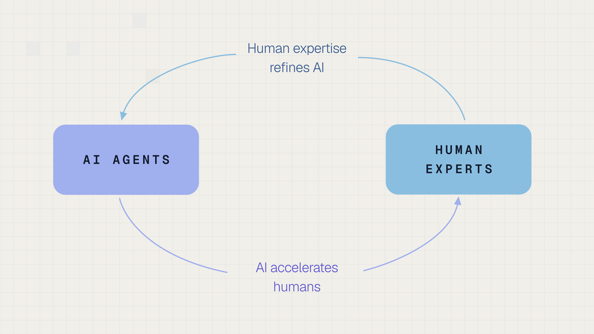

# The Company That Makes AI

_Snorkel AI, which used to sell labeling software, now sells finished datasets, and its valuation has gone from $1.3 billion to $3.5 billion in seventeen months_

## Executive Summary

> [!callout]
> Snorkel AI announced a Series E on September 22. The money raised was $350 million, and the valuation attached to it was $3.5 billion, close to three times the $1.3 billion the company carried seventeen months earlier when it raised a $100 million Series D. What settles the character of the announcement, though, is not the size of the round but what the company sold to get there. Snorkel used to sell software that automated the job of putting labels on a customer's data. Over the past year it changed the thing it sells, and now builds finished datasets, reinforcement learning environments and evaluation tasks itself and delivers them. This article reads the round through that change.

> The figure the company put forward is an annualized revenue run rate of $375 million, with a note that it has grown more than eighteenfold over the past year. Divide the two and the starting point a year ago lands near $21 million. Half the reason the multiple looks large is that the base was small. The other thing to carry is that an annualized run rate is not money that came in over twelve months but a recent stretch of performance projected out to a year.

> Sections 1 through 3 stay with what the company's post and the TechCrunch report say. Section 4 is the reading this article draws from them.

### Key Figures

Sources: [Snorkel AI's announcement](https://snorkel.ai/blog/data-2-0-and-the-research-era-of-ai-data/) (2026-09-22) and [TechCrunch](https://techcrunch.com/2026/09/22/snorkel-ai-triples-valuation-to-3-5b-as-demand-for-ai-training-data-booms/). The two ratios are this article's own division of the published figures.

<!-- stat-card -->
**$3.5B** — Valuation set at the Series E — Seventeen months ago, at the Series D, it was $1.3 billion, on a raise of $100 million

<!-- stat-card -->
**$375M** — Annualized run rate the company disclosed — Not twelve months of receipts but a recent run projected to a year. The post says the company crossed that line this week

<!-- stat-card -->
**about $21M** — Where the eighteenfold starts — $375 million divided by 18. A year ago this company's annualized run rate sat near there

<!-- stat-card -->
**about 9x** — Valuation divided by run rate — $3.5 billion over $375 million comes to 9.3. The multiple assumes the run rate turns into a full year of revenue

## From Selling the Tool to Selling the Dataset

Snorkel AI launched commercially in 2019, following four years of research by co-founder and chief executive Alex Ratner and his team at a Stanford AI lab. For most of the years since, the product was software. Rather than have people put a label on every record by hand, customers used rules and models to apply those labels automatically. Building the data stayed the customer's job, and what Snorkel sold was the tool that made the job faster.

*▲ Alex Ratner, who led the research at a Stanford AI lab and founded Snorkel AI in 2019 | Source: [Snorkel AI's announcement](https://snorkel.ai/blog/data-2-0-and-the-research-era-of-ai-data/)*

In that arrangement the price is capped by what the customer can do. Hand someone a good tool and nothing moves if nobody on their side can decide which label belongs on a given record. Software is priced by seats and usage, while the hard part, the judgment, stays with the buyer. The boundary is what the company changed over the past year. What Snorkel sells now is the result rather than the tool: finished datasets that experts have worked over, reinforcement learning environments for training models, and evaluation tasks for checking what a model can do. Going by Ratner's announcement, this line of business will soon be a year old.

The post lists the customers as the leading frontier labs, hyperscalers, neolabs, vertical AI leaders, enterprises, and U.S. government agencies. TechCrunch puts the growth down to "AI labs' insatiable appetite for high-end training data." The round was led by Insight Partners and S32, with existing investors Addition, Lightspeed, Greylock, GV and Wells Fargo taking part.

Along with what is sold, the way it gets made is different too. TechCrunch calls the method hybrid: "Rather than operating purely as a human expert marketplace, Snorkel relies on a hybrid approach, using its software and models to generate data synthetically alongside subject matter experts." Machines draft and people rule on the draft, instead of people building each item end to end, and that is also why the money going out to experts lands in a different place on this company's books than on a competitor's.

> [!callout]
> The bend in Snorkel's revenue curve sits at the point where the unit of sale changed, not at the point where some new technology arrived. Sell a license and the invoice is set by how many people use it. Sell datasets and it is set by how hard the data is and how much of it there is. That is where the same company with the same technology begins writing invoices of an entirely different size.

## The Founder's Two Names: Data 1.0 and Data 2.0

Ratner titled the post announcing the round "Data 2.0 and the research era of AI data." Inside it he splits the market for AI training data into two phases. The earlier one, Data 1.0, is "all about volume, and is largely a staffing and logistics problem." The later one, Data 2.0, is "all about the right curriculum of extremely complex, precisely targeted, high quality data – and is primarily a research and technology problem."

The same post restates the split as a distance: "the first mile is driven by volume of simpler data, and the last mile is driven by quality of more complex data." Once a model has already solved the easy problems, multiplying the hands on the job stops moving performance, and only a small amount of data aimed precisely at the hard problems closes what gap is left.

Ratner works the distinction out on coding data. Several years ago large language models could barely manage code auto-complete, so what was wanted was large volumes of raw code for pre-training, plus large volumes of simple coding problems and code preference labels for supervised fine-tuning and preference learning. Today models are approaching superhuman capability across many areas of coding. So Ratner writes down five things a usable coding dataset or RL environment now has to do: approximate software development problems that a senior engineer might struggle with over days or weeks; capture nuanced goals and reward signals over complex product-scale outputs; distributionally target the model's error modes; stand up to those advanced models' attempts to hack, cheat, or circumvent; and pass several hundred other quality control checks.

The same pattern is spreading through legal, finance and biology. Where it was once enough to gather a sufficient volume of relevant experts to write basic chatbot Q&A tasks or preference labels, one frontier data point now stands for an expert task that might take a person days or weeks, and some cases call for an environment simulating an entire company.

Ratner nails the conclusion down in two sentences. "Frontier data is no longer solvable by the optimized supply of human hours and bodies." And: "building the data and environments to safely measure and train AI is becoming too hard for even the smartest human experts to do alone." The bottleneck in data work has moved from the supply of people to the difficulty of the judgment, which doubles as the explanation for why this company chose to build and sell data rather than recruit people.

The easy misreading is one Ratner heads off himself. Calling it a research and technology problem does not mean people can be taken out. Frontier data is worth something only insofar as it targets what a model does not already know, and purely synthetic data will be highly correlated with what the model knows already. Once AI makes its own data and trains on it, mode collapse follows and the range of answers it gives narrows. Setting aside distillation, which carries a large model's capability down into a small one, the conclusion is that data with a human in the loop stays the most valuable kind.

A normative reason is written in alongside it. Data is how AI gets measured and aligned to human values and judgment, so data developed without any humans in the loop is, in the post's words, "tantamount to abdicating human oversight and alignment entirely." Read the passage not as a plan to use fewer people but as a plan to move where people stand, toward review and adjudication.

### 2.1. The One Piece of Evidence the Company Offers

For evidence, the post points at its own quality control on coding data. When building coding agent environments and data, Snorkel puts hundreds of specialized agents on quality control on top of human expert review, which it says "accelerates our QC efficiency by 50%+ and improves accuracy of review by 15+ accuracy points compared to a human + off-the-shelf-only LLM review baseline."

The loop turns once more from there. Human review at scale is fed back as weak supervision to train those agents, and the post reports a current 2x+ accuracy improvement over a non-specialized frontier LLM baseline for the agents that come out of it. The company calls this feedback structure the RSI engine for data, RSI standing for recursive self improvement, and says that loop is what has powered its growth to date. Hence the sentence: "Only humans and AI agents, collaborating together in compounding ways, can meet the accelerating needs of the frontier and keep humans in the driver's seat of AI progress for decades to come."

*▲ The recursive self-improvement loop as Snorkel AI describes it — AI agents accelerate human experts, and human feedback in turn refines the AI agents | Source: [Snorkel AI's announcement](https://snorkel.ai/blog/data-2-0-and-the-research-era-of-ai-data/)*

These are numbers the company measured on its own process by its own standard. It defined the baseline it measured against, and no third party has published a check of the same thing under the same conditions. That is not a reason to doubt the figures. It is a note about how far they have been confirmed.

The split itself leaves one more thing to say. Naming 1.0 a staffing and logistics problem and 2.0 a research and technology problem also sets this company apart from the competitors that grew by putting more people to work. The phrase describes a change running through the industry and it describes what this company sells. Nothing in this post separates the two.

The argument is not new this week, though. Ratner brings back, in the same post, the thesis the project started from at Stanford a decade ago: AI progress would become increasingly data-centric, and therefore data development should be studied as a true research and technology problem, not just a staffing and crowdsourcing one. What changed this time is the name, and the claim that the market has come around to the argument.

## How to Read the $375 Million

The most quoted figure from this announcement is the annualized revenue run rate of $375 million. Four things are worth checking before it is copied across as annual revenue.

### 3.1. What "Annualized" Qualifies

An annualized run rate takes the most recent month or quarter and multiplies it by twelve or by four to stretch it into a year. It is not money received over twelve months. Ratner's post says the company crossed that line this week; it does not say the company earned that much over the past year. The figure holds on the condition that contracts do not lapse and the present pace keeps up.

### 3.2. Where the Eighteenfold Starts

Snorkel AI and TechCrunch both say this revenue grew eighteenfold over the past year. Divide $375 million by 18 and about $21 million comes out. The company's annualized run rate a year ago sat at about that level. Eighteen is a large multiple, and half the reason it is large is that the number being divided into was small. For the same company to manage eighteenfold again next year it would have to clear $6.7 billion, and this post is not saying that will happen.

There is a question about the date of that starting point as well. Ratner writes that the new data service is coming up on a year old. But the [press release of May 29, 2025](https://www.businesswire.com/news/home/20250529083998/en/Snorkel-AI-Announces-$100-Million-Series-D-and-Expanded-Platform-to-Power-Next-Phase-of-AI-with-Expert-Data) that announced the Series D seventeen months ago had already announced Snorkel Expert Data-as-a-Service as generally available, together with Snorkel Evaluate. If a product under that name was already selling then, some share of this business was already inside the $21 million run rate of a year ago. Whether the start the post refers to is the moment the product shipped or the moment the company moved its center of gravity is not settled by laying the two documents side by side.

### 3.3. Two Sentences, Two Different Things Measured

The same eighteenfold is written slightly differently in the two places. Ratner's post says that since launching the new data-as-a-service offering, the company has grown over 18x. TechCrunch says the company's annualized revenue run rate rose eighteenfold over the last 12 months. Growth in one new line and growth in a whole company's revenue can be written with the same number without being the same statement. For both sentences to hold, nearly all of the company's revenue from a year ago would have had to vanish or to have been small enough to ignore. The public record says neither.

### 3.4. Revenue Means Different Things at Different Companies

TechCrunch sets other companies in the same market side by side. Mercor's gross annualized revenue has climbed to $2 billion, Handshake hit the $1 billion milestone earlier this year, and Micro1 has scaled to $500 million. The same article attaches a condition right after: "Since these companies pay out roughly 60% to 70% of their top-line income directly to the domain specialists doing the work, it's important to note that their actual net annual revenue is substantially lower than those headline gross figures."

Snorkel AI says its accounting works differently. Because it sells reinforcement learning environments and complete datasets rather than human labor, payments to its human experts are accounted for in its cost of goods sold rather than in the headline annualized revenue number. If that holds, Snorkel's $375 million and Mercor's $2 billion were not measured with the same ruler. Expert cost is already out of the first figure and not yet out of the second.

> [!callout]
> None of the four checks is grounds for calling the published numbers false. The trouble is that these figures end up on one line, compared with no mark saying what each of them measured. That the definition of revenue differs from one data company to the next reads, on its own, as a sign that this market is still a young one.

## Why Pebblous Is Watching This Round

From here the announcement gets read through the eyes of someone who works with data.

What got priced this round is not a model. It is the work of making data. Inside a company that work usually shows up as a cost line. Open the budget for adopting a model and there are rows for training and for API calls, while the work of cleaning up the data to train on and deciding the correct answers sits scattered through somebody's working hours. What this announcement says is that the market has begun putting a price on that work.

Ratner's split can be laid directly over the data work inside a company. Where your organization's data work is stuck right now, is it short of hands, or is it hard to settle what the right answer is?

- •If it is a shortage of hands, adding people or buying more outsourced volume solves it. Check whether progress rises in proportion to the number of people put on the job and the answer comes clear.
- •If the hard part is agreeing on the answer, ten times the people will not solve it. If two of your people often rule differently on the same material, this is the one you have.
- •What that second case needs is not headcount. It needs a standard for ruling, someone able to set that standard, and a procedure that makes the same ruling come out the same way next time.

Earlier Pebblous pieces gather at the same spot. Once labeling itself got cheap, what rose in price was the environment for training and scoring agents, which we [covered once already](/blog/labeling-to-rl-environments/en/), and the concentration of AI training-data supply into a handful of companies we [worked out separately](/blog/ai-data-supply-oligopoly/en/). This announcement is a case of those two currents meeting on one company's revenue sheet.

So three questions are enough to carry back to your own organization from this news. In your data work, which stage takes longest, gathering or ruling? How many people in the organization can make that ruling, and does the work stop when one of them is away? And can the amount attached to data preparation in this year's budget be pulled out as a single line?

Thank you for reading this far. The documents this article cites can be read directly at [Snorkel AI's announcement](https://snorkel.ai/blog/data-2-0-and-the-research-era-of-ai-data/) and in the [TechCrunch report](https://techcrunch.com/2026/09/22/snorkel-ai-triples-valuation-to-3-5b-as-demand-for-ai-training-data-booms/). We would be glad to hear which side your organization's data work was stuck on, and whether that call held up.

## References

- 1.Ratner, A. (2026, September 22). "[Data 2.0 and the Research Era of AI Data](https://snorkel.ai/blog/data-2-0-and-the-research-era-of-ai-data/)." Snorkel AI Blog.
- 2.Temkin, M. (2026, September 22). "[Snorkel AI triples valuation to $3.5B as demand for AI training data booms](https://techcrunch.com/2026/09/22/snorkel-ai-triples-valuation-to-3-5b-as-demand-for-ai-training-data-booms/)." TechCrunch.
- 3.Snorkel AI. (2025, May 29). "[Snorkel AI Announces $100 Million Series D and Expanded Platform to Power Next Phase of AI with Expert Data](https://www.businesswire.com/news/home/20250529083998/en/Snorkel-AI-Announces-$100-Million-Series-D-and-Expanded-Platform-to-Power-Next-Phase-of-AI-with-Expert-Data)." Business Wire.
