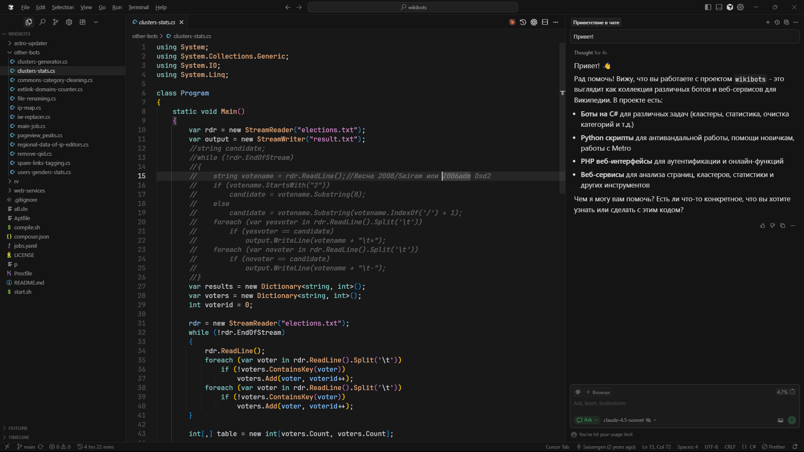

# SpaceX Bought Cursor for $60B and Its Developer Editing Sessions

_The all-stock deal took effect on August 14, and Cursor_

## Executive Summary

> [!callout]
> SpaceX finished acquiring the coding agent Cursor on August 14, in an all-stock deal worth $60 billion. The option it secured in April became a definitive agreement on June 16, and the regulatory paperwork took effect two months after that. Cursor does not stay independent. Its people and operations move into SpaceXAI, the organization built on the xAI business SpaceX absorbed earlier this year.

> What Cursor put at the front of its acquisition post was access to the largest fleet of GPUs in the world. The asset on the other side of the trade is written down in a Cursor engineering post published five months earlier. Billions of tokens from interactions with real users are distilled into reward signals, and a new checkpoint ships roughly every five hours. One of those signals is whether the edit the agent made stayed in the codebase.

> What enters that loop is written down in documents Cursor published itself, and an independent study of more than 20,000 real coding-agent sessions picks up the same signal from outside the company. For anyone about to wire a coding agent into their own team's work, those sentences are the items to settle at contract time.

### Key Numbers

The first two numbers give the size of the deal and the pace at which Cursor revises its model. The last two point at where the material for that pace comes from.

Sources: [TechCrunch (Aug. 15, 2026)](https://techcrunch.com/2026/08/15/spacex-officially-closes-its-cursor-acquisition/), [Cursor research blog (Mar. 26, 2026)](https://cursor.com/blog/real-time-rl-for-composer), [Cursor Enterprise](https://cursor.com/enterprise)

<!-- stat-card -->
**$60B** — All-stock acquisition — About 3.4% dilution at the IPO valuation

<!-- stat-card -->
**5 hours** — Time to ship a new checkpoint — Live signals collected, then weights updated

<!-- stat-card -->
**+2.28%** — Agent edits that persist in the codebase — A/B test result on Composer 1.5

<!-- stat-card -->
**50,000+** — Enterprises building with Cursor — Including 64% of the Fortune 500

## Even the Breakup Fee Was Priced in Compute

The company behind Cursor is Anysphere. When SpaceX entered a model-training partnership with Cursor in April, it also took the right to buy the company for $60 billion. The terms of that arrangement were either to acquire or, failing that, to hand over about $10 billion. On June 16, days after its Nasdaq listing, SpaceX announced the definitive agreement, and the regulatory record shows the deal taking effect on August 14.

*▲ Anysphere, the company SpaceX bought, builds this editor | Source: [Wikimedia Commons (CC BY 4.0)](https://commons.wikimedia.org/wiki/File:Cursor_Screenshot.png)*

What that $10 billion consisted of says something about the deal before anything else does. The terms SpaceX set out in its IPO filings were a termination fee of $1.5 billion plus $8.5 billion in computing resources. Most of what SpaceX would have owed Cursor if it walked away was not cash but calculation. Between these two companies, compute was already working as a means of payment.

The consideration is entirely SpaceX Class A common stock. Against the valuation at listing, it works out to roughly 3.4% dilution. The listing itself raised more than $80 billion and lifted the company above a $2 trillion valuation, and the deal that followed it is the largest acquisition of a venture-backed startup on record.

Before the SpaceX offer arrived, Cursor was in the middle of raising $2 billion at a $50 billion valuation. The $60 billion price is roughly 15 times revenue, and over the same stretch Cursor's market share had slid from about 41% in June 2025 to about 26% in May 2026 by Ramp's spending data. Whatever held the price up, it was not share of the current market alone.

The post-close structure is worth a look too. Cursor does not run as a separate company. Its people and operations move inside SpaceXAI, the organization built on the xAI business SpaceX merged in earlier this year, and the model Cursor shipped the same week as the announcement already carries the name Grok 4.6. The company that receives requests from developers using Cursor and the company that trains models on those requests are now under one roof.

## Compute Was Something You Could Lend

In April's partnership post, Cursor named its own bottleneck plainly. Composer 1.5 had scaled reinforcement learning by over 20 times and Composer 2 had added continued pretraining, and each step up in compute had translated to meaningfully more capable models. The company wanted to push training much further, it wrote, but "we've been bottlenecked by compute." August's acquisition post leads with the same theme, putting the world's largest GPU fleet first.

One thing does not fit. SpaceX also rents data center capacity to Anthropic and Google. Compute is a thing you can hand over by contract, and Cursor had in fact been running on Colossus infrastructure under exactly that kind of contract since April. What the extra $60 billion bought is not access to compute. It is whatever a compute contract does not transfer.

Cursor's Composer 2.5 post from May names it. Together with SpaceXAI the team is training a significantly larger model from scratch using 10 times more total compute, and it expects a major leap from Colossus 2's million H100-equivalents and **"our combined data and training techniques."** Data sits right beside compute in the list of what is being combined.
