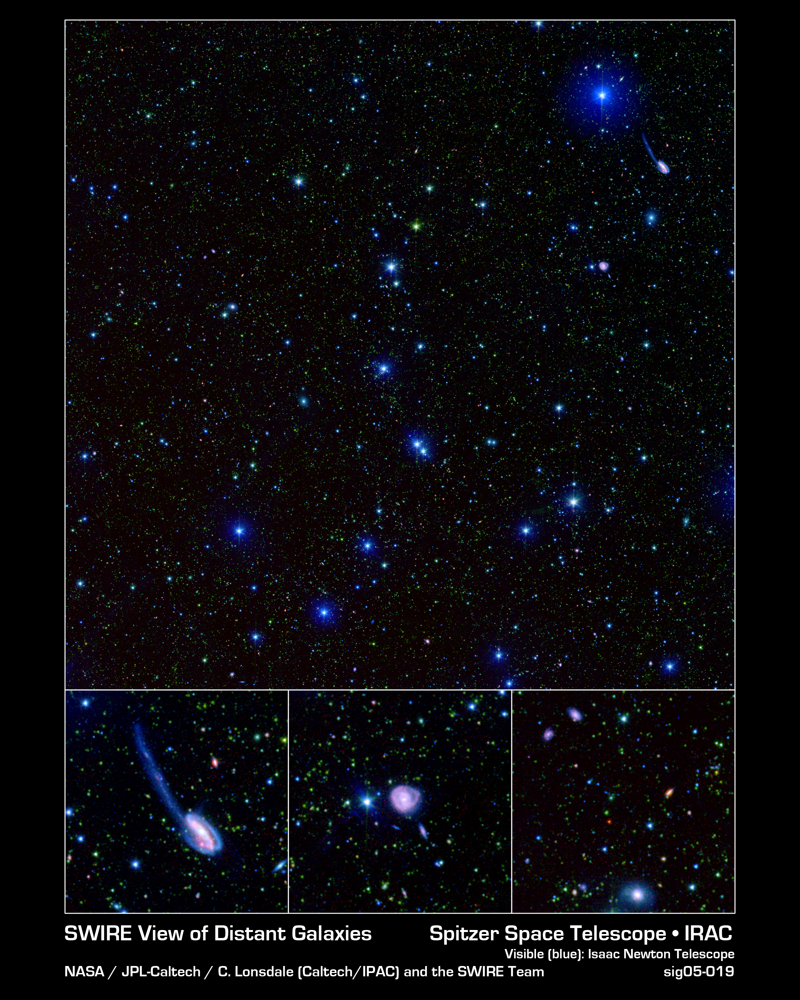

# 따로 찍은 사진 속 저 별, 같은 별인지 어떻게 알까?

_스피처 우주망원경 여덟 영역 천체 440만 개를 파장별 반경 1~12초각과 2MASS 좌표 정렬로 묶은 공개 데이터베이스_

## Executive Summary

> [!callout]
> 하늘의 같은 자리를 서로 다른 망원경이 수십 번씩 찍어 왔다. 그렇게 쌓인 기록은 저마다 다른 검출 프로그램, 다른 좌표 해, 다른 측광 규약, 다른 플래그 정의, 다른 파일 형식으로 남는다. 9월 16일 arXiv에 올라온 짧은 데이터 논문 한 편이 그 기록들을 천체 단위로 묶어 공개된 데이터베이스로 정리했다. 이 글은 그 병합이 어떤 규칙 위에 서 있는지를 본다.

> 묶인 천체는 440만 개, 넓이는 65제곱도, 파장은 자외선부터 원적외선까지 걸쳐 있다. 여기서 눈여겨볼 숫자는 천체 수가 아니라 반경이다. 두 관측을 같은 천체로 볼지 가르는 거리를 파장마다 달리 잡아, 근적외선 대역에서는 1초각, 가장 긴 원적외선에서는 12초각까지 벌렸다. 파장이 길어질수록 망원경이 보는 점이 뭉툭해지기 때문이다. 다만 그 숫자들을 쓰기 전에 끝내야 할 일이 있었다. 모든 입력 카탈로그를 2MASS 좌표계에 먼저 등록해 프레임끼리 어긋난 체계 오차를 빼냈고, 논문은 그 보정이 없으면 고정 반경 교차 식별의 신뢰도 자체가 떨어진다고 못 박는다.

> 1절부터 5절까지는 이 논문과 동반 논문, 그리고 배포 문서에 실린 내용을 따라간다. 6절에서 기업 데이터로 옮겨 읽는 부분은 이 글의 해석이고, 본문 중간에 붙인 추정도 어디까지가 추정인지 그때마다 밝혔다.

### 주요 수치

출처: [Vaccari, arXiv:2609.18694 (2026-09-16)](https://arxiv.org/abs/2609.18694)

<!-- stat-card -->
**440만** — 한 레코드로 묶인 천체 — 여덟 영역 65제곱도. 자외선 광도부터 원적외선 광도까지 한 줄에 실린다

<!-- stat-card -->
**1″ → 12″** — 파장에 따라 벌어지는 매칭 반경 — IRAC 3.6·4.5μm가 1초각, MIPS 160μm가 12초각. 열두 배 차이다

<!-- stat-card -->
**1″** — 부가 카탈로그에 일률로 쓴 반경 — 자외선·광학·근적외선·원적외선 카탈로그가 파장과 무관하게 같은 반경으로 붙는다

<!-- stat-card -->
**280만** — 더 깊게 찍은 판의 천체 — SERVS 18제곱도에 같은 절차를 그대로 적용한 동반 산출물이다

## 겹쳐 찍은 하늘은 장부 작업을 남긴다

중간적외선에서 천체를 고르면 넓은 하늘에서 먼 거리까지, 별의 질량에 가까운 잣대로 은하 표본을 모을 수 있다. 적색편이에 따른 보정이 그 대역에서 완만하게 변하기 때문이다. 스피처 우주망원경이 냉각 임무 기간에 IRAC과 MIPS로 훑은 외부은하 영역들, 그중에서도 SWIRE 영역들이 은하 진화 연구의 기준 실험실 노릇을 해 온 배경이 여기에 있다. 그 뒤로 같은 하늘에 자외선부터 전파까지 자료가 겹겹이 쌓였다.

논문은 그 풍요에 값이 따른다고 쓴다. 영역 하나가 수십 개의 독립된 서베이에 덮여 있고, 서베이마다 자기 소스 추출 방식과 좌표 해, 측광 규약, 플래그 정의, 파일 형식을 갖는다. 그래서 단 한 영역의 밴드 병합 카탈로그를 만드는 데도 상당한 장부 작업이 든다. 그 작업은 연구 그룹마다 되풀이되는데, 재현할 수 있을 만큼 상세히 문서로 남는 일은 드물다.

> [!callout]
> 그래서 이 데이터베이스가 내세우는 것은 새 관측이 아니다. 미리 병합되고 좌표까지 맞춰진 다중 파장 카탈로그를 영역마다 하나씩 만들었고, 거기에 판 번호를 붙여 인용할 수 있게 했다. 그 절차는 모든 영역에 똑같이 적용됐고, 문서로도 남았다. 새로 찍은 하늘은 한 조각도 없다.

다루는 영역은 여덟 개, 합쳐 65제곱도다. SWIRE 여섯 영역(ELAIS-S1, XMM-LSS, CDFS, Lockman Hole, ELAIS-N1, ELAIS-N2)에 스피처 딥 와이드 필드 서베이의 목동자리 영역(Boötes), 그리고 스피처 외부은하 퍼스트 룩 서베이(XFLS)가 더해졌다. 곁다리 자료가 깊고 넓게 쌓여 있다는 점, 그리고 허셜과 전파, 유클리드와 루빈 관측 계획에서 계속 중요하게 다뤄진다는 점을 선정 이유로 든다.

*▲ SWIRE 영역의 실제 다중 파장 합성 사진 — 초록·빨강은 스피처 IRAC 적외선, 파랑은 아이작 뉴턴 망원경 가시광. 같은 하늘이 서로 다른 장비로 겹쳐 찍힌다는 것이 정확히 이런 모습이다 | Source: [NASA/JPL-Caltech/C. Lonsdale (Caltech/IPAC) and the SWIRE Team](https://www.spitzer.caltech.edu/images/2375-sig05-019-A-SWIRE-Picture-is-Worth-Billions-of-Years)*

## 얼마나 가까우면 같은 천체인가

병합은 짧은 파장에서 시작해 바깥으로 나아간다. 각 단계의 반경은 그 밴드의 각분해능에 맞춘다. 3.6과 4.5μm 카탈로그는 1초각 반경으로 서로 짝지어지고 그 위치가 기준 좌표가 된다. 5.8과 8.0μm는 그 기준 좌표에 1.5초각 안에서 붙고, MIPS의 24·70·160μm는 각각 3초각, 6초각, 12초각 안에서 붙는다.
