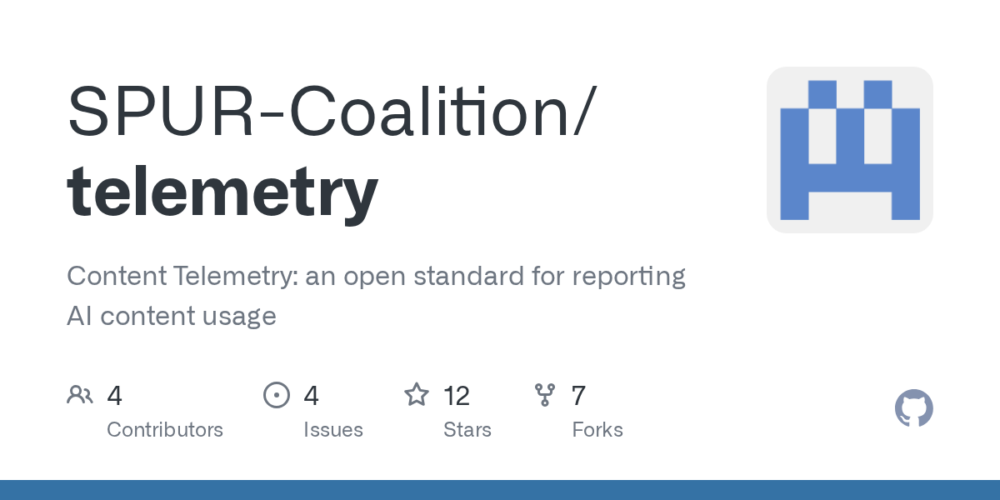
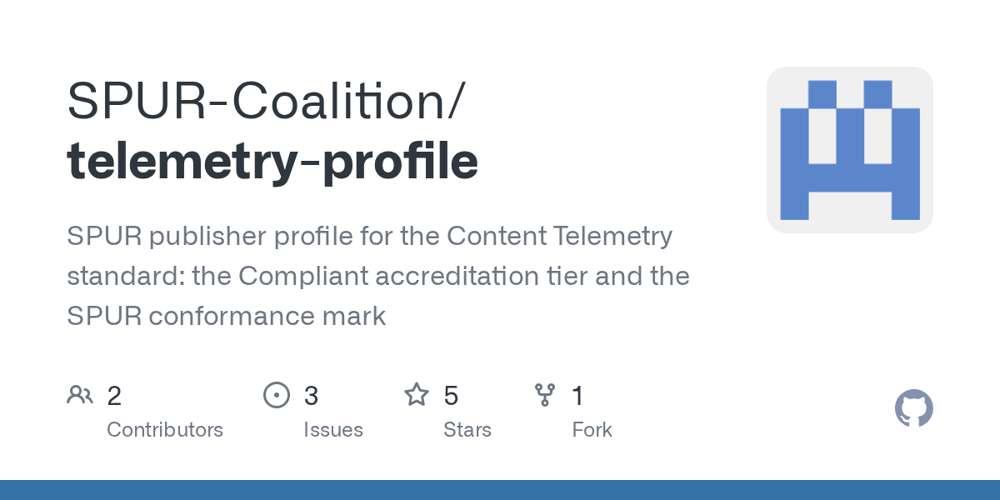

# SPUR Can Count AI

_SPUR, the coalition behind the BBC, the Guardian and the FT, published version 1.0 of its AI usage reporting standard on October 2, and no AI company has agreed to adopt it_

## Executive Summary

> [!callout]
> This article reads Content Telemetry 1.0, the reporting standard the publisher coalition SPUR released on October 2, 2026. The BBC, the Financial Times, the Guardian, Sky News, the Telegraph, AP, Mediahuis and CMA Media are its eight founding members, and thirty more joined at once in June. Their proposal is simple. Cut what happens after an AI takes an article into five pieces, and have each piece recorded in the same format and handed back to the publisher.

> The unit the standard picked for counting is characters, not tokens. A token count shifts depending on whose tokenizer is reading, while a character count comes out the same for everyone. It is a design that settles the unit before anyone settles the price. Three of the five stages, though, have no observer at all other than the AI company, by the standard's own account, and as of the announcement not one AI company has promised to adopt it.

> Sections 1 through 3 are facts written in the full specification and in the coalition's announcement. Section 4 is this article's reading of those facts from the side that buys and sells data.


*▲ Logo of SPUR, the coalition of publishers including the BBC, the Guardian and AP | Source: [SPUR Coalition](https://www.spurcoalition.org/updates)*

### Key Figures

Four numbers come out of the specification and the announcement coverage. The first three say what this standard still cannot do; the last says how far the document itself has been worked over.

Source: [Content Telemetry Specification v1.0](https://github.com/SPUR-Coalition/telemetry/blob/main/SPECIFICATION.md), [SPUR Content Telemetry Profile](https://github.com/SPUR-Coalition/telemetry-profile), [Digiday (2026-10-02)](https://digiday.com/media/spur-publishes-ai-content-tracking-standard-pitches-openai-and-google-to-join-advisory-board/).

<!-- stat-card -->
**0** — AI companies committed to adopting it — OpenAI, Anthropic, Google, Meta and Microsoft have only been invited onto an advisory board

<!-- stat-card -->
**3** — Stages with no second observer — Grounding, citation and presentation can only be reported by the agent

<!-- stat-card -->
**0.2** — Version of the conformance profile — Core is at 1.0, but the layer that certifies who kept to it is still a preview

<!-- stat-card -->
**171** — Test fixtures run on every change — Alongside 15 validated examples and 59 mutation checks

## What Happens to an Article an AI Retrieves, Cut into Five

The only record a publisher holds today is the request log on its web server. It shows which crawler took which address, and when. Past that point, nothing. Whether the article actually went into making an answer, whether it was named as a source, whether that source reached a user's screen, whether anyone clicked: only the side using it knows. The specification's problem statement begins at exactly that spot. When a platform publishes usage figures of its own, publishers have no record to set against them, and there is no way to compare numbers across platforms.

So the standard wraps one exchange between a user and an agent into a session, and cuts the boundaries content crosses inside it into five. Retrieval (`content_retrieved`), grounding (`content_grounded`), citation (`content_cited`), presentation (`content_presented`) and engagement (`content_engaged`). Every event carries the same session identifier, so a single question can be traced back afterwards to the articles that went into it and the answer that came out.

Where those lines fall is the heart of the standard. Grounding is pinned to the exact point at which content enters a generative model's context. An article used only to search and select, never placed in the context, is not grounded. The example it works through leaves no doubt. Retrieve a hundred results, embed them all, re-rank down to ten, then place five in the prompt, and the grounding count is five. The other ninety-five were retrieved and nothing more. Drawn that way, a retrieval pipeline, a reasoning model and a multi-step agent all fire the same event at the same place.

Caching makes the distinction tangible. An agent that fetches an article once and holds it for days fires retrieval once and grounding in every session the article enters. One request lands on the publisher's server while the actual use runs on well past it, and that is where the gap opens between the number a publisher sees today and the use that happened.

The gaps between the stages have names too. Retrieved but not grounded means useless content was taken. Grounded but not cited means the answer was influenced without the name going out. Cited but not presented means the attribution never reached a person. Presented but not engaged means the link appeared and nobody pressed it. The order is not always kept, either. A source sidebar can produce presentation without citation, and a hallucinated citation, where an article that was never retrieved is named as a source, produces citation with no grounding behind it. The instruction is to record these mismatches as they happened rather than treat them as errors.

▲ Original diagram by Pebblous. Source: SPUR Content Telemetry Specification v1.0, §4.3 and §4.4.

One name changed on the way to the final version. The draft's `content_displayed` became `content_presented`, and the reason given is that the old name read as though something had merely been seen, which says nothing about what crossed the boundary. A `presentation_kind` field was added in its place to separate a body excerpt from a bare link or attribution. A spoken answer, or a page opened by an agentic browser, needs a word wider than display.

## The Unit Is Fixed in Characters, the Count Left to the Contract

A grounding event carries two fields for how much went in. `chars_ingested` is the number of characters that entered the context, and `tokens_ingested` is the token count for the same material. Version 1.0 makes the first one first-class and the second one secondary. `excerpt_chars`, which records the length of a cited excerpt, is counted by the same rule.

The reason sits in the tokenizer. Token counts differ by model, shift when a vendor revises its tokenizer, and cannot be compared across emitters. A consumer therefore must not sum token counts from different emitters, and must not read a difference between two such counts as a difference in use. Characters behave otherwise. What is counted is the Unicode code points in the exact string that entered the context, and normalising for the purpose of counting is forbidden. Two emitters that place the same sequence of code points report the same number. A publisher who has no idea which model produced the figure can still compare volume across companies, and across time.

<!-- stat-card -->
**First-class · chars_ingested** — The count of Unicode code points in the string that entered the context. No normalising for the sake of counting. Two agents that place the same article report the same number.

<!-- stat-card -->
**Secondary · tokens_ingested** — The same material counted by the generative model's tokenizer. It changes when the vendor revises the tokenizer. Summing it across emitters is ruled out.

Pinning the unit is not the same as pinning the quantity. The boundary was drawn at the generative context, but the number of crossings was left open. "The boundary is consistent; the resulting grounding count is not," the spec writes. An agent that loads fifty results into a long context and one that places three re-ranked chunks produce very different grounding counts for the same answer. The counting model is therefore left to commercial agreement rather than fixed by the format.

The worked example in the document shows that line plainly. One article enters as session-scoped grounding, the user asks ten questions, and the article is cited three times. The record then holds one grounding, ten turns and three citations. Whether that is one royalty event, three or ten is for the commercial agreement to decide. The standard goes as far as laying the three models side by side. Counting one grounding per session fits access-based or flat-fee deals; counting the times a name appears in a response fits performance-based ones; counting the turns the article sat in context fits usage-based ones. It declines to pick an attribution algorithm too, listing last-touch, first-touch, linear, position-based and SHAP-based and handing the choice on. Whether to count at the grounding, citation or presentation layer lands in the same place, and the sentence that sits there reads: "the choice is commercial, not technical."

Two more fields force a declaration. One is `purpose`, which records what the content was taken for. It replaces the draft's `bot_category`, with a line drawn under it: this classifies access, not organisations. A bot can rename itself, while a purpose has to be declared. The other is `coverage`, which records how completely the emitter reported. Holding a conformance grade does not mean every event was reported. A separate clause follows from that: unless reporting is complete, the absence of an event must not be read as the absence of the activity.

| Field | Values | What it forces you to declare |
| --- | --- | --- |
| purpose | training · inference · search · advertising | Whether this is for training, a lookup while an answer is being made, indexing, or pulling advertising signals |
| coverage | complete · sampled · aggregated · selected | Whether everything was recorded, only a sample, a rolled-up total, or only what met a condition |

````

When sampling or aggregation is chosen, the rule has to be objectively determinable at the moment of emission and must not rest on the emitter's discretion at the time. Retrieval for training, however, attributes to nothing, since no session, no grounding and no citation follow it. The scope section is more explicit still. Assembling training corpora, training or fine-tuning a model, computing embeddings and building search indexes all sit outside this standard, and a conforming implementation says nothing whatever about which model learned from which article.

It is not an access standard either. How an agent discovers content and under what permission it takes it belongs to other protocols. Named among them are peek-then-pay, which serves a preview first and charges after; IAB CoMP, the trade body's format for negotiating content packages; and bilateral API agreements. The repository puts RSL, by which a publisher posts its own terms, on the same layer. Content Telemetry stands on the opposite side and handles reporting: what actually happened once access ended, licensed or not. Events carry a `license_ref` field recording which grant was relied on, which stitches the two together, but the schemas are independent, and telemetry works with any access protocol, or with none.

One field was taken back out. The draft carried `ip_hash` on edge and origin records, and 1.0 withdraws it on the grounds that a value drawn from a small space is not anonymous once hashed. Hashing the whole IPv4 address space and matching against candidates is within reach of ordinary hardware, so a hashed IP is pseudonymous rather than anonymous and has to be handled as personal data. The schema permits additional properties by design, so the prohibition cannot be enforced in the grammar, and the conformance suite checks this one clause at the application layer instead.

How far the document has been worked over is written into the repository as numbers. 171 test fixtures, 15 validated examples and 59 mutation checks run on every change request. Public comment was open from June 12 to July 24 and left 29 discussion threads on the specification and 3 on the profile, along with 5 change requests, with a recorded disposition on every thread. The release is stamped September 2 on GitHub, and the coalition announced it on October 2.


*▲ The repository holding the full specification, JSON schema and conformance tests | Source: [github.com/SPUR-Coalition/telemetry](https://github.com/SPUR-Coalition/telemetry)*

## The Records That Set the Price Are Written by Whoever Would Pay

The standard sets out who may emit at each stage. Retrieval has four possible observers: the publisher's origin server, the CDN or edge in front of it, an index that handed the content on in the middle, and the agent itself. The first two need no cooperation from an AI company. A publisher can emit them from code running at its own edge. Where several parties record the same retrieval, a token carried in the request header stitches the records together, and records that corroborate each other count as stronger evidence than a one-sided one.

The rest is another matter. Under the spec's allocation, grounding, citation and presentation can only be emitted by the agent or its operator. What happens inside the agent, what happens while the output is being composed, and what happens on the human's surface are not visible from publisher infrastructure. A third party who finds the original text in a published answer is supporting or contradicting the emitter's claim rather than observing the construction. Engagement leaves one narrow opening. Where a click lands on a publisher's page, the destination can carry the token through and corroborate the same engagement.

The licence marker on an event is a claim as well, not evidence. The value in `license_ref` records which grant the emitter says applied, and core neither resolves nor validates nor interprets it. The clause puts it directly: it "does not establish that the grant existed, that it covered this content, that it was valid at the time of use, or that the use was permitted." Verification means going to the records of whoever issued the grant, or using evidence defined outside the standard. For any implementation that read the draft's field as a confirmation of entitlement, the migration notes add that in 1.0 it is to be read as the emitter's claim about which grant applied.

If a participant in the middle emits nothing, the path itself goes undescribed. If an agent took the article from an intermediary that does not take part in telemetry, the only record is the agent's, and the address or identifier carried in it came from that intermediary. Telemetry alone cannot establish that the intermediary held the content lawfully, or that the content owner ever served it. In that case the clause's instruction is to treat the path back to the content owner as unestablished. A caveat travels with it: an honest agent cannot produce evidence about a party it did not observe, so this is a limit of the observation model, not a defect in the emitter. The reverse case, a record on the publisher's side with no agent record to set against it, is not simply blank either. It may be a scraper that does not support the protocol at all, or header propagation that broke somewhere in the middle.

The repository writes this structure down as an open problem, in its own words. Grounding and citation events are reported by the agent, and that agent is the very party that may owe payment under a licence. In 1.0 manifest signing is informational, so a consumer carries no obligation to verify it, and the standard does not require proof binding events to an emitter. Even making signing mandatory would prove only who reported, not that the report is true or complete. Hence its stated interest in sample audits and in canary content planted by publishers, mechanisms that test integrity and completeness rather than provenance.

The layer that decides whether anyone kept to it lives in a different document altogether. Conformance marks and certification grades belong to a separate profile repository rather than to core. Its one grade, Compliant, carries four requirements: emission that conforms to the specification, event-level delivery without batching, real-time delivery as events occur, and delivery to a publisher-designated endpoint. Sampling is allowed only where separately agreed with the publisher. The profile's own status, though, is still Preview 0.2, and it says of itself that requirements may change before it reaches 1.0. The document that measures is at 1.0, while the one that makes anyone follow it is still standing short of that.


*▲ The certification repository, kept separate from core — still Preview 0.2 | Source: [github.com/SPUR-Coalition/telemetry-profile](https://github.com/SPUR-Coalition/telemetry-profile)*

What remains is an answer from the companies that use the content. Along with the announcement SPUR invited OpenAI, Anthropic, Google, Meta and Microsoft onto an invitation-only AI licensing advisory board. It is aiming at around twenty members, a first meeting was set for October, and a technical committee covering audit and verification holds its first meeting on October 15. Co-founder David Buttle described the board as a way to ensure "both sides of the equation have a seat at the table and can work together." Nowhere in the announcement is there an AI company that has committed to adopting it. Google said only that it "frequently engages with SPUR and other associations on a variety of topics," and the rest did not respond. Technical lead Alex Springer put it shorter: "By no means did OpenAI come and comment on our standard. They are aware of it."

> [!callout]
> This is not a gap left by a missing standard. The unit is settled, a field for declaring completeness exists, and a draft of a certification grade is on the table. What is missing is a hand to write the records in. Of the five columns, a publisher can fill only the first from its own infrastructure, and the rest, the ones that carry the basis for a price, fill up only if the party that would pay writes them itself. Who builds a measurement standard and who makes anyone keep to it are different questions, and this one-page structure shows the difference plainly.

## Why Pebblous Is Watching This Standard

What this standard covers is news articles, but the same structure sits in the places where data is bought and sold. Training corpora, labelled work, answer keys for evaluation, bundles of domain documents: all of them can be priced by how much they are used. Yet how use is counted rarely appears in the contract, and where it does appear, whoever does the counting is usually whoever does the using. The order is settled in advance. Price first, argue about the unit later.

SPUR's proposal is worth noticing because it turns that order around. It put the unit and the record format on the table rather than a price list or a contract clause. Characters or tokens. The moment of entering the context or the moment of being named as a source. Complete reporting or a sample. Those three are where data deals break down first, and the standard pulled them out into clauses.

It stopped at the unit, though. How many events to count and what to charge for them stays with the contract. The line it draws between the technical and the commercial carries straight over into data deals. Faced with the same records, counting the times data was handed over and counting each outcome the data influenced produce invoices of different orders of magnitude, which is why 1 and 3 and 10 all come out of the example above. Agreeing the unit first does not make this argument disappear. It makes the argument happen over numbers instead of words.

There is one more limit. However finely the unit is cut, a column stays empty if nobody is obliged to report. So what a buyer or seller of data should ask before signing comes down to three questions. Each place the standard found a gap turns straight into one.

- Who defines the unit of use? If the unit is whatever the other side's measurement tool defines, the same data counts as different quantities depending on who receives it.
- Is the reporting complete or sampled? If it is not complete, the absence of a record cannot be read as the absence of use, and a sampling rule has to take a form that can be judged at the moment of emission.
- Is the party writing the number the same as the party paying it? If it is, a second observer has to be written into the contract. Canary data planted in advance, access logs kept separately on both sides: either way, it is not something that can be built after the fact.

None of the three can be answered once the data has gone out. Which records to keep and in what format is settled before anything moves. SPUR holding the price conversation back and publishing the record format first looks like the same judgement.

Thank you for reading this far. The clauses quoted in this article were checked directly against the [full text of the Content Telemetry specification](https://github.com/SPUR-Coalition/telemetry/blob/main/SPECIFICATION.md) and the [conformance profile repository](https://github.com/SPUR-Coalition/telemetry-profile), and the state of adoption and the quotations come from reporting by [Digiday](https://digiday.com/media/spur-publishes-ai-content-tracking-standard-pitches-openai-and-google-to-join-advisory-board/) and [Media Copilot](https://mediacopilot.ai/spur-ai-content-tracking-standard/). We would be glad to hear what your team counts data use in, and who writes that number down.

## References

### Primary Sources

- 1.SPUR Coalition. (2026). "[Updates](https://www.spurcoalition.org/updates)."
- 2.SPUR Coalition. (2026). "[Content Telemetry Specification v1.0](https://github.com/SPUR-Coalition/telemetry/blob/main/SPECIFICATION.md)." GitHub.
- 3.SPUR Coalition. "[SPUR Content Telemetry Profile](https://github.com/SPUR-Coalition/telemetry-profile)." GitHub.

### Industry Coverage

- 4.Press Gazette. (2026). "[SPUR publishes common language for tracking AI use of publisher content](https://pressgazette.co.uk/news/spur-publishes-common-language-for-tracking-ai-use-of-publisher-content/)."
- 5.ITBrief. (2026). "[Publishers launch standard to track AI use of content](https://itbrief.co.uk/story/publishers-launch-standard-to-track-ai-use-of-content)."
- 6.Digiday. (2026). "[SPUR publishes AI content tracking standard, pitches OpenAI and Google to join advisory board](https://digiday.com/media/spur-publishes-ai-content-tracking-standard-pitches-openai-and-google-to-join-advisory-board/)."
- 7.FourWeekMBA. (2026). "[SPUR, AI, Content Telemetry 1.0: Characters Over Tokens](https://fourweekmba.com/ai-spur-content-telemetry-1-0-characters-over-tokens/)."
- 8.Media Copilot. (2026). "[SPUR AI Content Tracking Standard](https://mediacopilot.ai/spur-ai-content-tracking-standard/)."
- 9.Media Copilot. (2026). "[AP Joins SPUR AI Content Licensing Standards](https://mediacopilot.ai/ap-joins-spur-ai-content-licensing-standards/)."
- 10.ExchangeWire. (2026). "[Digest: SPUR unveils AI content tracking standard, Singapore digital economy reaches $113bn](https://www.exchangewire.com/blog/2026/10/06/digest-spur-unveils-ai-content-tracking-standard-singapore-digital-economy-reaches-113bn/)."
