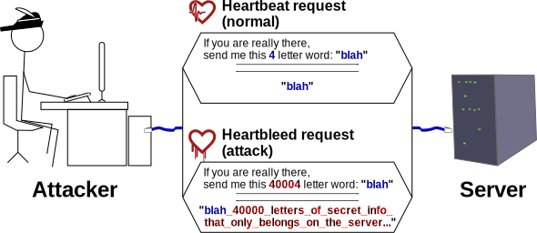

# 사람이 29년 못 본 버그를 AI가 읽어냈다

_Squidbleed(CVE-2026-47729)가 보여준 레거시 코드 감사의 새 조건_

## Executive Summary

> [!callout]
> 2026년, 기업 네트워크에서 널리 쓰이는 스퀴드 프록시(Squid Proxy)에서 오래된 결함 하나가 드러났다. 이름은 Squidbleed(CVE-2026-47729), 1997년 1월부터 코드에 잠복해 있었다. 특이한 점은 발견자다. 이 결함을 처음 "실제 버그"라고 짚어낸 것은 사람이 아니라 AI 에이전트였고, 판단의 근거로 C 언어 표준의 조항을 직접 인용했다. 이 글은 그 사건을 보안 속보가 아니라 데이터 품질의 문제로 읽는다.

> 29년간 아무도 못 본 이유는 이 버그가 평범한 실행 경로 바깥의 엣지 케이스에 숨어 있었기 때문이다. AI는 코드 리뷰나 테스트가 훑지 못한 그 구석을 명세와 대조해 찾아냈다. 다만 반전이 있다. AI가 버그를 짚은 뒤에도 패치를 각 버전에 반영하고, 발견자를 제대로 기록하고, 사용자에게 알리는 일은 여전히 사람이 손으로 처리해야 했다.

> "오래 쓰였으니 검증된 코드"라는 믿음은 여기서 흔들린다. 코드도 한번 만들어진 뒤 오래 방치되면 품질이 저하되는 데이터와 다르지 않다. AI는 그 방치된 데이터를 감사하는 도구가 될 수 있다. 이 글은 그 가능성과, 발견 이후에도 사람이 감당해야 하는 몫을 함께 본다.

이 사건이 남긴 자국은 네 개의 숫자로 압축된다. 결함이 얼마나 오래 숨어 있었는지, 같은 기간에 몇 팀이 각자 도달했는지, 그리고 발견 이후 패치와 공지가 얼마나 어긋났는지다.

<!-- stat-card -->
**29년** — 버그 잠복 기간 — 1997년 1월부터 코드에 존재

<!-- stat-card -->
**3팀** — 독립 발견 — 두 달 사이 각자 같은 버그에 도달

<!-- stat-card -->
**한 달** — v8→v7 패치 격차 — 그 사이 v7 사용자는 취약 상태

<!-- stat-card -->
**2주** — 릴리즈→어드바이저리 — 고쳤는지 확인하기 어려운 공백

## 1997년부터 잠들어 있던 결함

스퀴드는 기업과 기관의 네트워크 경계에서 웹 트래픽을 중개하는 프록시 소프트웨어다. 수많은 조직이 방화벽 안쪽에 두고 외부로 나가는 요청을 이 프로그램에 통과시킨다. 그만큼 오래됐고, 그만큼 검증됐다고 여겨졌다. 이번에 드러난 결함 Squidbleed는 그 스퀴드가 FTP 디렉토리 목록을 해석하는 파서에 있었다.

원인은 C 언어의 작은 함정 하나다. 문자열에서 특정 문자를 찾는 `strchr()` 함수는, 찾으려는 문자가 문자열의 끝을 나타내는 널 문자(`'\0'`)일 때 예외적으로 동작한다. 없으면 빈손(NULL)을 돌려줄 것 같지만, C 표준은 이때 문자열 끝의 널 종결자를 가리키는 포인터를 반환하라고 정해 두었다. 스퀴드의 FTP 파서는 이 포인터를 "못 찾았다"는 신호로 오해하지 않고 그대로 계산에 넣었고, 그 결과 버퍼의 경계를 넘어 옆 메모리를 읽었다.

그 옆 메모리에는 같은 프록시를 지나던 다른 사용자의 요청 데이터가 들어 있을 수 있다. 자격증명이나 API 키 같은 민감 정보가 공격자에게 새어 나가는 정보 유출(information disclosure) 결함이다. 공격 조건도 까다롭지 않다. 공격자가 제어하는 FTP 서버에 프록시가 접근하도록 유도하면 된다.

문제를 키우는 것은 기본 설정이다. 스퀴드는 별도로 끄지 않는 한 FTP 지원이 켜져 있고, 그 통로가 되는 21번 포트도 기본 허용 목록(`Safe_ports` ACL)에 들어 있다. 관리자가 손대지 않은 평범한 설치본 상당수가, 이 취약한 경로에 그대로 노출돼 있었다는 뜻이다.

## AI가 상태기계를 읽는 방법

발견 과정은 지금의 AI 활용을 그대로 보여 준다. Calif.io의 연구자는 AI 에이전트에게 스퀴드의 FTP 상태기계 전체를 조사하라고 지시했다. 필요하면 다른 에이전트를 추가로 띄워 경로 하나하나를 파고들라는 주문이었다. 그 과정에서 AI는 문제의 지점을 짚으며 이렇게 판단했다. "strchr(w_space, '\0')는 C11 §7.24.5.2에 따라 널이 아닌 값을 반환한다. 종결 널은 문자열의 일부다. 이것은 실제 버그다."

주목할 부분은 근거 방식이다. AI는 "이상해 보인다"에 그치지 않고 C 표준의 특정 조항을 인용해 왜 버그인지 논증했다. 사람이 29년 동안 못 본 이유와 정확히 대비되는 지점이다. 사람은 코드를 읽을 때 흔한 경로를 먼저 훑고, 드문 엣지 케이스는 테스트와 리뷰의 사각지대로 밀려나기 쉽다. 반면 이번 조사에서 AI는 상태기계의 모든 분기를 명세와 하나씩 대조했다. 사람이 "설마 여기서 문제가 나겠어"라고 넘긴 자리를 기계는 넘기지 않았다.

*▲ Squid Proxy — AI가 FTP 상태기계를 샅샅이 분석한 대상 | Source: [Wikimedia Commons (CC BY-SA 3.0)](https://commons.wikimedia.org/wiki/File:Squid-cache.png)*

더 눈여겨볼 신호는 발견자가 한 명이 아니라는 점이다. 3월 초 아이슬 리서치(Aisle Research)의 한 연구자가 이 결함을 처음 신고했고, 뒤이어 4월과 5월에 걸쳐 서로를 모르던 두 팀이 같은 버그에 독립적으로 다시 도달했다. 두 달 사이 세 번의 독립 발견은 우연으로만 보기 어렵다. AI 기반 코드 감사 도구가 퍼지면서, 오래 잠들어 있던 결함들이 비슷한 시기에 동시에 깨어나고 있다는 신호로 읽을 수 있다.

> [!callout]
> 핵심은 도구의 성능 자랑이 아니다. AI는 코드를 생성하는 데만 쓰이는 것이 아니라, 이미 존재하는 코드를 명세와 대조해 감사하는 데에도 쓰인다는 사실이다. "AI가 코드를 망친다"는 이야기의 반대편에서, AI는 사람이 오래 눈감아 온 코드를 다시 읽는 렌즈가 되고 있다.

## '검증된 레거시'라는 환상

많은 조직이 오래된 코드를 안심하고 쓴다. 수십 년 돌아갔으니 그동안 충분히 검증됐으리라는 직관 때문이다. Squidbleed는 그 직관의 약한 고리를 정확히 건드린다. "오래 쓰였다"는 사실은 "자주 실행된 경로가 안정적이다"라는 뜻일 뿐, 거의 실행되지 않는 엣지 케이스가 안전하다는 보장이 되지는 못한다. 검증은 실제로 밟은 경로만큼만 이뤄진다.

*▲ Heartbleed(CVE-2014-0160) — 신뢰받던 OpenSSL에 2년간 숨어 있던 메모리 유출 결함. '검증된 레거시'가 실은 가정이었다는 것을 보여 준 또 다른 사례 | Source: [Wikimedia Commons (CC BY-SA 3.0)](https://commons.wikimedia.org/wiki/File:Heartbleed_bug_explained.svg)*

페블러스가 데이터 품질에서 오래 다뤄 온 원칙이 여기에 그대로 적용된다. 한번 수집·가공된 데이터도 오래 방치되면 현실과 어긋나며 품질이 저하된다. 코드 역시 마찬가지다. 작성되던 시점의 가정과 관행 위에 굳은 채 오래 손대지 않으면, 그 자체로 감사가 필요한 오래된 데이터가 된다. 코드도 결국 사람이 읽고 쓰라고 만든 텍스트이고, 방치된 텍스트는 방치된 데이터와 같은 위험을 안는다.

그렇다면 AI 감사가 가장 큰 값을 내는 자리는 최신 코드가 아니다. 오히려 "이미 검증됐다"고 모두가 믿어 아무도 다시 들여다보지 않는 오래된 코드다. 사람의 관심에서 멀어진 만큼 사각지대가 넓고, 명세를 통째로 대조하는 기계의 방식이 그 넓은 사각지대에서 특히 유리하다.

> [!callout]
> '검증된 레거시'는 상태가 아니라 가정이다. 그 가정을 주기적으로 다시 시험하지 않으면, 안전하다는 믿음만 29년을 함께 쌓인다. 코드를 감사 대상 데이터로 다루기 시작할 때, 레거시는 비로소 관리되는 자산이 된다.

## 발견 이후는 사람의 몫

AI가 버그를 짚었다고 문제가 끝난 것은 아니다. 이후의 타임라인은 자동 발견과 자동 해결 사이의 거리를 그대로 보여 준다. 수정 패치는 4월 중순 최신 개발 브랜치(v8)에 먼저 들어갔지만, 여전히 널리 쓰이는 v7 브랜치에 반영되기까지는 한 달이 더 걸렸다. 그 한 달 동안 v7을 쓰던 조직은 패치가 존재하는데도 취약한 상태로 남아 있었다.

공지의 타이밍도 어긋났다. 수정이 담긴 v7.6이 6월 초 출시됐지만, 이 버전이 무엇을 고쳤는지 설명하는 공식 어드바이저리는 그로부터 2주 뒤에야 공개됐다. 사용자로서는 새 버전이 문제의 결함을 덮었는지 한동안 확신하기 어려웠다. 게다가 최초 보고자가 공식 어드바이저리에서 빠졌다가, 통보를 받은 뒤에야 기여자 목록에 추가되는 일도 있었다.
