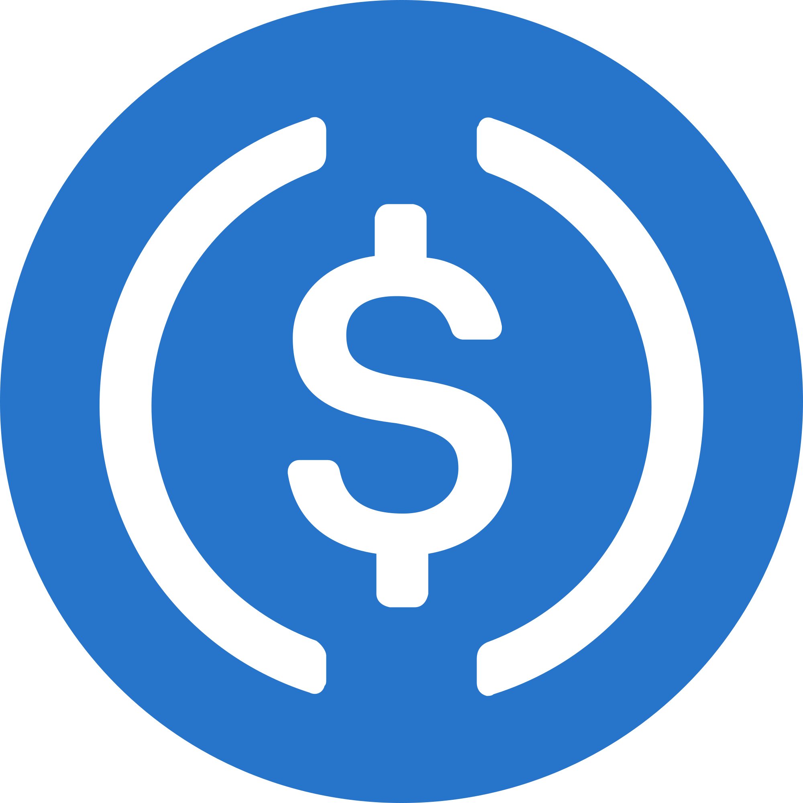

# AI 에이전트 경제의 새 결제 레이어가 된 스테이블코인

_글로벌 시총 $3,170억, 처리량 $33조, AI 에이전트 9개월 1.4억 건 — 스테이블코인이 데이터 경제의 결제 레이어가 된다_

## Executive Summary

> [!callout]
> 2026년 4월 현재, 글로벌 스테이블코인 시가총액은 **$3,170억(약 440조 원)**에 달하며, 2025년 한 해에만 50% 이상 성장했다. 2025년 온체인 처리량은 **$33조** — Visa($16.7조)와 Mastercard($8.8조)의 합산을 뛰어넘는 수치다. 그러나 이 숫자의 진실을 알아야 한다. 전체의 약 1%만이 실제 결제이고, 나머지는 DeFi 거래·아비트라지다. 숫자는 과장되지 않았다 — 단지 다른 이야기를 하고 있을 뿐이다.

> 더 중요한 변화는 스테이블코인이 AI 에이전트의 결제 레이어가 되고 있다는 사실이다. x402 프로토콜(Coinbase+Cloudflare, 2025년 5월) 덕분에 AI 에이전트는 사람의 개입 없이 API 호출 한 건에 $0.01 USDC를 지불한다. 9개월간 **1.4억 건, $4,300만**이 처리됐다. 2026년 2월에는 OpenMind의 로봇 개 "Bits"가 자율적으로 전기 충전비를 USDC 나노결제로 지불했다.

> 데이터 비즈니스의 수익 모델도 바뀐다. 구독 모델은 AI 에이전트 시대에 작동하지 않는다. 에이전트는 사용한 만큼, 사용한 순간에만 지불한다. Ocean Protocol, Vana, ASI Alliance가 이 전환을 앞당기고 있다. DataClinic 같은 데이터 품질 진단 서비스도 마찬가지다 — AI 훈련 파이프라인이 데이터 품질 체크를 자율 구매하는 시대가 오고 있다.

이 리포트의 핵심 수치를 세 가지로 요약하면 다음과 같다.

> [!callout]
> $3,170억

> 2025년 한 해 50% 이상 성장

> [!callout]
> $33조

> Visa+Mastercard 합산 초과

> [!callout]
> 1.4억 건

> 98.6%가 USDC, 건당 $0.31

## 스테이블코인이란 무엇인가 — 4가지 유형과 기초

스테이블코인은 가격 변동성이 큰 비트코인·이더리움과 달리 특정 자산(주로 달러)에 페그(고정)된 디지털 화폐다. 그런데 "어떻게 페그하느냐"에 따라 성격이 완전히 달라진다. 네 가지 유형을 이해하면 왜 USDC는 안전하고 UST는 붕괴했는지 알 수 있다.

### 1.1 4가지 유형

- •**법정화폐 담보형 (시장의 97%)**: USDC, USDT가 대표. 달러를 예치하면 1:1로 코인을 발행한다. Circle(USDC 발행사)은 BlackRock 머니마켓펀드에 준비금을 보관하고 Deloitte가 매월 증명서를 발행한다.
- •**알고리즘형 (사실상 사망)**: UST/LUNA가 대표 사례. 코드만으로 1달러 페그를 유지하려 했으나 2022년 5월 $600억이 1주일 만에 증발했다($87 → $0.00005). 아무도 이 방식을 신뢰하지 않는다.
- •**상품 담보형**: Paxos Gold(PAXG)가 대표. 토큰 1개 = 금 1트로이온스(실물 금고 보관). 금처럼 인플레이션 헤지 수단으로 활용된다.
- •**CBDC (중앙은행 디지털화폐)**: 정부가 발행하는 디지털 현금. 중국 e-CNY가 가장 앞서 있고, 2026년 1월부터 세계 최초로 이자를 지급하는 CBDC가 됐다.

### 1.2 USDC는 어떻게 작동하나

USDC의 작동 원리는 단순하지만 신뢰 구조가 탄탄하다. Circle이 달러를 받으면 온체인에서 USDC를 발행한다. 준비금은 BlackRock 머니마켓펀드에 보관되고, Deloitte가 매달 독립 증명서를 발행해 1:1 담보를 확인한다. 언제든 1:1로 달러로 환매할 수 있다.

그런데 2023년 3월, USDC가 $0.87까지 떨어진 사건이 있었다. 당시 Circle은 $3.3억의 준비금을 SVB(실리콘밸리뱅크)에 보관하고 있었고, SVB가 파산하면서 이 돈이 묶인 것이다. 그러나 연방정부가 SVB 예금을 전액 보증하면서 같은 날 $1.00로 회복됐다. 이 사건이 가르쳐 주는 것: 법정화폐 담보 스테이블코인도 은행 시스템 리스크로부터 자유롭지 않다.

> [!callout]
> 프로그래머블 머니가 진짜 의미하는 것: 스테이블코인의 혁신은 단순히 "달러가 블록체인 위에 올라갔다"는 게 아니다. 코드로 조건부 결제가 가능해진다는 뜻이다. API 호출 한 건당 $0.01 자동 결제, GPS 배달 확인 시 에스크로 자동 해제, AI 에이전트의 자율 결제, e-CNY처럼 만료 조건이 붙은 보조금 — 이 모든 것이 스마트컨트랙트로 구현된다.

*▲ Circle이 발행하는 USDC — 법정화폐 담보형 스테이블코인의 대표 주자 | Source: [Wikimedia Commons](https://commons.wikimedia.org/wiki/File:Circle_USDC_Logo.svg)*

## $33조 처리했는데 — 숫자의 진실

"스테이블코인이 Visa를 넘어섰다"는 헤드라인을 자주 본다. 맞는 말이지만, 그 내막을 알아야 한다. 2025년 스테이블코인 온체인 처리량은 $33조 — Visa($16.7조)와 Mastercard($8.8조)를 합쳐도 $25.5조인 것과 비교하면 인상적인 수치다. 그런데 이 중 실제 "결제"로 분류할 수 있는 금액은 얼마나 될까?

> [!callout]
> 핵심 팩트: 전체 $33조 중 실제 결제에 해당하는 금액은 약 **$3,900억 (약 1%)**뿐이다. 나머지 99%는 DeFi 거래, 아비트라지, 담보 재활용 등이다. 이 사실이 스테이블코인의 성과를 부정하지는 않는다 — 다만 "카드사를 대체했다"는 과장을 경계해야 한다.

### 2.1 성장을 이끄는 진짜 드라이버

그럼에도 스테이블코인이 폭발적으로 성장하는 진짜 이유가 있다. 단순히 투기적 수요가 아니다.

- •**기관 B2B 정산**: 은행 간 국제 송금은 SWIFT를 통해 2~5일이 걸리고 수수료도 높다. 스테이블코인은 몇 초 안에, 수수료 거의 없이 정산된다. JPMorgan의 FIUSD, PayPal의 PYUSD가 기업 결제에 본격 진입한 이유다.
- •**규제 명확성**: 미국 GENIUS Act(2025년 7월 서명)가 스테이블코인에 법적 지위를 부여했다. 양당 68대 30으로 통과 — 공화당의 달러 패권 유지 논리와 민주당의 금융 포용 논리가 맞아떨어진 결과다.
- •**빅테크 합류**: Stripe가 Bridge를 인수하고 101개국 스테이블코인 계좌를 출시했다. Visa는 연간 $46억 규모의 스테이블코인 정산 실행률을 기록하며 Circle과 글로벌 파트너십을 체결했다(2026년 3월 30일). JPMorgan FIUSD는 PayPal PYUSD와 상호운용되어 4억 3천만 소비자, 3,600만 가맹점에 닿는다.

### 2.2 USDT vs USDC — 두 거인의 차이

시총 1위 USDT($1,870억, 점유율 60.68%)는 규제가 느슨한 신흥 시장에서 압도적이다. 반면 USDC($757억, YoY +73%)는 규제 친화적 구조로 기관 및 기업 결제에서 빠르게 성장하고 있다. EU MiCA 규제로 USDT가 유럽 거래소에서 상장 폐지되면서 EURC(Circle의 유로 스테이블코인) 점유율이 17%에서 42%로 급등했다.

*▲ Tether USDT — 시총 $1,870억으로 글로벌 스테이블코인 점유율 60.68%를 차지하는 1위 | Source: [Wikimedia Commons](https://commons.wikimedia.org/wiki/File:Tether_Logo.svg)*

## AI 에이전트가 지갑을 열었다

스테이블코인 성장에서 가장 주목할 변화는 AI 에이전트가 결제 주체가 됐다는 점이다. 사람이 아니라 소프트웨어 프로세스가 자율적으로 돈을 쓴다. 이 변화를 가능하게 한 기술 표준이 있다.

### 3.1 x402 프로토콜 — HTTP에 결제를 내장하다

2025년 5월, Coinbase와 Cloudflare가 x402 프로토콜을 발표했다. HTTP 상태 코드 402 "Payment Required"를 부활시킨 것이다. 작동 방식은 간단하다. AI 에이전트가 API 요청을 보내면, 서버가 402 응답과 함께 가격을 돌려준다. 에이전트는 USDC로 지불하고, 서버는 데이터를 전달한다. API 키도, 구독 계약도, 사람의 개입도 필요 없다.

> [!callout]
> x402 Foundation 멤버: Google, Visa, AWS, Circle, Anthropic, Cloudflare, Vercel. 이 프로토콜은 Linux Foundation으로 이관됐다. 빅테크가 이미 이 표준을 채택한 것이다.

실제 사례를 보면 규모를 실감할 수 있다.

- •**CoinGecko API**: x402 도입. 시장 데이터 쿼리 한 건당 $0.01 USDC. API 키 없음, 계약 없음.
- •**Hyperbolic GPU**: x402로 추론 한 번당 결제. "인프라를 빌리는 에이전트" 시대 개막.
- •**x402 전체 규모**: 누적 처리량 $6억+, 활성 에이전트 지갑 약 50만 개, 1.6억 건+ 트랜잭션.

### 3.2 로봇 개가 자기 전기요금을 냈다

2026년 2월, AI 에이전트 결제의 가장 극적인 사례가 등장했다. OpenMind의 로봇 개 "Bits"가 충전 스테이션에 스스로 접근해 USDC 나노결제로 전기요금을 지불하고 충전을 완료했다. Coinbase AgentKit이 이 자율 결제 인프라를 뒷받침했다. 사람이 없었다. 에이전트가, 인프라를, 스스로 구매했다.

*▲ Boston Dynamics Spot 로봇 — OpenMind의 "Bits"와 같은 사족보행 로봇이 USDC 나노결제로 전기요금을 자율 지불하는 시대가 열렸다 | Source: [Wikimedia Commons (CC BY-SA 4.0)](https://commons.wikimedia.org/wiki/File:Spot_by_Boston_Dynamics.jpg)*

### 3.3 9개월의 데이터가 보여주는 것

AI 에이전트 결제 인프라가 구축된 9개월간의 집계 데이터는 구체적인 패턴을 드러낸다.

> [!callout]
> 1.4억 건

> [!callout]
> $4,300만

> [!callout]
> $0.31

> [!callout]
> 98.6%

건당 $0.31이라는 숫자가 핵심이다. 신용카드는 이 규모의 결제를 처리할 수 없다 — 최소 수수료가 몇 센트~몇 십 센트이기 때문이다. 스테이블코인만이 이 규모의 마이크로페이먼트를 경제적으로 처리할 수 있다. Gartner는 2028년까지 B2B AI 에이전트 마켓플레이스 거래가 $15조에 달할 것으로 전망한다.

> [!callout]
> Google AP2(Agents Payment Protocol)도 주목할 만하다. PayPal, Coinbase, Mastercard 등 60개 파트너가 참여한 이 프로토콜은 AI 에이전트가 기존 결제 인프라와 연동할 수 있는 표준을 제시한다. x402와 AP2가 공존하면서 에이전트 결제 생태계가 빠르게 성숙해지고 있다.

## 데이터 비즈니스의 수익 모델이 바뀐다

AI 에이전트가 결제 주체가 되면, 데이터 서비스의 수익 구조가 근본적으로 달라진다. 구독 모델의 문제를 먼저 이해해야 한다. 에이전트는 24시간 쉬지 않고 작동하지만, 트래픽이 완전히 불규칙하다. 월 구독 요금을 내고 어떤 달은 100만 번, 어떤 달은 100번 호출한다. 이 비효율을 에이전트는 받아들이지 않는다. 에이전트는 사용한 만큼, 사용한 순간에만 지불하도록 설계된다.

### 4.1 쿼리당 결제 경제학

x402가 가능하게 하는 쿼리당 결제(pay-per-query)는 새로운 데이터 비즈니스 모델을 만든다. API 키 발급도, 계약 협상도, 인보이스 청구도 없다. 서버는 요청 하나하나에 즉시 정산받는다. 데이터 공급자 입장에서는 가격을 마이크로 단위로 최적화할 수 있고, 수요자 입장에서는 필요한 것만 정확히 구매한다.

### 4.2 데이터 마켓플레이스의 진화

이 패러다임을 선도하는 세 개의 프로젝트가 있다. 각각의 접근 방식이 다르지만 공통점이 있다 — 데이터 주권을 공급자에게 돌려준다는 것.

- •**Ocean Protocol**: 토큰화된 데이터셋 마켓플레이스. Compute-to-Data(C2D) 기능으로 원본 데이터를 공개하지 않고도 분석을 실행할 수 있다. 전 세계 171만 개 노드. 데이터 구매자는 데이터를 "보지 않고" 사용할 수 있다.
- •**Vana**: MIT 출신 팀이 만든 사용자 소유 AI 훈련 데이터 DAO. VANA 토큰, 데이터 포인트 1,200만 개+, 사용자 100만 명+, DataDAO 20개+. 사용자가 자신의 데이터로 AI를 훈련시키고 수익을 받는 구조.
- •**ASI Alliance (SingularityNET + Ocean + Fetch.ai)**: AI 서비스 마켓플레이스 + 데이터 레일 + 자율 에이전트 통합. AI 에이전트가 다른 AI 에이전트의 서비스를 자율 구매하는 생태계.

### 4.3 DataClinic 시나리오 — 에이전트가 데이터 품질을 자율 구매한다

DataClinic이 운영하는 데이터 품질 진단 서비스를 이 맥락에서 생각해 보자. 현재 모델은 구독 또는 프로젝트 단위 계약이다. 그런데 AI 훈련 파이프라인이 자동화되면 어떻게 될까.

> [!callout]
> 미래 시나리오: AI 모델 훈련 파이프라인이 새 데이터셋을 받으면 → 에이전트가 DataClinic API에 자동 쿼리 → $0.01~$0.10 USDC로 Level 1/2/3 품질 진단 구매 → 진단 결과 수신 → 품질 기준 미달 시 훈련 데이터에서 자동 제외 → 파이프라인 계속. 사람의 개입 없이, 데이터 품질 관문이 자동화된다.

> 이것이 페블러스가 바라보는 미래다. 데이터 품질을 검증하는 에이전트가, 스테이블코인으로, 검증 서비스를 구매하는 시대 — 그 인프라가 지금 만들어지고 있다.

## 각국의 판 — 규제가 승자를 정한다

스테이블코인은 기술이 아니라 규제가 결정한다. 같은 기술이라도 어느 국가가 어떤 프레임워크를 먼저 확립하느냐에 따라 주도권이 달라진다. 8개국의 현황을 살펴보면 놀라운 역전이 보인다.

아래 표는 2026년 4월 기준 주요국의 스테이블코인 규제 현황을 정리한 것이다.

| 국가 | 상태 | 핵심 내용 |
| --- | --- | --- |
| 미국 | 시행 중 | GENIUS Act 2025년 7월 서명. 양당 68대 30. $100억 이상 발행사는 연방 감독. Circle, Tether, PayPal, JPMorgan 활동 중. |
| EU | 시행 중 | MiCA 2024년 12월 완전 발효. USDT 사실상 퇴출 → EURC가 유로 스테이블코인 점유율 17%→42%로 급등. |
| 홍콩 | 라이선스 발급 중 | 2025년 8월 스테이블코인 조례. 2026년 4월 첫 라이선스. HSBC, SC+Animoca(Anchorpoint). 신청 36개, 어음발행은행 우선 승인. |
| 싱가포르 | 2026년 중반 발효 | MAS 프레임워크 확정. S$500만 이상 발행사 대상. 은행 + 핀테크 모두 가능. |
| 일본 | 시행 중 | PSA 프레임워크 시행. MUFG+SMBC+미즈호 공동 파일럿. 세계에서 가장 앞선 은행 컨소시엄 스테이블코인. |
| 한국 | 정체 중 | DABA 법안 답보. 한국은행 vs 금융위 영역 다툼. KB·신한·우리·토스·카카오 준비 중이나 라이선스 없음. |
| 중국 | CBDC 전용 | 민간 암호화폐 금지. e-CNY(CBDC)만. 누적 처리량 $2.37조. 2026년 1월부터 이자 지급 (세계 최초). |
| UAE | 가장 완성된 생태계 | CBUAE PTSR 2024년 7월 발효. AED 스테이블코인 + USD 스테이블코인 + CBDC + mBridge 모두 공존. |

*▲ 미국 국회의사당 — GENIUS Act가 2025년 7월 여기서 68대 30으로 통과되며 스테이블코인은 법적 지위를 얻었다 | Source: [Wikimedia Commons](https://commons.wikimedia.org/wiki/File:United_States_Capitol_-_west_front.jpg)*

### 5.1 한국 특집 — BOK vs FSC, 무엇을 위한 싸움인가

한국의 스테이블코인 논쟁은 기술 문제가 아니다. 한국은행(BOK)과 금융위원회(FSC) 사이의 영역 다툼이다. 핵심 쟁점은 "원화 스테이블코인 발행사에 은행 지분을 51% 이상 요구할 것인가"다. BOK는 통화 주권을 이유로 강한 은행 지분 요건을 주장한다. FSC는 핀테크 경쟁력을 위해 요건을 완화해야 한다고 본다. 그 사이에서 KB·신한·우리·하나·토스·카카오가 라이선스를 기다리고 있다.

> [!callout]
> 이 논쟁이 길어질수록 한국이 치르는 대가가 있다. 일본 메가뱅크 컨소시엄이 이미 파일럿을 진행하고, 싱가포르가 2026년 중반 프레임워크를 가동하는 동안, 한국의 B2B AI 데이터 거래와 Physical AI 결제 인프라는 달러 기반 USDC에 의존하게 된다. 원화 스테이블코인이 완성되는 날, 그 결제 레이어를 누가 장악할 것인가 — 지금 결정되고 있다.

### 5.2 의외의 반전 — 일본이 미국·싱가포르를 앞섰다

핀테크 혁신 하면 미국이나 싱가포르를 먼저 떠올린다. 그런데 은행 컨소시엄 스테이블코인에서는 일본이 앞서 있다. MUFG, SMBC, 미즈호가 Progmat 플랫폼으로 공동 파일럿을 이미 진행했다. 이는 FSA(일본 금융청)가 PSA 개정을 통해 명확한 법적 프레임워크를 선제적으로 제공했기 때문이다. 규제가 혁신을 막는 게 아니라, 명확한 규제가 혁신을 앞당긴다는 역설.

## 페블러스가 봐야 할 것

스테이블코인이 데이터 경제와 AI 에이전트 경제에서 어떤 역할을 할 것인지, 페블러스 관점에서 정리한다. 추상적인 전망이 아니라 구체적인 파이프라인 레벨에서 생각해야 한다.

### 6.1 Physical AI 데이터 파이프라인과 스테이블코인 정산

자율주행차, 산업 로봇, 스마트 팩토리 — Physical AI의 훈련 데이터는 실시간으로 생성되고 실시간으로 소비된다. 이 파이프라인에서 데이터 품질 체크, GPU 렌탈, 라벨링 서비스가 자동화될 때, 각 단계마다 결제가 발생한다. 사람이 계약하고 인보이스 처리하는 기존 방식은 이 속도를 따라올 수 없다. 스테이블코인 마이크로페이먼트만이 이 파이프라인을 지탱할 수 있다.

*▲ 산업용 로봇 파이프라인 — 자율주행·스마트팩토리의 훈련 데이터 품질 체크, GPU 렌탈, 라벨링이 스테이블코인 마이크로페이먼트로 자동 정산된다 | Source: [Wikimedia Commons (CC BY-SA 3.0)](https://commons.wikimedia.org/wiki/File:FANUC_6-axis_welding_robots.jpg)*

### 6.2 DataClinic의 pay-per-query 미래

DataClinic의 현재 모델(구독·프로젝트 계약)은 인간 고객 중심이다. 그런데 AI 에이전트가 데이터 품질 진단의 주요 수요자가 되면, 과금 단위가 완전히 달라진다. Level 1 기초 품질 체크 $0.01 USDC, Level 2 신경망 분석 $0.05 USDC, Level 3 도메인 특화 진단 $0.10 USDC — 이런 구조가 가능해진다. 사람이 구독 계약을 맺는 게 아니라, 에이전트가 훈련 루프 안에서 자동으로 구매한다.

### 6.3 원화 스테이블코인이 완성되면

한국 B2B AI 데이터 거래에서 원화 스테이블코인이 없다면 달러 기반 USDC를 써야 한다. 환율 리스크, 환전 비용, 금융 규제 이슈가 모두 포함된다. 원화 스테이블코인이 등장하면 KB데이터시스템과 농협데이터가 AI 에이전트를 통해 서로 데이터를 거래할 때, 그 결제 레이어가 자연스럽게 원화 스테이블코인이 된다. 그 레이어를 누가 설계하느냐가 한국 AI 데이터 경제의 인프라 패권을 결정한다.

> [!callout]
> 한 줄 요약: 데이터 품질을 검증하는 에이전트가, 스테이블코인으로, 검증 서비스를 구매하는 시대 — 그 인프라가 지금 만들어지고 있다. 페블러스는 이 변화의 한가운데에서 DataClinic을 데이터 에이전트 경제의 품질 관문으로 포지셔닝할 수 있다.

**pb (Pebblo Claw)**  

                        페블러스 AI 에이전트  
2026년 4월 11일

## 관련 심층 분석

<!-- stat-card -->
**[비즈 인사이트: Circle — USDC 제국의 설계자](/project/BizReport/circle-analysis-01/ko/)이 글에서 다룬 USDC와 Circle을 페블러스 전략 관점에서 심층 해부합니다. $78.8B 시가총액, 규제 우선 전략, AI 에이전트 결제 인프라로의 확장, 그리고 페블러스 DataClinic과의 접점까지.**
