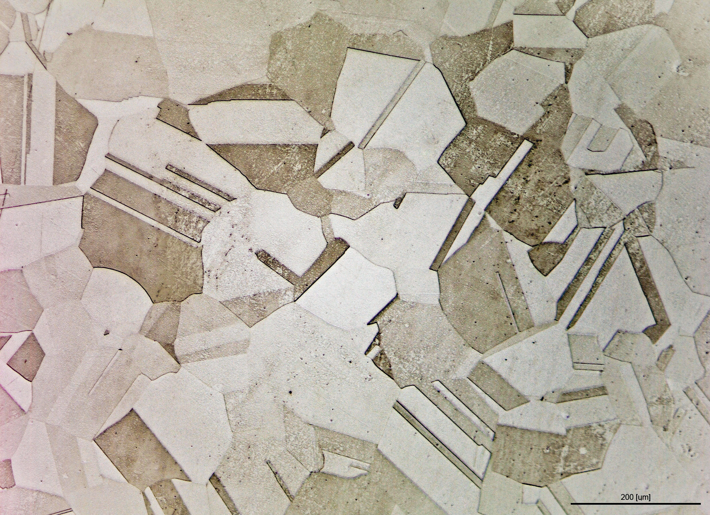

# 철강 미세조직 라벨링 시간이 170시간에서 37시간으로 줄었다

_AI 학습 데이터에서 가장 비싼 것은 모델이 아니라 전문가가 그리는 픽셀이다_

## Executive Summary

> [!callout]
> "AI 모델보다 라벨이 더 비싸다"는 말은 비유가 아닙니다. 스페인 연구진이 2026년 6월 공개한 한 논문이 이를 숫자로 증명합니다. 전문가 3명이 철강 미세조직 사진 82장에 픽셀 단위 마스크를 칠하는 데 170시간이 걸렸습니다. 이 글은 그 170시간을 37시간으로 줄인 방법과, 그래도 줄지 않은 22%가 무엇을 말하는지를 봅니다.

> 핵심은 분업입니다. 라벨이 전혀 없는 상태에서 학습하는 비지도 CNN이 초벌 마스크를 깔고, 전문가는 그 위에서 틀린 부분만 고칩니다. 정작 초벌 품질은 낮았습니다. 사전 라벨의 평균 IoU는 32~49%에 그쳤습니다. 그런데도 시간은 78% 줄었습니다. 사람은 "처음부터 그리는" 일보다 "고치는" 일에 압도적으로 빠르기 때문입니다.

> 그렇다면 남은 22%는 왜 여전히 사람 몫일까요. 이 질문이 이 글의 가장 날카로운 지점입니다. 답은 "기계의 정밀도가 부족해서"가 아니라 "거기에 판단이 필요해서"입니다.

*▲ 화학적 에칭 후 광학현미경으로 촬영한 스테인리스 강(A961) 미세조직. 어두운 선이 결정립 경계이며 각 영역의 밝기 차이가 상(phase)을 구분한다. 이처럼 불규칙한 경계를 픽셀 단위로 정답 처리하는 것이 어노테이션이다 | 출처: [Wikimedia Commons](https://commons.wikimedia.org/wiki/File:Microstructure_of_a_stainless_steel.jpg) (CC BY 4.0)*

### 주요 수치

네 숫자가 이 연구의 결과와 역설을 압축합니다. 앞 두 수치는 절감의 규모이고, 뒤 두 수치는 그 절감이 일어난 조건과 한계입니다.

출처: [Fernandez-Moreno et al. (arXiv:2606.19934)](https://arxiv.org/abs/2606.19934)

<!-- stat-card -->
**170h → 37h** — 어노테이션 시간 — 전문가 3명·사진 82장 기준

<!-- stat-card -->
**78%** — 시간 절감률 — 유형별 73~83%

<!-- stat-card -->
**IoU 32~49%** — 사전 라벨 품질 — 낮아도 절감 효과는 최대

<!-- stat-card -->
**22%** — 사람 몫으로 남은 시간 — 정밀도 아닌 판단의 영역

## 170시간은 어떻게 37시간이 됐나

철강은 같은 강철이라도 내부 미세조직이 다릅니다. Alpha, TiB2, TiN 같은 상(phase)이 어떤 비율로 어떻게 분포하느냐가 강도와 내구성을 결정합니다. AI로 이 조직을 자동 분류하려면, 먼저 사진 한 장 한 장에서 각 픽셀이 어떤 상에 속하는지를 사람이 칠해 둔 정답 마스크가 필요합니다. 이 작업이 어노테이션입니다.

문제는 비용입니다. 전문가 3명이 사진 82장을 밑바닥부터 픽셀 단위로 칠하는 데 170시간이 들었습니다. 시간당 전문가 비용을 100달러로만 잡아도 사진 82장의 라벨에 약 1만 7천 달러가 들어간 셈입니다. 모델 한 번 학습시키는 비용보다 몇 배 클 수 있는 금액이 데이터 준비에만 묶입니다.

연구진은 이 시간을 줄이기 위해 다섯 가지 비지도 알고리즘을 비교했습니다. 회색조 히스토그램을 쪼개는 Multi-Otsu, 그래프 기반의 슈퍼픽셀, K-means 군집, Meta의 범용 분할 모델 SAM, 그리고 특징 유사도와 공간 연속성을 함께 최적화하는 딥러닝 기반 비지도 CNN입니다. 최종 선택은 비지도 CNN이었습니다. 모든 강재 유형에서 일관된 성능을 냈기 때문입니다.

선택된 방법으로 초벌 라벨을 깔자 전체 어노테이션 시간은 170시간에서 37시간으로 떨어졌습니다. 78% 절감입니다. 강재 유형별로 뜯어 보면 절감 폭은 더 선명합니다.
