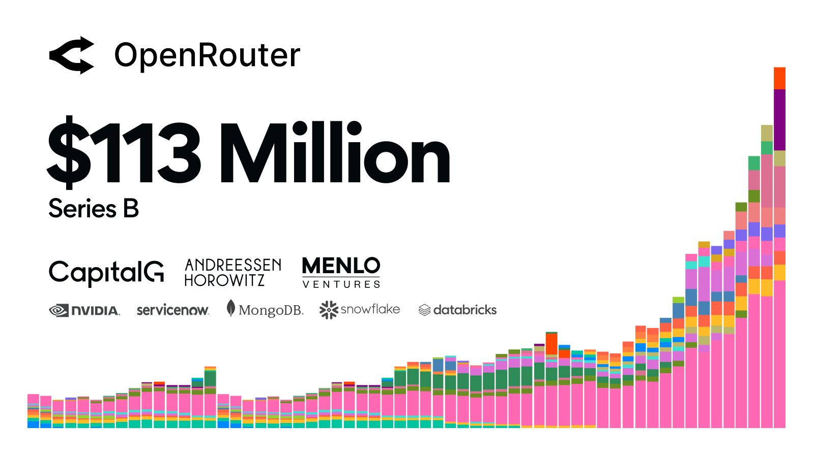
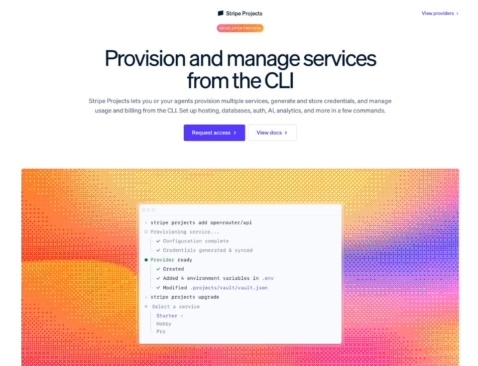

# 스트라이프가 70억 달러에 사들인 AI 모델 라우팅 관문

_5월 13억 달러였던 오픈라우터는 500여 개 모델로 요청을 나누고 크레딧 결제에서 수수료를 받는다_

## Executive Summary

> [!callout]
> 스트라이프가 오픈라우터를 70억 달러 넘는 값에 사들이는 거래를 확정했다고 블룸버그가 8월 16일 보도했고, 테크크런치가 이를 받아 전했습니다. 오픈라우터는 API 하나로 수백 개 모델에 요청을 나눠 보내는 라우팅 게이트웨이입니다. 석 달 전인 5월에는 13억 달러 평가로 시리즈 B를 받았습니다. 스트라이프는 소문이나 추측에 대해 언급하지 않는다고 답했고, 두 회사 모두 공식 확인은 하지 않았습니다.

> 값이 왜 그렇게 뛰었는지는 이 회사의 수익 구조가 설명해 줍니다. 오픈라우터는 추론 가격에 마진을 붙이지 않는다고 자사 문서에 명시하고, 대신 크레딧을 충전할 때 5.5%의 수수료를 받습니다. 결제회사가 산 것은 이미 결제 수수료로 돈을 버는 회사였습니다. 두 회사는 인수 보도 전부터 스트라이프 프로젝트라는 도구로 엮여 있었고, 오픈라우터는 그 출시 파트너였습니다.

> 이 글이 보는 것은 그다음입니다. 게이트웨이는 요청 하나마다 토큰 수와 지연, 어느 공급자가 받았는지를 적어 둡니다. 프롬프트 본문의 저장은 켜고 끌 수 있지만 이 계량 기록은 그렇지 않습니다. 정산이 그 위에서 이뤄지기 때문입니다. 남는 질문은 두 개입니다. 그 기록은 지금 누구의 권리 아래 놓여 있는가, 그리고 모델이나 게이트웨이를 갈아탈 때 기록도 따라오는가.

### 주요 수치

네 숫자를 나란히 놓으면 이 거래의 성격이 보입니다. 값은 석 달 만에 다섯 배가 됐는데, 그 값을 떠받치는 것은 추론 마진이 아니라 크레딧 충전 수수료와 관문을 지나는 물량입니다. 그 너머에는 공급자 80여 곳이 각자의 정책을 들고 서 있습니다.

출처: [TechCrunch (2026-08-16)](https://techcrunch.com/2026/08/16/stripe-will-reportedly-acquire-ai-gateway-startup-openrouter-for-7b/), [OpenRouter FAQ](https://openrouter.ai/docs/faq), [OpenRouter Series B (2026-05-28)](https://openrouter.ai/blog/announcements/series-b/), [OpenRouter 홈페이지](https://openrouter.ai/)

<!-- stat-card -->
**70억 달러+** — 보도된 인수가 — 5월 시리즈 B 평가 13억 달러의 약 다섯 배

<!-- stat-card -->
**5.5%** — 크레딧 충전 수수료 — 추론 가격에는 마진을 붙이지 않는다고 명시

<!-- stat-card -->
**25조 개** — 주간 처리 토큰 — 반년 전 5조에서 다섯 배, 5월 자사 공시

<!-- stat-card -->
**80여 곳** — 연결된 모델 공급자 — 보존·학습 정책은 공급자마다 따로 적용

## 석 달 만에 다섯 배가 된 값

테크크런치가 8월 16일 전한 내용은 짧습니다. 블룸버그 보도를 인용해 스트라이프가 오픈라우터 인수를 확정했다고 적었고, 월스트리트저널이 지난달 두 회사의 인수 협상을 먼저 보도했으며, 이번에 알려진 거래가는 70억 달러가 넘는다고 덧붙였습니다. 스트라이프 대변인은 소문이나 추측에 대해서는 언급하지 않는다고 답했습니다.

오픈라우터는 2023년 초에 최초의 LLM 마켓플레이스를 표방하며 시작한 회사입니다. 개발자가 코드를 고치지 않고도 여러 모델을 갈아탈 수 있도록 단일 API를 제공하고, 작업과 예산에 맞는 모델을 고르도록 돕습니다. 창업자이자 CEO인 알렉스 아탈라는 2017년 NFT 마켓플레이스 오픈시를 공동 창업했던 인물입니다. 그는 5월 시리즈 B 당시 오픈라우터가 AI 세계의 스트라이프에 해당한다고 설명했습니다. 여러 시스템에 대한 단일 접근점을 제공하고 락인을 막아 준다는 이유에서였습니다. 석 달 뒤 그 비유의 원본이 회사를 사게 됐습니다.

5월에 회사가 직접 밝힌 수치는 인수가를 이해하는 데 필요한 배경입니다. 시리즈 B는 1억 1,300만 달러 규모였고 알파벳의 성장 펀드 캐피털G가 주도했습니다. 엔비디아의 벤처 조직 엔벤처스와 서비스나우, 몽고DB, 스노우플레이크, 데이터브릭스의 벤처 조직이 함께 들어왔습니다. 오픈라우터는 같은 글에서 주간 처리량이 반년 만에 5조 토큰에서 25조 토큰으로 늘었고, 올해 1,000조 토큰을 넘겨 처리할 속도라고 적었습니다. 8월 현재 회사 홈페이지가 내건 집계는 월 200조 토큰 이상, 사용자 1,000만 명 이상, 공급자 80여 곳, 모델 500종 이상입니다.

*▲ 오픈라우터가 공개한 시리즈 B 발표 이미지 | Source: [OpenRouter Blog](https://openrouter.ai/blog/announcements/series-b/)*

투자자 명단을 다시 보면 이 회사의 성격이 드러납니다. 모델을 만드는 회사가 아니라 모델을 쓰는 회사들이 들어와 있습니다. 오픈라우터 자신도 시리즈 B 글에서 위치를 이렇게 적었습니다. 에이전트와 모델 공급자 사이에 앉아 라우팅과 안정성, 비용 최적화, 컴플라이언스를 처리한다는 것입니다.

## 결제회사가 라우팅 관문을 사는 이유

모델이 흔해지면 값은 통로로 옮겨 간다는 이야기는 지난 2년 동안 여러 번 나왔습니다. 이번 거래에서 새로운 대목은 그 통로를 결제망이 샀다는 점입니다. 그런데 오픈라우터의 가격 정책을 읽으면 두 회사의 거리가 생각보다 가깝습니다.

오픈라우터의 FAQ는 요금 구조를 이렇게 적어 두었습니다. 하부 모델 공급자의 가격을 그대로 통과시켜 추론 가격에는 마진을 붙이지 않고, 대신 크레딧을 구매할 때 5.5%의 수수료를 받는다는 것입니다. 최소 수수료는 0.8달러이고 암호화폐 결제는 5%, 자체 공급자 키를 쓰는 경우에도 5%가 붙습니다. 게이트웨이의 마진은 토큰당 가격 차이가 아니라 충전 결제에서 나옵니다. 결제회사가 인수 대상으로 고른 회사의 손익계산서는 이미 결제 수수료로 쓰여 있었습니다.

두 회사가 이미 연결돼 있었다는 사실도 오픈라우터 문서에 남아 있습니다. 스트라이프가 운영하는 CLI 기반 개발자 도구 마켓플레이스 스트라이프 프로젝트에서 오픈라우터는 출시 파트너입니다. 명령 한 줄로 오픈라우터 계정을 만들고 API 키를 발급받아 프로젝트의 환경 변수에 넣을 수 있으며, 호스팅과 데이터베이스, AI 비용을 하나의 스트라이프 계정에서 관리한다고 문서는 설명합니다. 키는 스트라이프의 암호화 금고에 보관되고, 코딩 에이전트가 대신 서비스를 붙일 수 있도록 스킬 파일도 프로젝트 폴더에 기록됩니다.

*▲ 오픈라우터가 출시 파트너로 참여한 스트라이프 프로젝트 CLI 화면 | Source: [OpenRouter, Stripe Projects](https://openrouter.ai/docs/guides/overview/stripe-projects)*

스트라이프 쪽 제품 목록에서도 같은 방향이 보입니다. 현재 스트라이프 사이트의 매출(Revenue) 항목에는 사용량 기반 과금 제품인 메트로놈이 빌링, 인보이싱, 수익 인식과 나란히 올라 있습니다. 개발자 가이드에는 사용량 기반 과금을 제공하는 법과 에이전트로 서비스를 프로비저닝하고 관리하는 법이 함께 놓여 있습니다. 계량과 결제는 이미 한 회사 안에 있고, 이번 보도가 사실이라면 그 앞단의 라우팅 결정이 같은 지붕 아래로 들어옵니다.

아래 표는 세 층이 각각 무엇을 하는지 정리한 것입니다. 스트라이프가 이 조합을 어떤 제품으로 묶을지는 아직 발표된 바 없습니다.

| 층 | 하는 일 | 현재 위치 |
| --- | --- | --- |
| 라우팅 | 어느 공급자의 어느 모델이 이 요청을 받을지 결정 | 오픈라우터 (인수 보도) |
| 계량 | 소비한 토큰과 호출을 세어 청구 가능한 항목으로 변환 | 메트로놈 (스트라이프 제품군) |
| 정산 | 그 항목에 값을 매겨 실제 돈을 옮김 | 스트라이프 빌링·결제 |

출처: [OpenRouter, Stripe Projects](https://openrouter.ai/docs/guides/overview/stripe-projects), [Stripe 제품 목록](https://stripe.com/)

세 층이 한 회사 안에 모이면 라우팅 로그의 성격이 달라집니다. 지금 그 로그는 어느 모델이 요청을 처리했고 얼마나 걸렸는지를 적어 둔 운영 기록입니다. 계량과 청구가 같은 지붕 아래로 들어오면 같은 기록이 청구서의 근거 자료가 됩니다. 운영 기록이 틀리면 대시보드의 숫자가 어긋나지만, 정산 기록이 틀리면 받거나 낸 돈이 어긋납니다. 그 기록에 무엇이 담기는지는 오픈라우터 자신의 문서에 적혀 있습니다.

## 요청마다 남는 사용량 원장

오픈라우터의 데이터 수집 문서는 첫 줄에서 프롬프트 보관은 언제나 옵트인이라고 밝힙니다. 회사는 프롬프트와 응답을 저장하지 않으며, 사용자가 두 가지 설정 가운데 하나를 켰을 때만 저장합니다. 하나는 자기 로그에서 프롬프트와 완성을 다시 볼 수 있게 하는 비공개 입출력 로깅이고, 다른 하나는 제품 개선에 데이터를 쓰도록 허용하고 전 모델 사용료에서 1% 할인을 받는 설정입니다. 둘 다 기본값은 꺼짐입니다.

같은 문서의 다음 절이 이 글의 주제입니다. 오픈라우터는 요청마다 메타데이터를 저장한다고 적고 있습니다. 프롬프트와 완성의 토큰 수, 지연 같은 값이며 프롬프트나 응답의 내용은 포함하지 않는다는 설명이 붙습니다. 본문 저장에는 스위치가 있지만 이 계량 기록에는 스위치가 없습니다. 요금 청구가 바로 이 기록 위에서 이뤄지기 때문입니다.

과금 절차는 FAQ에 한 문장으로 적혀 있습니다. 요청을 보내면 오픈라우터가 공급자로부터 처리된 총 토큰 수를 받고, 그 값으로 비용을 계산해 크레딧에서 차감합니다. 숫자는 공급자가 세고, 돈은 게이트웨이가 뺍니다. 그사이에 있는 것이 사용량 원장이고, 정산의 정확도는 그 원장이 얼마나 정확하냐에 걸립니다.
