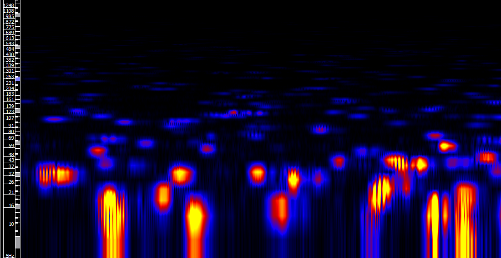
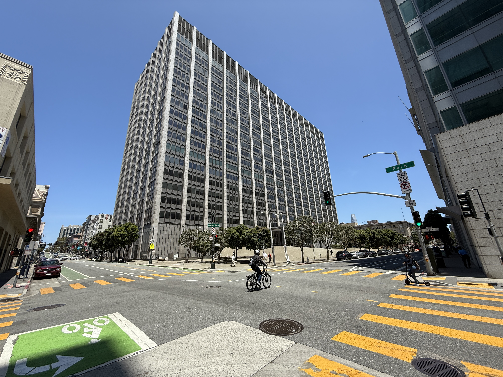

# 수노 저작권 소송이 학습 곡 6만여 개의 출처를 캐묻는다

_오디오 지문 대조로 수노 학습 데이터 속 저작권 곡이 드러나면서, 판단의 무게는 시장 잠식 여부로 옮겨가고 있다_

## Executive Summary

> [!callout]
> 소니·유니버설이 AI 음악 생성 서비스 수노(Suno)를 상대로 낸 저작권 소송은, 처음 특정한 곡이 560개였습니다. 그런데 원고 측 전문가가 오디오 지문 대조로 수노의 학습 데이터를 뜯어본 뒤, 소장에 추가하겠다고 신청한 저작물은 6만여 개로 불어났습니다. 이 글은 학습에 쓴 곡을 한 곡씩 추궁하기 시작한 이 소송을, 데이터 계보(lineage)의 문제로 읽습니다.

> 곡 수가 다투어지는 사이, 법원의 심사 무게중심은 조용히 옮겨갔습니다. 2025년 Bartz v. Anthropic 이후 미국 법원은 "무엇으로 배웠는가"보다 "만들어낸 결과가 원작의 시장을 잠식하는가"를 공정이용 제4요소로 더 무겁게 보기 시작했습니다. 적법하게 확보한 데이터로 배우는 일은 대체로 관대하게, 원작과 직접 경쟁하는 생성물은 엄격하게 보는 방향입니다. 다만 이 기준은 아직 판사마다 강조점이 다른, 확정되지 않은 법리입니다.

> 데이터를 다루는 쪽에서 이 소송이 남기는 신호는 분명합니다. 수노가 곡 단위 출처를 스스로 기록해 두지 않았기 때문에, 제3자가 법정 절차로 그 출처를 사후에 강제 복원해야 했습니다. 저작물 하나하나의 출처가 소송 증거가 되는 순간, 데이터 계보는 윤리 구호가 아니라 법적 인프라가 됩니다.

### 주요 수치

출처: [Axis Intelligence AI Copyright Lawsuits Tracker](https://axis-intelligence.com/ai-copyright-lawsuits-tracker/)

세 숫자가 이 소송의 무게와 방향을 압축합니다. 하나는 곡 단위 대조가 소장을 얼마나 키웠는지, 하나는 그 곡 수가 왜 그렇게 격렬하게 다투어지는지, 그리고 하나는 소송의 반대편에서 이미 시작된 정산의 단가입니다.

<!-- stat-card -->
**560 → 61,026곡** — 소장에 특정된 저작물 — 오디오 지문 대조 뒤 원고 측이 소장에 추가 신청한 저작물, 이마저 실제 매치의 일부라고 밝혔다

<!-- stat-card -->
**$150,000** — 저작물당 법정손해배상 상한 — 고의 침해 시 미국 저작권법상 상한, 6만 곡이면 배상액이 이론상 조 단위로 뛴다

<!-- stat-card -->
**$0.002~0.005** — 우디오 생성 1건당 로열티 — 유니버설과 우디오의 라이선싱 정산 단가, 정산이 성립하려면 곡 단위 추적이 전제된다

## 560곡이 6만 곡으로 불어난 과정

미국음반산업협회(RIAA)가 주도해 2024년 6월 낸 최초 소장은 수노가 무단 학습했다는 저작물을 약 560곡 특정하는 수준이었습니다. 소송의 실제 무게는 그 뒤에 붙었습니다. 2025년 11월부터 약 2주간, 유니버설과 소니가 선임한 전문가가 수노 측 로펌 사무실의 보안실에 물리적으로 들어가, 수노의 학습 데이터 전체를 오디오 지문 시스템으로 대조했습니다.

오디오 지문은 곡의 음높이 분포, 화성, 리듬 패턴을 수치로 바꿔 두 녹음이 같은 곡인지 판별하는 기술입니다. 이 대조 작업은 2026년 초까지 이어졌고, 그 결과 원고 측은 2026년 5월 저작물 61,026개를 소장에 추가하겠다고 법원에 신청했습니다. 원고 스스로 이 숫자조차 실제 매치의 일부에 불과하다고 밝혔습니다. 소니는 같은 시기 수노의 경쟁 서비스 우디오(Udio)를 상대로도 별도의 저작물 추가 신청을 냈습니다.

*▲ 오디오 지문 대조는 곡의 음높이·화성·리듬 패턴을 스펙트로그램으로 수치화해 비교한다 | Source: [Wikimedia Commons](https://commons.wikimedia.org/wiki/File:Audio_spectrogram_sonic_visualiser.png)*

이 대조가 순순히 진행된 것도 아닙니다. 수노는 1차 지문 대조에는 동의했다가 심화 분석 방식에 이견을 보이며 동의를 철회했고, 치안판사가 개입해 재협상이 성립한 뒤에야 작업이 재개됐습니다. 출처 기록이 없는 곳에서 그 출처를 사후에 복원하는 일은, 이렇게 법정 절차 하나하나를 거쳐야 하는 값비싼 과정이었습니다. 뒤에서 다시 보겠지만, 이 장면이 이 소송이 데이터 실무에 남기는 교훈의 핵심입니다.

곡 수가 이토록 격렬하게 다투어지는 이유는 배상액 구조에 있습니다. 미국 저작권법은 고의 침해에 대해 저작물당 최대 15만 달러의 법정손해배상을 규정합니다. 특정된 곡이 560개일 때와 6만 개일 때, 이론상 배상 상한은 자릿수가 통째로 달라집니다. 수노는 답변서에서 서비스를 만들려면 수천만 건의 녹음을 프로그램에 노출시켜야 했고 그중 원고 소유 저작물이 포함되었을 것으로 추정된다며, 사실상 학습 규모를 인정했습니다.

> [!callout]
> **사건 상태**: 2026년 7월 현재 다투어지는 것은 "저작물 추가 신청"이라는 절차 문제이지 본안 판결이 아닙니다. 사실심리 종료와 정식 약식판결 신청 기한은 2026년 하반기에서 2027년으로 예정돼 있어, 공정이용에 대한 최종 판단은 아직 이릅니다.

## 법원이 캐묻는 것은 무엇으로 배웠나가 아니다

수노 소송의 곡 대조가 왜 승패를 가르는 열쇠가 됐는지 이해하려면, 2025년 6월 캘리포니아 북부지법의 Bartz v. Anthropic 판결을 먼저 봐야 합니다. 작가들이 앤트로픽의 도서 학습을 상대로 낸 이 사건에서, 앨섭(Alsup) 판사는 공정이용 심사의 네 요소 가운데 특히 제4요소, 곧 시장 효과를 갈랐습니다.

*▲ Bartz v. Anthropic 판결이 나온 캘리포니아 북부지법 소재지, 샌프란시스코 필립 버튼 연방청사 | Source: [Wikimedia Commons](https://commons.wikimedia.org/wiki/File:Phillip_Burton_Federal_Building_%26_United_States_Courthouse.jpg)*

판단은 데이터를 어떻게 확보했느냐에 따라 나뉘었습니다. 적법하게 구매한 책을 학습에 쓰는 일은 제4요소가 공정이용에 유리하다고 봤습니다. 판사는 저자들의 불만이 "글쓰기를 잘 가르쳐서 경쟁작이 쏟아진다"는 불만과 다르지 않다고 비유하며, 학습이 경쟁 피해를 준다는 주장을 일축했습니다. 저자들이 내세운 학습용 라이선스 시장 침해 주장도, 저작권법이 저자에게 그 시장을 독점할 권리를 주지는 않는다며 기각했습니다. 반대로 해적판으로 확보한 사본은 제4요소가 불리하다고 봤습니다. 나중에 그 책을 정식으로 사더라도 이미 발생한 침해는 되돌릴 수 없다는 논리였습니다.

핵심은 심사의 무게중심이 옮겨갔다는 점입니다. "저작물을 학습에 썼는가"라는 질문 하나로 침해가 판가름 나던 구도에서, "그 학습이 원작의 시장을 어떻게 건드리는가"라는 질문이 승패를 가르는 자리로 올라섰습니다. RIAA와 소니가 수노에 겨누는 논리가 정확히 이 프레임을 씁니다. 수노는 원곡과 직접 경쟁하는 음악을 생성하므로 제4요소를 충족하지 못한다는 것입니다.

## 학습과 경쟁을 가르는 선은 아직 흔들린다

2026년 현재 논평들이 정리하는 흐름은 두 갈래로 요약됩니다. 의료 문헌을 학습해 진단을 보조하는 것처럼 원작을 대체하지 않는 변형적 학습은 공정이용에 우호적이고, 뉴스 기사를 대체하거나 원곡과 직접 경쟁하는 음악을 만들어내는 생성물은 침해 쪽으로 기웁니다. 분석용 학습과 경쟁 생성물을 가르는 선이, 소송의 실질적인 승부처인 셈입니다.

문제는 이 선이 아직 단단하지 않다는 데 있습니다. 같은 시기 카드리 대 메타(Kadrey v. Meta)에서 차브리아(Chhabria) 판사는, 원작과 경쟁하는 생성물이 시장을 희석하는지가 대개 제4요소를 결정지을 것이라고 언급하면서도 원고가 그 증거를 대지 못해 결국 메타 손을 들어줬습니다. 앨섭 판사는 라이선싱 시장 손해를 인정하지 않았고, 차브리아 판사는 인정할 여지를 열어 뒀습니다. 판사마다 강조점이 다른 이 균열이야말로, 수노 소송의 향후 판단이 지금 진행 중인 AI 저작권 소송들이 저마다 인용할 선례로 주목받는 이유입니다.

> [!callout]
> **핵심**: "학습이 위법이냐"는 질문은 점점 뒤로 물러나고, "생성물이 원작 시장을 잠식하느냐"는 질문이 앞으로 나옵니다. 그런데 그 잠식을 증명하려면, 어떤 저작물이 학습에 들어갔고 어떤 결과로 이어졌는지를 곡 단위로 짚을 수 있어야 합니다.

## 워너와 유니버설이 택한 라이선싱 정산

모든 레이블이 법정 다툼만 택한 것은 아닙니다. 워너뮤직은 2025년 11월 수노와 라이선싱 계약을 맺고 소송에서 이탈했습니다. 유니버설은 2025년 10월 우디오와 생성 1건당 0.002에서 0.005달러 수준의 로열티에 합의하고, 라이선스된 AI 음악 플랫폼을 함께 내놓기로 했습니다. 대형 레이블의 방향이 봉쇄에서 정산 인프라 구축으로 기울고 있는 것입니다.

*▲ 유니버설 뮤직 그룹 영국 본사(런던 킹스 크로스 팬크라스 스퀘어) | Source: [Wikimedia Commons](https://commons.wikimedia.org/wiki/File:Universal_Music_Group_UK_HQ,_King%27s_Cross_Central_development,_Pancras_Square,_London,_England_01.jpg)*

이 전환이 데이터 관점에서 중요한 이유가 있습니다. 생성 1건마다 특정 저작물의 권리자에게 로열티를 나누려면, 어떤 곡이 학습과 생성에 관여했는지를 곡 단위로 추적할 수 있어야 합니다. 계보 없이는 소송에서 침해를 다투기 어려울 뿐 아니라, 소송을 피해 정산으로 가더라도 그 정산 자체가 성립하지 않습니다. 봉쇄든 정산이든, 두 길 모두 곡 단위 출처 기록을 전제로 깔고 있습니다.

## 출처를 안 남기면 남이 강제로 복원한다

수노 소송에서 승패를 가를 핵심 증거는 결국 법원이 강제한 포렌식 오디오 지문 대조였습니다. 수노가 곡 단위 출처를 스스로 기록해 두지 않았기 때문에, 원고 측 전문가가 사무실에 들어가 학습 데이터를 하나씩 대조하며 그 출처를 사후에 재구성해야 했던 것입니다. 데이터 계보의 부재가 평판 리스크를 넘어 디스커버리 비용과 소송 리스크로 전환된 장면입니다.

페블러스 블로그는 비슷한 구조를 이미 다뤘습니다. 디 애틀랜틱이 2,120만 곡 규모의 학습 데이터를 사후 복원해 공개한 [사례](/blog/atlantic-ai-music-training-data/ko/)가 그것입니다. 다만 그때는 언론의 사후 폭로였고, 이번엔 소송 절차 자체가 그 복원을 강제했다는 점이 다릅니다. 같은 패턴은 음악에만 갇혀 있지 않습니다. 게티 대 스터빌리티 AI에서는 이미지에 남은 워터마크 잔상이 직접 복제의 증거가 됐고, 뉴욕타임스 대 오픈AI에서는 출력물이 원본과 경쟁하는지가 쟁점입니다. 어느 사건이든 다툼의 축은 학습이 위법이냐가 아니라, 출처를 증빙할 수 있느냐로 모입니다.

미국이 소송으로 밀어붙이는 이 요구를, 유럽은 규제로 밀어붙입니다. EU AI법은 고위험 AI의 학습 데이터 출처와 범위를 문서화하도록 요구하고, 일반목적 AI 모델 제공자에게 학습 데이터 요약을 공개하도록 합니다. 소송이든 규제든, 종착지는 같은 문장입니다. 무엇으로 배웠는지를 증빙 가능한 형태로 남겨 두라는 것입니다.

*▲ EU AI법을 주관하는 유럽집행위원회 브뤼셀 본부, 베를레몽 건물 | Source: [Wikimedia Commons](https://commons.wikimedia.org/wiki/File:Berlaymont_building_european_commission.jpg)*

## 지금 증빙 가능한 형태로 남기고 있는가

이 소송이 데이터 실무자에게 주는 질문은 하나로 좁혀집니다. 학습 코퍼스에 들어간 곡, 문서, 이미지의 출처를 지금 증빙 가능한 형태로 남기고 있는가. 학습 데이터를 조립하는 단계에서 각 항목의 출처와 라이선스, 권리 정보를 함께 기록하는 계보 추적 체계가 없다면, 나중에 어떤 데이터를 왜 어떻게 썼는지 증명할 수도 반박할 수도 없는 상태에 놓입니다. 그 상태의 모델은 저작권 소송의 승패를 떠나, 감사할 수 없는 자산이 됩니다.

계보 기록을 저작권 리스크 대응으로만 볼 필요는 없습니다. 어떤 데이터가 들어갔는지 되짚을 수 있어야 모델이 왜 그렇게 답하는지 설명하고, 문제가 된 데이터를 골라낼 수 있습니다. 출처 표식은 규제 대응 서류가 아니라 데이터 품질의 일부입니다. 스크래핑 데이터와 라이선스 데이터를 처음부터 분리해 보관하는 [실무 원칙](/blog/training-data-source-separation/ko/)이 왜 필요한지를, 수노 소송이 실전 사례로 보여 주고 있는 셈입니다.

> [!callout]
> **한 줄 요약**: 판단의 무게추가 학습 여부에서 시장 잠식 여부로 옮겨가는 사이, 곡 하나하나의 출처는 윤리 구호에서 법적 증거로 바뀌었습니다. 소송의 결과가 어느 쪽으로 흐르든, 학습에 쓴 데이터의 출처를 지금부터 기록해 두는 파이프라인은 손해 볼 일이 없습니다.

## 참고문헌

### 법률 해설

- 1.Norton Rose Fulbright. (2026). "[AI in litigation series: an update on AI copyright cases in 2026](https://www.nortonrosefulbright.com/en/knowledge/publications/ce8eaa5f/ai-in-litigation-series-an-update-on-ai-copyright-cases-in-2026)."
- 2.Copyright Alliance. (2025). "[Bartz v. Anthropic and the Fourth Fair Use Factor](https://copyrightalliance.org/bartz-v-anthropic-fair-use/)."

### 업계·보도

- 3.Axis Intelligence. (2026). "[AI Copyright Lawsuits Tracker](https://axis-intelligence.com/ai-copyright-lawsuits-tracker/)."
- 4.AI Vortex. (2026). "[AI Copyright & Training Data: The 2026 Landscape](https://www.aivortex.io/legal/guides/ai-copyright-training-data-2026-landscape/)."
- 5.Music Business Worldwide. (2026). "[Sony, Universal expand copyright claims against Suno](https://www.musicbusinessworldwide.com/)."
