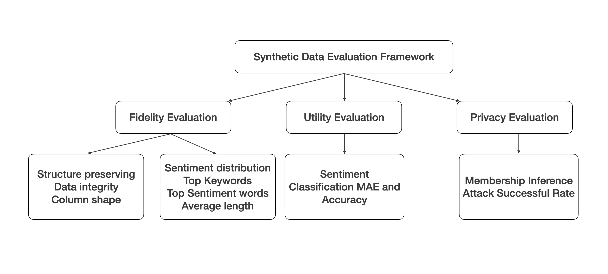
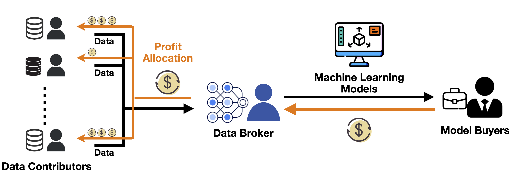
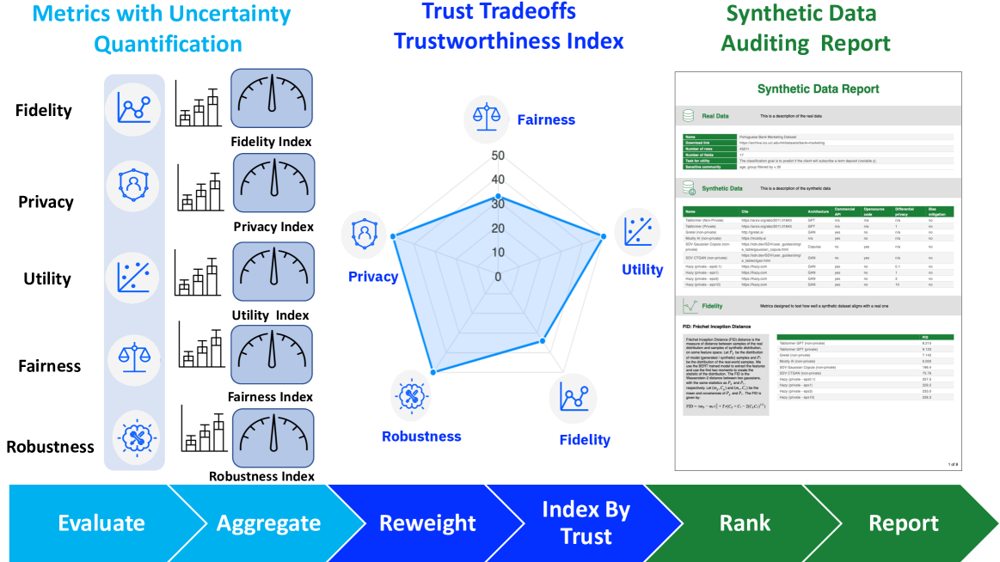
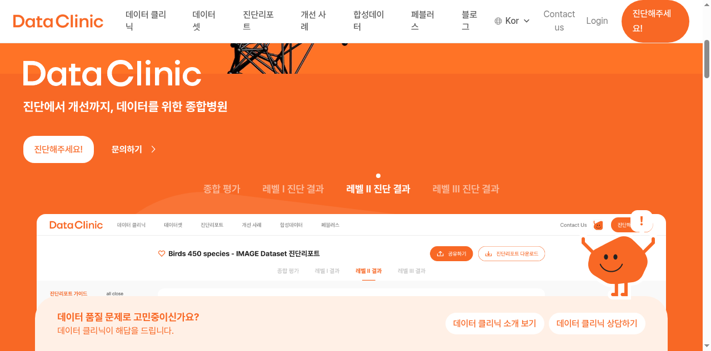

# 합성 데이터에 가격표를 붙이는 법

_페블러스 등록특허 10-2969403호 — 품질 평가에서 기여도 보상까지의 자동 파이프라인_

## Executive Summary

합성데이터 시리즈 · [전체 보기 →](/project/SyntheticData/ko/)

> [!callout]
> 기업의 67%가 합성 데이터를 사용하고 있지만, 그 데이터의 품질을 객관적으로 증명하는 표준은 아직 없습니다. 누가 좋은 데이터를 만들었는지 구분할 수 없으니 보상도 공정하지 않고, 결국 좋은 데이터 생산자가 시장을 떠나는 악순환이 반복됩니다. 만드는 기술은 매년 진화하는데, 평가하는 기술은 원시적인 상태에 머물러 있습니다.

> 페블러스 등록특허 제10-2969403호는 이 구조적 결함에 대한 기술적 해법을 제시합니다. Fidelity(충실도), Utility(유용성), Privacy(프라이버시)라는 세 축의 품질 점수를 자동으로 산출하고, 그 점수를 기반으로 데이터 생산자의 기여도를 정량화하여 보상을 배분합니다. 평가에서 보상까지, 사람의 판단 없이 돌아가는 자동 파이프라인입니다.

> 이 글은 합성 데이터 품질 평가의 업계 현황을 살펴보고, 기여도 산정의 이론적 배경(Shapley value)과 한계, 그리고 이 특허가 어떻게 실장 가능한 시스템으로 전환하는지를 순서대로 풀어갑니다. 페어 특허(10-2969395호, 스마트계약 기반 거래)와의 결합, 그리고 DataClinic에서 Data Greenhouse까지 이어지는 기술 스택도 함께 살펴봅니다.

<!-- stat-card -->
**67%** — 기업 활용률 — 합성 데이터 사용 중

<!-- stat-card -->
**3축** — 품질 평가 — Fidelity·Utility·Privacy

<!-- stat-card -->
**170x** — 시장 격차 — 브로커 $319B vs 마켓 $1.8B

<!-- stat-card -->
**$320M+** — Gretel 인수 — NVIDIA, 2025.03

<!-- stat-card -->
**2026.08** — EU AI Act — 품질 증명 법적 의무화

## 합성 데이터의 역설 — 양은 넘치는데 신뢰할 수 없다

합성 데이터 시장은 연평균 30%가 넘는 속도로 성장하고 있습니다. 2024년 약 5억 달러 규모였던 시장은 2030년이면 26억 달러를 넘길 것으로 전망됩니다. 기업의 67%가 이미 합성 데이터를 사용하고 있고, 2025년까지 80%에 도달할 것이라는 예측도 있습니다.

그런데 이 성장세 뒤에는 불편한 진실이 있습니다. Gartner는 "2027년까지 데이터/분석 리더의 60%가 합성 데이터 관리에서 치명적 실패에 직면할 것"이라고 경고했습니다. 누구나 합성 데이터를 만들 수 있게 되었지만, 그 데이터가 정말 쓸 만한지 확인할 방법은 없습니다.

NVIDIA가 2025년 3월 합성 데이터 스타트업 Gretel을 3억 2천만 달러 이상에 인수한 것은 이 시장의 전략적 가치를 보여주는 신호입니다. 하지만 동시에 하나의 문제를 드러냅니다. Gretel은 품질을 측정하는 SQS(Synthetic Quality Score)를 제공하지만, 이것은 단일 생산자의 자체 평가에 불과합니다. 복수의 데이터 생산자가 참여하는 마켓플레이스에서 "누구의 데이터가 더 좋은가"를 공정하게 판별하는 메커니즘은 아닙니다.

Lancet Digital Health는 2025년 논문에서 "합성 데이터로 훈련된 모델에 대한 근거 없는 과신(unwarranted confidence)"을 정면으로 경고했습니다. 합성 데이터의 핵심 병목은 생성 기술이 아니라 품질 증명입니다. 만드는 것은 쉬워졌지만, 증명하는 것은 여전히 어렵습니다.

## 합성 데이터 품질을 측정하는 세 가지 축

합성 데이터의 품질을 평가할 때, 업계에서 가장 널리 쓰이는 프레임워크는 세 가지 축으로 구성됩니다. Fidelity(충실도), Utility(유용성), Privacy(프라이버시). 이 세 축은 서로 독립적이면서도 상충 관계에 있어서, 하나를 극대화하면 다른 하나가 약화되는 트레이드오프가 발생합니다.

*합성 데이터 다면 평가 프레임워크(SynEval). Fidelity, Utility, Privacy 세 축을 통합적으로 평가하는 워크플로. 출처: Wang et al. (2024), arXiv:2404.14445*

### 2.1. Fidelity — 원본과 얼마나 닮았는가

Fidelity는 합성 데이터가 원본 데이터의 통계적 특성을 얼마나 충실히 재현했는지를 측정합니다. 단일 컬럼의 분포를 비교하는 KS Test(Kolmogorov-Smirnov Test), 두 분포 간 차이를 정량화하는 KL Divergence, 그리고 분포 간 최소 이동 비용을 측정하는 Wasserstein Distance 등이 대표적인 지표입니다. 원본의 상관관계 구조가 합성 데이터에서도 유지되는지, 다변량 분포가 보존되는지를 확인합니다.

### 2.2. Utility — 실제로 쓸 만한가

통계적으로 원본과 닮았더라도, 실제 작업에서 쓸모가 없다면 의미가 없습니다. Utility는 다운스트림 태스크(ML 모델 학습, 분석 등)에서 합성 데이터가 얼마나 효과적인지를 측정합니다. 가장 널리 쓰이는 접근법은 TSTR(Train on Synthetic, Test on Real)입니다. 합성 데이터로 모델을 학습하고 실제 데이터로 테스트하여, 실제 데이터만으로 학습한 모델과 성능을 비교합니다.

### 2.3. Privacy — 원본이 새어 나가지 않는가

합성 데이터의 존재 이유 중 하나가 프라이버시 보호입니다. 하지만 합성 데이터가 원본의 개별 레코드를 사실상 복제하고 있다면, 프라이버시 보호라는 약속은 공허해집니다. 멤버십 추론 공격(membership inference attack), 속성 추론 공격(attribute inference attack) 같은 시나리오를 통해 원본 데이터의 노출 위험을 정량적으로 평가합니다. k-anonymity, l-diversity 같은 지표가 사용됩니다.

> [!callout]
> 세 축의 핵심 난제는 트레이드오프입니다. 차등 프라이버시(Differential Privacy)를 강화하면 fidelity와 utility가 하락합니다. 노이즈를 더 많이 주입할수록 원본과 멀어지고, 모델 학습 성능도 떨어집니다. "이 데이터는 충분히 닮았고, 충분히 유용하며, 충분히 안전하다"를 동시에 증명하는 것이 합성 데이터 품질 평가의 본질적 과제입니다.

최근에는 이 세 축을 통합적으로 다루려는 시도가 활발합니다. SynQP(2026)는 품질과 프라이버시 리스크를 하나의 프레임워크 안에서 동시에 평가합니다. Synthetic Data Blueprint(SDB)는 통계적, 구조적, 그래프 기반 평가를 모듈화했습니다. NIST는 verisimilitude(사실성), consistency(일관성), traceability(추적성)라는 세 차원을 정의했습니다. 방향은 같지만, 실장 가능한 자동화 시스템으로의 전환은 아직 진행 중입니다.

## 누가 좋은 데이터를 만들었나 — 기여도 산정의 게임 이론

품질을 측정할 수 있다고 해서 문제가 해결되는 것은 아닙니다. 합성 데이터 마켓플레이스에서는 복수의 데이터 생산자가 참여합니다. 여러 생산자가 제공한 데이터가 하나의 모델 학습에 함께 사용될 때, 각자의 기여분을 어떻게 분리해서 공정하게 보상할 것인가가 다음 질문입니다.

### 3.1. Shapley value — 협력 게임의 해법

이 문제에 대한 이론적 출발점은 Shapley value입니다. 1953년 Lloyd Shapley가 제안한 이 개념은 협력 게임에서 각 참여자의 "평균 한계 기여도"를 계산합니다. 모든 가능한 참여자 조합(coalition)을 열거하고, 각 조합에서 특정 참여자가 추가되었을 때의 성능 변화를 평균하여 기여도를 산출합니다.

Data Shapley는 이 개념을 ML 모델 학습에 적용한 것입니다. 모델 성능에 대한 개별 데이터 포인트의 기여도를 계산합니다. 최근에는 DU-Shapley(NeurIPS 2024)가 효율적인 데이터셋 가치 평가를 위한 프록시 방법을 제안했고, Asymmetric Data Shapley(2025)는 원본 데이터와 합성 데이터 사이의 비대칭 기여도를 분리하는 방법을 제시했습니다.

*데이터 마켓 MaaS 워크플로. 복수의 데이터 기여자가 브로커를 통해 ML 모델에 데이터를 공급하고, Shapley value로 기여도를 산정하여 보상을 배분한다. 출처: Zheng et al. (2025), arXiv:2511.12863*

$$\phi_i(v) = \sum_{S \subseteq N \setminus \{i\}} \frac{|S|!(|N|-|S|-1)!}{|N|!} \left[ v(S \cup \{i\}) - v(S) \right]$$

Shapley value 공식. $\phi_i$는 참여자 $i$의 기여도, $v(S)$는 연합 $S$의 가치 함수, $N$은 전체 참여자 집합.

### 3.2. 이론의 한계 — 왜 실장이 어려운가

Shapley value는 이론적으로 공정하지만, 실제 시스템에 적용하기에는 네 가지 근본적인 한계가 있습니다.

- •계산 복잡도. 모든 가능한 연합을 열거해야 하므로 참여자 수에 대해 지수적 비용이 발생합니다. 참여자가 20명이면 조합 수는 100만 개를 넘습니다.
- •Non-IID 문제. 연합 학습 환경에서 참여자 데이터가 비동질적(Non-IID)일 때 기여도가 과소평가될 수 있습니다.
- •실시간 평가 불가. 배치 단위 사후 평가에 적합한 구조이므로, 실시간 거래에서 즉시 기여도를 산출하기 어렵습니다.
- •합성 데이터 특화 부재. 대부분의 연구가 원본 데이터의 기여도 산정에 초점을 맞추고 있으며, 합성 데이터 생산자의 기여도를 평가하는 체계는 아직 미탐구 영역입니다.

이론은 정교하지만 실장 가능한 시스템이 없다는 것이 현재 상태입니다. 여기가 특허 10-2969403호의 진입점입니다.

## 특허 제10-2969403호 — 평가에서 보상까지의 자동 파이프라인

페블러스 등록특허 제10-2969403호의 정식 명칭은 "합성 데이터의 품질을 평가하여 기여도를 산정하기 위한 방법"입니다. 이 특허는 합성 데이터 품질의 3축 평가를 자동으로 수행하고, 그 결과를 기여도 스코어로 변환하여 데이터 생산자에게 보상을 배분하는 end-to-end 파이프라인을 정의합니다.

### 4.1. 3축 품질 스코어의 자동 산출

이 특허의 첫 번째 핵심은 Fidelity, Utility, Privacy 세 축의 품질 점수를 단일 시스템 안에서 자동으로 산출하는 것입니다. 각 축의 메트릭을 독립적으로 계산한 뒤, 가중 조합을 통해 통합 품질 스코어를 생성합니다. 여기서 중요한 것은 가중치가 고정이 아니라 거래 목적에 따라 동적으로 조정된다는 점입니다. 의료 데이터 거래에서는 Privacy 가중치가 높아지고, 자율주행 시뮬레이션 데이터에서는 Fidelity 가중치가 높아집니다.

### 4.2. 기여도 스코어와 보상 배분

두 번째 핵심은 품질 스코어를 기여도 스코어(contribution score)로 변환하는 메커니즘입니다. 복수의 데이터 생산자가 참여하는 환경에서, 각 생산자가 전체 데이터셋의 품질에 기여한 정도를 정량화합니다. Shapley value의 지수적 계산 비용 없이, 품질 점수에서 기여도를 직접 도출하는 경로를 설계한 것이 구조적 차별점입니다.

기여도 스코어는 토큰이나 포인트 형태의 보상으로 전환됩니다. 좋은 데이터를 만든 생산자가 더 많은 보상을 받고, 품질이 낮은 데이터를 제공한 생산자는 보상이 줄어듭니다. 이 구조는 DSIC(Dominant Strategy Incentive Compatible) 원칙에 부합합니다. 최고 품질의 데이터를 공개하는 것이 모든 참여자에게 지배 전략이 되도록 설계된 인센티브 구조입니다.

### 4.3. 시스템 레벨 청구항의 의미

이 특허는 소프트웨어 알고리즘만을 보호하는 방법 특허가 아닙니다. 전자 장치와 시스템 레벨의 청구항을 포함하여, 알고리즘이 구동되는 하드웨어 환경과 전체 시스템 아키텍처를 함께 보호합니다. 이것은 유사한 알고리즘을 다른 시스템에서 구현하는 것까지 특허의 보호 범위에 포함시킨다는 의미입니다.

> [!callout]
> 기존 접근법이 "평가"에서 멈추는 반면, 이 특허는 "평가 → 기여도 → 보상"의 전체 루프를 자동화합니다. 평가 결과가 곧 보상의 근거가 되고, 보상 구조가 더 좋은 데이터의 생산을 유도합니다. 선순환을 설계한 것입니다.

## 페어 특허와의 시너지 — 스마트계약 기반 신뢰 인프라

특허 10-2969403호(품질 평가·기여도 산정)는 단독으로도 의미가 있지만, 같은 날 등록된 페어 특허 10-2969395호(스마트계약·가상환경 기반 거래)와 결합될 때 완전한 그림이 됩니다. 두 특허는 합성 데이터 신뢰 인프라의 양 날개입니다.

403호가 "이 데이터가 얼마나 좋은가, 누가 기여했는가"를 증명한다면, [395호](/blog/synthetic-data-smart-contract/ko/)는 "그 증명을 근거로 거래를 자동 실행한다"를 담당합니다. 품질 증명이 곧 거래 조건이 되는 구조입니다.

| 비교 축 | 10-2969403호 (이 특허) | 10-2969395호 (페어) |
| --- | --- | --- |
| 핵심 기능 | 품질 평가 + 기여도 산정 | 스마트계약 + 가상환경 거래 |
| 입력 | 합성 데이터셋 | 품질 증명서 + 거래 조건 |
| 출력 | 품질 스코어 + 기여도 보상 | 자동 거래 실행 + 블록체인 기록 |
| 기술 기반 | 3축 품질 메트릭 + 기여도 알고리즘 | 가상 시뮬레이션 + 스마트계약 |
| 파이프라인 위치 | 평가 단계 (거래 전) | 실행 단계 (거래 시) |

Ocean Protocol 같은 기존 블록체인 데이터 거래 플랫폼은 범용 데이터를 다루며, 합성 데이터 고유의 품질 문제를 다루지 않습니다. 글로벌 데이터 브로커 시장($319B)과 순수 데이터 마켓플레이스($1.8B) 사이에는 170배의 격차가 존재합니다. 이 격차의 핵심 원인은 정보 비대칭입니다. 구매자가 데이터의 품질을 사전에 검증할 수 없기 때문입니다.

*스마트계약 기반 합성 데이터 마켓플레이스 구조. 품질 증명(403호)과 자동 거래 실행(395호)이 결합된 신뢰 인프라.*

두 특허의 결합은 이 정보 비대칭을 구조적으로 해소합니다. 403호가 품질을 증명하고, 395호가 그 증명을 거래 조건으로 자동 실행합니다. 품질 측정과 거래 메커니즘이 분리되어 있으면 레몬 마켓이고, 통합되어 있으면 신뢰 인프라입니다. 페어 특허에 대한 상세한 분석은 [합성 데이터는 쏟아지는데, 거래소는 왜 없을까](/blog/synthetic-data-smart-contract/ko/)에서 다루고 있습니다.

## 규제가 만드는 시장 — EU AI Act와 ISO 5259

합성 데이터의 품질 증명이 "하면 좋은 일"에서 "하지 않으면 안 되는 일"로 전환되고 있습니다. 이 전환을 이끄는 두 가지 축은 EU AI Act와 ISO/IEC 5259 시리즈입니다.

### 6.1. EU AI Act — 2026년 8월의 데드라인

EU AI Act는 2026년 8월 2일 전면 시행됩니다. 고위험 AI 시스템에 대해 학습 데이터의 "관련성, 대표성, 정확성, 완전성"을 증명할 법적 의무를 부과합니다. Article 10은 학습, 검증, 테스트 데이터셋에 대한 품질 요구사항을 명시합니다. 합성 데이터를 바이어스 감지와 교정 도구로 인정하되, "적절한 통계적 속성"을 갖출 것을 요구합니다.

Article 50(2)는 AI가 생성한 합성 콘텐츠에 대해 기계 판독 가능한 마킹(워터마크, 메타데이터)을 의무화합니다. 미준수 시 매출의 3%에 해당하는 과징금이 부과됩니다. 합성 데이터의 출처를 추적하고 거래 이력을 관리하는 것이 법적 요구사항이 되면서, 블록체인 기반 증적 관리 기술의 필요성이 급증하고 있습니다.

### 6.2. ISO/IEC 5259 — 측정의 국제 표준

ISO/IEC 5259 시리즈(2024~2025 발행)는 AI 데이터 품질에 관한 국제 표준입니다. 5개 파트로 구성되어 있으며, 특히 Part 2(데이터 품질 측정 모델)와 Part 4(데이터 품질 프로세스 프레임워크)는 2025년 2월 유럽 표준(EN)으로 채택되었습니다.

| 파트 | 발행 | 핵심 내용 |
| --- | --- | --- |
| 5259-1 | 2024 | 개요 및 용어 정의 |
| 5259-2 | 2024.11 | 데이터 품질 측정 모델 — 측정 가능한 특성 집합 |
| 5259-3 | 2024/2025 | 요구사항 및 가이드라인 |
| 5259-4 | 2024.07 | 데이터 품질 프로세스 프레임워크 (EN 채택) |
| 5259-5 | 2025 | 데이터 품질 거버넌스 프레임워크 |

*합성 데이터 신뢰성 감사 프레임워크. Fidelity, Privacy, Utility, Fairness, Robustness 5개 차원의 신뢰 지표를 통합 평가하여 규제 대응 증적을 생성한다. 출처: Seedat et al. (2024), arXiv:2304.10819*

이 특허의 3축 품질 평가 알고리즘은 ISO/IEC 5259-2의 측정 모델을 실행하는 엔진 역할을 할 수 있습니다. 표준이 "무엇을 측정해야 하는가"를 정의한다면, 이 특허는 "어떻게 자동으로 측정하고 기여도까지 연결하는가"를 구현합니다. 규제는 비용이 아니라 시장 진입 장벽입니다. 증명 기술을 가진 쪽이 시장을 선점합니다.

## DataClinic에서 Data Greenhouse까지

이 특허는 페블러스의 기술 스택 안에서 고립된 발명이 아닙니다. DataClinic(진단) → PebbloSim(생성) → 품질 증명(이 특허) → 거래 실행(페어 특허)으로 이어지는 파이프라인의 핵심 노드 역할을 합니다.

### 7.1. Data Flywheel — 돌수록 빨라지는 바퀴

DataClinic이 데이터셋을 진단하면, 그 결과가 PebbloSim의 생성 품질을 높입니다. 생성된 합성 데이터는 다시 이 특허의 품질 평가를 거칩니다. 평가 결과는 진단 정확도를 개선하는 피드백으로 돌아옵니다. 이 루프가 반복될수록 진단은 더 정밀해지고, 생성은 더 정확해지며, 평가는 더 신뢰할 수 있게 됩니다. 경쟁자가 이 루프를 따라잡으려면 같은 순환을 처음부터 구축해야 합니다.

*DataClinic 진단 리포트 화면. 기하학적 매니폴드 기반으로 데이터 품질을 진단하고, 클래스별 분포와 밀도를 시각화한다. 출처: dataclinic.ai*

### 7.2. DataGreenhouse의 Governance Layer

페블러스는 이 전체 파이프라인을 'Data Greenhouse'라고 부릅니다. 5계층 아키텍처에서 이 특허는 Governance Layer에 위치합니다. Observation Layer(DataClinic 진단)에서 올라온 데이터가 Action Layer(PebbloSim 생성)를 거쳐, Governance Layer에서 품질 평가와 기여도 산정을 받습니다. ISO/IEC 5259와 ISO 42001이 요구하는 감사 로그와 증적을 이 레이어에서 자동으로 생성합니다.

<!-- stat-card -->
**DataClinic** — 데이터 건강 진단 — 기하학적 매니폴드 기반으로 데이터 품질을 진단합니다. 1시간 내 10만 이미지 분석, 클래스별 분포와 밀도를 시각적 데이터 맵으로 표현합니다.

<!-- stat-card -->
**PebbloSim** — 합성 데이터 생성 — 물리법칙을 복제하여 Physical Hallucination 없는 합성 데이터를 생성합니다. 5% 합성 데이터로 모델 성능 2% 향상 달성.

<!-- stat-card -->
**품질 증명 (이 특허)** — Governance Layer — 3축 자동 품질 평가 + 기여도 산정 + 보상 배분. ISO 5259 감사 증적을 자동 생성하여 규제 대응을 내장합니다.

Editor's Note

DataClinic은 현재 [dataclinic.ai](https://dataclinic.ai)에서 무료로 사용할 수 있습니다. 이미지 데이터셋의 품질을 기하학적 매니폴드 위에서 진단하고, 클래스별 분포, 밀도, 아웃라이어를 시각적으로 확인할 수 있습니다. 이 글에서 다룬 합성 데이터 품질 평가 파이프라인의 첫 번째 단계인 '진단'을 직접 체험해 보시기 바랍니다.

> [!callout]
> 특허 한 건의 가치는 제한적입니다. 하지만 "진단 → 생성 → 품질 증명 → 거래 실행"이 하나의 파이프라인으로 연결될 때, 각 단계가 다음 단계의 입력이 되는 수직 통합이 만들어집니다. 이 통합 자체가 해자(moat)입니다. 합성 데이터 시장에서 생산 기술은 범용화되겠지만, 품질 증명과 거래 인프라를 하나로 묶는 수직 통합은 쉽게 복제되지 않습니다.

**(주)페블러스 데이터 커뮤니케이션팀**  
2026년 6월 6일
