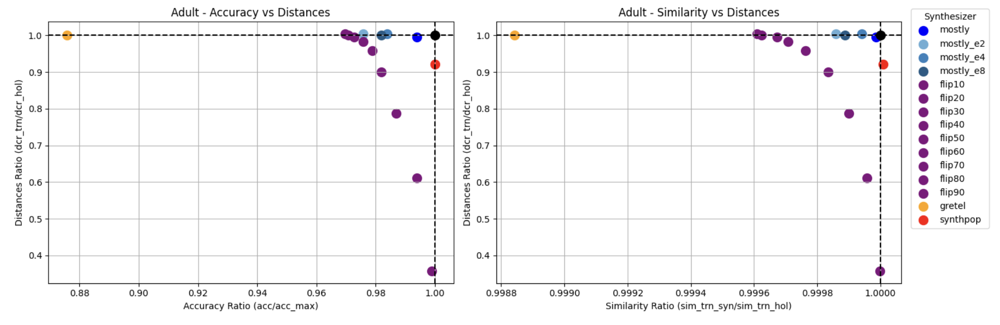
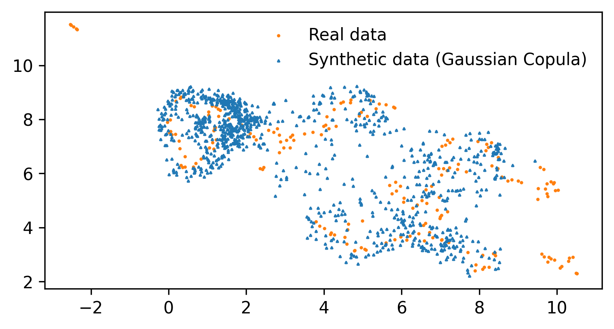
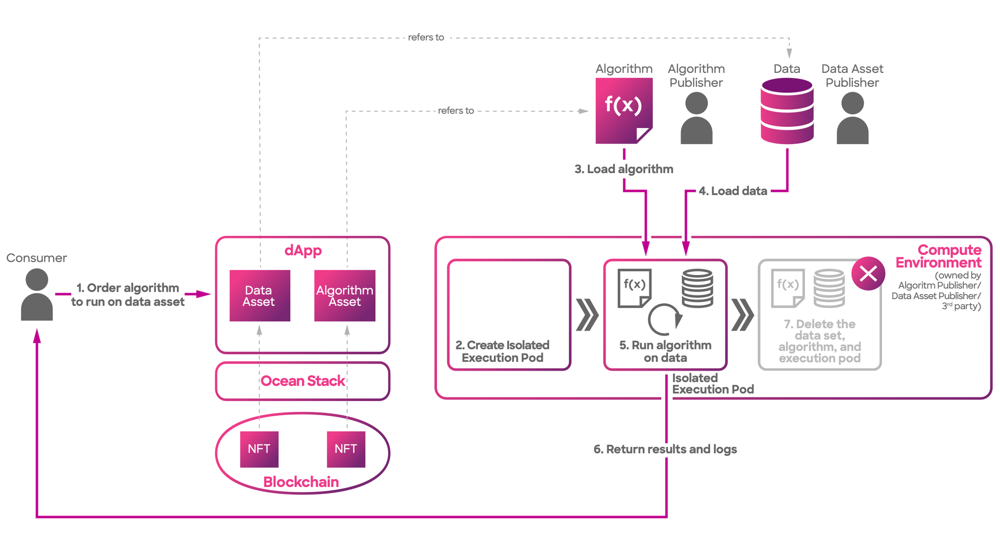
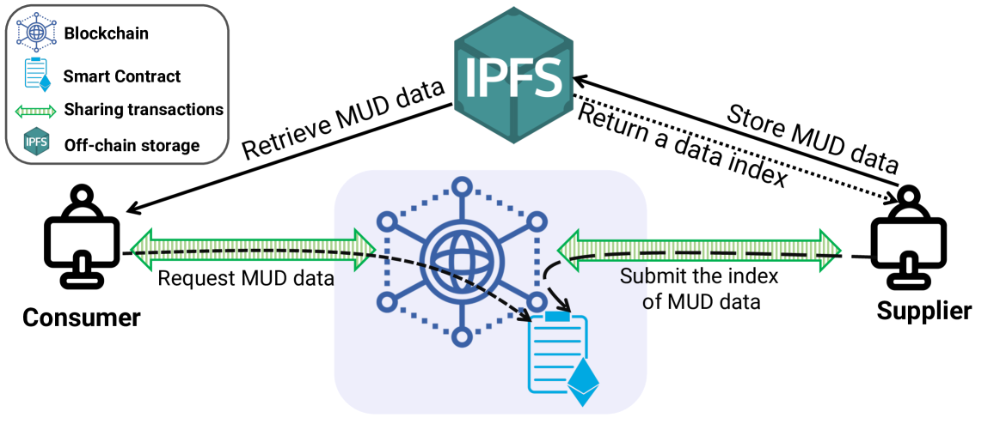
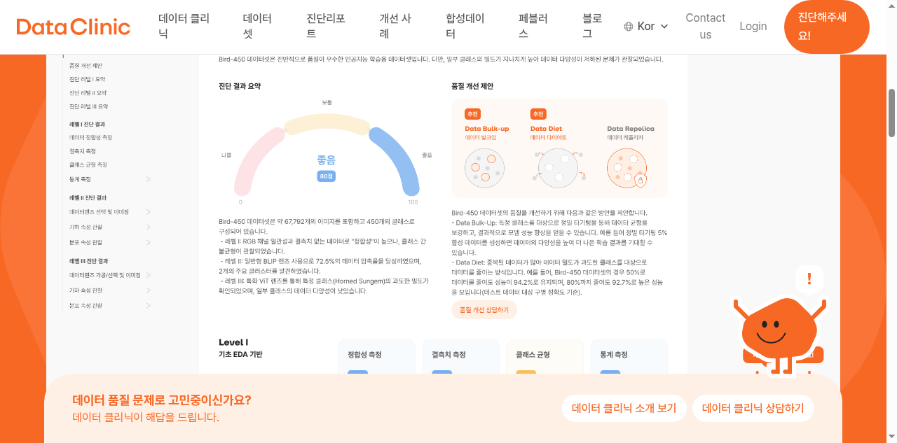

# Synthetic Data Is Booming — So Where

_The virtual-environment smart contract blueprint of Pebblous patent 10-2969395_

## Executive Summary

Synthetic Data Series · [View all →](/project/SyntheticData/en/)

> [!callout]
> The synthetic data market is growing at over 30% annually, yet there is virtually no infrastructure for buying and selling synthetic data. Buyers cannot verify quality beforehand, and sellers cannot control how their data is used after the sale. The technology to create synthetic data has exploded; the technology to trade it remains primitive.

> Pebblous registered patent No. 10-2969395 presents a concrete design for this problem. It proposes a virtual environment that simulates real-world operating conditions to pre-verify synthetic data quality, then connects those results to smart contracts that automatically execute trading terms. Quality proof becomes the trading condition itself.

> This article examines the structural bottlenecks of the synthetic data market, explores how smart contracts can address them, and dissects the specific blueprint laid out in the Pebblous patent. We follow the thread from DataClinic through PebbloSim to PebbloChain, tracing how these products interlock within a single pipeline.

<!-- stat-card -->
**$2.63B** — 2030 Market Forecast — Synthetic data market size

<!-- stat-card -->
**38.2%** — Annual Growth Rate — CAGR 2024-2030

<!-- stat-card -->
**75%** — Enterprise Adoption — Gartner 2026 forecast

<!-- stat-card -->
**Triple** — Claims Structure — Device + Method + System

<!-- stat-card -->
**$320M+** — NVIDIA-Gretel Deal — March 2025

## The Synthetic Data Boom — By the Numbers

The synthetic data market is outpacing the broader AI industry in growth. From roughly $497 million in 2024, the market is expanding at over 30% CAGR and is projected to surpass $2.63 billion by 2030. The driving force is clear: the domains where real data cannot or should not be used are steadily expanding.

Gartner predicts that by 2026, 75% of enterprises will use synthetic data for AI training. At the same time, they warn that "by 2027, 60% of data and analytics leaders will face critical failures in managing synthetic data." The market is hot, but the management framework is cold.

| Year | Market Size (USD) | Notes |
| --- | --- | --- |
| 2024 | ~$497M | Average across multiple research firms |
| 2025 | $510M – $683M | Variance across sources |
| 2026 | $586M – $791M | CAGR 30.8%–38.96% |
| 2030 | $2.63B | At 38.2% CAGR |

Big-tech movements sharpen the picture. NVIDIA acquired synthetic data startup Gretel for over $320 million in March 2025, and SAS acquired Hazy in November 2024. Synthetic data generation is no longer a lab experiment.

Sector-wise, financial services (BFSI) led with roughly 24% of 2024 revenue, while automotive and transportation is projected to grow fastest at 38.4% CAGR through 2030. Healthcare is also emerging as a critical market, driven by surging demand for privacy-preserving technologies.

*Accuracy vs. privacy tradeoff for leading synthesizers. Gretel (orange), MOSTLY AI (blue), and others show distinct quality profiles. (Source: arXiv:2504.01908)*

## The Lemon Market — Why Synthetic Data Doesn't Sell

The market is hot, but transactions are cold. While synthetic data generation technology advances every year, there is effectively no infrastructure for trading it. The classic "lemon market" structure — where information asymmetry drives out quality — is playing out in the synthetic data space.

### 2.1. No Way to Verify Quality

There is no standardized method for buyers to verify the quality of synthetic data before purchase. "Validation is the most underdeveloped component of synthetic data pipelines" is a diagnosis repeated across academia and industry alike. Lancet Digital Health warned in a 2025 paper about "unwarranted confidence in models trained on synthetic data."

### 2.2. No Way to Track Provenance

There is no system for systematically tracking what source data was referenced during generation, or whether privacy violations might exist. If you cannot prove data provenance, buyers are left shouldering the risk.

### 2.3. No Way to Enforce Usage Terms

Data licensing, scope restrictions, secondary processing permissions — these conditions are still managed through manual contracts. Buyers cannot verify quality before purchase; sellers cannot control misuse after the sale. Both sides operate in uncertainty.

> [!callout]
> Today's major synthetic data vendors — MOSTLY AI, Gretel/NVIDIA, Tonic.ai, Hazy/SAS — focus on data generation. The trading and distribution infrastructure that follows generation is an empty space that nobody has filled. The factory is running, but the marketplace has yet to open.

*Real data (orange circles) vs. synthetic data (blue triangles) in 2D space. The distributional mismatch illustrates how difficult it is to verify synthetic data quality before purchase. (Source: arXiv:2404.08866)*

## When Smart Contracts Meet Data

A smart contract is a "programmed agreement that executes automatically when specified conditions are met." While familiar in finance, applying smart contracts to data trading is still in its early stages. The global smart contract market is projected to grow from $2.72 billion in 2024 to over $1 trillion by 2035.

*Ocean Protocol's Compute-to-Data architecture: algorithms travel to the data, not the other way around. (Source: docs.oceanprotocol.com)*

Attempts to combine blockchain with data trading already exist. Ocean Protocol issues data as NFTs and data tokens, operating a Compute-to-Data model that enables private data trading without moving the data itself. In May 2024, it merged with SingularityNET and Fetch.ai to form the ASI Alliance. Streamr built a decentralized P2P network for real-time data streaming and exchange.

Academic research is also active. The VLDB 2024 workshop devoted a dedicated session to blockchain-based data provenance. The IBis framework (2024) proposed dynamic management of copyright compliance and data provenance in distributed AI training.

Yet all these efforts share a common missing piece. Existing blockchain data trading platforms handle general-purpose data and do not address synthetic data's unique challenges. Synthetic data is a peculiar kind of product where "how closely it resembles the original" and "how well it protects the original's privacy" must be satisfied simultaneously. General-purpose exchanges cannot meet this dual requirement.

*Decentralized data marketplace architecture using blockchain smart contracts. Consumer-supplier transaction flow via IPFS off-chain storage and on-chain smart contracts. (Source: arXiv:2401.00141)*

| Dimension | Ocean Protocol | Existing Vendors | Pebblous Patent |
| --- | --- | --- | --- |
| Data Type | General-purpose | Synthetic data | Synthetic-data-specific |
| Quality Verification | None | Internal metrics | Virtual environment simulation |
| Trading Infrastructure | Blockchain marketplace | None (API only) | Smart contract automation |
| Provenance Tracking | Partial (tokenization) | None | Full blockchain record |
| Physical Fidelity | N/A | N/A | Physics-based synthesis |

## Pebblous' Blueprint — Patent 10-2969395

Pebblous registered patent No. 10-2969395 is formally titled "Electronic device providing a virtual environment for smart contracts of synthetic data, method of operating the electronic device, and system including the electronic device." Filed in March 2023 and registered in May 2026, it features a triple claims structure covering device, method, and system — protecting every layer of the technology.

The patent's core idea can be distilled into three concepts: **virtual environment, quality proof, automated trading.**

This patent serves as the technical backbone connecting Pebblous' three products into a single pipeline.

<!-- stat-card -->
**DataClinic** — Data Health Diagnostics — Diagnoses data quality using geometric manifold analysis. Visualizes unstructured data distributions as a 'data map' for intuitive assessment of spread and density.

<!-- stat-card -->
**PebbloSim** — Synthetic Data Generation — Replicates physical laws to generate ultra-high-quality synthetic data free of Physical Hallucination. Creates data under conditions identical to the real world.

<!-- stat-card -->
**PebbloChain** — Data Trading & Governance — Records every step from data creation through refinement to distribution on a tamper-proof blockchain. This patent forms its direct technical foundation.

### 4.1. What Is the Virtual Environment?

The "virtual environment" in this patent is a simulation space that replicates real-world operating conditions. Think of it as a testbed that verifies how synthetic data would perform in actual deployment — before any transaction occurs. For an autonomous driving dataset, it runs quality checks in a virtual road environment; for medical data, in a virtual diagnostic environment.

### 4.2. Automating Trading Terms via Smart Contracts

Verification results from the virtual environment feed directly into smart contract execution conditions. For example: "If the data quality score exceeds the threshold, payment is automatically released; if it falls short, the transaction is voided." It is the verification result, not human judgment, that executes the contract.

### 4.3. Blockchain-Recorded Operational Evidence

How the data was created, what processing it underwent, how its value changed before and after trading — all of this is recorded on the blockchain. These records serve as evidence for post-transaction audits and regulatory compliance. The architecture embeds the operational evidence packages required by the EU AI Act and ISO 42001.

> [!callout]
> Pebblous calls the integration of these three products into a single autonomous operating system "Data Greenhouse." It is a seamless pipeline running from diagnostics (DataClinic) through generation (PebbloSim) to trading and governance (PebbloChain).

## Quality Comes First — The DataClinic Connection

Even if smart contracts automate trading flawlessly, it means nothing if the underlying data quality cannot be guaranteed. No matter how sophisticated the trading infrastructure, the entire system's trust collapses if the data flowing through it is defective.

DataClinic is a data quality diagnostics SaaS built on geometric manifold analysis. It transforms high-dimensional data into geometric space, then represents distributions and densities in a visual form called a "data map." Here is how those diagnostic results function at each stage of the synthetic data trading chain.

In the pre-trade phase, DataClinic diagnoses synthetic data and embeds the quality report into trading conditions. During the trade, smart contracts automatically verify whether quality thresholds are met — voiding the transaction if they are not. Post-trade, outcome metrics such as model performance changes are recorded on the blockchain to prove value after the fact.

*DataClinic diagnostic report: quality score (80/100) with actionable recommendations including Data Bulk-up and Data Diet interventions. (Source: dataclinic.ai)*

Editor's Note

DataClinic is currently available for free at [dataclinic.ai](https://dataclinic.ai). You can diagnose image dataset quality on geometric manifolds and visually inspect class-level distributions, densities, and outliers. Experience the first step of the synthetic data trading pipeline discussed in this article — quality diagnostics — for yourself.

The ISO/IEC 5259 series (published 2024) establishes international standards for AI data quality. ISO/IEC 5259-4 was adopted as a European standard in February 2025. DataClinic's diagnostic framework is structurally aligned with these international standards.

## Open Questions This Patent Raises

A patent is a technical blueprint, not an answer to every market problem. For this blueprint to function in reality, several unresolved questions remain.

The first question is when synthetic-data-specific trading standards will emerge. General data trading standards exist, but none yet address synthetic data's unique requirements — the simultaneous need for fidelity to the original and privacy protection. South Korea published its first synthetic data utilization guidelines in December 2024 and also established standard data contracts that year. But standards designed for automated trading are still in their earliest stages of discussion.

Second is the legal status of smart contracts. For smart contracts to be recognized as legally binding agreements in synthetic data trading, institutional deliberation is needed. What conditions must be met for code-executed outcomes to carry legal force? How would disputes be resolved? Consensus on these questions is still forming.

Third is the challenge of cross-border data trading. The EU AI Act faces full enforcement in August 2026 and requires machine-readable marking of synthetic content. Whether smart contracts can automatically handle the regulatory differences between the EU AI Act and South Korea's Data Industry Promotion Act remains an open question.

Fourth is the expansion potential into Physical AI. Demand for quality-verified synthetic data in autonomous driving, robotics, and digital twins is set to surge. How quickly these domains will require integrated quality-plus-trading infrastructure will determine this patent's practical value.

> [!callout]
> The synthetic data market exists in an asymmetric state where "creation technology" far outpaces "trading technology." The next infrastructure opportunity lies in closing that gap. Pebblous patent 10-2969395 offers one concrete blueprint for that opportunity.

**Pebblous Data Communication Team**  
June 6, 2026
