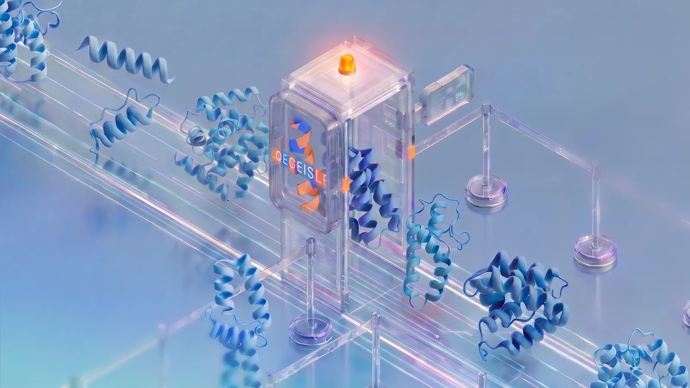

# SynthID Bio: Can the Watermark in an AI Protein Be Erased?

_Google DeepMind published it on September 30, and watermarked binders hit their targets on par with unmarked ones in the lab, but regenerating the design strips the mark_

## Executive Summary

> [!callout]
> This article reads SynthID Bio, which Google DeepMind published on September 30, 2026, alongside the Nature paper that appeared the same day, "Function-preserving watermarking of AI-generated proteins." It is a way of hiding a mark in proteins that an AI designed, and it goes into one of two places. One is the amino acid sequence. The other is the atomic coordinates of the three-dimensional structure the model predicts.

> The most striking result is that the proteins still did their job with the mark inside. The team designed binders against three targets: VEGF-A, the receptor binding domain of the SARS-CoV-2 spike protein, and PD-L1. They had the binders synthesized, and the watermarked designs came out level with the unwatermarked ones on hit rate, binding affinity, and sequence diversity. DeepMind calls these the first protein binders that work biologically while carrying a watermark. The same paper is equally plain about the weakness. Anyone who sets out to do it can regenerate the design and strip the mark from the sequence while the function stays intact.

> Sections 1 through 3 are facts recorded in DeepMind's announcement, in the Nature paper, and in the reporting that carried them. Section 4 is this article's reading of those facts through the eyes of someone who works with data.

### Key Numbers

Of the four numbers below, the detection accuracy and the loss in prediction quality say how well the mark worked. The count of binders synthesized and the count of targets say how far that result reaches.

Sources: [Google DeepMind's official announcement (2026-09-30)](https://deepmind.google/blog/introducing-synthid-bio/), [Nature paper s41586-026-10965-y](https://www.nature.com/articles/s41586-026-10965-y), [AI Times reporting (2026-10-02)](https://www.aitimes.com/news/articleView.html?idxno=215902).

<!-- stat-card -->
**1,300+** — Binders actually synthesized and tested — Not a comparison of design files. The proteins were made and put in front of their targets

<!-- stat-card -->
**Over 99%** — Accuracy of reading the sequence mark back — Held up through small sequence changes and noise, at a 0.1% false positive rate

<!-- stat-card -->
**Under 1%** — Loss in AlphaFold 3 structure prediction accuracy — Prediction quality barely moved even with the marking ability folded into the model weights

<!-- stat-card -->
**3** — Targets confirmed by experiment — VEGF-A, SARS-CoV-2 spike RBD, PD-L1. That is the range the authors call a proof of concept

## Where the mark goes

Google's SynthID began with images in 2023 and has widened into text and audio since. The shape has not changed: mix a signal into the output that no eye or ear catches, and let whoever holds the matching key check later whether that signal is there. SynthID Bio, out on September 30, carries the same idea over to proteins. Carrying it across opened two separate layers where the mark could sit.

*▲ The picture SynthID Bio is drawing: an AI-designed protein passing through a checkpoint that confirms its origin | Source: [Google DeepMind](https://deepmind.google/blog/introducing-synthid-bio/)*

### 1.1. Placed at the moment an amino acid is chosen

The first method puts the mark in the sequence. ProteinMPNN, a protein design model, picks by probability which amino acid to place at each position. SynthID Bio feeds in a secret key together with the amino acids already chosen, and tilts that choice very slightly. On its own, the resulting sequence is indistinguishable from one nature produced. Scored again with the same key, it gives the tilt away. DeepMind ran this method alongside AlphaProteo, its own binder design model.

One property of this method matters later on. The mark sits in the sequence itself, so a protein grown in cells from genes ordered against that sequence still carries it. Reading the amino acids off the physical product finds it intact.

### 1.2. A signature placed inside the model weights

The second method goes into the atomic coordinates of the structure the model predicts, and the approach is different. Rather than nudging the coordinates after they come out, part of AlphaFold 3's diffusion network was fine-tuned so that the ability to mark lives inside the model weights. Whoever runs that model, wherever they run it, the structures it produces carry the signature. DeepMind wrote that it designed the method so nothing changes for a researcher reading the structure.

Side by side, the two methods agree before they diverge. Neither touches a finished output afterward; both put the mark into the process that makes it. They differ in how far the mark travels. What gets read off a protein synthesized in a lab is the sequence mark, while the structure mark rides on the coordinates the model predicts.

▲ This article condensed the explanations in DeepMind's announcement and the Nature paper into one diagram.

## In the lab, marked binders performed on par with unmarked ones

Watermark stories always draw the same question. Does leaving a mark make the output worse? With proteins the question carries more weight. A signal mixed into an image has done its job if no one sees it, but a protein is only useful if it binds to its target. Changing a single amino acid can wreck the binding outright.

The team picked three targets. VEGF-A, which drives the growth of new blood vessels and has long been a target in cancer treatment. The part of the SARS-CoV-2 spike protein that latches onto a receptor on human cells. And PD-L1, which cancer cells use to escape attack by immune cells. All three have been handled in real drug research, so a standard for telling a usable design from an unusable one already exists.

The comparison went past design files. The binders were actually synthesized and measured in vitro for whether they stuck, and the protein lab Adaptyv Bio handled that verification. By AI Times' reporting, more than 1,300 binders were made and tested this way. Across hit rate, binding affinity and natural sequence diversity, the marked side tracked the unmarked side closely. One test condition reportedly yielded fewer working binders, so this is not to be read as zero loss under every condition.

The structure side scores a similar shape. By the reporting on the Nature paper, the loss in structure prediction accuracy came in under 1%, and the mark was read back with over 99% accuracy even when the sequence changed slightly or noise entered the data. The bar for calling it is a 0.1% false positive rate. That means the figures were measured with the rate of wrongly declaring an unmarked design marked held to one in a thousand, and in work like this, whether that bar is stated at all is what decides what a number means.

*▲ Binding affinity (Kd) distributions overlap with and without the mark, across all three targets | Source: [Google DeepMind](https://deepmind.google/blog/introducing-synthid-bio/)*

> [!callout]
> What deserves attention in this experiment is the order more than the numbers. The mark did not stop at a sequence file on a screen. It turned up in the physical protein made by synthesizing genes from that file and putting them into cells. That is the first time a provenance mark left a file and rode onto matter, and it is the point where DeepMind calls the result a world first.

## The mark can be erased

DeepMind does not call this technology a cure-all. The first item its announcement lists as future work is robustness against deliberate tampering. The paper is more specific. The authors showed it themselves: someone determined to do it can feed a finished design into another tool, regenerate the sequence, and watch the mark planted in that sequence disappear with the predicted function untouched.

So the place this technology stands is confirmation, not prevention. It is not a device that blocks a bad design. It is a device that lets a machine read which sequences came out of a model that can be trusted. A mark confirms provenance, but the absence of one does not mean a human made it. It may have been erased on the way, or it may have come from a different model that does not mark at all.

The tested range is narrow too. Right now that means one paper, one watermarking method, and binders against three targets. Because the experiments started from structures that had already bound successfully, whether other kinds of design score the same way is still unknown. Work with the Hie lab at Stanford and the Arc Institute to mark bacteriophage genomes using the genome model Evo 2 is also underway, but early experiments have borne out only that marked phages still function, and the details are deferred to a later paper.

Sarah Carter, who researches biosecurity, reads this watermark as letting developers take the lead on safety questions, because it ties the place that built the model to the designs that model puts out. She also described it as one important piece of the puzzle of tracing where biological designs came from. DeepMind releasing the code and the in vitro experimental data as open source, and putting even the model weights into the research community, is a move to add more pieces to that puzzle. If one company marks only the designs from its own models, the range in which provenance can be confirmed ends inside that company's output too.

The remedy DeepMind offers is not to lean on the mark alone. Record provenance information separately and attach it alongside the design, and set up a central repository for AI-made biological data. The picture is one more layer laid next to the filters that screen dangerous requests at the model stage. Jack Clark drew a similar line in Import AI, the newsletter that covered this news. Making the world resilient to AI-made biological threats is a vast and difficult problem, and marking has to travel together with other measures such as monitoring manufacturing equipment or classifiers run by AI providers.

> [!callout]
> That the mark can be erased does not make the technology pointless. A lock opens too if you break it, and nobody throws locks out over that. What changes is where the expectation sits. The mark is less a wall against malice than a tag that lets a design made in good faith prove where it came from.

## Why Pebblous Is Watching This Announcement

Pebblous keeps repeating one line whenever AI-Ready Data comes up. On top of data with no provenance and no history, verification is not verification. This announcement lands exactly there.

Provenance has been a problem inside the screen until now. SynthID in images, and specifications like C2PA that attach content history to a file, are in the end tags hanging on a file. Leave the file and the tag leaves with it. SynthID Bio breaks that pattern. Its sequence mark sits in the content of the data itself, so it still reads after genes are ordered from that sequence and the protein is grown in cells. It is the first case of data lineage following past the file, onto matter.

DeepMind names two places to use it. One is order screening at gene synthesis companies. The method in use now looks at how closely an ordered sequence resembles known dangerous sequences, and a sequence an AI newly invented resembles nothing, so it can slip through that net. The mark puts a different kind of signal in that spot, letting the screening side mechanically confirm which model produced a sequence. James Diggans, who handles policy and biosecurity at Twist Bioscience, called it a promising means of strengthening screening.

The other is databases. Open repositories such as PDB, UniProt, and GenBank have been built on records that people observed and reported. If AI-made sequences and structures mix in there unmarked, nothing is left to separate an entry a lab measured from one a model invented. Given that the next generation of models trains on those records, the problem does not end after a single pass.

So the question this announcement leaves runs wider than proteins. Can you tell, right now, whether an entry that came into your dataset was observed by a person or invented by a model? If you can, what do you look at to tell? And does that mark survive once the data has been processed once? SynthID Bio answered part of this, and the rest sits in everyone's own data exactly where it was.

Thanks for reading this far. DeepMind's full announcement is on the [Google DeepMind blog](https://deepmind.google/blog/introducing-synthid-bio/), and the write-up from a security angle is at [Help Net Security](https://www.helpnetsecurity.com/2026/10/01/synthid-bio-watermark/). Count what share of the data you handle can prove from a record that a person observed this value, and tell us the number.

## References

### Primary Announcement & Paper

- 1.Google DeepMind. (2026). "[SynthID Bio watermarks AI-designed proteins](https://deepmind.google/blog/introducing-synthid-bio/)." Google DeepMind Blog, 2026-09-30.
- 2.Google DeepMind. (2026). "[Function-preserving watermarking of AI-generated proteins](https://www.nature.com/articles/s41586-026-10965-y)." Nature. DOI: 10.1038/s41586-026-10965-y.

### Press Coverage

- 3.["SynthID Bio: Google DeepMind's new system to watermark AI-generated proteins."](https://www.helpnetsecurity.com/2026/10/01/synthid-bio-watermark/) Help Net Security, 2026-10-01.
- 4.Clark, J. (2026). "[Import AI 475: Swarm scaling, Google DeepMind watermarks biology, and the AI science economy](https://jack-clark.net/2026/10/05/import-ai-475-swarm-scaling-google-deepmind-watermarks-biology-and-the-ai-science-economy/)." Import AI, 2026-10-05.
- 5.AI Times. (2026). "[Google DeepMind unveils 'SynthID Bio', which embeds watermarks in AI-designed proteins](https://www.aitimes.com/news/articleView.html?idxno=215902)." 2026-10-02.
