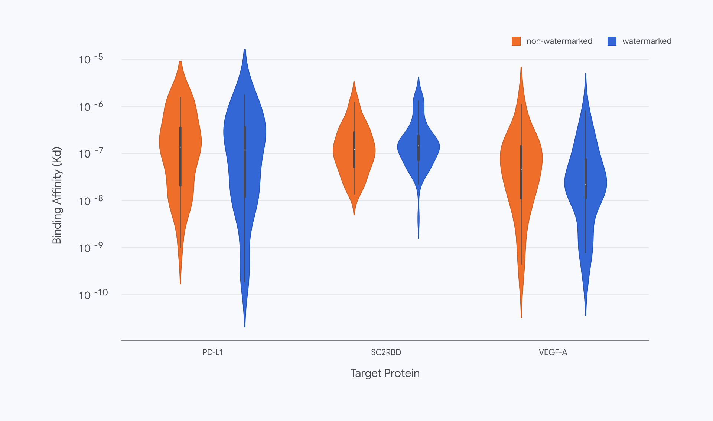

# SynthID Bio, AI가 만든 단백질의 표식은 지워질까?

_구글 딥마인드가 표식을 심은 단백질 1,300여 개를 만들어 보니 표적에 잘 붙었지만, 설계를 다시 만들면 표식만 지워진다_

## Executive Summary

> [!callout]
> 이 글은 구글 딥마인드가 2026년 9월 30일 공개한 SynthID Bio와, 같은 날 네이처에 실린 논문 「Function-preserving watermarking of AI-generated proteins」를 읽는다. AI가 설계한 단백질에 눈에 보이지 않는 표식을 심는 방법이고, 심는 자리가 둘로 갈린다. 하나는 아미노산 서열이고, 다른 하나는 모델이 예측한 3차원 구조의 원자 좌표다.

> 가장 눈에 띄는 결과는 표식을 넣어도 단백질이 제 일을 했다는 것이다. 연구진은 VEGF-A, 사스코로나바이러스2 스파이크 단백질의 수용체 결합 부위, PD-L1 세 표적에 붙는 결합체를 설계해 실제로 합성했고, 넣은 쪽과 넣지 않은 쪽이 적중률과 결합력, 서열 다양성에서 같은 수준으로 나왔다. 딥마인드는 이것을 표식이 들어간 채로 생물학적으로 작동하는 첫 단백질 결합체라고 부른다. 같은 논문이 적어 둔 약점도 분명하다. 작정하고 설계를 다시 뽑으면 기능은 그대로 둔 채 서열에서 표식만 지울 수 있다.

> 1절부터 3절까지는 딥마인드 발표문과 네이처 논문, 그리고 이를 전한 보도에 적힌 사실이다. 4절은 그 사실을 데이터를 다루는 사람의 눈으로 다시 읽은 이 글의 해석이다.

### 주요 수치

아래 네 숫자 가운데 검출 정확도와 예측 품질 손실은 표식이 얼마나 잘 작동했는지를 말하고, 합성해 붙여 본 결합체 수와 표적 수는 그 결과가 어디까지 뒷받침되는지를 말한다.

출처: [구글 딥마인드 공식 발표(2026-09-30)](https://deepmind.google/blog/introducing-synthid-bio/), [네이처 논문 s41586-026-10965-y](https://www.nature.com/articles/s41586-026-10965-y), [AI타임스 보도(2026-10-02)](https://www.aitimes.com/news/articleView.html?idxno=215902).

<!-- stat-card -->
**1,300개 이상** — 실제로 합성해 시험한 결합체 — 설계 파일만 비교한 것이 아니라 단백질을 만들어 표적에 붙여 봤다

<!-- stat-card -->
**99% 이상** — 서열에 심은 표식의 확인 정확도 — 서열이 조금 바뀌거나 잡음이 껴도 유지됐다. 오탐률 0.1% 기준

<!-- stat-card -->
**1% 미만** — AlphaFold 3 구조 예측 정확도 손실 — 표식 넣는 능력을 모델 가중치 안에 넣고도 예측 품질이 거의 그대로였다

<!-- stat-card -->
**3종** — 실험으로 확인된 표적 — VEGF-A, 사스코로나바이러스2 스파이크 RBD, PD-L1. 저자들이 이 연구를 개념 증명이라 부르는 범위다

## 표식을 어디에 심는가

구글의 SynthID는 2023년 이미지에서 시작해 텍스트와 오디오로 넓혀 온 표식 기술이다. 사람 눈이나 귀에 걸리지 않는 신호를 결과물에 섞어 두고, 나중에 같은 열쇠를 쥔 쪽이 그 신호가 있는지 확인하는 구조다. 9월 30일에 나온 SynthID Bio는 같은 생각을 단백질로 옮긴 것이다. 옮기는 과정에서 표식을 심을 수 있는 층이 둘로 나뉘었다.

*▲ SynthID Bio가 그리는 그림: AI가 설계한 단백질이 출처를 확인하는 검문소를 통과한다 | Source: [Google DeepMind](https://deepmind.google/blog/introducing-synthid-bio/)*

### 1.1. 아미노산을 고르는 순간에 심는다

첫 번째는 서열에 심는 방식이다. 단백질 설계 모델 ProteinMPNN은 자리마다 어떤 아미노산을 놓을지 확률로 고른다. SynthID Bio는 비밀 열쇠와 앞서 고른 아미노산 정보를 함께 넣어 그 선택을 아주 조금 기울인다. 나온 서열만 놓고 보면 자연에서 온 단백질과 구분되지 않지만, 같은 열쇠로 점수를 다시 계산하면 치우침이 드러난다. 딥마인드는 이 방식을 자사 결합체 설계 모델 AlphaProteo와 함께 돌렸다.

이 방식의 성질 하나가 뒤에 가서 중요해진다. 표식이 서열 그 자체에 들어가 있다는 것이다. 그 서열로 유전자를 주문해 세포에서 단백질을 만들어 내도, 만들어진 실물에서 아미노산을 읽으면 표식이 그대로 남아 있다.

### 1.2. 모델 가중치 안에 서명을 넣는다

두 번째는 모델이 예측한 3차원 구조의 원자 좌표에 심는 방식이다. 접근이 다르다. 나온 좌표를 사후에 흔들지 않는다. AlphaFold 3의 확산 신경망 가운데 일부를 미세조정해 표식 넣는 능력을 모델 가중치 안에 집어넣었다. 누가 어디서 그 모델을 돌리든 나오는 구조에 서명이 따라붙는다는 뜻이다. 구조를 읽는 연구자에게 달라질 것은 없도록 설계했다고 딥마인드는 적었다.

두 방식을 한자리에 놓고 보면 공통점이 먼저 눈에 띈다. 둘 다 완성된 결과물을 나중에 손대지 않고, 만드는 과정 안에 표식을 집어넣는다. 차이는 그것이 따라가는 범위에 있다. 실험실에서 합성한 실물 단백질에서 읽히는 쪽은 서열에 심은 표식이다. 구조에 심은 쪽은 모델이 내놓는 예측 좌표에 실린다.

▲ 딥마인드 발표문과 네이처 논문의 설명을 이 글이 한 장으로 정리했다.

## 시험관에서도 표식 없는 설계만큼 붙었다

워터마크 이야기에는 늘 같은 질문이 따라온다. 표시를 남기느라 결과물이 나빠지지 않느냐는 것이다. 단백질에서는 이 질문이 훨씬 무겁다. 이미지에 섞인 신호는 사람 눈에 안 보이면 제 몫을 다한 것이지만, 단백질은 표적에 붙어야 쓸모가 있다. 아미노산 하나를 바꾼 것이 결합을 통째로 망칠 수 있다.

연구진이 고른 표적은 셋이다. 혈관을 새로 만드는 데 관여해 암 치료의 표적이 되어 온 VEGF-A, 사스코로나바이러스2 스파이크 단백질에서 사람 세포 수용체에 달라붙는 부위, 그리고 암세포가 면역세포의 공격을 피하는 데 쓰는 PD-L1이다. 셋 다 실제 신약 연구에서 다뤄 온 단백질이라, 설계가 쓸 만한지 아닌지를 가릴 기준이 이미 있다.

비교는 설계 파일에서 멈추지 않았다. 결합체를 실제로 합성해 시험관에서 붙는지 측정했고, 그 검증은 단백질 실험 업체 Adaptyv Bio가 맡았다. AI타임스 보도로는 이렇게 만들어 시험한 결합체가 1,300개를 넘는다. 적중률도, 결합력도, 자연스러운 서열 다양성도 표식을 넣은 쪽과 넣지 않은 쪽이 비슷하게 나왔다. 한 실험 조건에서 제대로 붙는 결합체가 더 적게 나왔다는 보도도 있다. 모든 조건에서 손실이 0이었다는 뜻으로 읽을 일은 아니다.

구조 쪽 성적도 모양이 비슷하다. 네이처 논문을 전한 보도로는 구조 예측 정확도 손실이 1% 미만이었고, 서열이 조금 바뀌거나 데이터에 잡음이 껴도 99% 이상의 정확도로 표식을 확인했다. 판정 기준은 오탐률 0.1%다. 표식이 없는 설계를 있다고 잘못 부르는 일을 천 번에 한 번으로 묶어 둔 상태에서 잰 값이다. 워터마크 기술에서 이 기준을 명시하는지 아닌지가 숫자의 의미를 가른다.

*▲ 세 표적 모두에서 표식 유무에 따른 결합력(Kd) 분포가 겹친다 | Source: [Google DeepMind](https://deepmind.google/blog/introducing-synthid-bio/)*

> [!callout]
> 이 실험에서 눈여겨볼 대목은 숫자보다 순서다. 표식은 화면 속 서열 파일에서 끝나지 않았다. 그 파일로 유전자를 합성하고 세포에 넣어 만들어 낸 실물 단백질에서도 확인됐다. 출처 표시가 파일을 떠나 물질에 올라탄 첫 사례이고, 딥마인드가 이 결과를 세계 최초라 부르는 지점도 거기다.

## 표식은 지울 수 있다

딥마인드는 이 기술을 만능 해법이라 부르지 않는다. 발표문이 앞으로의 과제로 가장 먼저 꼽은 것이 의도적 변조에 대한 견고성이다. 논문은 더 구체적이다. 작정한 사람은 완성된 설계를 다른 도구에 넣어 서열을 다시 뽑을 수 있다. 그러면 예측되는 기능은 그대로 둔 채 서열에 심긴 표식만 사라진다. 저자들이 직접 해 보인 결과다.

그래서 이 기술이 서는 자리는 예방이 아니라 확인이다. 나쁜 설계를 막는 장치가 아니다. 어떤 서열이 신뢰할 수 있는 모델에서 나왔는지를 기계가 읽어 낸다. 표식이 있으면 출처가 확인되지만, 없다고 해서 사람이 만들었다는 뜻은 아니다. 지우고 왔을 수도 있고, 애초에 표식을 넣지 않는 다른 모델에서 나왔을 수도 있다.

시험해 본 범위도 좁다. 지금 있는 것은 논문 한 편, 워터마킹 방식 한 가지, 세 표적에 대한 결합체다. 실험이 이미 결합에 성공한 구조에서 출발했기 때문에 다른 종류의 설계에서도 같은 성적이 나올지는 아직 모른다. 스탠퍼드 Hie 랩, Arc Institute와 함께 게놈 모델 Evo 2로 박테리오파지 게놈에 표식을 넣는 작업도 진행 중인데, 초기 실험에서 그 파지가 기능한다는 것까지만 확인됐고 상세는 다음 논문으로 미뤄졌다.

바이오보안을 연구하는 사라 카터는 이 워터마크가 모델을 만든 곳과 그 모델이 내놓은 설계를 이어 준다고 봤다. 그래서 개발사가 안전 문제를 주도할 수 있게 된다는 것이다. 그러면서도 이 기술을 생물학적 설계의 출처를 추적하는 퍼즐의 중요한 한 조각이라고 표현했다. 딥마인드가 코드와 시험관 실험 데이터를 오픈소스로 내고 모델 가중치까지 연구 공동체에 푼 것도 그 조각을 늘리려는 조치다. 한 회사가 자기 모델에만 표식을 심어 두면, 출처를 확인할 수 있는 범위도 그 회사가 만든 설계 안에서 끝난다.

딥마인드가 내놓은 보완책은 표식 하나로 버티지 말자는 쪽이다. 출처 정보를 따로 기록해 함께 달아 두고, AI가 만든 생물 데이터를 모으는 중앙 저장소를 두자는 제안이다. 모델 단계에서 위험한 요청을 거르는 장치 옆에 한 겹을 더 얹는 그림이다. 이 소식을 다룬 뉴스레터 Import AI에서 잭 클라크도 비슷한 선을 그었다. AI가 만든 생물학적 위협에 세계를 견디게 만드는 일은 방대하고 어려운 문제이고, 표식은 제조 장비 감시나 AI 제공사의 분류기 같은 다른 수단과 함께 가야 한다는 것이다.

> [!callout]
> 지울 수 있다는 사실이 이 기술을 무의미하게 만들지는 않는다. 자물쇠도 뜯으면 열리지만 아무도 자물쇠를 버리지 않는다. 달라지는 것은 기대의 위치다. 표식은 악의를 막는 벽이 아니라, 선의로 만든 설계가 자기 출처를 증명할 수 있게 해 주는 꼬리표에 가깝다.

## 페블러스가 이 발표를 주목하는 이유

페블러스가 AI-Ready Data를 말할 때 되풀이하는 문장이 있다. 출처와 이력이 남지 않은 데이터 위에서는 검증도 검증이 아니다. 이번 발표가 걸려 있는 자리가 정확히 거기다.

지금까지 출처증명은 화면 안의 문제였다. 이미지에 심은 SynthID도, 콘텐츠 이력을 파일에 붙이는 C2PA 같은 규격도 결국 파일에 달린 꼬리표다. 파일을 떠나면 꼬리표도 함께 떠난다. SynthID Bio가 다른 점은 서열 쪽 표식이 데이터 자체의 내용에 들어가 있어서, 그 서열로 유전자를 주문하고 세포에서 단백질을 만들어 내도 읽힌다는 것이다. 데이터 계보가 파일 밖의 물질까지 따라간 첫 사례다.

쓸 곳으로 딥마인드가 꼽은 것은 둘이다. 하나는 유전자 합성 업체의 주문 심사다. 지금 방식은 주문받은 서열이 알려진 위험 서열과 얼마나 닮았는지를 보는 것인데, AI가 새로 지어낸 서열은 닮은 데가 없어 이 그물을 빠져나갈 수 있다. 표식은 그 자리에 다른 종류의 신호를 하나 더 놓는다. 이 서열이 어느 모델에서 나왔는지를 심사하는 쪽이 기계적으로 확인할 수 있게 하는 것이다. Twist Bioscience에서 정책과 생물보안을 맡은 제임스 디건스는 이를 두고 심사를 강화할 수 있는 유망한 수단이라고 평했다.

다른 하나는 데이터베이스다. PDB와 UniProt, GenBank 같은 공개 저장소는 사람이 관측하고 보고한 기록 위에 쌓여 왔다. 여기에 AI가 만든 서열과 구조가 표시 없이 섞여 들어가면, 어느 항목이 실험실에서 나왔고 어느 항목이 모델에서 나왔는지 구분할 길이 사라진다. 다음 세대 모델이 그 기록으로 학습한다는 점을 생각하면 문제가 한 번으로 그치지 않는다.

그래서 이 발표가 남기는 질문은 단백질 이야기에서 끝나지 않는다. 우리 데이터셋에 들어온 항목이 사람이 관측한 것인지 모델이 지어낸 것인지, 지금 구분할 수 있는가. 구분할 수 있다면 무엇을 보고 구분하는가. 그리고 그 표시는 데이터를 한 번 가공하고 나면 사라지지 않는가. SynthID Bio가 답한 것은 이 가운데 일부이고, 나머지는 각자의 데이터에 그대로 남아 있다.

여기까지 읽어 주셔서 감사하다. 딥마인드의 발표문 전문은 [구글 딥마인드 블로그](https://deepmind.google/blog/introducing-synthid-bio/)에, 보안 관점에서 정리한 기사는 [Help Net Security](https://www.helpnetsecurity.com/2026/10/01/synthid-bio-watermark/)에 있다. 여러분이 다루는 데이터 가운데 "이 값은 사람이 관측했다"를 기록으로 증명할 수 있는 항목이 몇 퍼센트인지 세어 보시고 알려 주시면 좋겠다.

## 참고문헌

### 1차 발표·논문

- 1.Google DeepMind. (2026). "[SynthID Bio watermarks AI-designed proteins](https://deepmind.google/blog/introducing-synthid-bio/)." Google DeepMind Blog, 2026-09-30.
- 2.Google DeepMind. (2026). "[Function-preserving watermarking of AI-generated proteins](https://www.nature.com/articles/s41586-026-10965-y)." Nature. DOI: 10.1038/s41586-026-10965-y.

### 보도

- 3.["SynthID Bio: Google DeepMind's new system to watermark AI-generated proteins."](https://www.helpnetsecurity.com/2026/10/01/synthid-bio-watermark/) Help Net Security, 2026-10-01.
- 4.Clark, J. (2026). "[Import AI 475: Swarm scaling, Google DeepMind watermarks biology, and the AI science economy](https://jack-clark.net/2026/10/05/import-ai-475-swarm-scaling-google-deepmind-watermarks-biology-and-the-ai-science-economy/)." Import AI, 2026-10-05.
- 5.AI타임스. (2026). "[구글 딥마인드, AI 설계 단백질에 워터마크 심는 '신스ID 바이오' 공개](https://www.aitimes.com/news/articleView.html?idxno=215902)." 2026-10-02.
