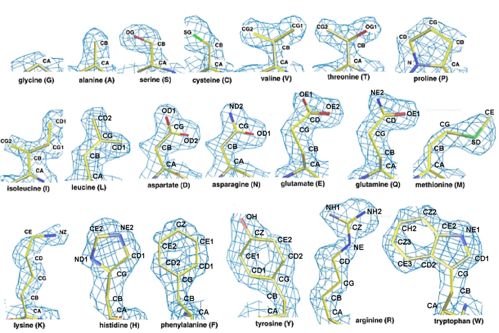

# Drug Discovery AI Learns From Hydrogen Atoms X-Rays Cannot See

_NYU chemists trained a neural network on crystals where hydrogen is visible, and flagged 126 molecules in a standard drug-discovery dataset whose recorded hydrogen positions may be wrong_

## Executive Summary

> [!callout]
> Programs that calculate how a drug candidate sticks to a protein take their input from atomic coordinates in a structure database. Those coordinates mostly have no hydrogen in them. X-rays locate atoms by bouncing off electrons, and hydrogen has only one electron, so its signal is very weak. At the resolution typical of protein crystals, there is no telling which site the hydrogen sits on. Filling that site in from chemical knowledge is a long-standing practice. A paper published on September 23 in Chemical Science by chemists at New York University built a yardstick to check those filled-in values against. This article looks at what the yardstick found and at what it did not.

> The team gathered 128,868 small-molecule crystals whose hydrogen positions had been resolved experimentally, marked the form each crystal actually adopted as stable, marked every other form that software generated for the same molecule as unstable, and ended up with a labeled table of 1,131,426 rows. They then ran the trained model over PDBbind, the standard dataset of proteins with drug candidates bound to them. Among the 5,075 ligands that could take more than one hydrogen arrangement, 279 disagreed with the model. Of those, only the 126 where the swap raised the number of hydrogen bonds and lowered the number of unsatisfied polar atoms were left standing as likely mis-assignments. The widely quoted 2.5% does not cover every disagreement, only the smaller half that structure took sides on.

> Sections 1 through 4 report what the paper says. Section 5 is the reading this article draws from it.

### Key Numbers

Source: Pan et al., [Chemical Science (2026)](https://doi.org/10.1039/D6SC03714C), Results section and Tables 1, 2, and 3.

<!-- stat-card -->
**126 / 279** — Reassignments that structure backed — 279 ligands disagreed with the model, and in 126 of them the swap added hydrogen bonds and removed unsatisfied polar atoms

<!-- stat-card -->
**2.30 → 1.65** — Mean absolute error of docking scores (kcal/mol) — Rescoring those 126 complexes with the new hydrogen placement narrowed the gap to measured binding affinity

<!-- stat-card -->
**129,783** — Stable tautomers experiments actually observed — The training table runs to 1,131,426 rows, but only this many forms were seen in a crystal; the rest were spun out by software and labeled unstable

<!-- stat-card -->
**0.72** — Precision on the water-based benchmark — Pooling every test set gives 0.88, but the aqueous set measured on its own gives the lowest figure in the paper

## The Hydrogen X-Rays Cannot See

The standard way to work out the shape of a protein is X-ray crystallography. You grow the protein into a crystal, fire X-rays at it, watch the beams scatter off electrons into particular directions, and run that pattern backwards to place one atom at a time where the electron density is thick. The method has a blind spot built into it. Hydrogen carries a single electron. Next to any other atom it returns almost no signal, and in crystals of molecules as large as proteins the resolution is usually nowhere near fine enough to pick that faint signal out.

So the Protein Data Bank mostly holds no information about where hydrogen sits. The NYU announcement states the situation plainly: in the Protein Data Bank, "the locations of hydrogen atoms that distinguish one tautomer from another are typically not available." The missing site is not left blank. Someone picks a chemically plausible form and fills it in, and that choice is the tautomer assignment.

*▲ An experimental electron density map (1.5Å resolution) with the 20 amino acid side chains overlaid. Carbon, nitrogen, oxygen, and sulfur trace a clear skeleton, but nowhere in the map does a hydrogen site appear. | Source: [Wikimedia Commons (CC BY-SA 4.0)](https://commons.wikimedia.org/wiki/File:20-amino-acids-density-map.png)*

Tautomers are forms of a molecule that share a formula while one hydrogen moves to a different site and the bonding pattern shifts with it. On paper the difference looks minor. Yet where the hydrogen sits decides whether the molecule donates a hydrogen bond or accepts one, which is to say it decides which residues inside a protein pocket the molecule can hold hands with. Yingkai Zhang, the chemistry professor who led the study, said that although this may seem like a small change, different tautomers of the same molecule can alter how a molecule interacts with a protein target.

> [!callout]
> What matters is where that assignment travels next. Docking, free-energy calculations, and virtual screening all take those coordinates and that bonding pattern as input. Derived datasets such as PDBbind, the ones used to train and score binding-affinity models, inherit the same assignment untouched. A form chosen by a person becomes the answer key a machine is graded against.

One misreading is worth heading off. The study does not claim that protein structures are wrong. Zhang drew the line himself in the announcement: "This does not mean that the experimentally determined protein structures themselves are incorrect; rather, our results suggest that the previously assigned chemical representation may warrant revision." The skeleton is what the experiment saw. The layer of chemical interpretation laid over that skeleton is what is up for review.

## The Crystals That Do Show Hydrogen

Experimental material that has seen hydrogen does exist, in crystals of small organic molecules. They are far smaller than proteins and pack more neatly, so resolution runs high and X-rays sometimes do catch the hydrogen. The surer route is neutrons. A neutron collides with the nucleus rather than the electron cloud, and a hydrogen nucleus scatters neutrons quite strongly. The atom that a single electron hides from X-rays can be pinned down with neutrons.

*▲ A neutron diffraction map of an arginine residue in the protein crambin (1.1Å resolution). Because neutrons collide with the nucleus rather than the electron cloud, hydrogen (purple) and deuterium (blue) density both show up clearly at a site X-rays could never resolve. | Source: [Wikimedia Commons (CC BY 3.0, Dcrjsr)](https://commons.wikimedia.org/wiki/File:4fc1_Arg17_neutron_H_vs_D_in_map.png)*

That is the material the team chose. The Cambridge Structural Database keeps a curated list of structures whose hydrogen positions are especially reliable, determined primarily through neutron diffraction. The researchers pulled every structure on that list, converted them to molecular formulas, stripped out broken and charged molecules, and deleted anything overlapping the molecules they had set aside for testing. Because a crystal records where the hydrogen actually sat, it also records which tautomer that crystal adopted.

Reading the size of the training table calls for one distinction. The 1.1 million stated in the abstract is not a count of forms that experiments observed. Table 1 breaks it out. There are 128,868 molecules, and 129,783 forms that experiments pointed to as stable. The remainder are other forms that a program produced mechanically from the same molecules, all written down on the unstable side. The full table of those labels runs to 1,131,426 rows. Close to eight rows on the wrong-answer side ride along with every row on the right-answer side. The sources the paper lists are not the CSD list alone either: two experimental databases of aqueous tautomer ratios go in with it.

The labeling rule itself was simple. For each molecule, enumerate every possible tautomer with software, mark the single form observed in the crystal as stable, and mark all the rest as unstable. The paper is upfront about what the rule drags in. Since a molecule can hold more than one stable form while only one gets the stable mark, this labeling strategy inevitably introduces some noise into the dataset.

The model neither builds a three-dimensional structure nor runs quantum mechanics. It is a graph neural network that reads only the flat picture of atoms and bonds and guesses which form is stable. Three graph networks and one fingerprint-based baseline were compared, and AttentiveFP came out as the final pick on a criterion worth noticing. It was not the most precise; it had the highest recall on the validation set. On precision alone AttentiveFP sits at 0.88, below the 0.90 of the two other graph models tested alongside it.

The paper gives its reason. Missing a genuinely stable form usually means missing the form that binds the protein, which throws off all the docking and free-energy work downstream, whereas a few extra unstable candidates slipping through can still be filtered at the later scoring and ranking stage. The team decided which mistake was the expensive one before it picked a model.

> [!callout]
> Boiled down to a line, this study did not correct an answer key. It brought in a different one. The proposal is to fill the site left empty in protein structures with hydrogen that small-molecule crystals genuinely saw. The new key comes with an environment of its own, though. This is hydrogen seen inside a crystal, not hydrogen seen in water or inside a protein pocket. Section 4 is where that caveat comes back as a number.

## From 279 Mismatches to 126 Cases

The trained model was turned on PDBbind v2020, the de facto standard for building and grading binding-affinity models. The search was never the whole dataset. It narrowed once to the 6,202 ligands carrying no charged functional groups, and again to the 5,075 of those that could take more than one tautomer. That 5,075 is the denominator under the widely quoted 2.5%. The trimming went beyond charge. Complexes with a metal ion sitting right next to the ligand came out, and so did ligands with more than 35 heavy atoms. Molecules that ionize tangle hydrogen gain and loss together with the tautomer question, the paper explains, and the two cannot be untied.
