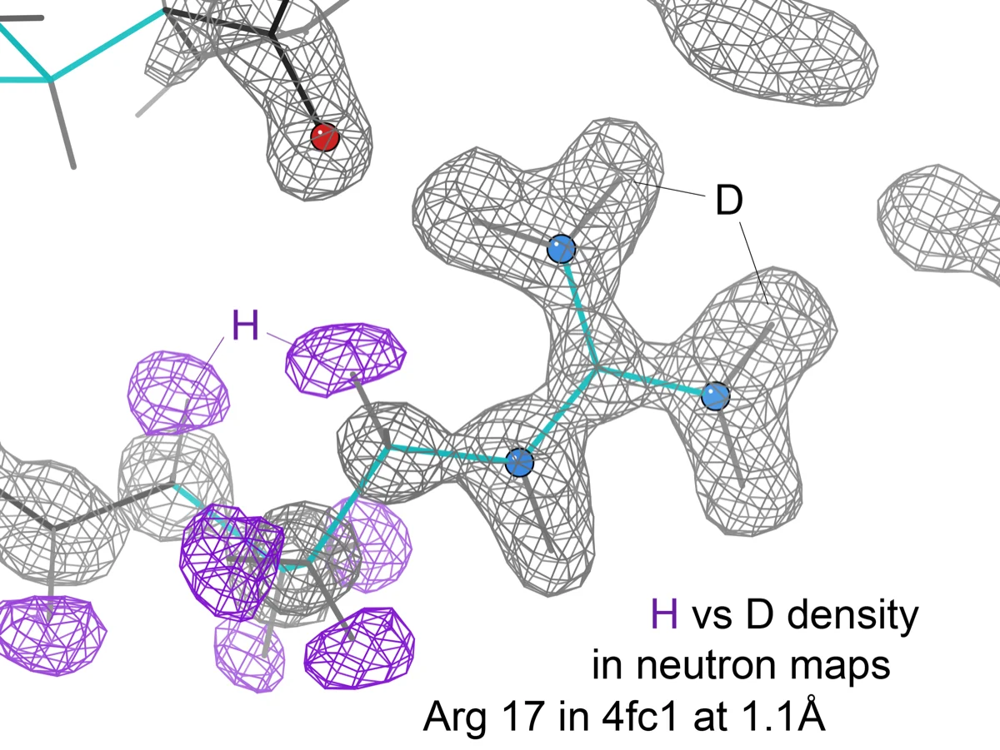

# 신약을 찾는 AI는 사람이 짐작한 원자를 정답으로 배운다

_뉴욕대가 수소 자리가 밝혀진 결정으로 AI를 가르쳐, 신약 연구용 데이터에서 수소 위치가 틀렸을 약물 후보 126개를 찾아냈다_

## Executive Summary

> [!callout]
> 약물 후보가 단백질에 어떻게 달라붙는지를 계산하는 프로그램은 구조 데이터베이스에 적힌 원자 좌표를 입력으로 받는다. 그 좌표에 수소는 대체로 없다. X선은 전자에 부딪혀 튕기는 빛으로 원자 자리를 알아내는데, 수소는 전자가 하나뿐이라 신호가 너무 약하다. 단백질 결정의 해상도로는 수소가 어느 자리에 붙어 있는지까지 가려내지 못한다. 그래서 그 자리는 사람이 화학 지식으로 채워 넣는 것이 오래된 관행이다. 뉴욕대 화학과 연구진이 9월 23일 《케미컬 사이언스》에 실은 논문은 그렇게 채워 넣은 값을 대조해 볼 잣대를 만들었다. 이 글은 그 잣대가 무엇을 찾아냈고 무엇은 못 찾았는지를 본다.

> 연구진은 수소 위치가 실험으로 확인된 소분자 결정 12만여 개를 모아, 결정이 실제로 택한 형태를 안정으로 적고 프로그램이 같은 분자에서 뽑아낸 나머지 형태를 불안정으로 적어 113만 줄짜리 학습표를 만들었다. 그 모델을 단백질과 약물 후보가 붙어 있는 표준 데이터셋 PDBbind에 걸었다. 수소 자리가 여럿일 수 있는 리간드 5,075건 가운데 279건이 모델의 예측과 어긋났다. 그중 수소결합이 늘고 짝을 못 찾은 극성 원자가 줄어든 126건만 표기가 틀렸을 가능성이 크다는 쪽으로 남았다. 널리 인용되는 2.5%는 어긋난 전부가 아니라, 구조가 편을 들어 준 절반 이하다.

> 1절부터 4절까지는 논문에 적힌 내용이다. 5절은 그 내용에서 이 글이 끌어낸 해석이다.

### 주요 수치

출처: Pan 외, [Chemical Science (2026)](https://doi.org/10.1039/D6SC03714C) 본문 결과·표 1·표 2·표 3.

<!-- stat-card -->
**126 / 279** — 구조가 뒷받침한 재지정 후보 — 모델과 어긋난 리간드는 279건이고, 그중 수소결합이 늘고 짝 없는 극성 원자가 준 것이 126건이다

<!-- stat-card -->
**2.30 → 1.65** — 도킹 점수의 평균절대오차(kcal/mol) — 126건의 수소 자리를 바꿔 다시 계산하자 실측 결합력과의 오차가 줄었다

<!-- stat-card -->
**12만 9,783** — 실험이 실제로 본 안정 토토머 — 학습표는 113만 1,426줄이지만, 그중 결정에서 관측된 형태는 이만큼이고 나머지는 프로그램이 만들어 내 불안정으로 적은 것이다

<!-- stat-card -->
**0.72** — 물속 기준 평가셋의 정밀도 — 다섯 평가셋을 합치면 0.88이지만, 수용액 하나만 떼어 재면 가장 낮은 값이 나온다

## X선은 수소를 보지 못한다

단백질의 생김새를 알아내는 표준 방법은 X선 결정학이다. 단백질을 결정으로 키워 X선을 쏘면 전자에 부딪힌 빛이 특정 방향으로 몰려 나오고, 그 무늬를 거꾸로 풀어 전자가 짙은 곳에 원자를 하나씩 놓는다. 이 방법에는 태생적인 맹점이 하나 있다. 수소는 전자를 하나만 가진다. 다른 원자보다 되비치는 신호가 거의 없다시피 하고, 단백질처럼 큰 분자의 결정에서는 그 희미한 신호를 잡아낼 만큼 해상도가 나오지 않는 경우가 대부분이다.

그래서 단백질 구조 데이터베이스(PDB)에는 수소가 어디 붙어 있는지를 가려 줄 정보가 대체로 없다. 뉴욕대 발표문은 이 상태를 그대로 적는다. 토토머를 구별해 주는 수소 원자의 위치는 PDB에서 보통 이용할 수 없다는 것이다. 없으면 비워 두는 것이 아니라, 화학적으로 그럴듯한 형태를 골라 채운다. 그 선택이 곧 토토머 지정이다.

*▲ 실험으로 얻은 전자밀도 지도(1.5Å 해상도)에 20종 아미노산 곁사슬을 겹친 그림. 탄소·질소·산소·황 원자는 뼈대를 그려 낼 만큼 또렷하지만, 수소가 놓일 자리는 지도 어디에도 나타나지 않는다. | Source: [Wikimedia Commons (CC BY-SA 4.0)](https://commons.wikimedia.org/wiki/File:20-amino-acids-density-map.png)*

토토머는 분자식이 같은데 수소 하나가 자리를 옮기고 그에 맞춰 결합 패턴이 함께 바뀌는 형태들을 말한다. 종이 위에서는 사소해 보이는 차이다. 그런데 수소가 어디 붙어 있느냐에 따라 그 분자가 수소결합을 내주는 쪽인지 받는 쪽인지가 뒤바뀐다. 단백질 주머니 안에서 어느 잔기와 손을 잡을 수 있는지가 달라진다는 뜻이다. 교신저자인 잉카이 장 교수는 작아 보이는 변화지만 같은 분자의 토토머가 다르면 표적 단백질과 상호작용하는 방식이 달라진다고 설명했다.

> [!callout]
> 여기서 걸리는 것은 그 지정이 어디로 흘러가느냐다. 도킹, 자유에너지 계산, 가상 스크리닝은 모두 이 좌표와 결합 패턴을 입력으로 받는다. 그리고 결합력 예측 모델을 학습시키고 채점하는 데 쓰이는 PDBbind 같은 파생 데이터셋도 같은 지정을 그대로 물려받는다. 사람이 고른 형태가 기계의 정답지가 되는 셈이다.

오해를 피할 필요가 있다. 이 연구가 단백질 구조가 틀렸다고 말하는 것이 아니다. 장 교수는 발표문에서 선을 분명히 그었다. "이것은 실험으로 결정된 단백질 구조 자체가 틀렸다는 뜻이 아니다. 우리 결과는 이전에 지정된 화학적 표현이 수정을 요할 수도 있음을 시사한다." 뼈대는 실험이 본 것이고, 그 뼈대 위에 얹힌 화학적 해석 한 겹이 재검토 대상이라는 이야기다.

## 수소가 보이는 결정을 교과서로 삼았다

수소를 본 적이 있는 실험 자료가 따로 있다. 작은 유기분자의 결정이다. 단백질보다 훨씬 작고 잘 정렬되기 때문에 해상도가 높게 나오고, X선으로도 수소가 잡히는 경우가 있다. 더 확실한 것은 중성자를 쓴 경우다. 중성자는 전자가 아니라 원자핵에 부딪히고, 수소의 핵은 중성자를 꽤 세게 튕겨 낸다. 전자가 하나뿐이라 X선으로는 놓치던 원자를 중성자로는 잡아낼 수 있다.

*▲ 단백질 크람빈(1.1Å 해상도)의 아르기닌 잔기를 중성자 회절로 찍은 지도. 원자핵에 부딪히는 중성자 앞에서는 수소(보라색)와 중수소(파란색) 밀도가 X선으로는 볼 수 없던 자리에 뚜렷이 나타난다. | Source: [Wikimedia Commons (CC BY 3.0, Dcrjsr)](https://commons.wikimedia.org/wiki/File:4fc1_Arg17_neutron_H_vs_D_in_map.png)*

연구진이 고른 자료가 그것이다. 케임브리지 구조 데이터베이스(CSD)에는 수소 위치가 특히 믿을 만한 구조만 따로 추린 목록이 있고, 주로 중성자 회절로 결정된 것들이다. 이 목록의 구조를 전부 꺼내 분자식으로 바꾼 뒤, 깨진 분자와 전하를 띤 분자를 걷어내고 평가용으로 떼어 놓은 분자와 겹치는 것을 지웠다. 결정 안에서 수소가 실제로 어느 자리에 있었는지가 적혀 있으니, 그 결정이 어떤 토토머를 택했는지도 함께 적혀 있는 셈이다.

학습표의 크기를 읽을 때는 한 가지를 따져 봐야 한다. 논문 초록에 적힌 110만여 건은 실험이 본 형태의 개수가 아니다. 표 1에 그 내역이 있다. 분자는 128,868개, 그중 실험이 안정하다고 본 형태는 129,783건이다. 나머지는 같은 분자에서 프로그램이 기계적으로 펼쳐 놓은 다른 형태들로, 전부 불안정으로 적혔다. 그렇게 채운 학습표의 총 줄 수가 1,131,426이다. 정답 쪽 한 줄에 오답 쪽 여덟 줄 가까이가 붙어 있는 셈이다. 논문이 출처로 적은 곳도 CSD 목록 하나가 아니라, 물속 토토머 비율을 실은 실험 데이터베이스 두 곳이 함께 들어간다.

정답표를 만드는 규칙은 단순했다. 분자마다 가능한 토토머를 프로그램으로 전부 늘어놓고, 결정에서 관측된 형태 하나만 안정으로 적고 나머지는 모두 불안정으로 적었다. 논문은 이 규칙이 무엇을 들여오는지를 스스로 밝힌다. 한 분자가 안정한 형태를 둘 이상 가질 수 있는데도 하나만 안정으로 표시되므로, 이 라벨 방식은 어쩔 수 없이 잡음을 들여온다는 것이다.

모델은 3차원 구조를 만들지도, 양자역학 계산을 돌리지도 않는다. 원자와 결합으로 이루어진 2차원 그림만 보고 어느 형태가 안정한지를 맞히는 그래프 신경망이다. 그래프 신경망 세 가지와 분자 지문을 쓰는 기준선 하나를 나란히 시험한 끝에 AttentiveFP가 최종 모델로 뽑혔는데, 고른 기준이 눈에 띈다. 정밀도가 가장 높은 것이 아니라 검증셋 재현율이 가장 높은 쪽을 골랐다. 실제로 정밀도만 놓고 보면 AttentiveFP는 0.88로, 함께 시험한 다른 두 그래프 모델의 0.90보다 낮다.

이유는 논문에 적혀 있다. 진짜 안정한 형태를 놓치면 그것이 대개 단백질에 붙는 형태이므로 뒤따르는 도킹과 자유에너지 계산이 통째로 어긋나지만, 불안정한 후보가 몇 개 더 섞여 들어오는 것은 나중 점수 매기기 단계에서 걸러 낼 수 있다는 판단이다. 놓치는 쪽과 더 집어 오는 쪽 가운데 무엇이 더 비싼 실수인지를 먼저 정하고 모델을 고른 것이다.

> [!callout]
> 이 연구가 한 일을 한 줄로 줄이면 정답지를 바꾼 것이 아니라 다른 정답지를 데려온 것이다. 단백질 구조에서 비어 있던 자리를, 소분자 결정이 실제로 본 수소로 채워 보자는 제안이다. 다만 새 정답지도 환경을 갖는다. 결정 속에서 본 수소이지 물속이나 단백질 주머니 안에서 본 수소가 아니다. 4절에서 이 단서가 숫자로 되돌아온다.

## 279건이 어긋났고 126건이 남았다

학습을 마친 모델을 PDBbind v2020에 걸었다. 결합력 예측 모델을 만들고 채점할 때 사실상 표준으로 쓰이는 자료다. 검사 대상은 처음부터 전체가 아니었다. 전하를 띤 작용기가 없는 리간드 6,202건으로 한 번 좁히고, 그중 토토머가 여럿 가능한 5,075건으로 다시 좁혔다. 널리 인용되는 2.5%의 분모가 이 5,075건이다. 좁히는 손질은 전하 말고도 더 있었다. 금속 이온이 리간드 바로 곁에 있는 복합체를 뺐고, 무거운 원자가 35개를 넘는 큰 리간드도 뺐다. 이온이 되는 분자는 수소가 붙고 떨어지는 문제와 토토머 문제가 엉겨 있어 따로 풀 수 없다는 것이 논문이 밝힌 이유다.
