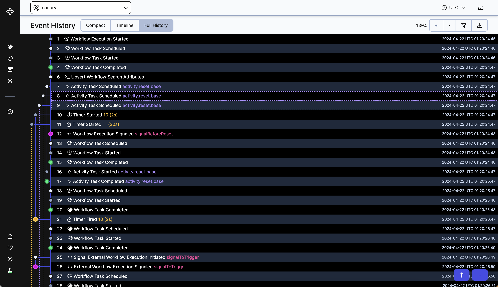

# AI가 일하다 멈추면, 처음부터 다시 해야 할까?

_템포럴, 라이트스피드 주도 5억 5,000만 달러 시리즈 E — 기업가치 125억 5,000만 달러로 일곱 달 새 2.5배_

## Executive Summary

> [!callout]
> 애플리케이션과 AI 에이전트가 장애를 만났을 때 하던 일을 이어 가게 해 주는 오픈소스 소프트웨어를 만드는 회사가 9월 14일 시리즈 E를 발표했다. 워싱턴주 벨뷰에 있는 템포럴(Temporal Technologies)이고, 조달액은 5억 5,000만 달러, 기업가치는 125억 5,000만 달러다. 이 글은 그 값이 무엇에 매겨진 것인지를 본다.

> 직전 라운드와 견주면 폭이 드러난다. 2월 시리즈 D에서 이 회사의 값은 50억 달러였다. 일곱 달 만에 2.5배가 된 셈인데, 그사이 늘어난 것은 모델의 성능이 아니라 에이전트가 실제로 프로덕션에서 돌아간 횟수다. 다만 이 값은 투자자들이 비공개 라운드에서 합의한 가격이지 시장이 매긴 시세는 아니다.

> 4절까지는 회사가 공개한 발표문과 보도에 나온 것, 그리고 이 회사가 파는 기술의 작동 방식을 따라간다. 5절에서 데이터 실무 쪽으로 옮겨 적는 부분은 그 문서들에 없는 이 글의 해석이다.

### 주요 수치

출처: [템포럴 공식 발표문 (2026-09-14)](https://temporal.io/blog/temporal-raises-usd550m-series-e-at-usd12-55b-valuation-ai)

<!-- stat-card -->
**125.5억 달러** — 시리즈 E 기업가치 — 2월 시리즈 D의 50억 달러에서 일곱 달 만에 2.5배. 지난해 3월 시리즈 C 때는 17억 2,000만 달러였다

<!-- stat-card -->
**1조 9,000억 건** — 8월 한 달 청구 대상 액션 — 전년 대비 350% 이상. 액션은 이 회사가 실행 한 단위를 세어 과금하는 기준이다

<!-- stat-card -->
**60배** — 오픈AI의 사용량 증가 — 1년이 채 안 되는 사이. 유료 고객은 4,300곳을 넘어 전년 대비 139% 늘었다

<!-- stat-card -->
**2.5억 달러** — 연환산 매출 — 전년 대비 200% 이상 성장. 순 달러 유지율은 2월 이후 200%를 넘게 유지하고 있다

## 무슨 일이 있었나

라운드는 라이트스피드가 이끌었다. 웰링턴 매니지먼트와 골드만삭스 얼터너티브스의 그로스 에퀴티, 타이거 글로벌 세 곳이 공동 리드로 들어왔고 T. 로우 프라이스와 SV 엔젤이 참여했다. 이전 라운드를 이끌었던 a16z와 세쿼이아, 인덱스, GIC, 사파이어 벤처스, 앰플리파이는 다시 들어왔다. 이번에 앞에 선 라이트스피드도 새 얼굴은 아니다. 2월 시리즈 D에 참여 투자자로 이미 들어와 있었고, 일곱 달 만에 뒷줄에서 맨 앞으로 옮겨 앉았다. 회사는 자금을 글로벌 운영 확대, 플랫폼 핵심 요소에 대한 투자, 그리고 기업 고객이 요청한 신뢰성·보안 작업에 쓰겠다고 밝혔다. 직원은 지난 1년 사이 두 배로 늘어 570명이 됐다.

값이 뛴 속도가 이 발표의 핵심이다. 세 번의 기준점을 나란히 놓으면 이렇다.

| 시점 | 라운드 | 기업가치 |
| --- | --- | --- |
| 2025년 3월 | 시리즈 C · 1억 4,600만 달러 | 17억 2,000만 달러 |
| 2026년 2월 | 시리즈 D · 3억 달러 · a16z 주도 | 50억 달러 |
| 2026년 9월 14일 | 시리즈 E · 5억 5,000만 달러 · 라이트스피드 주도 | 125억 5,000만 달러 |

시리즈 D와 E 수치는 회사가 각각 2월 17일과 9월 14일에 낸 발표문에 적힌 것이고, 시리즈 C 수치는 투자 데이터베이스 딜룸의 집계다. 시리즈 C와 D의 기업가치는 투자 후 기준이다.

눈금을 한 칸 더 뒤로 물리면 폭이 더 커진다. 2025년 3월 시리즈 C 때 이 회사의 값은 17억 2,000만 달러였다. 열여덟 달 만에 일곱 배가 넘은 셈이다. 공개된 라운드를 모두 더하면 지금까지 조달한 금액은 12억 달러 안팎이 된다.

다만 같은 기간에 매출이 붙는 속도는 내려왔다. 2월 발표문은 매출이 전년 대비 380% 넘게 늘었다고 적었고, 이번 발표문은 200% 넘게 늘었다고 적는다. 밑동이 커지면 증가율이 낮아지는 것은 자연스럽지만, 값이 2.5배가 되는 동안 성장률은 그 방향으로 가지 않았다는 사실은 같이 읽어 둘 만하다.

성장 지표도 함께 공개됐다. 연환산 매출이 2억 5,000만 달러를 넘었고 전년 대비 200% 이상 늘었다. 오픈소스 설치는 4,300만 건을 넘겨 지난해 12월 대비 134% 늘었다. 고객 명단에는 오픈AI, 스냅, 엔비디아, 넷플릭스, JP모건 체이스가 올라 있다. 스냅은 하루 4억 1,400만 건의 스토리를 이 위에서 실어 나르고, JP모건 체이스는 규제를 받는 프로덕션 환경에서 돌린다.

보도자료가 함께 실은 명단은 더 길다. 커서를 만드는 애니스피어, 러버블, 스케일 AI, 세일즈포스, 쇼피파이, 부킹닷컴, 블록, 도어대시가 들어 있다. 용례로는 장시간 에이전트와 결제, 고객 운영에 더해 자율주행 시뮬레이션이 함께 나온다. 물리 세계를 다루는 쪽에서도 같은 종류의 문제를 풀고 있다는 뜻이다.

가장 눈에 띄는 수치는 오픈AI 쪽이다. 회사에 따르면 오픈AI의 사용량은 1년이 채 안 되는 사이 60배가 됐다. 오픈AI의 인프라 담당 부사장 벤캇 벤카타라마니는 발표문에 이렇게 붙였다.

“As infrastructure teams increasingly handle really complex, long-running workflows, they have even less control over external dependencies. Durable Execution is more than ever a core requirement for modern AI systems, and Temporal offers a compelling platform to help build it in from the start. This is one of the main reasons why we invested in building a durable orchestration framework powered by Temporal at OpenAI.”

무게는 마지막 문장에 있다. 오픈AI는 이 도구를 골라 쓴 데서 그치지 않고, 그 위에 자기네 지속 실행 오케스트레이션 프레임워크를 한 겹 더 올렸다고 밝혔다. 도구를 골라 쓰는 일과 그 위에 자기 층을 짓는 일은 나중에 갈아 끼우는 비용이 다르다.

## 이 회사는 무엇을 파나

템포럴은 모델을 만들지 않는다. 이 회사가 파는 것은 긴 작업이 중간에 끊겼을 때 그 작업을 끝까지 밀고 가는 실행 엔진이다. 회사는 그것을 지속 실행(Durable Execution)이라 부른다. 코드를 평범하게 짜 두면 엔진이 그 실행의 모든 걸음을 기록해 두고, 서버가 죽든 네트워크가 끊기든 그 기록을 근거로 하던 자리에서 다시 이어 간다는 뜻이다. 사람의 승인을 며칠 기다리는 작업도 같은 장치로 버틴다. 기다리는 동안 프로세스가 살아 있을 필요가 없기 때문이다.

*▲ 템포럴 웹 UI의 Event History 화면 — 실행 중 벌어진 일이 번호가 매겨진 채 순서대로 쌓인다 | Source: [Temporal Blog](https://temporal.io/blog/the-dark-magic-of-workflow-exploration)*

이 회사는 에이전트 붐을 타고 갑자기 생긴 곳이 아니다. 두 창업자 맥심 파테예프와 사마르 아바스는 아마존에서 장시간 작업을 조율하는 서비스를 만들다 만났다. 파테예프가 심플 워크플로 서비스(SWF)를 맡고 있었고, 아바스는 2012년 그 서비스를 외부에 연 팀에 있었다. 아바스는 이어 마이크로소프트에서 오픈소스 더러블 태스크 프레임워크를 공동으로 만들었고, 마이크로소프트는 나중에 그 위에 애저 더러블 펑션스를 올렸다. 지금 이 회사가 파는 물건에 붙은 지속(durable)이라는 낱말은 그 시절에서 온다.

두 사람은 우버에서 다시 만나 오픈소스 워크플로 엔진 카덴스(Cadence)를 만들었다. 카덴스는 3년 만에 사내 유스케이스 100개를 넘겼고 2017년 외부에 공개됐다. 템포럴은 2019년 그 카덴스를 포크해 시작됐다. 지금 에이전트 인프라라고 불리는 문제를 이 사람들은 에이전트가 없던 시절부터 같은 이름으로 풀고 있었다.

창업자이자 최고경영자인 아바스는 이번 발표에서 회사가 어디에 서 있는지를 이렇게 정리했다.

“Reliability has never been optional, but AI has quickly raised the cost of skipping it, and developers need a foundation for that built in from day one, not bolted on afterward.”

라이트스피드의 파트너 아누슈카 바스와니가 든 근거는 더 실무적이다. 바스와니는 AI로 무언가를 만드는 모든 팀이 같은 벽에 부딪힌다고 했다. 데모는 쉬운데 프로덕션이 어렵고, 그 이유는 모델이 아니라 모델 주위를 둘러싼 시스템이 실제 실행을 감당하지 못해서라는 것이다.

투자 쪽 계산이 드러나는 대목은 그 뒤다. 바스와니는 시장의 대다수가 그 벽을 독자 스택에 팀을 묶어 두는 방식으로 넘고 있다고 했다. 템포럴은 열려 있고 갈아 끼울 수 있는 바닥이라 고객이 이미 쓰던 시스템과 에이전트를 함께 굴린다고 덧붙였다. 이 라운드가 무엇에 돈을 걸었는지도 여기서 읽힌다. 모델을 얼마나 잘 돌리느냐보다, 이미 쓰던 것을 걷어내지 않고도 그 옆에 끼워 넣을 수 있느냐다. 실제로 쓰는 경로도 붙고 있다. 오픈AI 에이전츠 SDK 연동이 3월에 정식 출시됐고, 버셀의 AI SDK 연동이 뒤따라 타입스크립트 쪽에도 같은 보장을 붙였다.

## 멈춘 에이전트에서 무엇이 되살아나나

에이전트가 서른 걸음쯤 걸어간 작업 도중에 워커가 죽었다고 하자. 흔한 대응은 재시도다. 그런데 재시도는 대개 처음부터 다시 실행한다. 스무 번째 걸음에서 이미 결제 API를 한 번 불렀다면 그 호출이 한 번 더 나간다. 이미 보낸 메일이 다시 나가고, 이미 옮긴 레코드가 다시 옮겨진다. 게다가 모델 호출은 같은 입력에도 같은 답을 주지 않으니, 다시 걸은 길이 원래 길과 같다는 보장도 없다.

지속 실행은 다른 길을 간다. 실행 중에 바깥으로 나간 모든 비결정적 연산의 결과를 이벤트 로그에 남긴다. 모델이 무엇을 답했는지, 툴이 무엇을 돌려줬는지, 외부에서 읽은 값이 무엇이었는지가 순서대로 쌓인다. 그 대신 그 사이를 잇는 제어 흐름은 결정적이어야 한다. 같은 입력 순서에는 같은 분기를 타야 한다는 조건이다. 복구할 때 엔진은 기록이 남은 지점까지를 다시 실행하지 않고 저장된 결과를 그대로 대입한다. 부작용이 한 번도 새로 일어나지 않는다. 그리고 기록이 끊긴 자리, 곧 죽은 그 지점부터 실제 실행이 재개된다.

여기서 갈리는 두 낱말을 구분해 두면 나중에 비용을 아낀다. 재생(replay)은 "그때 무슨 일이 있었나"에 답하고, 재실행(re-run)은 "지금 실행하면 어떻게 되나"에 답한다. 둘을 같은 것으로 취급하는 복구 설계가 메일을 두 번 보내고 결제를 두 번 긁는다.
