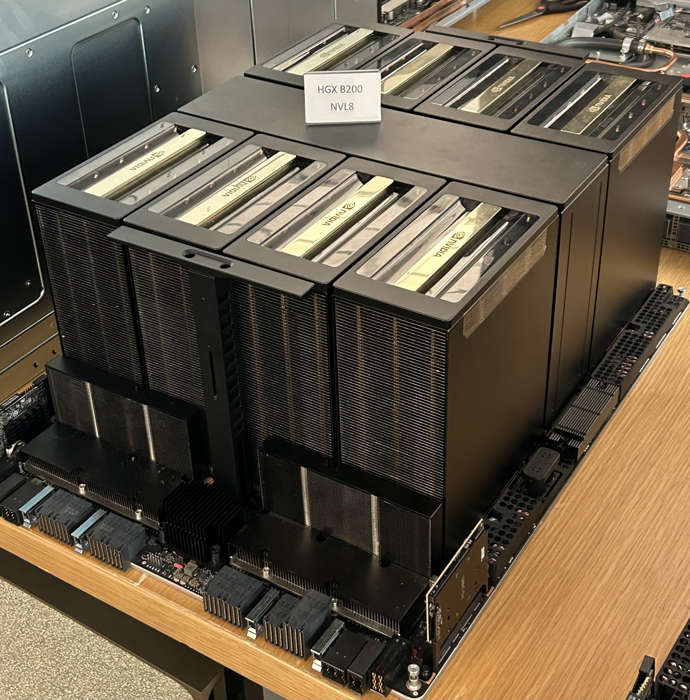
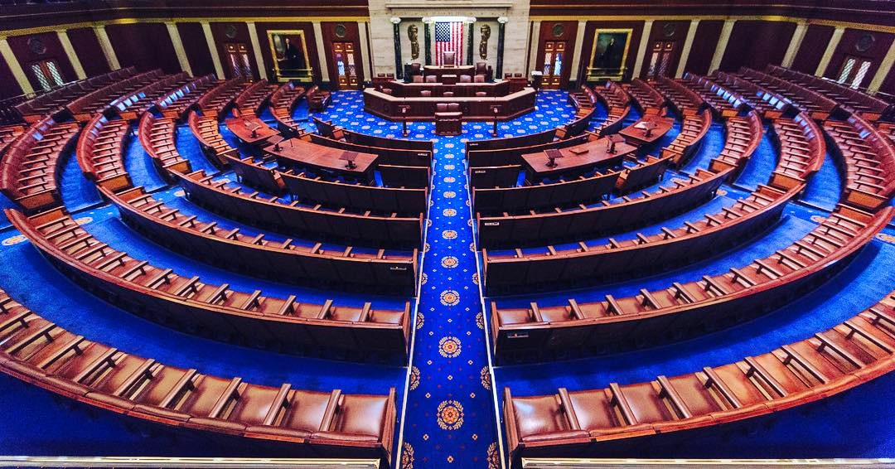

# 텐센트가 오라클에서 AI 칩을 빌리면, 데이터는 어디에 남을까?

_파이낸셜타임스 보도 — 텐센트가 동남아 오라클 데이터센터의 AI 칩 10만 개를 5년간 70억 달러에 빌린다_

## Executive Summary

> [!callout]
> 이 글은 텐센트가 오라클의 동남아시아 데이터센터에서 고성능 AI 칩 10만 개를 5년간 빌리기로 했다는 파이낸셜타임스 보도를 읽는다. 거래의 모양은 단순하다. 칩은 팔리지 않고 쓸 권리만 건너간다. 미국 수출 통제는 그 칩이 중국 땅에 들어가는 것을 막지만, 중국에 앉아 바다 건너 칩에 접속하는 것은 막지 않는다.

> 값은 5년에 70억 달러이고, 텐센트는 이 가운데 약 30%를 먼저 낸다. 그 선불이 재무제표의 부호 하나를 뒤집었다. 텐센트의 2분기 잉여현금흐름은 138억 위안 적자였는데, 회사는 연산 조달 선지급금을 빼면 376억 위안 흑자였을 것이라고 밝혔다. 다만 텐센트도 오라클도 계약을 공식 확인하지 않았고, 정확한 사이트와 칩 모델도 공개되지 않았다.

> 1절부터 3절까지는 파이낸셜타임스·월스트리트저널 보도와 텐센트 실적 공시, 미국 하원 표결 기록에 적힌 사실이다. 4절과 5절은 그 사실을 데이터를 다루는 사람의 눈으로 다시 읽은 이 글의 해석이다.

### 주요 수치

이 거래에 붙은 숫자는 두 갈래다. 앞의 둘은 거래 자체의 크기, 곧 빌리는 양과 치르는 값이다. 뒤의 둘은 그 값이 텐센트 장부에 남긴 흔적과 이 구조에 걸린 시한이다.

출처: [TNW가 전한 파이낸셜타임스 보도(2026-10-01)](https://thenextweb.com/news/tencent-oracle-100000-ai-chips-7bn-lease-ft), [텐센트 2분기 실적 정리](https://www.ciw.news/p/tencent-q2-2026), [미국 하원 표결 기록 Roll Call 13](https://clerk.house.gov/Votes/2026013).

<!-- stat-card -->
**10만 개** — 텐센트가 빌리는 AI 칩 — 5년 동안 쓸 권리만 받는다. 칩은 동남아시아에 남고 텐센트의 자산이 되지 않는다

<!-- stat-card -->
**70억 달러** — 5년치 임대료 — 약 9조 5천억 원. 이 가운데 약 30%를 계약 시점에 먼저 낸다

<!-- stat-card -->
**-138억 위안** — 텐센트 2분기 잉여현금흐름 — 연산 조달 선지급금을 빼면 376억 위안 흑자였다고 회사가 밝혔다

<!-- stat-card -->
**369 대 22** — 원격 접속 규제 법안 하원 표결 — 2026년 1월 12일 통과했지만 상원에 묶여 아직 법이 아니다

## 5년 쓸 권리에 70억 달러, 30%는 선불

파이낸셜타임스는 10월 1일 텐센트가 오라클과 5년짜리 임대 계약을 맺었다고 전했다. 규모는 고성능 AI 칩 약 10만 개, 금액은 약 70억 달러다. 칩은 동남아시아에 있는 오라클 데이터센터 여러 곳에 흩어져 있고, 텐센트는 그 칩을 사들이지 않는다. 계약 기간이 끝나면 텐센트에 남는 장비는 없다. 보도에 따르면 이 거래는 텐센트가 해외에서 맺은 임대 계약 가운데 가장 크다.

*▲ 엔비디아 블랙웰 세대 HGX B200 GPU 서버. 텐센트가 오라클에서 빌리는 10만 개도 같은 세대 칩으로 구성된 랙에 나뉘어 있다 | Source: [Wikimedia Commons](https://commons.wikimedia.org/wiki/File:Nvidia_DGX-B200-HGX.jpg)*

공개된 것과 공개되지 않은 것을 가르면 이렇다. 수량과 금액과 기간, 그리고 계약 금액의 약 30%를 선불로 낸다는 조건은 보도에 나왔다. 어느 나라의 어느 사이트인지, 어떤 칩 모델인지는 나오지 않았다. 텐센트와 오라클 모두 거래를 확인하지 않았고, 로이터는 같은 날 이 보도를 전하면서 수치를 독자적으로 확인하지 못했다고 적었다. 그래도 시장은 반응했다. 보도가 나온 뒤 오라클 주가는 시간외 거래에서 2.5% 넘게 올랐다.

선불 조건은 숫자놀이가 아니다. 텐센트의 2분기 실적에 이미 흔적이 남았다. 자본지출은 528억 위안으로 1년 전보다 176% 늘었고, 직전 분기와 견줘도 65% 많다. 잉여현금흐름은 138억 위안 적자였다. 회사는 같은 공시에서 연산 조달에 들어간 선지급금을 제외하면 잉여현금흐름이 376억 위안 흑자였을 것이라고 밝혔다. 적자는 영업에서 나온 것이 아니라 연산을 미리 사 두는 방식에서 나왔다.

현금의 두께도 얇아졌다. 순현금은 3월 말 1,469억 위안에서 6월 말 582억 위안으로 한 분기 만에 절반 아래로 내려갔다. 신규 AI 제품은 2분기에 105억 위안 손실을 냈고, 1분기 88억 위안보다 늘었다. 매출은 2,048억 위안으로 11% 성장했으니 사업이 흔들린 것은 아니다. 흔들린 것은 현금을 쌓아 두던 리듬이다.

경영진은 이 지출을 한시적인 것으로 설명했다. 류츠핑 사장은 AI 사업에 들어가는 자본지출이 해마다 되풀이되는 것이 아니라 올해와 내년에 몰린 일회성 투자라고 말하면서, 최악의 경우 그 인프라를 원가 회수 수준으로 빌려줄 수 있다는 점을 "분명한 하방 방어"라고 표현했다. 전략책임자 제임스 미첼은 연산 용량을 전부 외부에 빌려주면 당장도 괜찮은 수익이 나지만 더 긴 기간의 수익을 보고 자체 모델을 키우는 쪽을 골랐다고 밝혔다. 빌려 온 연산 위에서 훈위안 계열 모델을 학습시키고 서비스에 태우겠다는 계획이다.

## 칩은 못 사는데 연산은 왜 빌릴 수 있나

미국 수출 통제는 물건의 이동을 규율한다. 엔비디아의 최상급 AI 칩을 중국 고객에게 팔거나 중국으로 보내는 일은 금지돼 있다. 그런데 현행 규정은 바다 건너 서버에 원격으로 접속해 연산만 쓰는 일을 수출로 보지 않는다. 블랙웰 서버를 베이징으로 실어 보낼 수는 없지만, 베이징에 앉아 방콕 어느 랙에 꽂힌 같은 서버의 시간을 빌릴 수는 있다. 상무부 산업안보국이 다루는 것은 선적이고, 원격 로그인은 선적이 아니다.

이것은 규정의 빈틈을 영리하게 비집은 해석이 아니라 규제 당국이 오래 지켜 온 선이다. 산업안보국은 클라우드로 연산 용량을 내주는 행위를 물건의 수출이 아니라 서비스 제공으로 보아 왔고, 그래서 수출관리규정의 적용 대상으로 삼지 않았다. 수출자로 지목되는 쪽도 용량을 파는 사업자가 아니라 그 용량을 쓰는 고객이다. 중국 기업이 학습 데이터를 말레이시아의 서버로 보내 그곳 GPU에서 모델을 돌리고 가중치를 받아 와도, 칩은 제자리에 있으니 수출이라고 부를 사건 자체가 일어나지 않는다.

그래서 같은 연산을 쓰더라도 사는 길과 빌리는 길은 규제 위에서 서로 다른 물건이 된다. 두 길에서 무엇이 달라지는지를 항목별로 늘어놓으면 차이가 분명해진다.

| 항목 | 칩을 사서 들여올 때 | 연산을 빌려 쓸 때 |
| --- | --- | --- |
| 국경을 넘는 것 | 칩이라는 물건 | 워크로드와 학습 데이터 |
| 계약이 끝난 뒤 | 장비가 자산으로 남는다 | 학습된 모델만 남고 장비는 없다 |
| 현행 수출 통제 | 금지 | 규율 대상이 아니다 |
| 설치·전력·냉각 | 직접 책임진다 | 운영사가 책임진다 |
| 학습 데이터가 처리되는 곳 | 자국 안 | 제3국 데이터센터 |
| 멈추게 되는 조건 | 고장과 노후 | 규정 변경, 호스트국 결정, 계약 해지 |

▲ 같은 연산을 쓰더라도 조달 방식에 따라 달라지는 항목. 마지막 두 줄이 이 글이 보려는 자리다.

이번 계약이 이 길을 처음 낸 것은 아니다. 월스트리트저널은 상하이의 AI 스타트업 INF테크가 인도네시아 자카르타에 설치된 엔비디아 블랙웰 칩 2,304개에 접속해 왔다고 보도했다. 경로는 이렇다. 엔비디아가 미국 법인 에이브리스에 칩을 팔았고, 인도네시아 통신사 인도삿 오레두 허치슨이 에이브리스로부터 GB200 랙 32대를 약 1억 달러에 사들였다. 랙 한 대에 블랙웰 칩 72개가 들어가니 합이 2,304개다. 인도삿은 에이브리스가 INF테크를 고객으로 연결해 준 뒤에야 칩을 샀다. 인도삿은 INF테크가 칩에 물리적으로 접근하지는 않는다고 확인했고, 보도에 인용된 수출 통제 전문 변호사들은 이 구조가 현행 규정을 어기지 않는다고 봤다.

텐센트에게도 전례가 있다. 파이낸셜타임스는 지난해 12월 텐센트가 제3자를 거쳐 일본 데이터섹션과 12억 달러가 넘는 임대 계약을 맺고 블랙웰 GPU 1만 5천 개를 쓰게 됐다고 전했다. 3년짜리 계약이고, 데이터섹션의 설비는 일본과 호주에 흩어져 있다. 오사카에 B200 5천 개짜리 클러스터가, 시드니에 B300 1만 개짜리 설비가 있다고 회사가 공개한 바 있다. 이번 오라클 건은 같은 방식을 예닐곱 배로 키운 것이다.

규제 쪽 사정도 이 길을 넓혔다. 바이든 행정부는 클라우드를 통한 우회를 겨냥해 이른바 AI 디퓨전 규칙을 만들었지만, 트럼프 행정부가 2025년 5월 이를 폐기했다. 함께 거둬들인 고객 확인 지침 탓에 태국·싱가포르·말레이시아·일본의 데이터센터가 최종 사용자가 누구인지 확인하지 않고도 중국 기업에 연산을 내줄 수 있게 됐다는 지적이 나왔다.

다만 물건 쪽 문은 그 뒤 다시 좁아졌다. 2026년 5월 31일 산업안보국은 디퓨전 규칙을 집행하지 않기로 한 것과 별개로, 첨단 연산 품목을 중국이나 마카오에 본사를 둔 기업, 또는 최종 모회사가 그곳에 있는 기업에 수출할 때는 그 기업이 어느 나라에 있든 허가가 필요하다는 지침을 냈다. 2023년 11월부터 규정에 들어 있던 조항이 지금도 살아 있다는 확인이었다. 중국 기업의 해외 자회사가 현지 법인이라는 이유만으로 통제 품목을 그냥 사 올 수 있느냐는 업계의 질문에 아니라고 답한 셈이다. 같은 지침은 데이터센터 운영사에 대해서는 이미 설치해 쓰고 있는 품목의 사용과 보관, 정비를 이 지침 때문에 멈출 필요는 없다고 밝혔다. 다만 그 유예를 받는 '선의의 운영사'가 누구를 가리키는지는 정의하지 않았다.

그래서 경계선이 전보다 또렷해졌다. 중국 기업이 해외에 법인을 세워 통제 품목을 직접 사들이는 길에는 허가라는 문턱이 다시 놓였고, 제3자가 소유한 칩에 원격으로 접속하는 길은 열린 채로 남았다. 인도네시아에서는 인도삿이, 일본에서는 데이터섹션이 장비의 주인이었다. 텐센트가 오라클과 맺은 계약도 뒤쪽 모양이다. 칩의 소유자는 미국 기업이고, 텐센트가 받는 것은 그 칩을 쓸 시간이다.

## 구멍을 막으려는 두 움직임과 빠진 권한

워싱턴도 이 구조를 보고 있다. 다만 입법과 행정이 따로 손을 대고 있는데, 둘 다 아직 끝나지 않았다.

### 3.1. 하원을 통과한 법안

2026년 1월 12일 밤, 미국 하원은 원격 접속 보안법을 369 대 22로 통과시켰다. 공화당 167명과 민주당 202명이 찬성했고, 하원 규칙을 유예한 표결이라 3분의 2 찬성이 필요했는데도 넉넉히 넘겼다. 뉴욕주 마이크 롤러 의원이 2025년 4월에 낸 법안이고, 하원 외교위원회는 같은 달 51 대 0으로 처리했다. 내용은 짧다. 2018년 수출관리개혁법을 고쳐 통제 품목에 대한 '원격 접속'도 수출과 같이 다룰 수 있게 한다. 지금까지 수출, 재수출, 역내 이전 셋만 다루던 체계에 네 번째 항목이 붙는다.

발의자인 롤러 의원은 "우리 수출 통제는 가장 약한 고리만큼만 강한데, 지금 중국 공산당은 이 금지를 피해 갈 실질적인 수단을 갖고 있다"고 말했다. 산업안보국을 관할하는 하원 외교위 소위원장인 빌 휴이젠가 의원은 더 짧게 정리했다. "다시 말해 쉬운 말로 하면, 살 수 없는 것이라면 빌릴 수도 없어야 한다." 반대표도 이유가 있었다. 토머스 매시 의원 측은 이 법이 평범한 클라우드 컴퓨팅과 원격 협업, 소프트웨어 개발까지 연방 정부의 통제 아래 두게 된다는 이유로 반대했다고 밝혔다.

*▲ 미국 하원 본회의장. 2026년 1월 12일 이곳에서 원격 접속 보안법(H.R. 2683)이 369 대 22로 통과됐다 | Source: [Wikimedia Commons](https://commons.wikimedia.org/wiki/File:United_States_House_of_Representatives_chamber.jpg)*

### 3.2. 상무부가 쓰고 있는 규정 초안

행정부는 같은 틈을 규정으로 막으려 한다. 디인포메이션은 2026년 8월, 상무부 안의 소수 인원이 폐기된 AI 디퓨전 규칙의 축소판을 쓰고 있다고 보도했다. 겨냥하는 곳은 태국과 싱가포르처럼 미국과 수출 규제 수준이 맞지 않는 제3국이다. 이런 나라로 첨단 AI 칩이 수출될 때 데이터센터 운영사나 대형 구매자가 중국 기업의 원격 접속을 차단하도록 하는 방식이 거론됐다. 연산을 빌려주는 쪽에도 고객 확인 의무를 지우자는 내용이다. 초안을 이르면 9월에 업계 단체와 공유할 수 있다고 전해졌지만, 2026년 10월 현재까지 제안도 공표도 시행도 없다.

앞으로 쓸 규정과 별개로, 이미 맺어진 거래를 되짚는 작업도 함께 시작됐다. 블룸버그는 2026년 8월 산업안보국이 중국 AI 기업들이 역외 GPU에 접근해 온 합법적인 경로를 전수로 들여다보고 있다고 전했다. 밀수를 적발하던 일에서, 법을 어기지 않은 구조가 수출 통제의 취지를 비껴간 것은 아닌지 따지는 일로 초점이 옮겨 간 것이다. 보도가 든 사례에는 문샷AI와 INF테크, 그리고 텐센트가 일본 데이터섹션을 거쳐 블랙웰 1만 5천 개를 쓰게 된 계약이 들어 있었다. 바이트댄스도 함께 거론됐다. 이번 오라클 건보다 한참 작은 텐센트의 직전 거래가 이미 그 목록에 올라 있었다.

### 3.3. 권한이 비어 있는 구간

정작 두 움직임을 이어 줄 권한이 아직 없다. 베이커매켄지의 한 변호사는 디인포메이션에 현행법으로는 상무부가 원격 접속에 관한 규정을 집행할 수 없다는 것이 수출 통제 실무에서 널리 인정된다고 말했다. 산업안보국은 물건의 이동을 규율하도록 설계된 기관이고, 원격 로그인은 아무것도 움직이지 않는다. 그 권한을 새로 주는 것이 바로 하원을 통과한 법안인데, 그 법안은 1월 13일 상원 은행위원회로 넘어간 뒤 연간 국방수권법에 묶어 갈지를 두고 멈춰 있다.

> [!callout]
> 순서를 세워 보면 지금 이 계약의 시간표가 설명된다. 집행 권한을 주는 법은 상원에 있고, 그 권한을 전제로 쓰이는 규정은 초안 단계에 있다. 5년짜리 계약은 그 두 가지가 모두 끝나지 않은 구간에서 서명됐다. 이 조달 구조의 경제성은 칩값이나 전기값만이 아니라, 규정이 아직 따라오지 않았다는 사실 위에 올라앉아 있다.

## 칩은 그 자리에 있고 데이터가 움직인다

수출 통제를 둘러싼 이야기는 대체로 칩이 어디 있느냐를 묻는다. 그런데 임대 구조에서 칩은 움직이지 않는다. 움직이는 것은 그 칩을 향해 건너가는 쪽이다. 모델을 학습시키려면 학습 데이터를 그 데이터센터로 보내거나, 적어도 그 데이터를 읽는 연산을 그곳에서 돌려야 한다. 하드웨어의 국경이 단단해질수록 실제로 국경을 넘는 것은 데이터 쪽이 된다.

▲ 임대 구조에서 국경을 넘는 것과 넘지 않는 것. 출처: 파이낸셜타임스 보도(2026-10-01)와 미국 수출 통제 규정을 바탕으로 작성.

동남아시아 데이터센터는 그래서 묘한 자리에 선다. 미국 관할권에도, 중국 관할권에도 속하지 않는다. 운영사는 미국 기업이고 설비는 제3국 땅에 있으며 고객은 중국 기업이다. 파이낸셜타임스에 따르면 이 지역 데이터센터의 최대 고객은 이미 바이트댄스와 알리바바다. 중국 빅테크의 학습 연산이 어느 한쪽 법의 온전한 지배도 받지 않는 땅에 몰려 있다.

사이트가 어디인지 밝혀지지 않았다는 점이 여기서 다시 걸린다. 동남아시아는 데이터를 국경 밖으로 내보내는 문제에 하나의 규칙을 쓰지 않는다. 싱가포르는 본인 동의를 받거나 받는 쪽이 자국 법과 비슷한 수준의 보호를 보장하면 내보낼 수 있게 한다. 태국은 적정성을 인정받은 나라가 아직 하나도 없어서, 당국이 승인한 표준계약조항이나 구속력 있는 기업 규칙, 또는 위험을 알린 뒤 받은 명시적 동의에 기대야 한다. 인도네시아는 일부 범주에 현지 보관을 요구하고, 베트남은 사이버보안법으로 데이터 현지화를 의무로 못 박았다. 아세안이 2021년에 내놓은 데이터 관리 체계와 국경 간 데이터 이전 표준계약조항이 있기는 하지만 기업이 골라 쓰는 자발적 틀이고, 이 조항을 썼다고 각 회원국 국내법을 지킨 것이 되지는 않는다고 아세안 스스로 적어 두었다. 칩 10만 개가 어느 나라에 놓였는지 모른다는 것은, 그 칩 위를 지나가는 데이터에 어느 규칙이 걸리는지 모른다는 뜻이다.

이 구조가 정치 쟁점이 된 사례도 이미 나왔다. 2026년 7월 22일 백악관 과학기술정책실장 마이클 크라치오스는 중국 문샷AI가 엔비디아 GB300 서버를 보유했고 태국에 있는 같은 시스템에도 접속했다며, 이 연산이 Kimi K3 학습에 쓰였을 것이라고 주장했다. 공개 석상에서 기업 이름이 지목된 사건이지만 접속 기록이나 서버 소유 관계 같은 증거는 함께 공개되지 않았고, 문샷AI도 답하지 않았다. 중요한 것은 주장의 진위보다 주장의 형식이다. 칩이 중국에 들어간 적이 없어도 이 질문은 성립한다.

그렇다면 그 데이터센터를 지나가는 학습 데이터는 어느 법 아래 있나. 답은 세 겹이 함께 정한다. 텐센트와 오라클이 맺은 계약서의 데이터 처리 조항, 데이터센터가 놓인 나라의 국내법, 그리고 미국의 재수출·원격 접속 규정이다. 세 겹 가운데 바깥에 공개된 것은 하나도 없다. 계약서는 당사자만 보고, 호스트국이 어디인지도 밝혀지지 않았으며, 원격 접속 규정은 아직 쓰이는 중이다. 페블러스가 앞서 [오픈웨이트 Kimi K3를 다루며 적었던 것](/blog/kimi-k3-open-weights-data-sovereignty/ko/)도 같은 자리였다. 가중치를 공개한다고 주권이 생기지 않고, 그 모델을 학습시킬 인프라가 어디에 있느냐가 조건을 정한다.

## 페블러스가 이 계약을 주목하는 이유

자체 모델을 키우려는 기업에게 구매와 임대의 선택은 보통 비용표 위에서 끝난다. 장비를 사면 감가상각이 생기고 전력과 냉각을 떠안는다. 빌리면 초기 지출이 줄고 필요한 만큼만 쓴다. 표를 그렇게만 그리면 임대가 거의 언제나 이긴다. 그 표에는 줄이 두 개 빠져 있다. 하나는 학습 데이터가 어느 관할권에서 처리되는가이고, 다른 하나는 그 조건을 누가 바꿀 수 있는가다.

두 번째 줄이 특히 낯설다. 장비를 사면 그 장비를 멈추게 하는 것은 고장과 노후다. 연산을 빌리면 규정 한 문장이 같은 일을 한다. 하원을 통과한 법이 상원을 넘어가거나 상무부 초안이 시행되면, 지금 서명된 5년짜리 계약과 같은 구조의 거래들이 한꺼번에 다시 검토 대상이 된다. 조달 계획의 수명이 계약 기간이 아니라 입법 일정에 묶인다.

페블러스가 AI-Ready Data를 이야기할 때 되풀이하는 말이 있다. 데이터는 어디에 있느냐만큼 어디를 지나왔느냐가 중요하다. 모델이 좋아지려면 좋은 데이터가 필요한데, 그 데이터가 어느 나라 설비에서 어떤 조건으로 처리됐는지가 기록으로 남지 않으면 나중에 그 모델의 내력을 설명할 방법이 없다. 규제가 바뀌어 특정 경로가 막혔을 때, 그 경로로 학습된 부분이 어디까지인지 가려낼 수 있는 조직과 그렇지 않은 조직의 차이는 그때 처음 드러난다.

규모가 작아도 구조는 같다. 해외 클라우드의 GPU 인스턴스에서 사내 데이터로 모델을 미세조정하는 팀이라면, 텐센트가 70억 달러짜리로 만든 질문을 월 몇백만 원짜리로 받아 든 것이다. 그 데이터가 어느 리전에서 처리됐는지, 리전을 고른 근거가 계약서 어디에 적혀 있는지, 규정이 바뀌면 누가 먼저 통보를 받는지. 이 셋에 대한 답이 지금 문서로 나오지 않는다면, 그 조달은 비용표만 보고 고른 것이다.

여기까지 읽어 주셔서 감사하다. 텐센트와 오라클의 임대 계약은 [AI타임스](https://www.aitimes.com/news/articleView.html?idxno=215909)와 [TNW](https://thenextweb.com/news/tencent-oracle-100000-ai-chips-7bn-lease-ft) 보도에서 원문을 볼 수 있고, 주권과 인프라의 관계는 [소버린 AI 지형](/project/SovereignAI/ko/)에 모아 두었다. 여러분의 조직은 학습에 쓰는 연산을 어디에서 빌리고 있는지, 그 계약서에 데이터가 머무는 곳이 적혀 있는지 한번 확인해 보시고 알려 주시면 좋겠다.

## 참고문헌

### 계약·실적 보도

- 1.AI타임스. (2026). "[텐센트, 오라클서 AI 칩 10만 개 임대…5년간 70억 달러 규모](https://www.aitimes.com/news/articleView.html?idxno=215909)." 2026-10-02.
- 2.TNW. (2026). "[Tencent leases 100,000 AI chips from Oracle in a $7bn deal, FT reports](https://thenextweb.com/news/tencent-oracle-100000-ai-chips-7bn-lease-ft)." 2026-10-01.
- 3.뉴스핌. (2026). "[[중국 특징주] 텐센트, 9조원 들여 오라클서 AI 칩 10만 개 임대](https://www.newspim.com/news/view/20261001001019)." 2026-10-01.
- 4.TNW. (2026). "[Tencent capex jumped 176% and free cash flow went negative](https://thenextweb.com/news/tencent-q2-2026-capex-176-percent-free-cash-flow-negative-ai)." 텐센트 2026년 2분기 실적.
- 5.China Internet Watch. (2026). "[Tencent's AI bet hardens at RMB10.5B Q2 cost](https://www.ciw.news/p/tencent-q2-2026)." 선지급금 제외 시 잉여현금흐름·순현금 변동.

### 우회 구조 조사 보도

- 6.Tom's Hardware. (2026). "[Chinese AI startup gets access to 2,300 banned Blackwell GPUs by exploiting cloud loophole](https://www.tomshardware.com/tech-industry/artificial-intelligence/chinese-ai-startup-gets-access-to-2-300-banned-blackwell-gpus-by-exploiting-cloud-loophole-rents-compute-from-indonesian-firm-with-32-nvidia-gb200-server-racks)." 월스트리트저널 조사 보도 정리.
- 7.Seeking Alpha. (2025). "[Tencent obtains access to Nvidia Blackwell chips via Japanese third-party: report](https://seekingalpha.com/news/4533603-tencent-obtains-access-to-nvidia-blackwell-chips-via-japanese-third-party-report)." 2025-12.
- 8.The Hill. (2026). "[White House official accuses Chinese startup of improperly using Anthropic's latest model, accessing restricted Nvidia chips](https://thehill.com/policy/technology/5984510-white-house-moonshot-ai-anthropic-nvidia/)." 2026-07.

### 입법·규제 기록

- 9.U.S. House of Representatives. (2026). "[Roll Call 13 — H.R. 2683, 119th Congress, 2nd Session](https://clerk.house.gov/Votes/2026013)." 2026-01-12.
- 10.GovTrack. "[H.R. 2683: Remote Access Security Act](https://www.govtrack.us/congress/bills/119/hr2683)." 발의·위원회·상원 회부 경과.
- 11.Export Compliance Daily. (2026). "[House Backs Ending Remote Access Export Control 'Loophole' for Chips](https://exportcompliancedaily.com/article/2026/01/14/house-backs-ending-remote-access-export-control-loophole-for-chips-2601130006)." 2026-01-14. 휴이젠가·매시 발언.
- 12.The Register. (2026). "[Congress votes to kick China off remote GPU services](https://www.theregister.com/2026/01/13/congress_votes_china_gpu_cloud/)." 2026-01-13. 롤러·물레나르 발언.
- 13.Baker McKenzie. (2026). "[US House Passes Remote Access Security Act](https://sanctionsnews.bakermckenzie.com/us-house-passes-remote-access-security-act/)." 수출관리개혁법 개정 내용.
- 14.Gear Live. (2026). "[The US Is Reportedly Drafting a Rule to Stop China Renting the AI Chips It Can't Buy](https://www.gearlive.com/news/article/us-rule-china-remote-access-ai-chips-report)." 디인포메이션 보도 정리, 2026-08.
- 15.Baker McKenzie. (2026). "[BIS Clarifies That License Requirements for Advanced Computing Items to Country Group D:5- and Macau-Headquartered Entities Remain in Force Despite AI Diffusion Rule Non-Enforcement](https://sanctionsnews.bakermckenzie.com/bis-clarifies-that-license-requirements-for-advanced-computing-items-to-country-group-d5-and-macau-headquartered-entities-remain-in-force-despite-ai-diffusion-rule-non-enforcement/)." 2026-05-31 산업안보국 지침.
- 16.Holland & Knight. (2026). "[BIS Publishes Guidance on License Requirements for Advanced Computing Items](https://www.hklaw.com/en/insights/publications/2026/06/bis-publishes-guidance-license-requirements-advanced-computing-items)." '선의의 운영사' 유예와 그 정의 공백.
- 17.Tech Times. (2026). "[BIS Targets Legal Cloud Compute as China AI Firms Bypass Export Controls](https://www.techtimes.com/articles/323532/20260807/bis-targets-legal-cloud-compute-china-ai-firms-bypass-export-controls.htm)." 2026-08-07. 블룸버그 보도 정리, 합법 경로 전수 검토.

### 데이터 이전 규칙

- 18.Pertama Partners. (2026). "[Cross-Border Data Transfers in Asia: Complete Guide 2026](https://www.pertamapartners.com/insights/cross-border-data-transfers-asia)." 싱가포르·태국·인도네시아·베트남 등 국가별 국경 간 이전 요건.
- 19.ASEAN. (2021). "[ASEAN Model Contractual Clauses for Cross Border Data Flows](https://asean.org/wp-content/uploads/3-ASEAN-Model-Contractual-Clauses-for-Cross-Border-Data-Flows_Final.pdf)." 자발적 채택 원칙과 국내법 준수 보장 여부.
