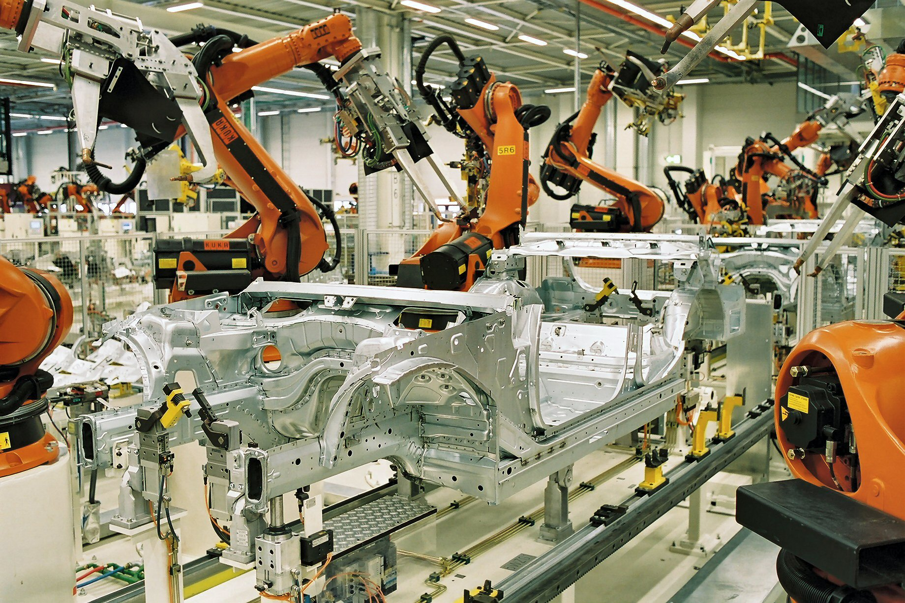

# One Sentence. One Factory.

_How NVIDIA Omniverse, LLMs, and OpenUSD Are Reinventing Manufacturing_

## Executive Summary

> [!callout]
> "Move the assembly line to the north wall. Add three robot cells." That sentence — typed in plain English — now generates a full 3D factory layout. NVIDIA's USD Layout NIM, unveiled at SIGGRAPH 2024, converts natural language instructions into OpenUSD scenes in real time. BMW used this stack to virtually complete its new Debrecen plant in Hungary before a single beam was raised. Today 15,000 BMW employees use that system daily.

> The infrastructure has three layers. NVIDIA Omniverse provides a physics-accurate 3D rendering environment. OpenUSD (Universal Scene Description) serves as the shared data language across every tool in the stack — CAD, ERP, robot simulators, and AR viewers. And LLM-based NIM microservices translate human intent into precise scene commands. Accenture packaged this entire stack into a commercial product — the Physical AI Orchestrator, launched October 2025 — connecting Omniverse, NVIDIA Mega Blueprint, and a model-agnostic AI Refinery layer.

> But the speed of this transition exposes a problem most vendors aren't talking about. AI-generated factory layouts are only as trustworthy as the data they're validated against. The sim-to-real gap — the delta between simulation and physical reality — is the silent failure mode of every Physical AI deployment. That's where Pebblous sits in this stack: not competing with Omniverse, but certifying that what Omniverse generates is actually fit for training AI.

## The Paradigm Shift Nobody Noticed

Factory design used to be a multi-month slog. A CAD specialist drafts 2D floor plans. A simulation engineer converts them to 3D. Logistics, safety, and production teams review in their own siloed tools. A change request resets everything back to square one. The bottleneck wasn't engineering skill — it was the friction between incompatible systems.

That friction is disappearing, driven by two forces that converged around 2024.

The first is a **common data standard**. OpenUSD — originally built by Pixar for film production — has become the lingua franca of industrial digital twins. Over 400 companies including NVIDIA, Siemens, PTC, Autodesk, and Rockwell now participate in the OpenUSD Alliance. When every tool speaks USD, you stop translating between formats and start actually building things.

The second is a **language interface**. Mature LLMs can now extract spatial relationships, constraints, and physical logic from plain text. "Keep a 5-meter safety corridor on the east side" becomes a precise coordinate instruction in USD. These two forces — a universal format plus a language bridge — are what make text-to-factory possible.

- 2D CAD drawings → weeks
- Manual 3D conversion → weeks
- Siloed reviews per tool
- Change request → restart everything
- Incomplete validation before construction

- Text prompt → USD scene → immediate
- Real-time physics simulation
- Single USD platform, all teams
- Change → reflects instantly
- Virtual completion before groundbreak

<!-- stat-card -->
**Factory Design: Then vs. Now** — ⏪ Traditional Workflow — ⚡ Omniverse + LLM Workflow

This isn't incremental automation. It's a temporal inversion. You validate the entire factory — every robot path, every logistics flow, every emergency scenario — before anything is physically built. Construction becomes the final step of a process that was already proven in simulation.

## USD Layout NIM — How Text Becomes Factory

NVIDIA's **[USD Layout NIM](https://nvidianews.nvidia.com/news/nvidia-announces-generative-ai-models-and-nim-microservices-for-openusd)**, first shown at [SIGGRAPH 2024](https://nvidianews.nvidia.com/online-press-kit/siggraph-2024-news) and generally available since [CES 2025](https://nvidianews.nvidia.com/news/nvidia-expands-omniverse-with-generative-physical-ai), is the core technical component in this shift. NIM stands for NVIDIA Inference Microservice — a packaged AI inference capability that other software can call via API.

What it does, concretely: a user types a layout instruction — "Place the conveyor belt 5 meters from the east wall, with a welding robot cell immediately adjacent" — and the NIM translates that into OpenUSD scene composition commands. The result appears instantly in a live Omniverse scene, viewable in 3D.

*▲ USD Search NIM in action: typing "Objects in a warehouse such as conveyor belts, pallets, and boxes" generates a 3D scene in Omniverse. This is the text-to-scene pipeline described in this section. | Source: [NVIDIA Technical Blog](https://developer.nvidia.com/blog/integrate-generative-ai-into-openusd-workflows-using-new-nvidia-omniverse-developer-tools/)*

### 2.1 OpenUSD — The Factory's Common Language

USD deserves more attention than it gets in manufacturing circles. It's simultaneously a file format, an API, and a composition model for 3D scenes. Originally designed to handle the complexity of Pixar's film pipelines — think _Monsters, Inc._, where dozens of artists need to work on overlapping scene elements — it's now the industrial standard for digital twins in automotive, aerospace, and construction.

Its killer feature in manufacturing is **layered composition**. The building structure, machine placements, plumbing and electrical infrastructure, robot paths, and safety zones all live as independent layers — editable separately, rendered together. The mechanical engineering team edits their layer; the full factory scene updates automatically. No more "send me the latest CAD file."

### 2.2 NVIDIA Mega Blueprint — Testing the Robot Fleet

Generating a layout is step one. Validating it is step two. NVIDIA's **Mega Blueprint** framework runs multi-robot fleet simulations inside factory digital twins with full physics accuracy. Hundreds of AMRs (Autonomous Mobile Robots) navigate the space — does anything collide? Where do paths cross? What happens in an emergency evacuation? All of this runs before any physical robot is purchased, let alone deployed.

<!-- stat-card -->
**The Text-to-Factory Pipeline** — 1 — Natural Language Input — "Rearrange assembly line relative to north wall, add 3 robot cells" — 2 — USD Layout NIM — LLM translates natural language → OpenUSD scene commands — 3 — Omniverse Scene Generation — Physics-accurate 3D rendering, viewable instantly — 4 — Mega Blueprint Validation — Multi-robot fleet simulation, collision and path verification — ✓ — Virtual Completion → Physical Groundbreak — Construction executes a design that's already been proven

USD Layout NIM shipped as GA in NVIDIA AI Enterprise subscriptions at CES 2025. It's not a roadmap item. It's available now.

## The Enterprise Stack: Accenture's Physical AI Orchestrator

Individual components don't make an enterprise product. Accenture's **[Physical AI Orchestrator](https://newsroom.accenture.com/news/2025/accenture-launches-physical-ai-orchestrator-to-help-manufacturers-build-software-defined-facilities)**, launched October 28, 2025, is the first major attempt to package this entire stack for Fortune 500 deployment.

The architecture has three layers:

<!-- stat-card -->
**🏭** — NVIDIA Omniverse + Mega Blueprint — The simulation substrate. Physics-accurate 3D environment, USD-based data exchange, multi-robot fleet validation. Accenture builds enterprise workflows on top of this layer rather than replacing it.

<!-- stat-card -->
**🤖** — AI Refinery (Model-Agnostic) — No vendor lock-in by design. Selects and swaps the best model for each task — layout optimization, logistics forecasting, anomaly detection. Accenture's existing LLM partnerships (Anthropic, Google, Microsoft among others) feed into this layer.

<!-- stat-card -->
**🔗** — Enterprise Integration Layer — Connectors that pipe ERP, MES, and IoT sensor data into the Omniverse digital twin. Real factory operations reflect in the digital twin in real time.

The model-agnostic principle matters more than it sounds. Right now, Claude might be the best choice for a given task. In 18 months, something else might be better. The factory operations data and workflows stay intact; the model underneath is swapped. That's the architectural decision that prevents vendor lock-in — and it's why enterprise buyers should care about it.

<!-- stat-card -->
**💡 On Claude + Omniverse** — Accenture has maintained a strategic partnership with Anthropic since 2023. Claude-class models can be included in AI Refinery for specific tasks. However, as of April 2026, there is no official public disclosure confirming Claude is used directly for USD scene translation within the Physical AI Orchestrator — the model-agnostic architecture means configurations vary by deployment.

Competition is moving fast. Siemens revealed the **Digital Twin Composer** at CES 2026 — a natural language interface for building and editing digital twins, Omniverse-compatible. Dassault Systèmes and NVIDIA announced **Industry World Models** in February 2026: domain-specific physical AI models co-developed for industrial use cases. The text-to-factory stack is becoming a contested platform.

## Already in Production — BMW, Mercedes-Benz, Wandelbots

None of this is pilot-phase experimentation. The world's largest manufacturers are running it in production.

### 4.1 BMW — The World's First Virtually Completed Factory

BMW's Debrecen plant in Hungary holds a singular distinction: it is the first factory in history to be completely designed and validated in a digital twin before physical construction began. Every production line placement, every robot path, every logistics corridor was simulated and optimized in Omniverse. When workers broke ground, they were executing a design that had already been run through thousands of iterations.

That project became the foundation for **[BMW FactoryExplorer](https://blogs.nvidia.com/blog/bmw-group-nvidia-omniverse/)** — a company-wide Omniverse platform now used by 15,000 BMW employees across 30+ production facilities. Production engineers simulate new equipment before procurement. Logistics teams test routing changes in real time. Safety officers run emergency scenarios without ever stopping the line.

*▲ BMW × NVIDIA Omniverse at GTC 2023: left side shows the real factory floor (orange KUKA robots), right side shows its Omniverse digital twin (white wireframe). BMW's iFACTORY strategy — simulate first, build second. | Source: [NVIDIA Blog](https://blogs.nvidia.com/blog/bmw-group-nvidia-omniverse/)*

<!-- stat-card -->
**BMW FactoryExplorer at Scale** — 15,000 — daily users — 30+ — production sites connected — weeks → hours — layout change review time

*▲ Industrial robot arm in BMW Leipzig's body manufacturing (Karosseriebau) process. These are precisely the robots whose placement, paths, and coordination BMW simulates in Omniverse — before they're ever physically installed. | Source: [Wikimedia Commons](https://commons.wikimedia.org/wiki/File:BMW_Leipzig_MEDIA_050719_Download_Karosseriebau_max.jpg)*

### 4.2 Mercedes-Benz — MO360 as a Global Nerve System

Mercedes-Benz's [MO360 (Mercedes-Benz Operations 360)](https://blogs.nvidia.com/blog/mercedes-benz-ev-nvidia-omniverse-generative-ai/) platform connects over 30 production facilities into a single digital ecosystem. Live factory data flows into digital twins in real time. When a bottleneck appears anywhere in the global production network, AI recommends which line at which plant should adjust — and Omniverse provides the 3D visualization and simulation layer that makes those recommendations explainable to the people who act on them.

*▲ Mercedes-Benz × NVIDIA Omniverse: a production vehicle with its digital twin overlay, visualizing the MO360 ecosystem. Real-time factory data feeds into the digital twin, enabling AI-driven recommendations across 30+ global plants. | Source: [NVIDIA Blog](https://blogs.nvidia.com/blog/mercedes-benz-ev-nvidia-omniverse-generative-ai/)*

### 4.3 Wandelbots NOVA — Language Meets Robot Programming

The text interface isn't limited to layout design. [Wandelbots](https://www.wandelbots.com)' **NOVA** platform extends it to robot programming itself. Traditionally, each robot brand required its own proprietary programming language — a specialist skill most factory floors don't have in abundance. NOVA replaces that with natural language or physical demonstration: show the robot what you want it to do, and it converts that into executable robot instructions.

NOVA integrates with NVIDIA Isaac Sim, which means behaviors validated in a digital twin can be deployed directly to physical robots. For small and mid-sized manufacturers — who can't afford large robotics engineering teams — this is the moment the technology becomes accessible.

## Why 2024–2026? Three Convergences

Text-to-factory automation didn't become possible because of one breakthrough. Three independent technology curves hit critical thresholds at the same time.

<!-- stat-card -->
**🧠1. LLM Spatial Reasoning Reached Deployment Quality** — Post-GPT-4 models can reliably extract spatial relationships, physical constraints, and manufacturing logic from natural language. "5-meter clearance," "north wall reference," "no collision paths" — these constraints can now be translated into structured USD commands at a quality level enterprises will bet production lines on.

<!-- stat-card -->
**🖥️2. GPU Computing Made Real-Time Physics Economical** — Since the Hopper architecture (H100), running a fully physics-accurate simulation of a factory with thousands of simultaneous robots went from a multi-day job to a multi-hour one. The compute cost crossed the threshold where iterative simulation became economically rational for planning decisions.

*▲ NVIDIA H100 Tensor Core GPU. The Hopper architecture crossed the compute threshold that made real-time physics simulation of factory-scale robot fleets economically viable — shifting digital twins from R&D experiments to daily production tools. | Source: [Wikimedia Commons](https://commons.wikimedia.org/wiki/File:NVIDIA_H100_(极客湾Geekerwan)_014.png)*

<!-- stat-card -->
**📐3. OpenUSD Crossed the Industry Adoption Threshold** — With 400+ companies in the [OpenUSD Alliance](https://aousd.org) — including every major CAD, ERP, MES, and robotics software vendor — there's now a common format connecting every link in the manufacturing software chain. Without this, language-to-layout is a dead end. You'd translate text perfectly into a format nobody else's tools can read.

The market is reflecting this. Digital twin market estimates range from $21–36B in 2025 to $150B+ by the early 2030s — with significant variance between research firms. The exact number matters less than the direction: factory digitalization has shifted from a cost-reduction project to the core infrastructure of competitive manufacturing.

## The Hidden Bottleneck — Data Quality

Here's what the vendor pitch decks don't show you.

NVIDIA Omniverse provides physics-accurate rendering. "Physics-accurate" means the simulation respects real-world physical laws. But it does not mean the simulation _perfectly matches your specific factory floor_. These are different claims, and confusing them is where Physical AI projects fail.

Pebblous' **PebbleSim** sits at this exact gap. If Omniverse is the rendering infrastructure, PebbleSim is the **data quality certification layer** for the AI training data that infrastructure generates. They're not competing — they're complementary layers in the same stack.

### 6.1 The Sim-to-Real Gap

The sim-to-real gap is the delta between what a simulation models and what physically exists. It shows up as microscopic floor vibrations that affect sensor readings. Camera perception errors from specific lighting conditions your simulator didn't model. Tolerance stack-ups in mechanical components that accumulate across a production run.

The practical consequence: an AI model trained entirely on Omniverse-generated synthetic data can fail in production in ways that have nothing to do with model architecture. The robot arm that worked perfectly in simulation slips on a floor surface with slightly different friction than what the simulation assumed. This is the most common root cause of Physical AI deployment failures — not bad models, but bad training data.

### 6.2 What Data Quality Certification Covers

PebbleSim evaluates how faithfully synthetic data generated by Omniverse represents the actual manufacturing environment it's supposed to model. Specifically:

▶**Distribution alignment:** Does the statistical distribution of synthetic sensor data match real sensor data from your floor? Are edge cases adequately represented, or is your training set suspiciously clean?

▶**Physical parameter coverage:** Has the simulation sampled sufficient variation in lighting conditions, friction coefficients, camera noise, and component tolerances? An under-sampled parameter space is a ticking failure mode.

▶**Label consistency:** Do the labels in your synthetic data (robot positions, object identities, safety states) map onto the same semantic meaning in the real environment? Label drift between simulation and reality is a frequent source of silent model degradation.

- Physics-accurate 3D rendering
- Factory layout simulation
- Multi-robot fleet validation
- USD-based data exchange

- AI training data quality certification
- Sim-to-real gap measurement
- Synthetic data representativeness
- Pre-deployment reliability assurance

<!-- stat-card -->
**Omniverse vs. PebbleSim — Complementary Roles** — NVIDIA Omniverse — PebbleSim — These are complementary, not competing

The post-mortems of Physical AI deployment failures almost never blame the model architecture. They blame the training data. A model trained on synthetic data that didn't cover a specific real-world condition fails exactly in that condition. The infrastructure layer (Omniverse) is maturing fast. The data quality layer is where the next competitive advantage gets built.

## Conclusion

Text-to-factory is not a 2028 roadmap item. It's a 2026 operational reality. BMW has 15,000 people using it every day. Mercedes-Benz runs global production decisions through digital twins. Siemens, Dassault, and Wandelbots have all shipped production products in this space within the last 18 months. The NVIDIA AI Enterprise subscription that includes USD Layout NIM is available now.

The speed of adoption is not surprising in retrospect. Three technology curves — LLM spatial reasoning, GPU-accelerated physics simulation, and OpenUSD's industry adoption — crossed their thresholds within the same 24-month window. When enabling technologies converge simultaneously, adoption accelerates faster than forecasters expect.

The next frontier isn't the rendering quality of simulations. It's the trustworthiness of the data those simulations produce for AI training. Sim-to-real gap is the silent failure mode. Whoever closes that gap first — whoever builds the certification layer between Omniverse's output and production-ready AI — will own the next layer of the Physical AI stack.

> [!callout]
> The Physical AI infrastructure is maturing rapidly. The next competitive advantage belongs to whoever can certify — with evidence, not just confidence — that what their simulation generates is actually fit for training the robots that run in the real world.

## References

1. NVIDIA Newsroom — [NVIDIA Announces Generative AI Models and NIM Microservices for OpenUSD (SIGGRAPH 2024)](https://nvidianews.nvidia.com/news/nvidia-announces-generative-ai-models-and-nim-microservices-for-openusd)
2. NVIDIA Newsroom — [NVIDIA Expands Omniverse With Generative Physical AI (CES 2025)](https://nvidianews.nvidia.com/news/nvidia-expands-omniverse-with-generative-physical-ai)
3. Accenture Newsroom — [Accenture Launches "Physical AI Orchestrator" (Oct 28, 2025)](https://newsroom.accenture.com/news/2025/accenture-launches-physical-ai-orchestrator-to-help-manufacturers-build-software-defined-facilities)
4. NVIDIA Blog — [BMW Group Starts Global Rollout of NVIDIA Omniverse](https://blogs.nvidia.com/blog/bmw-group-nvidia-omniverse/)
5. BMW Group Press — [BMW Group and NVIDIA Take Virtual Factory Planning to the Next Level](https://www.press.bmwgroup.com/global/article/detail/T0329569EN/bmw-group-and-nvidia-take-virtual-factory-planning-to-the-next-level)
6. NVIDIA Blog — [Mercedes-Benz Prepares Its Digital Production System With NVIDIA Omniverse and Generative AI](https://blogs.nvidia.com/blog/mercedes-benz-ev-nvidia-omniverse-generative-ai/)
7. Wandelbots — [Wandelbots NOVA: Software-Defined Automation for Industrial Robots](https://www.wandelbots.com)
8. Alliance for OpenUSD — [aousd.org](https://aousd.org)
