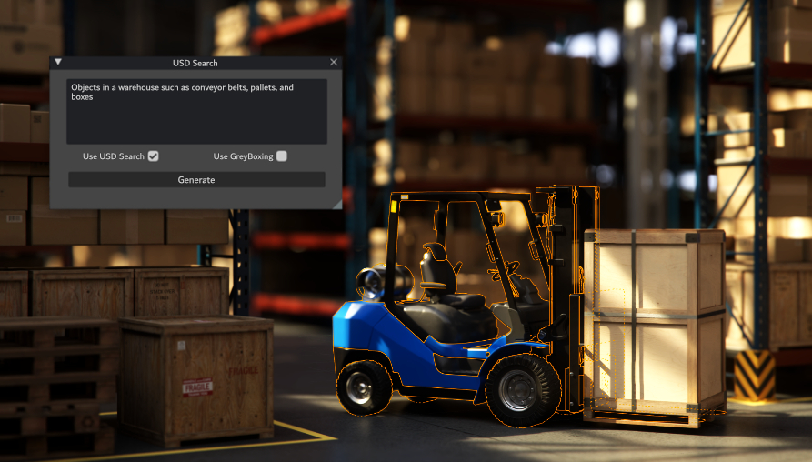
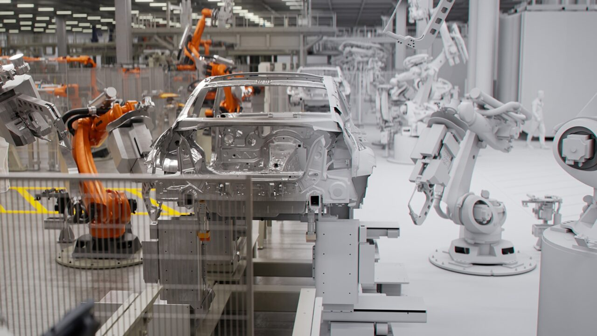
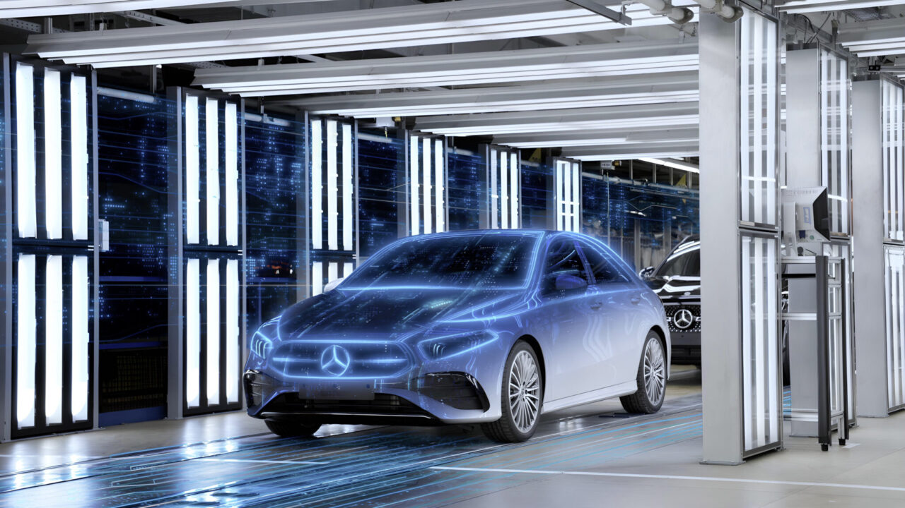
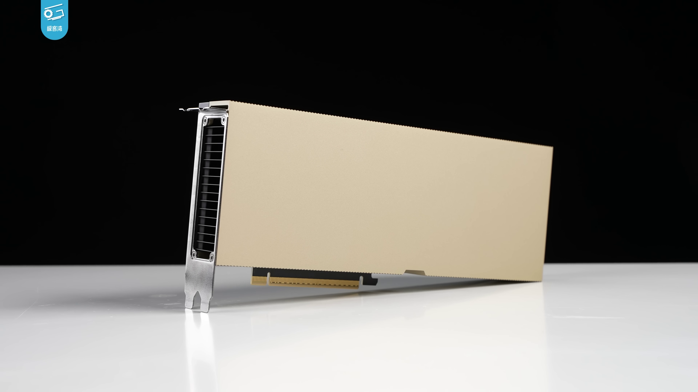

# 텍스트 한줄로 공장을 세운다.

_Omniverse, USD, Physical AI가 만드는 디지털 공장 혁명_

## Executive Summary

> [!callout]
> "조립 라인을 북쪽 벽 기준으로 재배치하고, 로봇 셀 세 개를 추가해줘." 이 한 문장이 공장 3D 설계도로 변환됩니다. NVIDIA가 SIGGRAPH 2024에서 공개한 USD Layout NIM은 자연어 프롬프트를 OpenUSD 씬(scene)으로 변환하는 마이크로서비스입니다. BMW는 이 기술로 헝가리 데브레첸 공장을 세계 최초로 '가상 완성' 후 착공했고, 15,000명의 직원이 Omniverse 기반 공장 탐색 시스템을 일상 도구로 씁니다.

> 이 기술의 핵심 인프라는 세 개의 레이어입니다. NVIDIA Omniverse가 물리 법칙을 따르는 3D 렌더링 환경을 제공하고, USD(Universal Scene Description)가 공장 설계 데이터를 교환하는 공통 언어 역할을 하며, LLM 기반 NIM 마이크로서비스가 자연어를 이 환경에 맞는 명령으로 번역합니다. Accenture는 2025년 10월 "Physical AI Orchestrator"를 출시해 이 스택을 엔터프라이즈 수준으로 통합했습니다 — Omniverse + NVIDIA Mega Blueprint + AI Refinery가 하나의 파이프라인으로 연결됩니다.

> 그러나 텍스트→공장 자동화가 얼마나 신뢰할 수 있느냐는 결국 데이터 품질에 달려 있습니다. AI가 생성한 공장 레이아웃은 실제 제조 환경 데이터로 검증되어야 합니다. 시뮬레이션이 현실과 얼마나 가깝게 일치하는지(sim-to-real gap)가 모든 의사결정의 신뢰도를 결정합니다. 페블러스가 이 기술 전환의 중심에 있는 이유가 여기에 있습니다.

## 무슨 일이 일어나고 있나

공장 설계는 전통적으로 수개월짜리 프로젝트였습니다. CAD 전문가가 2D 도면을 그리고, 시뮬레이션 엔지니어가 3D 모델로 변환하고, 물류·안전·생산성 전문가들이 각자의 소프트웨어로 검토합니다. 도구가 다르고, 데이터 형식이 다르고, 변경 사항이 생기면 모든 과정이 다시 시작됩니다.

2024~2026년 사이에 이 프로세스가 근본적으로 바뀌고 있습니다. 변화는 두 방향에서 동시에 왔습니다.

첫 번째 방향은 **공통 데이터 표준**입니다. Pixar가 영화 제작을 위해 개발한 OpenUSD(Universal Scene Description)가 제조업의 공통 언어로 자리잡고 있습니다. CAD 소프트웨어, 로봇 시뮬레이터, AR/VR 도구, 공장 관리 시스템 — 서로 다른 소프트웨어가 USD를 통해 동일한 공장 데이터를 공유합니다. 2024년 기준, NVIDIA·Siemens·PTC·Autodesk·Rockwell 등 주요 제조·소프트웨어 기업 400개 이상이 OpenUSD Alliance에 참여하고 있습니다.

두 번째 방향은 **언어 인터페이스의 등장**입니다. LLM이 성숙하면서, 전문 도구의 복잡한 조작을 자연어로 추상화할 수 있게 됐습니다. "로봇을 여기에 놓아라"는 명령이 USD 씬의 구체적인 좌표계 명령으로 자동 번역됩니다. 이 두 흐름이 만나는 지점에서 "텍스트 프롬프트 → 공장 레이아웃" 자동화가 탄생했습니다.

- CAD → 2D 도면 (수주)
- 수작업 3D 변환 (수주)
- 소프트웨어별 개별 검토
- 변경 → 전 과정 반복
- 착공 전 검증 불완전

- 텍스트 프롬프트 → USD 씬 (즉시)
- 실시간 물리 시뮬레이션
- 단일 USD 플랫폼 통합
- 변경 → 실시간 반영
- 가상 완성 후 착공

<!-- stat-card -->
**공장 설계 패러다임 변화** — ⏪ 기존 방식 — ⚡ Omniverse + LLM 방식

이것은 단순한 자동화 수준 향상이 아닙니다. 설계와 검증의 시간 축 자체가 뒤집힙니다. 착공 전에 공장 전체를 디지털 공간에서 완성하고, 수만 가지 시나리오를 시뮬레이션하고, 문제를 발견하고 수정합니다. 실제 착공은 사실상 이미 검증된 설계를 현실에 구현하는 과정에 가깝습니다.

## USD Layout NIM — 텍스트가 공장이 되는 과정

2024년 SIGGRAPH에서 NVIDIA가 공개한 **[USD Layout NIM](https://nvidianews.nvidia.com/news/nvidia-announces-generative-ai-models-and-nim-microservices-for-openusd)**은 이 변화의 핵심 기술 컴포넌트입니다. NIM(NVIDIA Inference Microservice)은 AI 추론 기능을 API 형태로 패키징한 마이크로서비스 단위입니다 — 다른 소프트웨어가 호출해서 쓸 수 있는 AI 기능 블록입니다.

USD Layout NIM이 하는 일은 구체적으로 이렇습니다. 사용자가 자연어로 레이아웃 지시를 입력하면 — "컨베이어 벨트를 동쪽 벽에서 5미터 떨어뜨리고, 용접 로봇 셀을 그 옆에 배치해줘" — NIM이 이를 OpenUSD 포맷의 씬 구성 명령으로 변환합니다. 결과는 즉시 Omniverse 씬에 반영되어 3D 공간에서 확인할 수 있습니다.

*▲ USD Search NIM 데모: "Objects in a warehouse such as conveyor belts, pallets, and boxes" 프롬프트 입력 → Omniverse 씬에 창고 오브젝트 자동 생성. 텍스트→3D 씬 변환 파이프라인의 실제 인터페이스. | Source: [NVIDIA Technical Blog](https://developer.nvidia.com/blog/integrate-generative-ai-into-openusd-workflows-using-new-nvidia-omniverse-developer-tools/)*

### 2.1 OpenUSD — 공장 설계의 공통 언어

USD를 이해하는 것이 이 기술 전체를 이해하는 핵심입니다. USD는 3D 씬을 계층적 트리 구조로 표현하는 파일 포맷이자 API입니다. 영화 _몬스터 주식회사_의 렌더링 파이프라인에서 시작해, 지금은 제조·건축·자동차·항공우주 분야의 디지털 트윈 표준으로 자리 잡았습니다.

제조업에서 USD의 강점은 **레이어 합성(layered composition)**에 있습니다. 공장 건물 구조, 기계 배치, 배관·전기 인프라, 로봇 경로, 안전 구역 — 각 레이어를 독립적으로 관리하면서도 하나의 통합된 씬에서 모두 볼 수 있습니다. 기계 담당자는 자신의 레이어만 편집하고, 전체 공장 씬은 자동으로 업데이트됩니다.

### 2.2 NVIDIA Mega Blueprint — 로봇 플릿 테스트

레이아웃이 생성되면 다음 단계는 검증입니다. NVIDIA **Mega Blueprint**는 공장·창고 디지털 트윈 안에서 멀티 로봇 플릿이 작동하는 모습을 물리 정확도 시뮬레이션으로 테스트하는 프레임워크입니다. 수백 대의 AMR(자율이동로봇)이 서로 충돌하지 않는지, 동선이 교차하지 않는지, 비상 상황에서 어떻게 이동하는지 — 실제 로봇을 배치하기 전에 디지털 공간에서 모두 검증합니다.

<!-- stat-card -->
**텍스트 → 공장 파이프라인** — 1 — 자연어 입력 — "조립 라인을 북벽 기준 재배치, 로봇 셀 3개 추가" — 2 — USD Layout NIM — LLM이 자연어 → OpenUSD 씬 명령 변환 — 3 — Omniverse 씬 생성 — 물리 정확도 3D 렌더링, 실시간 확인 — 4 — Mega Blueprint 검증 — 멀티 로봇 플릿 시뮬레이션, 충돌·동선 검증 — ✓ — 가상 완성 → 물리 착공 — 검증된 설계의 물리적 복사

중요한 점은 이 파이프라인이 이미 작동하고 있다는 사실입니다. NVIDIA는 USD Layout NIM을 [CES 2025](https://nvidianews.nvidia.com/news/nvidia-expands-omniverse-with-generative-physical-ai)에서 GA(일반 공개) 버전으로 출시했고, 현재 NVIDIA AI Enterprise 구독에 포함되어 기업들이 즉시 사용할 수 있습니다.

## Accenture Physical AI Orchestrator — 엔터프라이즈 스택

개별 기술 컴포넌트가 아무리 뛰어나도, 기업이 실제로 쓰려면 엔터프라이즈 수준의 통합 솔루션이 필요합니다. Accenture는 2025년 10월 28일 **[Physical AI Orchestrator](https://newsroom.accenture.com/news/2025/accenture-launches-physical-ai-orchestrator-to-help-manufacturers-build-software-defined-facilities)**를 공식 출시하며 이 공백을 채웠습니다.

Physical AI Orchestrator는 세 개의 핵심 레이어로 구성됩니다.

<!-- stat-card -->
**🏭** — NVIDIA Omniverse + Mega Blueprint — 디지털 트윈 환경. 공장 3D 씬 생성, 물리 시뮬레이션, 멀티 로봇 플릿 테스트. USD 기반 데이터 교환. Accenture가 이 레이어 위에 엔터프라이즈 워크플로를 구축합니다.

<!-- stat-card -->
**🤖** — AI Refinery (모델 비가지) — 특정 AI 모델 공급업체에 종속되지 않는 아키텍처. 공장 최적화·물류 예측·이상 감지 등 작업에 맞게 최적 모델을 선택·교체합니다. Accenture의 기존 LLM 파트너십(Anthropic, Google, Microsoft 포함)이 이 레이어를 지원합니다.

<!-- stat-card -->
**🔗** — 엔터프라이즈 통합 레이어 — ERP·MES·IoT 센서 데이터를 Omniverse 디지털 트윈과 연결하는 커넥터. 실제 공장 운영 데이터가 실시간으로 디지털 트윈에 반영됩니다.

AI Refinery의 "모델 비가지(model-agnostic)" 원칙은 실무적으로 중요한 의미를 가집니다. 지금 Claude를 쓰더라도, 내년에 더 나은 모델이 나오면 교체할 수 있습니다. 공장 운영 데이터와 워크플로는 모델과 독립적으로 유지됩니다. 이것이 기업 입장에서 특정 AI 벤더 종속(lock-in)을 피할 수 있는 핵심 아키텍처 결정입니다.

<!-- stat-card -->
**💡 Accenture와 Anthropic의 파트너십** — Accenture는 2023년부터 Anthropic과 전략적 파트너십을 맺고 있으며, AI Refinery에 Claude 계열 모델이 포함될 수 있습니다. 다만 Physical AI Orchestrator에서 Claude가 USD 변환에 직접 사용된다는 공식 발표는 현재(2026.04 기준) 확인되지 않았습니다 — "모델 비가지" 스택이기 때문에 백엔드 모델 구성은 케이스별로 다를 수 있습니다.

Siemens도 이 흐름에서 독자적인 움직임을 보이고 있습니다. CES 2026에서 공개한 **Siemens Digital Twin Composer**는 자연어로 디지털 트윈을 생성·편집하는 도구로, Omniverse와 연동됩니다. Dassault Systèmes는 2026년 2월 NVIDIA와 함께 "Industry World Models" 이니셔티브를 발표했습니다 — 특정 산업 도메인에 특화된 물리 AI 모델을 공동 개발하겠다는 선언입니다. 이 공간에서 경쟁이 빠르게 가속되고 있습니다.

## 실제 사례 — BMW, Mercedes-Benz, Wandelbots

이 기술은 아직 실험 단계가 아닙니다. 세계 최대 제조업체들이 이미 생산 현장에 적용하고 있습니다.

### 4.1 BMW — 세계 최초 '가상 완성' 공장

BMW는 NVIDIA Omniverse 도입의 가장 앞선 사례입니다. 헝가리 데브레첸(Debrecen) 공장은 세계 최초로 Omniverse 기반 디지털 트윈으로 가상 완성된 후 실제 착공에 들어갔습니다. 공장이 물리적으로 건설되기 전에, 모든 생산 라인 배치·로봇 동선·물류 흐름이 디지털 공간에서 수천 번 시뮬레이션되고 최적화됐습니다.

BMW의 **[FactoryExplorer](https://blogs.nvidia.com/blog/bmw-group-nvidia-omniverse/)**는 이 접근의 확장판입니다. 15,000명의 BMW 직원이 Omniverse 기반 공장 탐색 시스템을 일상 도구로 씁니다. 생산 기술자가 새 설비 도입 전 영향을 시뮬레이션하고, 물류 담당자가 동선 최적화를 실시간으로 테스트하고, 안전 담당자가 비상 대피 시나리오를 검증합니다 — 모두 실제 공장을 멈추지 않고, 디지털 트윈 안에서.

*▲ BMW × NVIDIA Omniverse: 왼쪽은 실제 공장(주황색 KUKA 로봇), 오른쪽은 Omniverse 디지털 트윈. GTC 2023에서 공개된 BMW의 iFACTORY 전략의 핵심 — 실제 가동 중인 공장을 디지털로 먼저 시뮬레이션한다. | Source: [NVIDIA Blog](https://blogs.nvidia.com/blog/bmw-group-nvidia-omniverse/)*

<!-- stat-card -->
**BMW FactoryExplorer 수치** — 15,000명 — 일상 사용자 수 — 30개+ — 연결된 BMW 생산 시설 — 수주 → 수시간 — 레이아웃 변경 검토 시간

*▲ BMW 라이프치히 공장의 차체 제조(Karosseriebau) 공정에서 작동 중인 산업용 로봇 팔. 현대 자동차 생산 라인의 자동화 수준을 보여주며, Omniverse 디지털 트윈으로 이 로봇들의 배치와 동선을 미리 최적화한다. | Source: [Wikimedia Commons](https://commons.wikimedia.org/wiki/File:BMW_Leipzig_MEDIA_050719_Download_Karosseriebau_max.jpg)*

### 4.2 Mercedes-Benz — MO360 디지털 생태계

Mercedes-Benz는 [MO360(Mercedes-Benz Operations 360)](https://blogs.nvidia.com/blog/mercedes-benz-ev-nvidia-omniverse-generative-ai/) 플랫폼으로 전 세계 30개 이상 생산 시설을 하나의 디지털 생태계로 연결합니다. 공장별 생산 데이터가 실시간으로 디지털 트윈에 반영되고, 글로벌 생산 네트워크에서 병목이 발생하면 어느 공장의 라인을 어떻게 조정할지를 AI가 추천합니다. Omniverse가 이 시스템의 3D 시각화 및 시뮬레이션 레이어를 담당합니다.

*▲ Mercedes-Benz × NVIDIA Omniverse: 공장 내 차량에 파란 디지털 오버레이가 적용된 MO360 디지털 트윈 개념. 실제 공장 데이터가 실시간으로 Omniverse 씬에 반영되어 글로벌 생산 네트워크를 하나의 인터페이스로 관리한다. | Source: [NVIDIA Blog](https://blogs.nvidia.com/blog/mercedes-benz-ev-nvidia-omniverse-generative-ai/)*

### 4.3 Wandelbots NOVA — 로봇 프로그래밍의 언어화

공장 레이아웃 설계를 넘어, 로봇 프로그래밍 자체도 언어 인터페이스로 바뀌고 있습니다. [Wandelbots](https://www.wandelbots.com)의 **NOVA**는 "행동을 묘사하면 로봇이 실행하는" 패러다임을 표방합니다. 기존에는 로봇별 전용 언어로 프로그래밍해야 했지만, NOVA는 자연어 또는 동작 시연(demonstration)을 로봇 동작으로 변환합니다. NVIDIA Isaac Sim과 연동되어, 디지털 트윈 안에서 먼저 검증한 행동을 실제 로봇에 배포합니다.

이 접근은 중소 제조업체에게 특히 의미 있습니다. 고가의 로봇 프로그래머 없이도, 현장 작업자가 직접 로봇에게 "이렇게 움직여라"를 가르칠 수 있는 미래를 가리킵니다.

## 왜 지금인가 — 수렴하는 세 가지 기술

"텍스트 → 공장" 자동화가 2024~2026년에 갑자기 가능해진 이유는 무엇일까요? 오랫동안 각자 발전하던 세 가지 기술이 동시에 임계점을 넘었기 때문입니다.

<!-- stat-card -->
**🧠1. LLM의 공간 추론 능력 성숙** — GPT-4 이후 세대의 LLM은 공간적 관계, 제약 조건, 물리 법칙에 대한 이해를 자연어로 표현된 지시에서 추출할 수 있습니다. "5미터 간격", "북벽 기준", "충돌 없는 경로" 같은 제약을 구조화된 명령으로 변환하는 것이 신뢰할 수 있는 수준에 도달했습니다.

<!-- stat-card -->
**🖥️2. GPU 컴퓨팅의 물리 시뮬레이션 가속** — NVIDIA Hopper 아키텍처(H100) 이후, 실시간 물리 정확도 시뮬레이션이 경제적으로 가능해졌습니다. 수천 대의 로봇이 동시에 움직이는 공장을 물리 법칙에 맞게 시뮬레이션하는 데 수일이 아닌 수시간이 걸립니다.

*▲ NVIDIA H100 텐서 코어 GPU. AI 추론 및 물리 시뮬레이션 가속의 핵심 하드웨어로, Hopper 아키텍처 이후 실시간 공장 디지털 트윈 시뮬레이션이 경제적으로 가능해졌다. | Source: [Wikimedia Commons](https://commons.wikimedia.org/wiki/File:NVIDIA_H100_(极客湾Geekerwan)_014.png)*

<!-- stat-card -->
**📐3. OpenUSD 표준의 산업 채택 임계점 돌파** — 400개 이상의 기업이 [OpenUSD Alliance](https://aousd.org)에 참여하며, 주요 CAD·ERP·MES·로봇 소프트웨어가 USD를 지원합니다. 공통 데이터 포맷이 없으면 "텍스트 → 공장" 파이프라인 자체가 성립하지 않습니다. 표준이 먼저 성숙해야 언어 인터페이스가 의미 있어집니다.

시장 규모 전망도 이 수렴을 반영합니다. 디지털 트윈 시장은 2025년 210~360억 달러에서 2030년대 1,500억 달러 이상으로 성장할 것으로 예측됩니다(연구기관별 추정 범위 큰 편차 있음). Physical AI 관련 시장 전체로 보면 규모는 더 큽니다. 이 숫자보다 중요한 것은 방향입니다 — 제조업의 디지털화는 비용 절감 프로젝트에서 경쟁 우위의 핵심 인프라로 위상이 바뀌고 있습니다.

## 데이터 품질 병목 — PebbleSim 관점

텍스트→공장 자동화 파이프라인에서 NVIDIA Omniverse는 무엇입니까? 물리 정확도를 갖춘 3D 렌더링 및 시뮬레이션 인프라입니다. 공장 레이아웃을 현실처럼 보이게 하고, 물리 법칙에 맞게 로봇이 움직이도록 합니다.

그렇다면 페블러스 **PebbleSim**은 어디에 위치합니까? Omniverse가 렌더링 인프라라면, PebbleSim은 **AI 학습 데이터의 품질 인증 레이어**입니다. 이 두 가지는 충돌하지 않습니다 — 상호보완적입니다.

### 6.1 Sim-to-Real Gap — 시뮬레이션과 현실 사이의 틈

아무리 물리 정확도가 높은 시뮬레이터도, 현실과 완벽하게 일치하지는 않습니다. 이것을 **sim-to-real gap**이라고 합니다. 공장 바닥의 미세한 진동, 조명 조건에 따른 카메라 인식 오류, 부품 공차(tolerance)의 누적 효과 — 이런 현실의 복잡성은 시뮬레이터 안에서 완벽하게 재현되지 않습니다.

이 gap이 중요한 이유는, AI 모델이 시뮬레이션 데이터로 학습한 뒤 실제 공장에 배포됐을 때 예상치 못한 실패가 발생하기 때문입니다. 시뮬레이션 안에서는 완벽하게 작동하던 로봇 동작이, 실제 공장의 약간 다른 바닥 마찰 계수에서 미끄러집니다.

### 6.2 합성 데이터 품질 인증의 역할

PebbleSim이 해결하는 문제는 바로 이것입니다. Omniverse가 생성한 합성 데이터(synthetic data)가 실제 제조 환경을 얼마나 충실히 대표하는지를 측정하고 인증합니다. 구체적으로는 다음을 평가합니다.

▶**분포 일치성**: 합성 데이터의 통계적 분포가 실제 센서 데이터와 얼마나 가까운가. 모서리 케이스(edge case)가 적절히 포함되어 있는가.

▶**물리 파라미터 커버리지**: 조명 조건, 마찰 계수, 카메라 노이즈, 부품 공차의 변이 범위가 충분히 샘플링되었는가.

▶**레이블 일관성**: 시뮬레이션 레이블(로봇 위치, 객체 인식 등)이 실제 환경에서도 동일한 의미를 가지는가.

- 물리 정확도 3D 렌더링 인프라
- 공장 레이아웃 시뮬레이션 환경
- 멀티 로봇 플릿 검증
- USD 기반 데이터 교환

- AI 학습 데이터 품질 인증
- Sim-to-real gap 측정
- 합성 데이터 대표성 검증
- 배포 전 신뢰도 보증

<!-- stat-card -->
**Omniverse vs. PebbleSim — 역할 분담** — NVIDIA Omniverse — PebbleSim — 두 기술은 경쟁이 아닌 상호보완 관계입니다

제조 AI의 실제 배포 실패 사례를 보면, 대부분 모델 아키텍처의 문제가 아니라 학습 데이터의 문제입니다. 시뮬레이션 환경에서 수집한 데이터로 학습한 모델이 실제 공장의 다른 조건에서 작동하지 않는 것. 이것이 PebbleSim이 Physical AI 생태계에서 가지는 포지셔닝입니다 — 인프라를 제공하는 Omniverse 위에서, 그 인프라가 생성하는 데이터의 신뢰도를 보증하는 레이어.

## 결론

"텍스트 한 줄, 공장 하나"는 2026년의 현실입니다. BMW가 이미 15,000명의 직원과 함께 쓰고 있고, Siemens와 Mercedes-Benz가 전 세계 생산 시설에 적용하고 있습니다. NVIDIA USD Layout NIM, Accenture Physical AI Orchestrator, Wandelbots NOVA — 텍스트→공장 파이프라인을 구성하는 각 컴포넌트가 상용 제품으로 출시되어 기업들이 즉시 도입할 수 있습니다.

이 변화의 속도는 예상보다 빠릅니다. OpenUSD 표준의 산업 채택, LLM의 공간 추론 능력, GPU 컴퓨팅 비용 하락이 동시에 임계점을 넘으면서, 2024~2026년 2년 사이에 기술 성숙도가 개념 증명(PoC) 수준에서 엔터프라이즈 생산 배포 수준으로 도약했습니다.

그러나 기술이 빠를수록, 데이터 품질 문제가 더 선명하게 드러납니다. AI가 생성한 공장 레이아웃은 현실을 신뢰할 수 있게 반영하는 데이터로 검증되어야 합니다. 시뮬레이션이 현실과 얼마나 가깝게 일치하느냐가 — sim-to-real gap의 크기가 — 모든 의사결정의 신뢰도를 결정합니다.

> [!callout]
> Physical AI의 인프라(Omniverse)는 빠르게 성숙하고 있습니다. 다음 경쟁 우위는 그 인프라가 생성하는 데이터의 품질을 누가 먼저, 더 신뢰할 수 있게 관리하느냐에서 결정됩니다.

## 참고 자료

1. NVIDIA Newsroom — [NVIDIA Announces Generative AI Models and NIM Microservices for OpenUSD (SIGGRAPH 2024)](https://nvidianews.nvidia.com/news/nvidia-announces-generative-ai-models-and-nim-microservices-for-openusd)
2. NVIDIA Newsroom — [NVIDIA Expands Omniverse With Generative Physical AI (CES 2025)](https://nvidianews.nvidia.com/news/nvidia-expands-omniverse-with-generative-physical-ai)
3. Accenture Newsroom — [Accenture Launches "Physical AI Orchestrator" (2025.10.28)](https://newsroom.accenture.com/news/2025/accenture-launches-physical-ai-orchestrator-to-help-manufacturers-build-software-defined-facilities)
4. NVIDIA Blog — [BMW Group Starts Global Rollout of NVIDIA Omniverse](https://blogs.nvidia.com/blog/bmw-group-nvidia-omniverse/)
5. BMW Group Press — [BMW Group and NVIDIA Take Virtual Factory Planning to the Next Level](https://www.press.bmwgroup.com/global/article/detail/T0329569EN/bmw-group-and-nvidia-take-virtual-factory-planning-to-the-next-level)
6. NVIDIA Blog — [Mercedes-Benz Prepares Its Digital Production System With NVIDIA Omniverse and Generative AI](https://blogs.nvidia.com/blog/mercedes-benz-ev-nvidia-omniverse-generative-ai/)
7. Wandelbots — [Wandelbots NOVA: Software-Defined Automation for Industrial Robots](https://www.wandelbots.com)
8. Alliance for OpenUSD — [aousd.org](https://aousd.org)
