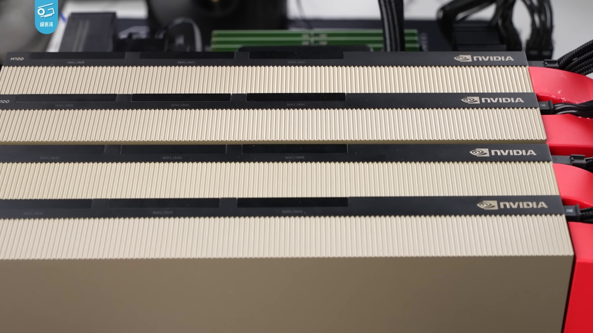

# Together AI Just Got an $8.3B Price Tag for Renting Out GPUs

_As models and infrastructure both lose their price, the moat is moving to data_

## Executive Summary

> [!callout]
> On July 1, 2026, Together AI — a startup that rents out GPU clusters — raised $800 million at an $8.3 billion valuation. Saudi Aramco's venture arm led the round, and Nvidia joined it. Just 16 months earlier the company was valued at $3.3 billion, so this is a 2.5x jump. The striking part is that Together AI does not build new AI models. It is an infrastructure company that runs other people's models — above all the open-source models anyone can download for free.

> It is a signal that the direction of the money has changed. As open-source models closed in on the best proprietary ones, enterprises began swapping expensive APIs for far cheaper open-source alternatives. And so the capital flowed not to the companies building models but to the GPUs and data centers that actually run them. Over the same stretch, other neoclouds — Upscale AI, TensorWave, Groq — each pulled in hundreds of millions of dollars, and more than 70% of all global venture funding in the first half of 2026 went to AI.

> Yet even that infrastructure is losing its price. Rental rates for the H100 GPU have fallen 60–75% from their peak. If the model is being commoditized, and the infrastructure that runs it is being commoditized too, where does a durable edge survive? Using Together AI's price tag as a thread, this piece follows how the moat migrates from the layers that are losing their price toward the one that keeps it.

<!-- stat-card -->
**$8.3B** — Together AI valuation — $3.3B → $8.3B in 16 months, roughly a 2.5x jump

<!-- stat-card -->
**3x** — Open-source model usage — Industry-wide growth over the past year, per OpenRouter

<!-- stat-card -->
**60–75%↓** — H100 rental price drop — From the peak, signaling the infra layer is commoditizing too

<!-- stat-card -->
**70%+** — Q2 venture funding into AI — Up from 50% a year ago; $51B total in H1 2026

## The GPU Landlord Worth $8.3B

What Together AI does fits in one sentence. It secures Nvidia GPUs at scale, wires them into clusters, and rents them by the hour to companies that want to train or serve AI. The industry calls this business a "neocloud." Where hyperscalers like Amazon, Google, and Microsoft sold general-purpose cloud, neoclouds are a new generation built for a single thing: AI compute.

The Series C announced on July 1, 2026 stands out first for its size: $800 million raised at an $8.3 billion valuation. Aramco Ventures, the venture arm of Saudi Arabia's state oil company, led the round, with Vista Equity Partners, General Catalyst, and Nvidia taking part. Sixteen months earlier, when the Series B raised $305 million, the company was valued at $3.3 billion — so this round more than doubled it. Total capital raised since founding now stands at roughly $1.2 billion.

The founder is Vipul Ved Prakash, who once sold the social-search startup Topsy to Apple for more than $200 million. Stanford professor Percy Liang is among the co-founders. As of the most recent quarter, annualized bookings had passed $1.15 billion, and buzzy AI startups such as Cursor and Cognition are on the customer list. Backed by its investors, the company also laid out a plan to secure 500 megawatts of compute over the next five years. That it counts its data centers in units of electricity tells you exactly what kind of thing is happening here.

*▲ Nvidia H100 GPU modules — the core resource neoclouds like Together AI rent out by the hour | Source: [Wikimedia Commons (Geekerwan, CC BY 3.0)](https://commons.wikimedia.org/wiki/File:NVIDIA_H100_(%E6%9E%81%E5%AE%A2%E6%B9%BEGeekerwan)_023.png)*

> [!callout]
> Capital poured into the whole neocloud sector over the same period. Upscale AI took $500 million at a $2 billion valuation; TensorWave, which specializes in AMD GPUs, raised $350 million at a $1.55 billion valuation; and Lambda and Groq pulled in $100 million and $650 million respectively. This is not a Together AI story. It is a pattern of money crowding into every company that rents out GPUs.

## Why Infrastructure, Not Models

For the past two years, the protagonist of AI investment was the model. OpenAI and Anthropic absorbed tens of billions, and the company with the better model was the winner. But in 2026 that premise is wobbling, because free, openly released models have all but caught the best proprietary ones on performance.

The numbers back this up. As recently as late 2023, the best proprietary model and the best open-source model were separated by 17.5 percentage points on knowledge benchmarks. By early 2026 that gap had narrowed to essentially zero. Five open-source families — DeepSeek, Qwen, Kimi, GLM, and Mistral — reached frontier grade at roughly the same time. Once performance converges, the next question naturally moves to price.

And the price difference is large. For the same retrieval-augmented (RAG) workload handling 100,000 requests a month, the best proprietary API costs about $2,275 a month, while running a leading open-source model on cheap infrastructure costs about $168, a gap of more than 13x. Inference costs overall are falling steeply too. The compute price for GPT-4-class performance dropped from $20 per million tokens in late 2022 to about $0.40 by early 2026, roughly a 10x decline each year.

As performance arrived and prices fell, enterprises moved. Data from the AI gateway OpenRouter shows open-source model usage tripled over the past year. But an open-source model only lacks a license fee; it doesn't run itself. Someone still has to provide the GPUs to put it on. The closer the model itself gets to free, the more valuable the compute that actually runs it becomes. Together AI's $8.3 billion is the price attached to precisely that spot, where free models meet paid compute.

> [!callout]
> **The core observation**: when the model layer commoditizes, money flows to the layer beneath it. Where the price of software (the model) collapses, the physical layer (GPUs, power, data centers) picks up the value instead. The capital rushing into Together AI is not a signal that "AI is hot." It is the more specific signal that "the model is nearly free now, and what carries value is the physical capacity to run it."

## Infrastructure Is No Safe Harbor

If the moat has moved from models to infrastructure, is infrastructure a safe final destination? The data says otherwise. GPU rental — the core product a neocloud sells — is itself falling fast in price. The hourly rate for Nvidia's H100, once so scarce it commanded a premium, has dropped 60–75% from its peak. As supply grows and competitors crowd in, the pressure of commoditization is spreading straight into the infrastructure layer too.

The competitive picture is unforgiving. CoreWeave, the market leader, operates 33 data centers across the U.S. and Europe and gets priority access to Nvidia's newest chips — but its debt-to-equity ratio runs to 4.8x, and its structure of borrowing against GPUs as collateral is flagged across the industry as an unprecedented risk. Nebius, spun out of Yandex, bulked up by signing a multi-year, tens-of-billions-of-dollars deal with Microsoft. Crusoe, which builds renewable-powered data centers, has committed to a construction plan so aggressive that execution speed itself is counted as a risk.

The industry calls the present moment a "3-to-5-year window before the hyperscalers catch up." Once Amazon, Google, and Microsoft move into GPU rental in earnest, the neocloud premium thins out. It is the rush to lock in scale before that happens that has produced the current scene: capital being poured into data centers and power. Unlike the era when software startups grew on code, these companies grow on concrete, power grids, and cooling systems. That is why the capital is being absorbed less like software and more like physical construction.

*▲ Data center server racks housing AI compute — neocloud competition ultimately comes down to a race to build | Source: [Wikimedia Commons (Carl Lender, CC BY 2.0)](https://commons.wikimedia.org/wiki/File:Datacenter_Server_Racks_(22370909788).jpg)*

> [!callout]
> **The paradox**: the money flooding into infrastructure right now behaves less like a software investment and more like a construction one. Construction is a contest of scale, and a contest of scale ends, sooner or later, in price competition. The same force that commoditized the model has begun to operate, identically, in the infrastructure layer.

## So Where Does the Moat Go?

If the model is commoditized and even infrastructure is under commoditization pressure, then a durable edge doesn't fully settle in either layer. If the moat keeps flowing from where prices collapse toward where prices hold, where does it settle next? Seen from the vantage of people who work with data, the thread of an answer sits inside the adoption statistics.

According to a survey by MIT Sloan Management Review, the number-one reason enterprises in regulated industries adopt open-source models is not cost but data sovereignty: the demand to keep their own data under internal control rather than handing it to an external API. In fact, in one 2026 survey, 75% of enterprises said they plan to restrict the use of external tools like ChatGPT out of concern over data leakage. Companies aren't switching on the mere fact that a model is cheap; the judgment to keep their own data in their own hands moves right alongside it.

This is where the hybrid strategy settles in as the 2026 standard: handle general-purpose tasks quickly through proprietary APIs, and run cost-sensitive or domain-specific tasks on open models fine-tuned with your own data. And the success or failure of this dual approach converges on a single point. Whatever model you put underneath, what makes the difference in the output on top of it is the quality of the proprietary data used for fine-tuning and retrieval. Two companies can rent the exact same open model in the exact same way, and if the data they feed into training and alignment differs, their results diverge.

> [!callout]
> **The path of migration**: the moat moves from the model (commoditized) → infrastructure (commoditizing) → data, reliability, and orchestration. The first two layers can be bought with money, and competitors will soon buy the same things. Only the last layer — the quality and coherence of your own data — is something no one else can replicate for you.

## The Cheaper Models Get, the More Data Matters

Read Together AI's $8.3 billion purely as venture news and it ends at "AI infrastructure is hot." Read it again from the seat of a team that works directly with data, and a different sentence remains: the more the price of models collapses, the more the center of gravity for what differentiates output shifts toward data.

The reason is simple. Once everyone can use the same open model for close to nothing, the choice of model is no longer a differentiator. Your competitor runs the same model, on the same neocloud, at a similar price. At that moment, what separates performance is the data each side lays on top. How accurately it is labeled, how current and representative it is, how much domain context it carries — these produce different results from the same model.

So the practical question shifts from "which model should we use?" to "is our data clean enough to feed this model properly?" Open-source or proprietary, hybrid or not, the variable that remains at the end is the quality of your own data. That the price of models and infrastructure is falling together is exactly why this moment puts the old problem of data quality back at the front.

> [!callout]
> **One-line takeaway**: the cheaper models get, the more expensive data becomes. The layers that lose their price (models, infrastructure) can be bought by anyone; only the layer that holds its price (data quality) resists replication. Together AI's price tag is a snapshot of a waystation in that migration.

Editor's Note

Pebblous is a company that works on AI-Ready Data and data-quality diagnostics. This article's conclusion — that as models and infrastructure commoditize, the differentiator moves to data quality — touches the very subject Pebblous has long worked on. That said, the aim of this piece is to interpret the Together AI case from a data perspective, not to recommend any particular product. The figures and judgments in the body rest on the original sources listed in the references below.

## References

Primary Sources

- 1.TechCrunch. (2026). "[Neocloud Together AI raises $800M, leaps to $8.3B valuation](https://techcrunch.com/2026/07/01/neocloud-together-ai-raises-800m-leaps-to-8-3b-valuation/)." **TechCrunch**.
- 2.Crunchbase News. (2026). "[Global Startup Funding, Exits, IPO And M&A Soar On AI In Q2 And H1 2026](https://news.crunchbase.com/venture/global-startup-exits-ipo-ma-soar-ai-q2-h1-2026/)." **Crunchbase News**.

Industry & Data

- 3.Stanford Institute for Human-Centered AI. (2026). "[The AI Index Report 2026 — Chapter 2: Technical Performance](https://hai.stanford.edu/assets/files/ai_index_report_2026_chapter_2_technical.pdf)." **Stanford HAI**.
- 4.SemiAnalysis. (2026). "[The Great GPU Shortage – Rental Capacity – Launching our H100 1 Year Rental Price Index](https://newsletter.semianalysis.com/p/the-great-gpu-shortage-rental-capacity)." **SemiAnalysis Newsletter**.
- 5.SemiAnalysis. (2026). "[AI Neocloud Playbook and Anatomy](https://newsletter.semianalysis.com/p/ai-neocloud-playbook-and-anatomy)." **SemiAnalysis Newsletter**.

Academic & Policy

- 6.MIT Sloan. (2026). "[AI open models have benefits. So why aren't they more widely used?](https://mitsloan.mit.edu/ideas-made-to-matter/ai-open-models-have-benefits-so-why-arent-they-more-widely-used)." **MIT Sloan — Ideas Made to Matter**.
