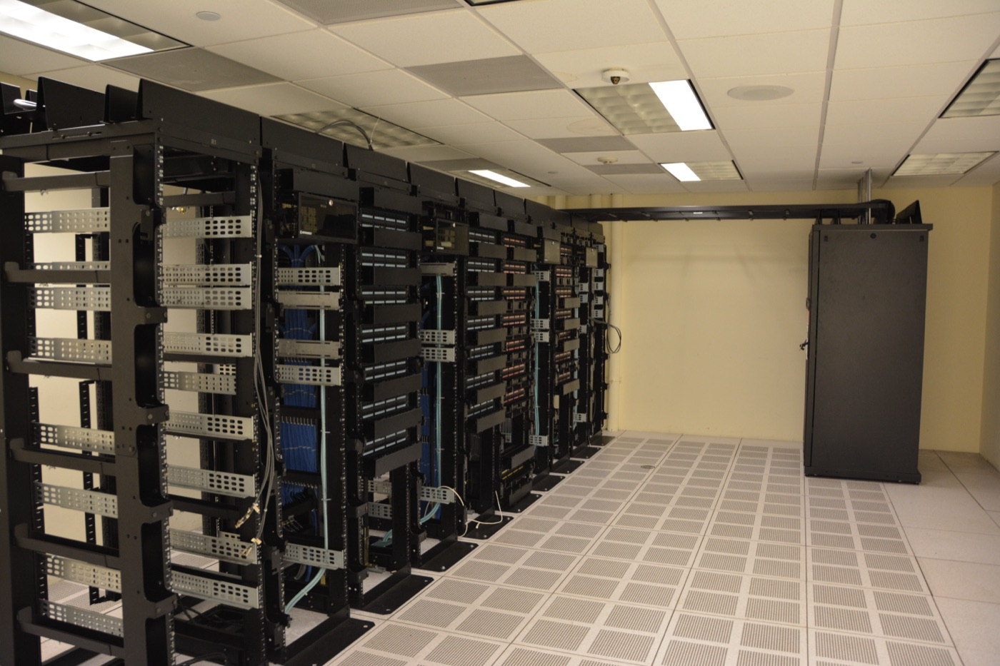

# 투게더 AI가 GPU 임대로 83억 달러 몸값을 받았다

_모델도 인프라도 값이 무너지는 지금, 해자는 데이터로 옮겨간다_

## Executive Summary

> [!callout]
> 2026년 7월 1일, GPU 클러스터를 빌려주는 스타트업 투게더 AI가 8억 달러를 조달하며 밸류에이션 83억 달러에 올랐습니다. 사우디 아람코의 벤처 부문이 라운드를 이끌었고 엔비디아도 참여했습니다. 불과 16개월 전 밸류가 33억 달러였으니 2.5배 뛴 값입니다. 흥미로운 대목은 이 회사가 새 AI 모델을 만들지 않는다는 사실입니다. 남이 만든 모델, 그중에서도 무료로 공개된 오픈소스 모델을 대신 돌려 주는 인프라 회사입니다.

> 돈의 방향이 바뀐 신호입니다. 오픈소스 모델의 성능이 최고 폐쇄형 모델을 거의 따라잡으면서, 기업들은 값비싼 API 대신 훨씬 싼 오픈소스로 옮겨가기 시작했습니다. 그러자 자금은 모델을 만드는 쪽이 아니라, 그 모델을 실제로 돌릴 GPU와 데이터센터로 흘렀습니다. 같은 시기 업스케일 AI·텐서웨이브·그록 같은 다른 네오클라우드에도 나란히 수억 달러가 몰렸고, 2026년 상반기 전 세계 벤처 자금의 70% 이상이 AI로 갔습니다.

> 그런데 그 인프라마저 값이 무너지고 있습니다. H100 GPU 임대가는 고점 대비 60~75% 내렸습니다. 모델이 상품화되고, 그 모델을 돌리는 인프라까지 상품화되는 중이라면, 오래가는 차별점은 어디에 남을까요. 이 글은 투게더 AI의 몸값을 실마리로, 값이 무너지는 계층에서 값이 붙는 계층으로 해자가 어떻게 이동하는지를 따라갑니다.

<!-- stat-card -->
**83억 달러** — 투게더 AI 밸류에이션 — 16개월 만에 33억 → 83억, 약 2.5배 점프

<!-- stat-card -->
**3배** — 오픈소스 모델 사용량 — OpenRouter 기준 지난 1년간 업계 전체 증가폭

<!-- stat-card -->
**60~75%↓** — H100 임대가 하락 — 고점 대비 — 인프라 계층도 상품화되는 신호

<!-- stat-card -->
**70%+** — Q2 벤처 자금 중 AI 비중 — 1년 전 50%에서 상승, H1 2026 총 510억 달러

## 83억 달러가 된 GPU 임대업체

투게더 AI가 하는 일은 한 문장으로 정리됩니다. 엔비디아 GPU를 대규모로 확보해 클러스터로 묶어 두고, AI를 학습하거나 서비스하려는 회사에 시간 단위로 빌려줍니다. 업계는 이런 사업을 "네오클라우드"라고 부릅니다. 아마존·구글·마이크로소프트 같은 하이퍼스케일러가 범용 클라우드를 팔았다면, 네오클라우드는 오직 AI 연산 하나에 특화된 새 세대의 클라우드입니다.

2026년 7월 1일 발표된 시리즈 C는 규모부터 눈에 띕니다. 조달액 8억 달러, 밸류에이션 83억 달러. 사우디 국영 석유회사 아람코의 벤처 부문인 아람코 벤처스가 라운드를 주도했고, 비스타 이쿼티 파트너스와 제너럴 카탈리스트, 그리고 엔비디아가 참여했습니다. 16개월 전 시리즈 B에서 3억 500만 달러를 조달할 때 밸류가 33억 달러였으니, 이번에 2.5배 넘게 뛴 셈입니다. 창업 이후 누적 조달액은 약 12억 달러에 이릅니다.

회사를 세운 사람은 소셜 검색 스타트업 톱시(Topsy)를 애플에 2억 달러 넘게 팔았던 비풀 베드 프라카시입니다. 공동 창업진에는 스탠퍼드 교수 퍼시 리앙이 이름을 올렸습니다. 최근 분기 기준 연간 예약액은 11억 5천만 달러를 넘어섰고, 커서와 코그니션 같은 화제의 AI 스타트업이 고객으로 이름을 올립니다. 투자자 지원을 등에 업고 향후 5년간 500메가와트 규모의 컴퓨트를 확보하겠다는 계획도 내놨습니다. 데이터센터를 전력 단위로 세는 이 표현이, 지금 벌어지는 일의 성격을 그대로 드러냅니다.

*▲ 엔비디아 H100 GPU 모듈 — 투게더 AI 같은 네오클라우드가 시간 단위로 빌려주는 핵심 자원 | Source: [Wikimedia Commons (Geekerwan, CC BY 3.0)](https://commons.wikimedia.org/wiki/File:NVIDIA_H100_(%E6%9E%81%E5%AE%A2%E6%B9%BEGeekerwan)_023.png)*

> [!callout]
> 같은 시기 네오클라우드 섹터 전체에 자금이 몰렸습니다. 업스케일 AI가 밸류 20억 달러에 5억 달러를, AMD GPU에 특화한 텐서웨이브가 밸류 15.5억 달러에 3.5억 달러를 받았고, 룬포드와 그록도 각각 1억 달러와 6.5억 달러를 조달했습니다. 투게더 AI 한 곳의 사건이 아니라, GPU를 빌려주는 회사 전체로 돈이 쏠리는 패턴입니다.

## 왜 모델이 아니라 인프라인가

지난 2년간 AI 투자의 주인공은 모델이었습니다. 오픈AI와 앤트로픽이 조 단위의 자금을 빨아들였고, 좋은 모델을 가진 회사가 곧 승자였습니다. 그런데 2026년 들어 그 전제가 흔들립니다. 무료로 공개된 오픈소스 모델이 최고 폐쇄형 모델을 성능에서 거의 따라잡았기 때문입니다.

숫자가 이를 뒷받침합니다. 2023년 말만 해도 최고 폐쇄형 모델과 최고 오픈소스 모델 사이에는 지식 벤치마크 기준 17.5%포인트의 격차가 있었습니다. 2026년 초 그 격차는 사실상 0으로 좁혀졌습니다. 딥시크, 큐원, 키미, GLM, 미스트랄 같은 다섯 개 오픈소스 계열이 동시에 프론티어급에 도달했습니다. 성능이 비슷해지자 다음 질문은 자연스럽게 가격으로 넘어갑니다.

가격 차이는 큽니다. 월 10만 건 요청이 오가는 동일한 검색 증강(RAG) 워크로드를 기준으로, 최고 폐쇄형 API는 월 약 2,275달러가 드는 반면 대표적 오픈소스 모델을 저렴한 인프라에서 돌리면 월 약 168달러입니다. 13배가 넘는 차이입니다. 추론 비용 전반도 가파르게 내려갑니다. GPT-4급 성능의 연산 단가는 2022년 말 백만 토큰당 20달러에서 2026년 초 약 0.40달러로, 해마다 10배씩 떨어졌습니다.

성능이 붙고 값이 싸지자 기업들이 옮겨갔습니다. AI 게이트웨이 OpenRouter의 데이터를 보면 오픈소스 모델 사용량이 지난 1년간 3배로 늘었습니다. 그런데 오픈소스 모델은 라이선스 비용이 없을 뿐, 저절로 돌아가지는 않습니다. 누군가는 그 모델을 얹을 GPU를 마련해야 합니다. 모델 자체가 무료에 가까워질수록, 그 모델을 실제로 굴리는 연산이 오히려 값나가는 자원이 됩니다. 투게더 AI의 83억 달러는 바로 이 자리, 무료 모델과 유료 연산이 만나는 지점에 붙은 값입니다.

> [!callout]
> **핵심 관찰**: 모델 계층이 상품화되면 돈은 그 아래 계층으로 흐릅니다. 소프트웨어(모델)의 값이 무너진 자리를, 물리(GPU·전력·데이터센터)가 대신 받아 갑니다. 투게더 AI에 몰린 자금은 "AI가 뜬다"는 신호가 아니라 "모델은 이제 공짜에 가깝고, 값나가는 건 그걸 돌릴 물리적 능력"이라는 더 구체적인 신호입니다.

## 인프라도 안전지대가 아니다

모델에서 인프라로 해자가 옮겨갔다면, 인프라는 안전한 종착지일까요. 데이터를 보면 그렇지 않습니다. 네오클라우드가 파는 핵심 상품인 GPU 임대가 자체가 빠르게 내려가고 있습니다. 한때 구하기 어려워 프리미엄이 붙던 엔비디아 H100의 시간당 임대가는 고점 대비 60~75% 하락했습니다. 공급이 늘고 경쟁자가 몰리면서, 인프라 계층에도 상품화의 압력이 그대로 번지고 있습니다.

경쟁 구도도 만만치 않습니다. 이 시장의 1위 코어위브는 미국과 유럽에 33개 데이터센터를 두고 엔비디아 최신 칩에 우선 접근하지만, 부채 대비 자본 비율이 4.8배에 이르고 GPU를 담보로 빚을 내는 구조라 업계에서 전례 없는 리스크로 지목됩니다. 얀덱스에서 분사한 네비우스는 마이크로소프트와 5년간 수백억 달러 규모 계약을 맺으며 몸집을 키웠습니다. 재생에너지 데이터센터를 짓는 크루소는 실행 속도 자체가 리스크로 꼽힐 만큼 공격적인 건설 계획을 내걸었습니다.

업계는 지금을 "하이퍼스케일러가 따라잡기 전 3~5년의 창(window)"으로 부릅니다. 아마존·구글·마이크로소프트가 본격적으로 GPU 임대에 뛰어들면 네오클라우드의 프리미엄은 얇아집니다. 그 사이에 규모를 확보하려는 조바심이, 데이터센터와 전력에 자금을 쏟아붓는 지금의 광경을 만들었습니다. 소프트웨어 스타트업이 코드로 성장하던 시절과 달리, 이 회사들은 콘크리트와 전력망과 냉각 설비로 성장합니다. 자금이 소프트웨어가 아니라 물리적 건설처럼 빨려 들어가는 이유입니다.

*▲ AI 컴퓨트를 수용하는 데이터센터 서버랙 — 네오클라우드 경쟁은 결국 건설 속도의 경쟁이다 | Source: [Wikimedia Commons (Carl Lender, CC BY 2.0)](https://commons.wikimedia.org/wiki/File:Datacenter_Server_Racks_(22370909788).jpg)*

> [!callout]
> **역설**: 지금 인프라에 몰리는 돈의 성격은 소프트웨어 투자가 아니라 건설 투자에 가깝습니다. 건설은 규모의 경쟁이고, 규모의 경쟁은 결국 가격 경쟁으로 끝납니다. 모델을 상품화한 힘이 인프라 계층에서도 똑같이 작동하기 시작했다는 뜻입니다.

## 그래서 해자는 어디로 가는가

모델이 상품화되고 인프라마저 상품화 압력을 받는다면, 오래가는 차별점은 두 계층 어디에도 온전히 머물지 않습니다. 값이 무너지는 곳에서 값이 붙는 곳으로 해자가 계속 흐른다면, 그다음 정착지는 어디일까요. 데이터를 다루는 관점에서 보면 답의 실마리는 채택 통계 안에 있습니다.

MIT 슬론 매니지먼트 리뷰의 조사에 따르면, 규제 산업에서 기업이 오픈소스 모델을 채택하는 1순위 이유는 비용이 아니라 데이터 주권(data sovereignty)이었습니다. 자사 데이터를 외부 API에 넘기지 않고 내부에서 통제하려는 요구입니다. 실제로 2026년 한 설문에서 기업의 75%가 데이터 유출 우려 때문에 챗GPT류 외부 도구 사용을 제한할 계획이라고 답했습니다. 모델이 싸다는 사실만으로 옮겨가는 것이 아니라, 자기 데이터를 자기 손 안에 두겠다는 판단이 함께 움직입니다.

여기서 하이브리드 전략이 2026년의 표준으로 자리 잡습니다. 범용 작업은 폐쇄형 API로 빠르게 처리하고, 비용에 민감하거나 도메인에 특화된 작업은 자체 데이터로 파인튜닝한 오픈 모델로 돌리는 방식입니다. 이 병행 전략의 성패는 결국 한 곳으로 수렴합니다. 어떤 모델을 얹든, 그 위에서 결과의 차이를 만드는 것은 파인튜닝과 검색에 쓰이는 자체 데이터의 품질입니다. 같은 오픈 모델을 두 회사가 똑같이 빌려 써도, 학습·정렬에 넣는 데이터가 다르면 결과물이 갈립니다.

> [!callout]
> **이동 경로**: 해자는 모델(상품화됨) → 인프라(상품화 진행 중) → 데이터·신뢰성·오케스트레이션으로 옮겨갑니다. 앞의 두 계층은 돈으로 살 수 있고 경쟁자도 곧 같은 것을 삽니다. 마지막 계층, 곧 자기 데이터의 품질과 정합성만은 남이 복제해 주지 못합니다.

## 모델이 싸질수록 데이터가 남는다

투게더 AI의 83억 달러를 벤처 뉴스로만 읽으면 "AI 인프라가 뜬다"에서 끝납니다. 데이터를 직접 다루는 팀의 자리에서 다시 읽으면 다른 문장이 남습니다. 모델의 값이 무너질수록, 결과물의 차이를 만드는 무게중심이 데이터 쪽으로 이동한다는 것입니다.

이유는 단순합니다. 모두가 같은 오픈 모델을 거의 공짜로 쓸 수 있게 되면, 모델 선택 자체는 더 이상 차별점이 아닙니다. 경쟁자도 같은 모델을, 같은 네오클라우드에서, 비슷한 값에 돌립니다. 그 순간 성능을 가르는 것은 각자가 그 위에 얹는 데이터입니다. 얼마나 정확하게 라벨링됐는지, 얼마나 최신이고 대표성 있는지, 도메인 맥락을 얼마나 담고 있는지가 같은 모델에서 서로 다른 결과를 만듭니다.

그래서 실무의 질문은 "어떤 모델을 쓸까"에서 "우리 데이터가 이 모델을 제대로 먹일 만큼 정돈돼 있는가"로 옮겨갑니다. 오픈소스든 폐쇄형이든, 하이브리드로 병행하든, 마지막에 남는 변수는 자체 데이터의 품질입니다. 모델과 인프라의 값이 함께 내려가는 지금이, 데이터 품질이라는 오래된 과제를 다시 전면에 세우는 순간인 이유입니다.

> [!callout]
> **한 줄 요약**: 모델이 싸질수록 데이터가 비싸집니다. 값이 무너지는 계층(모델·인프라)은 누구나 살 수 있고, 값이 붙는 계층(데이터 품질)만 복제되지 않습니다. 투게더 AI의 몸값은 그 이동의 중간 정거장을 찍은 스냅숏입니다.

Editor's Note

페블러스는 AI-Ready Data와 데이터 품질 진단을 다루는 회사입니다. 이 글의 결론 — 모델과 인프라가 상품화될수록 차별점이 데이터 품질로 이동한다 — 은 페블러스가 오래 다뤄 온 주제와 맞닿아 있습니다. 다만 이 글의 목적은 투게더 AI의 사례를 데이터 관점에서 해석하는 데 있고, 특정 제품을 권하려는 것이 아닙니다. 본문의 수치와 판단은 아래 참고문헌의 원 출처에 근거합니다.

## 참고문헌

핵심 소스

- 1.TechCrunch. (2026). "[Neocloud Together AI raises $800M, leaps to $8.3B valuation](https://techcrunch.com/2026/07/01/neocloud-together-ai-raises-800m-leaps-to-8-3b-valuation/)." **TechCrunch**.
- 2.Crunchbase News. (2026). "[Global Startup Funding, Exits, IPO And M&A Soar On AI In Q2 And H1 2026](https://news.crunchbase.com/venture/global-startup-exits-ipo-ma-soar-ai-q2-h1-2026/)." **Crunchbase News**.

업계·데이터

- 3.Stanford Institute for Human-Centered AI. (2026). "[The AI Index Report 2026 — Chapter 2: Technical Performance](https://hai.stanford.edu/assets/files/ai_index_report_2026_chapter_2_technical.pdf)." **Stanford HAI**.
- 4.SemiAnalysis. (2026). "[The Great GPU Shortage – Rental Capacity – Launching our H100 1 Year Rental Price Index](https://newsletter.semianalysis.com/p/the-great-gpu-shortage-rental-capacity)." **SemiAnalysis Newsletter**.
- 5.SemiAnalysis. (2026). "[AI Neocloud Playbook and Anatomy](https://newsletter.semianalysis.com/p/ai-neocloud-playbook-and-anatomy)." **SemiAnalysis Newsletter**.

학계·정책

- 6.MIT Sloan. (2026). "[AI open models have benefits. So why aren't they more widely used?](https://mitsloan.mit.edu/ideas-made-to-matter/ai-open-models-have-benefits-so-why-arent-they-more-widely-used)." **MIT Sloan — Ideas Made to Matter**.
