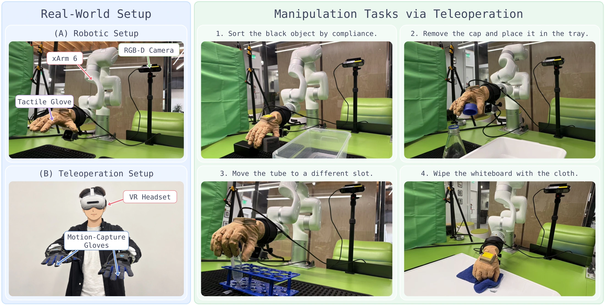

# TouchScale: One Tactile Glove, and Robot Success More Than Doubles

_Five hundred hours gathered on one model of two-handed tactile glove, and average success across four contact-heavy robot tasks rose from 22.5% to 57.5%_

## Executive Summary

> [!callout]
> This article reads the TouchScale paper, posted to arXiv on October 7, 2026. What its twenty-six authors put out is a dataset rather than a new model. It holds 500 hours of recordings in which people wore tactile gloves on both hands and handled objects while a head-mounted camera and wrist cameras ran on the same clock.

> The weakness the authors named in earlier datasets was not size. Big corpora were stitched together out of recordings from several sensors and several annotation procedures, so when performance rose, there was no telling whether volume or equipment had produced it. They answered by holding the rig and the procedure to one. Contact prediction accuracy against a tactile sensor the model had never seen rose from 0.134 to 0.383, and two components of a different nature sit inside that gap. Section 3 pulls them apart.

> Sections 1 through 4 are facts written in the paper, on the project page, and in the outside sources named along the way. Section 5 is this article's reading of those facts from the side that collects physical AI data.

### Key Figures

Four numbers come out of the paper and the project page. The first two measure the record and the rig that produced it. The last two are values returned by models trained on that record.

Source: [Li et al., "TouchScale: 500 Hours of Human Vision and Touch for Visual-Tactile Learning", arXiv:2610.10288 (2026-10-07)](https://arxiv.org/abs/2610.10288).

<!-- stat-card -->
**500 hours** — Touch recorded on one rig — The largest prior dataset the paper lines up for comparison runs 37.2 hours

<!-- stat-card -->
**880** — Sensing points on one glove — Spread across the five fingers and the palm, at a spatial resolution under 2mm

<!-- stat-card -->
**0.134→0.383** — Contact prediction IoU on an unseen sensor — Matched at about 16 hours each, it reads 0.134 against 0.181, and the rest is what volume bought

<!-- stat-card -->
**22.5%→57.5%** — Average success across four robot tasks — Each task was shown 50 demonstrations and then attempted 20 times

## Video Piles Up, and the Contact Goes Unrecorded

Teams trying to teach robots how to use a body have spent the past few years collecting first-person video. Film what a person picks up in a kitchen and how, the thinking goes, and that footage becomes material for training a robot policy. The paper's opening paragraph grants the trend and adds one thing to it. Video does not record contact or pressure. The frame of a hand holding a cup survives; which part of which finger was pressed, and how hard, does not.

Tactile datasets meant to fill that hole already exist, several of them. Their size sits an order of magnitude away from the video. Among the ones the paper lines up for comparison, EgoTouch runs 20 hours, FEEL about 27, DeskTask-Tac 37.2, while OpenTouch is 5.1 and EgoTactile 5.82. In a field where first-person video trades in thousands of hours, the largest tactile corpus comes in under 40.

The authors weigh something else more heavily than size. The bigger a corpus was, the more likely it was built by pooling recordings shot with different sensors and passed through different annotation procedures. If a model trains on material like that and performance goes up, the rise cannot be explained. More data, a better sensor that got mixed in partway, a shift in annotation standard: none of these can be told apart. The paper's own phrasing is that the effect of data scale is hard to isolate.

The same diagnosis shows up outside the paper. An IROS workshop held in Pittsburgh in September 2026 carried the title "Scalable Tactile Sensing for Dexterous Manipulation," and the organizers wrote in their statement that touch, for all that robots need it, trails vision in standardization and deployment. Responses to that lag point in different directions. The visible one is to build denser sensors. The tactile sensor from DAIMON Robotics, as IEEE Spectrum described it, packs more than 110,000 effective sensing units into a module the size of a fingertip. TouchScale spreads 880 across one glove, so the two differ by orders of magnitude in density and also in the part of the problem they aim at.

> [!callout]
> The point is not confined to touch. Corpora grown by pooling several sources turn up in every field, and on corpora built that way, even the ordinary premise that more data helps goes untested. TouchScale's answer was not a better sensor but a single set of equipment already in hand, with the procedure left alone.

## One Glove, One Rig, Every Hour

The collection rig is a single wearable set. One glove carries 880 sensing points across the five fingers and the palm, at a spatial resolution under 2mm. Each point reads pressure applied perpendicular to the surface. Values arrive 50 times a second over the wireless link and 100 times a second over USB-C. A head-mounted RGB-D camera and a pair of wrist-mounted RGB cameras run alongside at 30 frames a second, and all three streams align to the same clock. Seeing and touching end up on one line.

About twenty participants left 500 hours and roughly 87,000 episodes with this one set. Task descriptions number about 2,000, and more than 800 distinct scene configurations sit inside nine broad collection settings. The content runs from everyday motions at a kitchen counter or a workbench through to structured manipulation. The part that matters is that all of it came in through the same glove, the same camera placement, the same procedure.

Holding the equipment fixed does not make any single recording better. It makes recordings comparable to each other. When a 50-hour subset and the full 500 hours are trained side by side, the difference between them comes from volume and nothing else. The sensor is the same and the procedure is the same, so no other explanation has room to enter. This is where the paper's experimental design gets its footing.

▲ Pebblous original diagram. Source: Li et al., arXiv:2610.10288 (2026-10-07); [TouchScale project page](https://touch-scale.github.io/).

## The Rig's Share and the Volume's Share

The sentence the paper's abstract leads with is that contact prediction accuracy rises from 0.134 to 0.383. The metric behind it, cIoU, measures how far the region a model marks as touched overlaps the region actually touched, averaged over twelve anatomical parts of the hand. Closer to 1 is more accurate. The test is zero-shot. Material recorded with a tactile sensor the model never trained on, specifically the sensor behind the EgoTactile dataset, is handed over for the model to predict.

Read those two numbers straight and they say that thirty times the data brought nearly three times the accuracy. But 0.134 did not come from training on a small slice of TouchScale. It came from a model trained on the entire training split of the EgoTouch dataset, 16.2 hours. The dataset changed and the volume changed with it, so a single cause does not explain the gap between the two figures.

The authors knew this and ran a separate size-matched experiment. They carved about 16 hours out of TouchScale and set it against EgoTouch's 16.2 under the same conditions. The result was 0.181. At equal volume 0.134 and 0.181 part ways, so that 0.047 is the share belonging to one rig and one procedure. The remaining 0.202 is the share won by holding that rig steady and pushing the volume to 500 hours. Two components hidden inside the abstract's one line come apart this way.

▲ Pebblous original diagram. The top two values come from the size-matched comparison table, the bottom two from a separate experiment that raises the data share from 10% to 100%. Source: Li et al., arXiv:2610.10288, Table 2 and Figure 4.

Volume's share is not one block either. The figures the paper reports by proportion show 0.311 already at 10 percent of the corpus, which is 50 hours, and 0.383 after filling in ten times more to reach 500. The stretch from about 16 hours to 50 lifted the number by 0.13, while the stretch from 50 to 500 lifted it by 0.07. The curve keeps rising and keeps flattening. The two sets of numbers come from different experiments and cannot be laid on one curve, yet the direction is plain.

One more cell in the same table stands out. When each dataset predicts its own evaluation split, EgoTouch scores 0.403 and TouchScale 0.422. They nearly tie. The distance between the two corpora opens up away from home, on a sensor neither has met before. This contrast holds what a unified collection standard actually buys: less collapse when the equipment changes, rather than a higher score on familiar material.

Recognition results came along with it. After pretraining a video encoder on TouchScale and scoring it on three action recognition benchmarks (MECCANO, Something-Something V2, Ego-Exo4D), the paper reports the highest average accuracy among the vision-tactile datasets it compared.

Touch is absent at evaluation time. During pretraining the model's job was to predict touch, but the three benchmarks that score it are video corpora with no tactile recordings in them. The comparisons use the same encoder architecture pretrained the same way on OpenTouch, FEEL and EgoTouch, so the pretraining material is the only condition that changed, and the results tilted the same way whether the encoder was frozen with a classifier on top or retrained end to end. Representations learned by guessing what was touched stayed inside the video after the glove came off.

## What Changed on a Real Robot Hand

Whether records gathered from human hands carry over to a robot is a separate question to settle. The paper mounted a BrainCo Revo 2 hand on an xArm6 arm and ran four tasks, all of them contact-heavy. Each task was shown 50 human demonstrations, and after training the policy attempted it 20 times while successes were counted.

The comparison runs between a policy with TouchScale inserted at the mid-training stage and one without it. Results by task follow.

| Task | What it involves | Baseline policy | With TouchScale |
| --- | --- | --- | --- |
| Soft/Hard Sorting | Feeling objects and sorting the soft from the hard | 10% | 60% |
| Bottle-Cap Removal | Twisting a bottle cap open | 40% | 70% |
| Test-Tube Transfer | Picking up a test tube and moving it | 30% | 60% |
| Whiteboard Wipe | Pressing down and wiping a whiteboard | 10% | 40% |
| Average |  | 22.5% | 57.5% |

▲ All four tasks run on 50 demonstrations per task and 20 evaluation trials. Source: Li et al., arXiv:2610.10288; TouchScale project page.

With 20 trials one tick is 5 percentage points, so the per-task figures swing. Even so, all four moved in the same direction, and the largest gain landing on the task that sorts soft objects from hard ones is worth reading. Softness is difficult to judge by sight and has to be pressed to be known. The largest gain arrived exactly where tactile records should contribute most.

*▲ The xArm6 testbed with a gloved hand (left) and the four tasks from the table above in action (right). Source: [TouchScale project page](https://touch-scale.github.io/).*

The limits the paper sets down for itself belong in the same reading. The robot evaluation stayed with one platform and four manipulation tasks, and TouchScale carries no action labels. Heavier than either is the passage reporting only a weak association between the error in predicting the next moment of touch and the error in predicting the next action. Whether a model that predicts touch well becomes a robot that moves well, the authors left open.

> [!callout]
> The conclusion the paper attaches to these results is careful. With the sensor and the collection procedure held fixed, using more TouchScale data shows a general upward trend in zero-shot tactile prediction and in robot success rates. It does not claim a monotone rise at every point.

## Why Pebblous Is Watching This Dataset

There is a premise Pebblous repeats whenever it talks about AI-Ready Data. The worth of data is not settled by volume alone, and a corpus becomes usable material only when the standard it was gathered under is recorded alongside it. This paper is a rare case that puts a number on that claim. One line saying 0.134 and 0.181 parted ways at the same 16 hours means that matching the standard is not overhead. It comes back in the score.

The ordering follows from that. Unifying a collection standard is work to finish before much data is gathered. Afterwards there is no going back. Five hundred hours piled up on different equipment remains material that cannot support the sentence "performance went up because we added volume," however large it grows, and whoever uses it cannot tell what to do next even when the numbers rise. For a team collecting data, the part of this paper to look at first is the condition of a single set, not the number 500.

Binding the standard carries its own cost. Records gathered with gloves on look different from scenes where bare hands touch objects. The TouchSight paper, out three weeks ahead of TouchScale, takes up exactly that problem. Working from 500 hours of pressure-glove recordings, it built a separate 20-hour paired dataset in which a generative model redraws gloved footage as bare-handed scenes, closing the appearance gap that opens when a model trained on gloved hands is pointed at bare-handed video. Hold one side fixed and a cost appears on the other, as these two papers show side by side.

Anyone planning to use the data has one thing to check first. What sits on Hugging Face right now is 100 hours, 15,324 episodes, 929 tasks and 22 scene types. That differs from the 500 hours and roughly 87,000 episodes the paper describes. The upload is a partial release, and the license is CC BY-NC 4.0, so commercial use needs separate permission. When citing the paper's figures it is safer to keep straight which of the two you are working from.

Thank you for reading this far. The figures in this article were checked against the [TouchScale paper](https://arxiv.org/abs/2610.10288) and the [project page](https://touch-scale.github.io/). We would be glad to hear what your team unifies first, before it starts collecting.

## References

### Academic Papers

- 1.Li, D. et al. (2026). "[TouchScale: 500 Hours of Human Vision and Touch for Visual-Tactile Learning](https://arxiv.org/abs/2610.10288)." arXiv:2610.10288, 2026-10-07.
- 2.Zhou, D. et al. (2026). "[TouchSight: Bare-Handed Tactile Prediction from Egocentric Video via Generative Visual Augmentation](https://arxiv.org/abs/2609.20414)." arXiv:2609.20414, 2026-09-17.

### Industry & Data Sources

- 3.TouchScale Team. (2026). "[TouchScale Project Page](https://touch-scale.github.io/)."
- 4.2077AI Data Foundation. (2026). "[TouchScale: Egocentric Human Vision and Touch for Visual–Tactile Learning](https://huggingface.co/datasets/2077AIDataFoundation/TouchScale)." Hugging Face, CC BY-NC 4.0.
- 5.Dutta, S. (2026). "[DAIMON Robotics Wants to Give Robot Hands a Sense of Touch](https://spectrum.ieee.org/daimon-robotics-physical-ai)." IEEE Spectrum, 2026-05-04.
- 6.IROS 2026 Workshop Organizers. "[Scalable Tactile Sensing for Dexterous Manipulation](https://tactile-dexterity-iros.github.io/)." IROS 2026, Pittsburgh, 2026-09-27.
