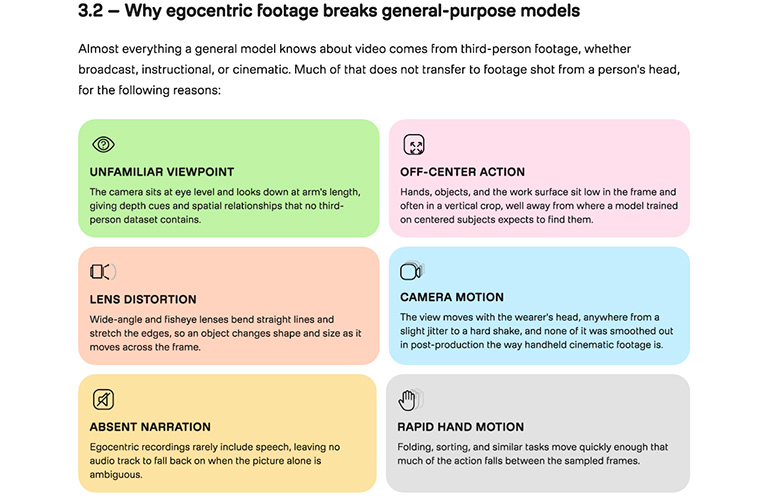
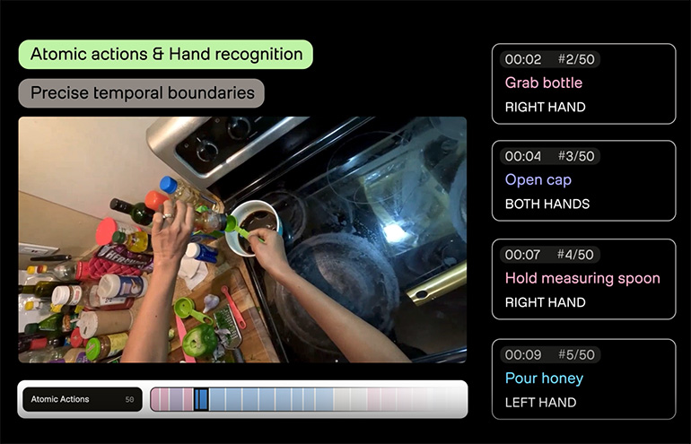

# TwelveLabs Picks Your Robot Training Clips. Who Checks the Model?

_Pegasus 1.6 takes over labeling that ran about 155 human hours per hour of video, and so far there is no named robot customer and no independent benchmark_

## Executive Summary

> [!callout]
> This article reads Pegasus 1.6, the vision-language model TwelveLabs released on October 6, 2026, US time. It handles one kind of footage only: first-person video shot on an action camera or smart glasses, the kind that shows a person doing something with their own hands. Teaching a robot how people move takes video like this, and the expensive part is not the footage. It is the written description attached to it.

> One public dataset shows how expensive. Ego-Exo4D runs to 1,286 hours of video, and putting labels on it took more than 200,000 cumulative hours of annotation work. Every hour of raw video took roughly 155 hours of that work. Pegasus 1.6 offers to do that job for $1.75 per hour of video. What has not appeared yet is a robot company willing to be named as a user, or an independent benchmark that measures the model against competing products.

> Sections 1 through 4 are facts from the TwelveLabs press release, from the VentureBeat and AI Times coverage, and from the Ego-Exo4D paper. Section 5 is this article's reading of those facts through the eyes of people who work with data.

### Key Numbers

The announcement narrows to four numbers. The first two give the size of the problem and the speed the model claims. The last two give the price attached to that claim and the evidence still missing.

Source: [VentureBeat (2026-10-06)](https://venturebeat.com/technology/twelvelabs-debuts-pegasus-1-6-to-improve-robotics-training-data-from-first-person-video), [TwelveLabs press release](https://www.globenewswire.com/news-release/2026/10/06/3375633/0/en/twelvelabs-brings-video-understanding-to-physical-ai-with-latest-launch.html), [Ego-Exo4D paper](https://arxiv.org/abs/2311.18259).

<!-- stat-card -->
**155 hours** — Human work behind one hour of first-person video — Ego-Exo4D's 1,286 hours drew more than 200,000 cumulative hours of annotation effort

<!-- stat-card -->
**17 years** — Footage the chief executive says was processed in 18 hours — The compute behind it was not disclosed, so nobody outside can work the claim back

<!-- stat-card -->
**$1.75** — Price of putting one hour of video in — Text the model produces is billed separately at $7.50 per million tokens, and enterprise deals are custom

<!-- stat-card -->
**Zero** — Robot customers named in public — VentureBeat found no customer to confirm field results and no comparative benchmark

## An Hour of Video, 155 Hours of Labeling

To teach a robot to use its hands, you have to show it the hands of people at work. That is why robot companies are collecting first-person video, shot from a camera worn on the head or the chest so that it captures exactly what the wearer sees. The industry calls it egocentric video, and most of it is ordinary: washing dishes, fixing a bicycle, cooking a meal.

*▲ TwelveLabs' Pegasus 1.6 launch visual, showing robot and factory footage being broken into time-stamped segments on the way to becoming robot training data | Source: [AI Times (image: TwelveLabs)](https://www.aitimes.com/news/articleView.html?idxno=216022)*

The trouble is that raw footage is not training material. For a model to learn from it, someone has to write down which stretch of video is which action, and how a hand took hold of what. Until now a person wrote that down.

Ego-Exo4D gives a public sense of the scale. It is a 1,286-hour dataset filmed by 740 participants across 13 cities, and the annotation effort poured into labeling it runs past 200,000 cumulative hours. That works out to about 155 hours of human work for every hour of source footage. VentureBeat puts the going cost of this work at somewhere between 70 and 155 hours per hour of video.

> [!callout]
> Turn that number around and the bottleneck moves. There is no shortage of video to teach robots with. There is a shortage of people to sort the footage already shot and write descriptions for it.

Teams are pushing on this bottleneck from different sides. Some build clean data from the start with [rigs that let a person drive the robot directly](/blog/xdof-teleoperation-data-collection-rig/en/). Some [pay people by the minute to film first-person video](/blog/figure-index-robot-training-video-gig/en/). Others [generate the footage itself with a model](/report/physical-ai-world-model-synthetic-data-2026-09/en/). TwelveLabs stands in none of those places. It is going after the step where human hands piled up the most: picking what is worth keeping out of video that already exists, and writing the descriptions.

## The Five Jobs Pegasus 1.6 Wants to Take Over

TwelveLabs is a video understanding company founded in the United States in 2021. It runs two model families: Marengo, which finds scenes and sounds inside video, and Pegasus, which turns those results into text. Version 1.6 narrows the Pegasus line to first-person footage, and the company describes the model as turning raw video into time-stamped metadata.

*▲ TwelveLabs' breakdown of why egocentric footage breaks general-purpose video models: unfamiliar viewpoint, off-center action, lens distortion, camera motion, absent narration, and rapid hand motion | Source: [The Robot Report (image: TwelveLabs)](https://www.therobotreport.com/pegasus-1-6-brings-video-understanding-physical-ai-says-twelvelabs/)*

Robots are not the only target the company names. The press release gathers drones, autonomous vehicles and industrial equipment under the heading of physical AI, and says the model helps those machines recognize and work in real environments. In this announcement, though, only one of them arrives with numbers and uses attached, and that is robot training data.

The press release lists five capabilities. Match each one to the stage of work it replaces and it looks like this.

| Capability | What a person used to do |
| --- | --- |
| Action segmentation and labeling | Scrub through footage marking start and end times for tasks, steps, objects, and hand-object contact |
| Dense captioning | Write out in sentences what was placed where and how the hands moved |
| Quality scoring | Weed out shaky or badly framed clips by eye |
| Search and curation | Hunt down rare scenes and thin out duplicate clips |
| Consent and compliance flagging | Find and mark the stretches where faces, bystanders, or sensitive information appear |

▲ Source: TwelveLabs press release (2026-10-06). The right column is this article's rendering of the manual work each capability stands in for.

The five are not the same kind of thing. The first two generate descriptions the footage never had. The last three screen and mark a pile of footage that already exists, and in those three the model is effectively the judge. It decides which clip is worth training on and which scene runs into privacy, and that verdict carries straight into the next stage.

What the judge looks at is written down in the press release as three things: whether the action is clearly visible, whether it is properly framed, and whether the shot is stable. What is not written down is everything after that. Where the line for a low score falls, and how the three combine into a single score, is not stated.

## Seventeen Years in Eighteen Hours, With No Way to Check

On speed, the company has put out one number. Chief executive Jae Lee says about 17 years' worth of first-person video was processed in 18 hours. He put the meaning of the launch this way.

Our mission has always been to help machines understand how the world works through video. Physical AI is the next expression of that mission.

*▲ A Pegasus 1.6 screen capture breaking a first-person cooking video into 50 atomic actions, labeling moments like "grab bottle" and "open cap" by hand. This is what the throughput claim is actually describing | Source: [The Robot Report (image: TwelveLabs)](https://www.therobotreport.com/pegasus-1-6-brings-video-understanding-physical-ai-says-twelvelabs/)*

The price is public too. Video going in costs $1.75 an hour, and the text the model produces costs $7.50 per million tokens. Enterprise customers negotiate separately. Set those figures beside a process that attached 155 hours of labeling to one hour of video and they sit orders of magnitude apart.

VentureBeat ran three caveats alongside the announcement. None of the three disputes the numbers. All three say there is no way to check them.

- •It could not find a robotics customer who would confirm field results from the outside. There was a mention of a US data company refining hundreds of thousands of hours a day with the model, but the company was not named
- •No performance figures or public benchmarks against competing products came out with the launch
- •The claim of 17 years in 18 hours arrives without the compute that went into it, so nobody else can reproduce the conditions

The throughput gap is the simpler one. Publish how many GPUs ran and for how long, and it closes. Quality is the hard one. When the model gives a clip a low score and throws it out, whether that call was right cannot be known until a person looks at the discarded clip again. And the gain from automatic filtering comes precisely from not taking that second look.

## The Four Rivals Do Not All Do the Same Job

Filtering video and attaching descriptions automatically is not an empty lane. VentureBeat lined up four alternatives alongside this one.

In the table below the first row is Pegasus 1.6, and the four under it are the ones VentureBeat set beside it. Nvidia's Cosmos Curator and Encord stand in the same pipeline of sorting and labeling video that has already been shot, but Google's Gemini Robotics ER 2 is about planning and coordinating what a robot does, and FLUX-mimic generates robot motion itself. Sharing one table does not make them interchangeable.

| Product | What it does | Price |
| --- | --- | --- |
| Pegasus 1.6TwelveLabs | Action segmentation, captioning, quality scoring, search and privacy flagging for first-person video | $1.75 per hour of video |
| Cosmos CuratorNvidia | Filtering, annotating and deduplicating video (open source) | GPU and cloud cost only |
| Encord + Cosmos | Platform pairing automatic labeling with human review | Not disclosed |
| Gemini Robotics ER 2Google | Robot planning and coordination, video interpretation included | $1 to $2 per million tokens |
| FLUX-mimic | Generating robot motion itself | Not disclosed |

▲ Source: comparison compiled by VentureBeat (2026-10-06). The units differ (hours of video against tokens), so the prices do not convert onto a single line.

The table cannot tell you which product is cheaper, because the units do not line up. What it does show is that buyers already have a wide field to pick from, and choosing among them comes down to running the same pile of video through each and comparing what comes out. VentureBeat's own advice to companies was to verify for themselves how many usable training examples they get for the money.

Robotics is still in training mode. Data usually gets gathered by having a person drive the robot by remote control, which eats people and equipment. That is the background against which first-person video came up as an alternative. But video does not carry how hard something was pressed, how it felt to the touch, or the fine control values. No amount of careful sifting creates that information.

There is a Korean angle as well. According to AI Times, TwelveLabs has raised more than 300 billion won to date and has grown its Korean office headcount by more than 50 percent against the start of last year. It was also the first Korean company to put a model on Amazon Bedrock.

## Why Pebblous Is Watching This Launch

When people did the labeling, a question about quality had something to answer with. Who the annotator was, what guidelines they worked from, how closely two people agreed after watching the same footage. All of it stays on record. When a label came out wrong, you could trace back to which passage of which guideline was ambiguous. Most of the traditional ways of measuring labeling quality rest on that record.

Put a model in that seat and the record changes character. The outcomes remain. This clip scored low and was dropped, that stretch was flagged as personal information. The grounds for those decisions do not remain. A good part of what turns 155 hours into $1.75 is the grounds never being produced.

> [!callout]
> The question moves up a level here. It used to be about the quality of the data. Now it is about the quality of the model that judged the data. And what the outside currently holds on that model is the company's own figures.

This is not an argument against automatic filtering. Leaving a process that costs 155 hours per hour to people is not really an option. But taking the filtered output as it comes and taking it together with the reason each clip was kept or dropped are two different things. The difference surfaces when a regulator or a customer later asks how this training data was selected.

A team building robot training data has three things worth checking before deciding to adopt. First, is there a plan for people to look again at some share of the clips the model threw out and count how often it was right? Second, do the score the model assigned and the version of the model that assigned it get stored alongside the data? Third, is there capacity to run the same footage through another tool and find the points where the two results diverge?

There is a premise Pebblous repeats whenever it talks about AI-Ready Data. On top of data whose origin was never recorded, verification is not verification. The moment the filtering is handed to a model, one more line attaches to that sentence. If the grounds for the filtering are not recorded, there is no way to explain to a person why the filtered data is good data.

Thank you for reading this far. The capabilities and the quotation were checked against the [TwelveLabs press release](https://www.globenewswire.com/news-release/2026/10/06/3375633/0/en/twelvelabs-brings-video-understanding-to-physical-ai-with-latest-launch.html), and the pricing and the comparison against the [VentureBeat report](https://venturebeat.com/technology/twelvelabs-debuts-pegasus-1-6-to-improve-robotics-training-data-from-first-person-video). If your team keeps a record of the grounds behind automatically filtered training data, we would be glad to hear what form it takes.

## References

### Primary Source

- 1.TwelveLabs, Inc. (2026). "[TwelveLabs Brings Video Understanding to Physical AI With Latest Launch](https://www.globenewswire.com/news-release/2026/10/06/3375633/0/en/twelvelabs-brings-video-understanding-to-physical-ai-with-latest-launch.html)." GlobeNewswire, 2026-10-06.

### Academic Paper

- 2.Grauman, K. et al. (2023). "[Ego-Exo4D: Understanding Skilled Human Activity from First- and Third-Person Perspectives](https://arxiv.org/abs/2311.18259)." arXiv:2311.18259.

### Industry Coverage

- 3.Franzen, C. (2026). "[TwelveLabs debuts Pegasus 1.6 to improve robotics training data from first-person video](https://venturebeat.com/technology/twelvelabs-debuts-pegasus-1-6-to-improve-robotics-training-data-from-first-person-video)." VentureBeat, 2026-10-06.
- 4.Kim, H. (2026). "["First-Person Video as Robot Training Data"...TwelveLabs Launches 'Pegasus 1.6'](https://www.aitimes.com/news/articleView.html?idxno=216022)." AI Times, 2026-10-07. (Korean)
- 5.Demaitre, E. (2026). "[Pegasus 1.6 brings video understanding to physical AI, says TwelveLabs](https://www.therobotreport.com/pegasus-1-6-brings-video-understanding-physical-ai-says-twelvelabs/)." The Robot Report, 2026-10-06.
