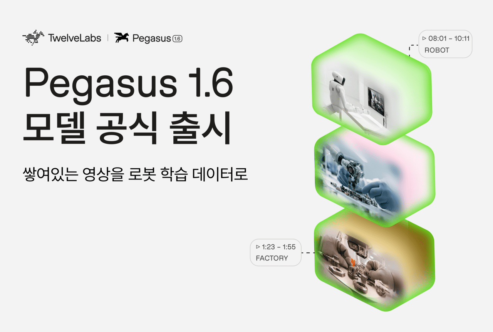

# 트웰브랩스의 로봇 영상 라벨 자동화, 확인할 길이 아직 없다

_페가수스 1.6은 사람이 1시간 영상에 155시간 쓰던 라벨 작업을 자동화한다. 공개 고객 사례와 독립 검증은 아직 없다_

## Executive Summary

> [!callout]
> 이 글은 트웰브랩스가 2026년 10월 6일(현지시간) 내놓은 비전언어모델 페가수스 1.6을 읽는다. 액션캠이나 스마트글래스로 찍은 1인칭 영상, 그러니까 사람이 자기 손으로 무언가를 하는 장면만 따로 다루는 모델이다. 로봇에게 사람의 동작을 가르치려면 이런 영상이 필요한데, 영상 자체보다 영상에 붙이는 설명을 만드는 일이 훨씬 비싸다.

> 얼마나 비싼지는 공개 데이터셋 하나가 보여 준다. Ego-Exo4D는 1,286시간 분량 영상에 라벨을 붙이는 데 누적 20만 시간이 넘게 들었다. 원본 1시간마다 사람이 약 155시간을 들인 셈이다. 페가수스 1.6은 그 일을 영상 1시간당 1.75달러에 대신하겠다고 한다. 다만 이 모델을 실제로 쓰고 있다고 이름을 밝힌 로봇 회사도, 경쟁 제품과 성능을 견줘 본 독립 벤치마크도 아직 공개되지 않았다.

> 1절부터 4절까지는 트웰브랩스 보도자료와 벤처비트·AI타임스 보도, 그리고 Ego-Exo4D 논문에 적힌 사실이다. 5절은 그 사실을 데이터를 다루는 사람의 눈으로 다시 읽은 이 글의 해석이다.

### 주요 수치

이번 발표는 숫자 네 개로 좁혀진다. 앞의 둘은 문제의 크기와 이 모델이 주장하는 속도이고, 뒤의 둘은 그 주장에 붙은 값과 아직 비어 있는 증거다.

출처: [VentureBeat(2026-10-06)](https://venturebeat.com/technology/twelvelabs-debuts-pegasus-1-6-to-improve-robotics-training-data-from-first-person-video), [트웰브랩스 보도자료](https://www.globenewswire.com/news-release/2026/10/06/3375633/0/en/twelvelabs-brings-video-understanding-to-physical-ai-with-latest-launch.html), [Ego-Exo4D 논문](https://arxiv.org/abs/2311.18259).

<!-- stat-card -->
**155시간** — 1인칭 영상 1시간에 붙은 사람 손 — Ego-Exo4D 1,286시간에 주석 노력이 누적 20만 시간 넘게 들어갔다

<!-- stat-card -->
**17년치** — CEO가 18시간에 처리했다고 밝힌 영상 분량 — 투입한 계산 자원은 공개하지 않아 바깥에서 따져 볼 수 없다

<!-- stat-card -->
**1.75달러** — 영상 1시간을 넣을 때 드는 값 — 나오는 글에는 100만 토큰당 7.50달러가 따로 붙고, 기업 계약은 별도다

<!-- stat-card -->
**0곳** — 이름이 공개된 로봇 도입 고객 — 벤처비트는 현장 결과를 확인해 줄 고객도, 비교 벤치마크도 찾지 못했다

## 영상 1시간에 라벨 155시간

로봇에게 손 쓰는 법을 가르치려면 사람이 손 쓰는 장면을 보여 줘야 한다. 그래서 요즘 로봇 회사들이 모으는 것이 1인칭 영상이다. 머리나 가슴에 단 카메라로 자기 시야를 그대로 찍은 영상이고, 업계에서는 에고센트릭 영상이라고 부른다. 그릇을 닦고, 자전거를 고치고, 요리를 하는 평범한 장면들이 여기에 해당한다.

*▲ 트웰브랩스가 공개한 페가수스 1.6 출시 이미지. 로봇·공장에서 찍힌 1인칭 영상에 구간별 타임스탬프를 붙여 로봇 학습 데이터로 바꾸는 과정을 보여 준다 | Source: [AI타임스(사진=트웰브랩스)](https://www.aitimes.com/news/articleView.html?idxno=216022)*

문제는 그 영상이 그대로는 학습 재료가 되지 못한다는 데 있다. 모델이 배우려면 언제부터 언제까지가 어떤 동작인지, 손이 무엇을 어떻게 잡았는지가 글로 적혀 있어야 한다. 그 글을 붙이는 일은 지금까지 사람이 했다.

규모를 짐작하게 해 주는 공개 사례가 Ego-Exo4D다. 13개 도시에서 740명이 참여해 찍은 1,286시간짜리 데이터셋인데, 여기에 라벨을 붙이는 데 들어간 주석 노력이 누적 20만 시간을 넘는다. 원본 영상 1시간마다 사람 손이 약 155시간 붙었다는 뜻이다. 벤처비트는 이 작업의 품을 영상 1시간당 70시간에서 155시간 사이로 전한다.

> [!callout]
> 이 숫자를 뒤집어 보면 병목의 위치가 바뀐다. 로봇을 가르칠 영상이 모자란 것이 아니다. 찍어 둔 영상에서 쓸 만한 것을 골라내고 설명을 붙일 사람이 모자란 것이다.

이 병목을 두고 업계는 서로 다른 방향에서 밀고 있다. 어떤 팀은 [사람이 로봇을 직접 조종하는 장비](/blog/xdof-teleoperation-data-collection-rig/ko/)로 처음부터 깨끗한 데이터를 만들고, 어떤 팀은 [일당을 주고 사람을 불러 1인칭 영상을 찍게](/blog/figure-index-robot-training-video-gig/ko/) 한다. 아예 [영상 자체를 모델로 만들어 내는](/report/physical-ai-world-model-synthetic-data-2026-09/ko/) 쪽도 있다. 트웰브랩스가 선 자리는 그 어느 쪽도 아니다. 이미 찍혀 있는 영상 더미에서 쓸 것을 고르고 설명을 붙이는 일, 그러니까 가장 사람 손이 많이 가던 공정을 가져가겠다는 쪽이다.

## 페가수스 1.6이 가져가겠다는 다섯 가지

트웰브랩스는 2021년 미국에서 창업한 영상 이해 모델 회사다. 영상 안의 장면과 소리를 찾는 마렝고, 그 결과를 글로 바꾸는 페가수스 두 계열을 운영해 왔다. 이번 1.6은 페가수스 계열을 1인칭 영상 쪽으로 좁힌 판본이고, 회사는 이 모델이 원본 영상을 시간이 붙은 메타데이터로 바꾼다고 설명한다.

*▲ 트웰브랩스가 정리한, 일반 영상 모델이 1인칭 영상 앞에서 깨지는 이유. 낯선 시점·화면 밖으로 치우친 동작·렌즈 왜곡·흔들림·대사 부재·빠른 손 움직임 여섯 가지를 꼽는다 | Source: [The Robot Report(자료=트웰브랩스)](https://www.therobotreport.com/pegasus-1-6-brings-video-understanding-physical-ai-says-twelvelabs/)*

회사가 겨냥한다고 적은 쪽은 로봇만이 아니다. 보도자료는 드론, 자율주행차, 산업용 장비까지 한데 묶어 피지컬 AI라고 부르고, 이 모델이 그 기계들이 실제 환경을 알아보고 다루도록 돕는다고 적는다. 다만 이번 발표에서 숫자와 쓰임이 따라붙은 것은 로봇 학습 데이터 하나다.

보도자료가 적은 기능은 다섯 가지다. 각각이 사람 작업의 어느 단계를 대신하는지 나란히 놓으면 이렇게 된다.

| 기능 | 지금까지 사람이 하던 일 |
| --- | --- |
| 동작 분할과 라벨링 | 영상을 돌려 보며 작업·단계·물체·손과 물체의 접촉에 시작과 끝 시각을 찍는 일 |
| 밀도 높은 캡션 | 무엇이 어디에 놓였고 손이 어떻게 움직였는지를 문장으로 받아 적는 일 |
| 품질 점수 매기기 | 흔들리거나 화면이 잘려 쓸 수 없는 영상을 눈으로 걸러 내는 일 |
| 검색과 큐레이션 | 드물게 나오는 장면을 찾아내고 겹치는 클립을 솎아 내는 일 |
| 동의·규정 준수 표시 | 얼굴, 지나가는 사람, 민감한 정보가 찍힌 구간을 찾아 표시하는 일 |

▲ 출처: 트웰브랩스 보도자료(2026-10-06). 오른쪽 열은 각 기능이 대신하는 수작업을 이 글이 풀어 적은 것이다.

다섯 가지의 성격이 같지는 않다. 앞의 둘은 영상에 없던 설명을 만들어 붙이는 생성이고, 뒤의 셋은 이미 쌓인 영상을 추려 내고 표시하는 선별이다. 뒤쪽 셋에서는 모델이 사실상 심판 노릇을 한다. 어떤 클립이 학습에 쓸 만한지, 어떤 장면이 개인정보에 걸리는지를 모델이 정하고, 그 판정 결과가 다음 단계로 그대로 넘어간다.

그 심판이 무엇을 보는지는 보도자료에 세 가지로 적혀 있다. 동작이 또렷하게 보이는지, 화면에 제대로 담겼는지, 흔들리지 않고 안정적인지다. 적혀 있지 않은 것은 그다음이다. 어느 선부터 낮은 점수가 되는지, 셋을 어떻게 합쳐 하나의 점수로 만드는지는 나와 있지 않다.

## 17년치를 18시간에, 확인할 길은 없다

속도에 관해 회사가 내놓은 숫자가 하나 있다. 이재성 최고경영자는 1인칭 영상 약 17년치를 18시간 만에 처리했다고 밝혔다. 그는 이번 발표의 뜻을 이렇게 설명했다.

우리의 사명은 항상 기계가 비디오를 통해 세상이 어떻게 작동하는지 이해하도록 돕는 것이었다. 물리적 AI는 그 사명의 다음 표현이다.

*▲ 페가수스 1.6이 1인칭 요리 영상에서 동작을 50개 단위로 쪼개 "병 집기", "뚜껑 열기" 같은 동작과 손에 라벨을 붙인 화면. 속도 주장이 가리키는 작업이 실제로 이런 모습이다 | Source: [The Robot Report(자료=트웰브랩스)](https://www.therobotreport.com/pegasus-1-6-brings-video-understanding-physical-ai-says-twelvelabs/)*

값도 공개됐다. 영상을 넣을 때는 1시간당 1.75달러, 모델이 내놓는 글에는 100만 토큰당 7.50달러가 붙는다. 기업 고객은 따로 계약한다. 1시간 영상에 사람이 155시간을 붙이던 공정과 나란히 두면 자릿수가 다른 숫자다.

벤처비트는 이 발표를 전하면서 세 가지를 함께 적었다. 셋 다 숫자를 반박하는 내용이 아니라, 숫자를 확인할 방법이 없다는 지적이다.

- •현장에서 쓴 결과를 바깥에서 확인해 줄 로봇 고객을 찾지 못했다. 미국의 한 데이터 기업이 하루 수십만 시간을 이 모델로 정제하고 있다는 언급은 있었지만 회사 이름은 공개되지 않았다
- •경쟁 제품과 견줄 성능 수치나 공개 벤치마크가 함께 나오지 않았다
- •17년치를 18시간에 처리했다는 말에 어떤 계산 자원을 얼마나 썼는지가 빠져 있어, 다른 곳에서 같은 조건을 재현할 수 없다

처리량 쪽 공백은 그래도 성격이 단순하다. GPU를 몇 장 얼마나 돌렸는지 밝히면 끝난다. 까다로운 쪽은 품질이다. 모델이 어떤 클립에 낮은 점수를 주어 버렸을 때, 그 판단이 맞았는지는 버려진 클립을 사람이 다시 들여다보기 전에는 알 수 없다. 자동 선별이 싼 까닭도 거기에 있다. 그 재확인을 건너뛰기 때문이다.

## 경쟁 상대 넷이 다 같은 일을 하지는 않는다

영상을 자동으로 솎고 설명을 붙이는 자리는 비어 있지 않았다. 벤처비트가 함께 늘어놓은 선택지만 넷이다.

아래 표에서 첫 줄은 페가수스 1.6이고, 그 아래 넷은 벤처비트가 나란히 놓은 제품이다. 엔비디아의 Cosmos Curator와 Encord는 쌓인 영상을 골라 라벨을 붙이는 같은 공정에 서 있지만, 구글의 Gemini Robotics ER 2는 로봇이 할 일을 짜고 조정하며, FLUX-mimic은 로봇 동작 자체를 만들어 낸다. 이름이 한 표에 모였다고 해서 서로 바꿔 쓸 수 있는 것들은 아니다.

| 제품 | 하는 일 | 값 |
| --- | --- | --- |
| 페가수스 1.6트웰브랩스 | 1인칭 영상의 동작 분할·캡션·품질 평가·검색·개인정보 표시 | 영상 1시간 1.75달러 |
| Cosmos Curator엔비디아 | 영상 걸러 내기, 주석 붙이기, 중복 제거 (오픈소스) | GPU·클라우드 비용만 |
| Encord + Cosmos | 자동 라벨링과 사람 검수를 묶은 플랫폼 | 비공개 |
| Gemini Robotics ER 2구글 | 로봇의 계획과 조정, 영상 해석 포함 | 100만 토큰당 1~2달러 |
| FLUX-mimic | 로봇 동작 자체를 만들어 내기 | 비공개 |

▲ 출처: VentureBeat(2026-10-06)가 정리한 비교. 값의 단위가 서로 달라(영상 시간 대 토큰) 한 줄로 환산해 비교하기는 어렵다.

이 표로 가격 우열을 가릴 수는 없다. 단위가 서로 다르기 때문이다. 대신 분명해지는 것은 사는 쪽이 고를 수 있는 폭이 이미 넓다는 사실이다. 어느 제품을 쓸지 정하려면 결국 같은 영상 더미를 각각에 통과시켜 결과를 비교해 보는 수밖에 없다. 벤처비트도 기업에 비용 대비 쓸 만한 학습 사례가 얼마나 나오는지 직접 확인하라고 적었다.

로보틱스는 아직 학습 단계에 머물러 있다. 데이터는 사람이 로봇을 원격으로 조종해 모으는 경우가 흔한데, 이 방법은 사람과 장비를 많이 먹는다. 1인칭 영상이 대안으로 떠오른 배경이 여기 있다. 다만 영상에는 누르는 힘이나 닿는 감촉, 미세한 제어 신호가 담기지 않는다. 영상을 아무리 잘 골라도 그 정보는 생기지 않는다.

국내 맥락도 하나 있다. AI타임스에 따르면 트웰브랩스는 누적 3,000억원 넘는 투자를 받았고, 한국 사무실 인력을 지난해 초 대비 50% 이상 늘렸다. 아마존 베드록에 모델을 올린 국내 첫 사례이기도 하다.

## 페블러스가 이 발표를 주목하는 이유

사람이 라벨을 붙이던 시절에는 품질을 묻는 질문에 답할 거리가 있었다. 작업자가 누구였는지, 어떤 지침을 받았는지, 두 사람이 같은 영상을 보고 얼마나 같은 답을 냈는지가 남는다. 틀린 라벨이 나와도 어느 지침의 어느 대목이 모호했는지를 되짚을 수 있다. 라벨링 품질을 재는 전통적인 방법 대부분이 이 기록 위에 서 있다.

그 자리를 모델이 대신하면 기록의 성격이 달라진다. 결과는 남는다. 이 클립은 점수가 낮아 버렸고, 저 구간은 개인정보로 표시했다는 결과 말이다. 그렇게 판단한 근거는 남지 않는다. 155시간을 1.75달러로 바꾸는 이득은 상당 부분 그 근거를 만들지 않는 데서 나온다.

> [!callout]
> 여기서 질문이 한 칸 위로 올라간다. 전에는 데이터의 품질을 물었다면, 이제는 데이터 품질을 판정한 모델의 품질을 묻게 된다. 그런데 지금 그 모델을 두고 바깥이 가진 것은 회사가 내놓은 수치뿐이다.

자동 선별을 쓰지 말자는 얘기가 아니다. 1시간에 155시간이 드는 공정을 사람이 떠안는 선택지는 사실상 없다. 다만 걸러 낸 결과를 그대로 받는 것과, 왜 그렇게 걸러졌는지를 함께 받아 두는 것은 다른 일이다. 규제 기관이나 고객이 나중에 이 학습 데이터가 어떻게 선별됐는지 물을 때 차이가 드러난다.

로봇 학습 데이터를 만드는 팀이라면 도입을 정하기 전에 세 가지를 확인해 볼 만하다. 첫째, 모델이 버린 클립을 일부라도 사람이 다시 보고 맞았는지 세어 볼 계획이 있는가. 둘째, 모델이 매긴 점수와 그 점수를 매긴 모델의 판본이 데이터와 함께 저장되는가. 셋째, 같은 영상을 다른 도구에도 한 번 통과시켜 결과가 갈리는 지점을 찾아볼 여력이 있는가.

페블러스가 AI-Ready Data를 말할 때 되풀이하는 전제가 있다. 출처가 기록되지 않은 데이터 위에서는 검증도 검증이 아니다. 선별을 모델에 맡기는 순간 그 문장에 한 줄이 더 붙는다. 선별의 근거가 기록되지 않으면, 걸러 낸 데이터가 왜 좋은 데이터인지 사람에게 설명할 수가 없다.

여기까지 읽어 주셔서 감사하다. 기능과 인용문은 [트웰브랩스 보도자료](https://www.globenewswire.com/news-release/2026/10/06/3375633/0/en/twelvelabs-brings-video-understanding-to-physical-ai-with-latest-launch.html)에서, 가격과 비교 정보는 [벤처비트 보도](https://venturebeat.com/technology/twelvelabs-debuts-pegasus-1-6-to-improve-robotics-training-data-from-first-person-video)에서 확인했다. 여러분의 팀은 자동으로 걸러 낸 학습 데이터의 선별 근거를 어떤 형태로 남기고 있는지 나눠 주시면 좋겠다.

## 참고문헌

### 1차 소스

- 1.TwelveLabs, Inc. (2026). "[TwelveLabs Brings Video Understanding to Physical AI With Latest Launch](https://www.globenewswire.com/news-release/2026/10/06/3375633/0/en/twelvelabs-brings-video-understanding-to-physical-ai-with-latest-launch.html)." GlobeNewswire, 2026-10-06.

### 학술 논문

- 2.Grauman, K. et al. (2023). "[Ego-Exo4D: Understanding Skilled Human Activity from First- and Third-Person Perspectives](https://arxiv.org/abs/2311.18259)." arXiv:2311.18259.

### 업계·보도

- 3.Franzen, C. (2026). "[TwelveLabs debuts Pegasus 1.6 to improve robotics training data from first-person video](https://venturebeat.com/technology/twelvelabs-debuts-pegasus-1-6-to-improve-robotics-training-data-from-first-person-video)." VentureBeat, 2026-10-06.
- 4.김해원. (2026). "["1인칭 영상을 로봇 학습 데이터로"...트웰브랩스 '페가수스 1.6' 출시](https://www.aitimes.com/news/articleView.html?idxno=216022)." AI타임스, 2026-10-07.
- 5.Demaitre, E. (2026). "[Pegasus 1.6 brings video understanding to physical AI, says TwelveLabs](https://www.therobotreport.com/pegasus-1-6-brings-video-understanding-physical-ai-says-twelvelabs/)." The Robot Report, 2026-10-06.
