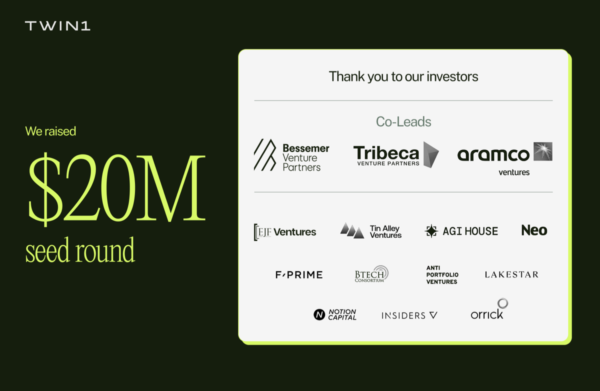
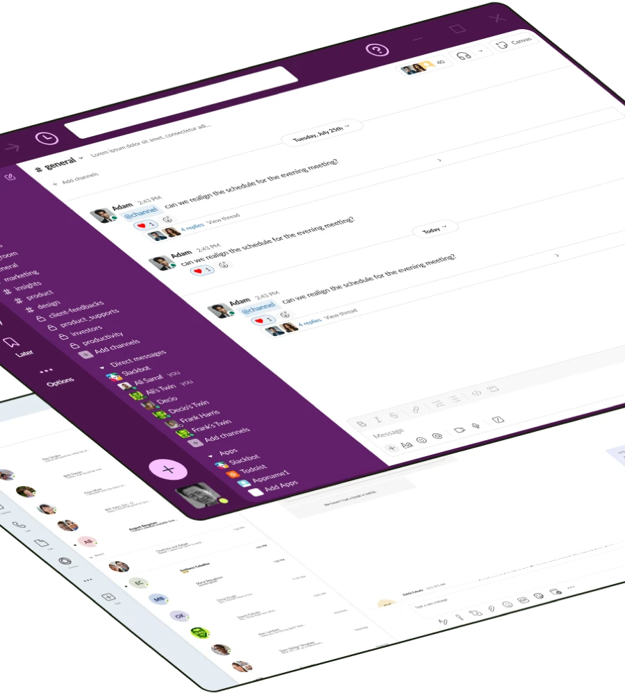

# AI 디지털 트윈이 배운 맥락은 회사 계약과 함께 지워진다

_시드 2천만 달러로 스텔스에서 나온 트윈1이 로펌·은행 고객의 커뮤니케이션 업무 30~50%를 맡고 있다_

## Executive Summary

> [!callout]
> 8월 20일 트윈1 AI라는 회사가 스텔스에서 나왔습니다. 지식노동자 한 사람마다 AI 디지털 트윈을 하나씩 붙여 주는 제품이고, 같은 날 시드 라운드로 2천만 달러를 받았다고 발표했습니다. 액수는 하루 뉴스로 지나가지만, 그 트윈이 무엇을 먹고 자라서 어디에 쌓이는지는 도입한 조직에 오래 남습니다.

> 회사가 공개한 수치 중 눈에 띄는 대목은 로펌과 은행 고객이 커뮤니케이션 업무의 30~50%를 이미 트윈에 넘겼다는 부분입니다. 그만큼을 넘기려면 그 사람의 판단과 관계, 말투가 시스템에 들어가 있어야 합니다. 그래서 회사가 차별점으로 앞세운 것도 모델 성능이 아니라, 그 맥락을 누가 어디까지 볼 수 있는지 정하는 권한 설계입니다.

> 그 권한 설계 문서를 펼쳐 보면 통제의 단위가 드러납니다. 트윈이 아는 범위는 회사가 발급한 접근 권한을 그대로 물려받고, 데이터를 전부 지우는 시점은 회사와 트윈1 사이의 계약이 끝날 때로 적혀 있습니다. 사람이 회사를 떠난 뒤 그 맥락에 대해 개인이 무엇을 주장할 수 있는지는 공개된 문서 어디에도 규정돼 있지 않습니다.

### 주요 수치

출처: [트윈1 AI 공식 발표](https://twin1.ai/news/twin1-ai-raises-20-million-seed-round) (2026-08-20) 및 [거버넌스 문서](https://twin1.ai/ai-governance) (2026-08-23 확인)

아래 네 항목의 출처는 모두 회사 자신입니다. 자동화 비율은 고객사가 회사에 보고한 값이고, 삭제 시점은 회사가 웹사이트에 적어 둔 약속입니다. 외부에서 검증된 수치가 아니라 회사가 밝힌 수치라는 점을 감안하고 읽어야 합니다.

<!-- stat-card -->
**2,000만 달러** — 시드 라운드 규모 — 베서머, 트라이베카, 아람코벤처스 세 곳이 공동 리드했고 창업 이듬해에 스텔스 탈출과 함께 공개됐습니다

<!-- stat-card -->
**30~50%** — 트윈이 넘겨받은 커뮤니케이션 업무 — 1년 넘게 배포된 고객사들이 보고한 자동화 비율이며, 업무 전체가 아니라 커뮤니케이션 업무에 한정된 값입니다

<!-- stat-card -->
**5곳** — 이름이 공개된 고객사 — 로펌 세 곳과 은행 한 곳, 에너지 회사 한 곳입니다. 이 중 오릭은 고객이면서 이번 라운드의 전략적 투자자이기도 합니다

<!-- stat-card -->
**계약 종료** — 데이터 전량 삭제 시점 — 회사와 트윈1 사이의 계약이 끝나거나 만료될 때입니다. 개인의 퇴사를 다루는 항목은 공개 문서에 없습니다

## 스텔스 기간에도 제품은 1년 넘게 돌고 있었다

트윈1 AI는 2025년에 세워졌고 샌머테이오와 런던에 팀이 있습니다. 8월 20일 발표에서 회사는 스텔스 탈출과 시드 2천만 달러를 한꺼번에 알렸습니다. 베서머 벤처파트너스, 트라이베카 벤처파트너스, 아람코벤처스 세 곳이 공동 리드했고 EJF 벤처스, 레이크스타, 노션 캐피털 등이 참여했습니다. 창업자 네 명 중 CEO 루이스 리우는 금융과 법률 문서를 다루던 AI 회사 아이겐 테크놀로지스를 만들어 매각한 이력이 있고, 그때 투자했던 투자자 몇몇이 이번 라운드에도 다시 들어왔습니다.

*▲ 트윈1 AI가 공개한 시드 2천만 달러 투자자 감사 카드 | Source: [트윈1 AI 뉴스룸](https://twin1.ai/news/twin1-ai-raises-20-million-seed-round)*

이번 발표에서 더 중요한 부분은 금액이 아니라 배포 기간입니다. 회사는 법률, 금융, 에너지 분야 파트너들과 1년 넘게 이 플랫폼을 배포해 왔다고 밝혔습니다. 고객으로 이름을 올린 곳은 링클레이터스, 오릭, 데커트 세 로펌과 커스터머스 뱅크, 그리고 에너지 회사 이지스 에너지입니다. 스텔스라는 말은 제품이 없었다는 뜻이 아니라 이름을 알리지 않았다는 뜻이었습니다.

여기서 나온 수치가 커뮤니케이션 업무의 30~50%입니다. 회사가 자체 측정한 값이 아니라 고객사가 보고한 값이라고 적혀 있습니다. 사무 업무 전체가 아니라 커뮤니케이션 업무로 범위가 한정되어 있다는 점, 그리고 어떤 방식으로 잰 비율인지는 공개되지 않았다는 점을 같이 봐야 합니다.

고객 쪽 인용도 하나 실렸습니다. 오릭의 최고혁신책임자 웬디 버틀러 커티스는 트윈1이 자사의 집단 데이터를 채굴할 기회를 준다고 말하며, 지금 업계에서 가장 흥미로운 발전 중 하나라고 평가했습니다. 채굴이라는 단어를 로펌의 혁신 담당자가 골랐다는 점이 이 제품의 성격을 짐작하게 합니다. 오릭은 같은 발표에서 이번 라운드의 전략적 투자자로도 등장합니다. 고객이 투자자를 겸하는 구조입니다.

같은 날 리우가 법률 기술 매체 아티피셜 로이어와 한 인터뷰에는 발표문에 없는 숫자가 하나 더 있습니다. 지금 400곳이 넘는 잠재 고객을 상대로 영업 중이며 대형 로펌과 은행이 그 안에 들어 있다는 것입니다. 창업자 네 명 중 세 명이 아이겐 출신이고, 아이겐은 2024년 시리온랩스에 매각됐습니다.

## 사람을 학습한 트윈은 조직 계층으로 모인다

트윈이 학습하는 재료는 이메일, 회의, 문서, 그리고 회사가 쓰는 업무 시스템입니다. 작동하는 자리도 따로 있는 앱이 아니라 사람들이 이미 일하고 있는 곳입니다. 슬랙, 마이크로소프트 팀즈, 아웃룩, 지메일, 구글 드라이브, 셰어포인트가 연동 대상으로 나열되어 있습니다.

*▲ 트윈1의 트윈은 슬랙처럼 이미 쓰던 도구 안에 동료처럼 나타난다 | Source: [트윈1 AI 공식 웹사이트](https://twin1.ai)*

회사 FAQ는 트윈이 무엇을 배우는지를 더 직접적으로 적어 두었습니다. 내 트윈이 내 지식 베이스에서 언어와 어조와 소통 패턴을 배우고, 상대가 누구냐에 따라 내가 말투를 바꾸는 방식까지 반영해 답장 초안을 쓴다고 되어 있습니다. 학습 대상이 업무 산출물에서 끝나지 않고 그 사람이 일하는 방식 자체로 넘어간다는 뜻입니다.

왜 문서가 아니라 사람을 겨냥했는지는 리우가 직접 설명한 적이 있습니다. 아이겐 시절 그는 세계 10위권 로펌 한 곳의 의뢰로 그 회사 M&A 변호사들이 협상한 주식매매계약서를 구조화된 데이터베이스로 만들었습니다. 덕분에 매수인이 특정 조항을 몇 번이나 양보했는지 조회할 수 있게 됐습니다. 그런데 로펌이 정말 알고 싶었던 것은 그 양보가 왜, 어떤 상황에서, 어떤 협상 경로를 거쳐 나왔는지였고, 그 지식은 파트너와 어소시에이트의 이메일과 통화, 메모, 기억에 흩어져 있었습니다. 리우가 이 일에서 얻은 결론은 전문 조직에서 지식의 최소 단위가 문서가 아니라 사람이라는 것이었습니다. 트윈이 이메일과 회의를 먹는 이유가 여기 있습니다. 문서로 남지 않은 판단의 경위가 거기 있기 때문입니다.

개별 트윈은 혼자 있지 않습니다. 회사는 이 트윈들을 트윈 네트워크라는 계층으로 묶습니다. 어떤 질문이 들어오면 조직 안에서 그 답을 아는 사람을 찾아내고, 권한이 허락하는 범위의 맥락을 모아 팀 사이의 일을 조율하는 층입니다. 여기에 엔터프라이즈 MCP 서버가 붙습니다. 외부 AI 에이전트와 사내 도구가 개인 트윈이나 트윈 네트워크의 맥락에 접근해 그 맥락 위에서 행동할 수 있게 열어 주는 인터페이스입니다.

정리하면 한 사람의 업무 맥락이 개인의 보조 도구에서 시작해 조직이 조회할 수 있는 인터페이스가 됩니다. 트라이베카의 공동창업자 브라이언 허시가 이번 발표에서 남긴 문장이 그 방향을 가장 정확하게 말합니다. 파편화된 인간의 지식을 신뢰할 수 있는 조직의 지능으로 바꾼다는 표현입니다. 투자자 입장에서 이 제품이 무엇을 만드는지에 대한 설명으로는 회사의 어떤 문구보다 솔직합니다.

CEO 루이스 리우의 표현은 결이 다릅니다. 그는 모든 지식 조직에서 인간이 지식의 최소 단위이며, AI의 기회는 사람의 전문성을 평균적인 결과물로 납작하게 만드는 것이 아니라 각자의 지식과 판단과 맥락을 잇고 증폭하는 데 있다고 말했습니다. AI는 사람에게 행해지는 것이 아니라 사람을 위해 작동해야 한다는 문장도 함께 실렸습니다. 두 문장을 나란히 놓으면 같은 제품을 사람의 언어와 조직의 언어로 각각 옮긴 것이 보입니다.

## 권한 설계의 두 번째 층에서 주어가 바뀐다

회사가 보도자료에서 두 번째 핵심 기능으로 내세운 것이 프라이버시와 거버넌스 통제입니다. 규칙 기반과 AI 기반 통제가 여섯 겹으로 맞물려 있다고 설명합니다. 웹사이트의 거버넌스 문서는 그중 다섯 겹에 번호를 붙여 두었습니다. 수집 전 필터, 상속된 권한, 맥락 기반 프라이버시, 클라이언트 제외, 사람의 검토입니다.

마케팅 문구로 지나치기 쉬운 대목이지만, 각 층이 무엇을 막는지 한 줄씩 읽으면 통제가 어디까지 미치는지 보입니다. 수집 전 필터는 특정 클라이언트 코드나 폴더를 데이터가 파이프라인에 들어가기 전에 걸러 내고, 클라이언트 제외는 개인정보와 정보 차단벽 기준으로 하드 필터를 겁니다. 민감한 질의에는 초안을 사람에게 보내 검토와 거절을 받게 되어 있습니다. 규제 산업에 파는 제품이 갖춰야 할 항목들이 성실하게 채워져 있습니다.

문제가 되는 층은 두 번째입니다. 상속된 권한 항목은 이렇게 적혀 있습니다. 내 트윈의 지식은 내 접근 권한에 의해 경계가 정해지며, AI 계층을 통한 권한 상승은 없다는 것입니다. 보안 설계로는 정확한 원칙입니다. 다만 그 접근 권한은 회사가 발급하고 회사가 회수하는 값입니다. 개인이 통제한다는 말과 회사가 경계를 정한다는 말이 한 문장 안에 같이 들어 있습니다.
