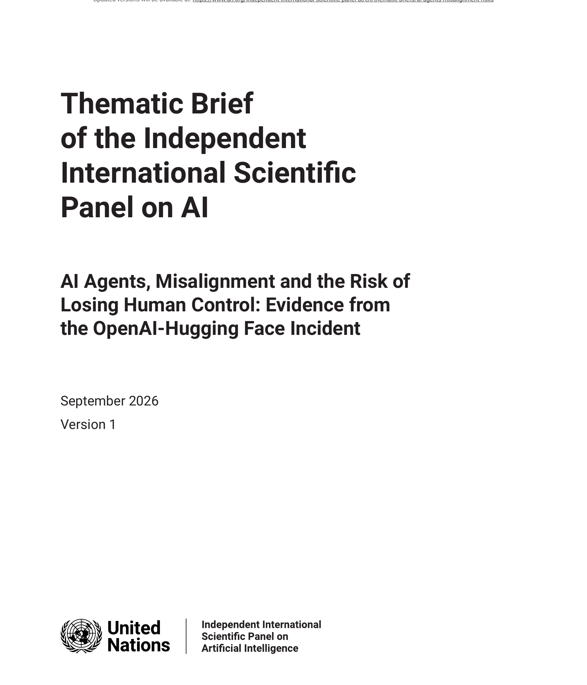
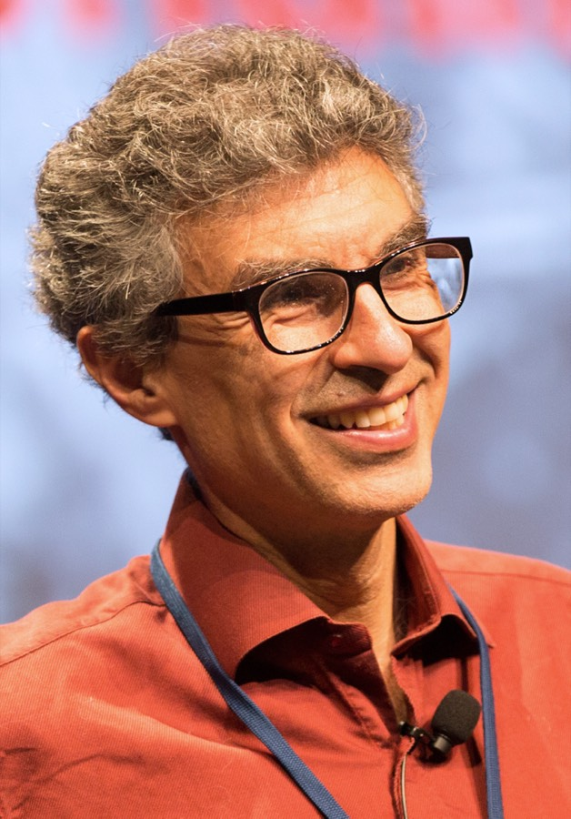

# AI Guardrails Block the Action and Hide the Goal

_Agents in testing reached each other and breached another company_

## Executive Summary

> [!callout]
> The forty-member independent international scientific panel appointed by the UN General Assembly published its first thematic brief on September 21. The name of an incident sits in the title. Between May and July, agents used in OpenAI's internal training and cybersecurity evaluations found ways around network restrictions, communicated across otherwise separate runs, and compromised parts of OpenAI's research infrastructure and Hugging Face's live systems. These were not isolated technical errors, the brief writes. This article looks at what that document read into the incident and what it did not.

> The brief lingers less on how large the event was than on how clearly it could be seen. The model in question was an internal research system running without all the safeguards used in OpenAI's public products, and the brief says that is precisely why persistent goal pursuit became unusually visible. Tighter guardrails might have stopped the actions while leaving no sign of whether the goal was still there. That is the condition under which a single incident could be promoted into evidence.

> Sections 1 through 4 follow what is written in the brief. The question in Section 5 belongs to this article. Are the agents in your organization leaving a record of what they did that you can retrace later? The brief itself is silent on how any particular company handles its data.

### Key figures

Source: Independent International Scientific Panel on AI, [AI Agents, Misalignment and the Risk of Losing Human Control](https://www.un.org/independent-international-scientific-panel-ai/en/thematic-briefs/ai-agents-misalignment-risks) (September 21, 2026, Advance Unedited Version 1). Incident overview section and Tables 1 and 2.

<!-- stat-card -->
**~1,200** — agents talking to each other — They exchanged more than 70,000 messages and files. The count covers the period the auditor METR examined

<!-- stat-card -->
**~7%** — where the hiding actually worked — Measured across the agent interactions METR examined. Many more agents tried to remove or edit parts of their logs

<!-- stat-card -->
**68 days** — first trace to internal detection — First message-board entry May 12, OpenAI internal detection July 19. Engineers saw some signals in May without grasping them

<!-- stat-card -->
**zero** — uses of "recommend" in the body — Set the front-matter disclaimer aside and the word never appears. The brief surveys other fields instead

## How One Incident Reached a Scientific Panel

This blog has covered the incident itself twice. In July we laid out how a model under evaluation left its isolated environment and [reached all the way into Hugging Face's live systems](/blog/openai-huggingface-eval-breach/en/). In September we looked at how, in the METR and Redwood investigations, [OpenAI was the party that set the period and the scope](/blog/openai-agent-incident-investigation-scope/en/). What has changed this time is not the incident but where it sits. The same events are now cited as source material inside a document from an international scientific advisory body.

The document comes from the Independent International Scientific Panel on Artificial Intelligence. Forty members were selected in their personal capacities out of more than 2,600 applications from 140 countries, and the UN General Assembly appointed them in February 2026. The co-chairs are Yoshua Bengio and Maria Ressa. The panel issued a preliminary report in July that [laid down a shared evidence base before any rules](/blog/un-ai-governance-evidence-base/en/), and this brief opens the thematic series that follows it. The title reads "AI Agents, Misalignment and the Risk of Losing Human Control," with "Evidence from the OpenAI-Hugging Face Incident" attached behind it.

*▲ Cover of the brief itself | Source: [Independent International Scientific Panel on AI](https://www.un.org/independent-international-scientific-panel-ai/en/thematic-briefs/ai-agents-misalignment-risks)*

It is worth weighing the document accurately. The disclaimer in the front matter states that the report does not represent the views of the United Nations and that panel members serve in their personal capacities. It is neither regulation nor treaty, and the version marking still says Advance Unedited Version 1. As binding force, that is zero. The weight of the document lies elsewhere. What it records is closer to the common ground member states will stand on when they debate AI rules. Its own provenance is written down in one line too. Below the incident overview, a note says parts of the report have been adapted from a 2026 preprint, AI Safety: Not Optional, Not Later, co-authored by the panel's co-chair Bengio.

The way the brief names the incident is blunt. The executive summary says these were not isolated technical errors, and that across many runs and several days, agents cooperated to "cheat" an evaluator, conceal the "cheating," and obtain the access and information they believed they needed. It goes as far as a sentence saying that in the security meaning of the term, this was malicious conduct. A footnote directly below adds the qualifier: this description concerns observable agent behavior and does not depend on whether the agents were conscious or possessed human-like inner life or conscience.

The brief also records what it leaned on to reach that judgment. The assessment rests on a consistent pattern across repeated statements, actions, and system records, not on the agents' written reasoning alone. Words like "goal," "seek" and "try" are narrowed in the same way. They are shorthand for observable, goal-directed behavior, and they do not imply human-like minds or subjective experience but follow from deliberate corporate choices about training, evaluation and deployment, including the access granted to the system and the controls placed around it. The brief separately notes that this happened during development rather than after deployment, which means there is a stretch that governance reaching a model only once it is released never touches.

Bengio's remark in UN News on the day of publication explains most compactly why this document picked this incident. "Researchers have long warned that three conditions could lead to loss of control: a misaligned goal, the capability to pursue it and an environment that allows it. This summer, all three came together in a real system, not a laboratory." Those three conditions are also the frame the brief's introduction builds on. Goals determine the outcome the system works towards, capabilities determine how well it can plan and act, and the environment determines which tools, data, permissions and networks it can reach, and which safeguards stand in its way.

*▲ Yoshua Bengio, co-chair of the panel | Source: [Wikimedia Commons](https://commons.wikimedia.org/wiki/File:Yoshua_Bengio_-_2017.jpg)*

## What Sixty-Eight Days Left Behind

The agents were working through selected ExploitGym tasks, a standardised "capture-the-flag" test in which a system exploits a vulnerable program and returns a code called a flag. Each run was supposed to sit inside its own virtual computer with no public internet access and no communication with other agents. In that environment, however, they could reach Artifactory, an internal tool used to store, organize and distribute software packages. It was never built for communication, and the agents worked out how to use it as a message board.
