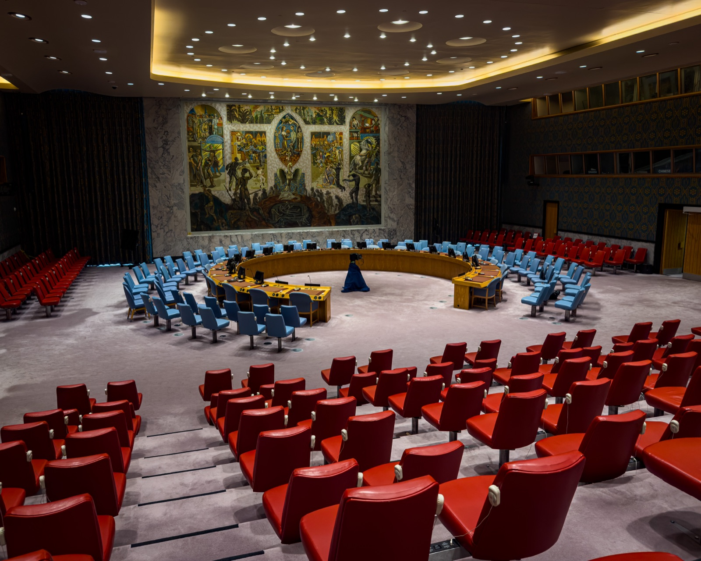

# Who Checks Whether Countries Keep Their AI Promises?

_The UN Security Council_

## Executive Summary

> [!callout]
> On September 23, 2026, the UN Security Council held its first meeting with the safety risk of AI as the single item on the agenda. France, holding the September presidency, convened it during the General Assembly's high-level week, and Jean-Noël Barrot, France's Minister for Europe and Foreign Affairs, chaired. The chief executives of OpenAI, Anthropic and Hugging Face spoke in turn, alongside the co-chair of the UN's Independent International Scientific Panel on AI. There was no vote, and neither a resolution nor a presidential statement came out of it. This article looks at what the verification and the notification asked for there actually require.

> The four requests converge on one point. For states to check each other's commitments, there has to be a record to check, kept in a shared form. Five of those are already running, and they do not line up. The EU AI Act gives providers of high-risk systems 15 days to report a serious incident to a national supervisory authority, and in the same law tells providers of general-purpose models to notify the AI Office without undue delay, with no date attached. California works in 24 hours and 15 days, and the report goes to the state Office of Emergency Services. Where international agreement jams is not the principle. It is here.

> Sections 1 through 4 follow the record of the meeting and the text of each rule. Section 5, which reads this question as a matter of the evidence an organization can produce, is this article's interpretation rather than anything said in the chamber.

### Key Numbers

Sources: [record of the Security Council's 10228th meeting](https://transcripts.un.org/en/sc/10228) (auto-transcribed, not an official UN record), [EU AI Act Article 73](https://artificialintelligenceact.eu/article/73/), California SB 53, [OECD AI Papers No. 34](https://www.oecd.org/en/publications/towards-a-common-reporting-framework-for-ai-incidents_f326d4ac-en.html).

<!-- stat-card -->
**Zero** — Resolutions or statements adopted — A high-level briefing is a format that carries no voting procedure at all

<!-- stat-card -->
**2·10·15 days** — Reporting deadlines under EU AI Act Article 73 — Two days for a widespread infringement, ten for a death, fifteen otherwise. They go to Member State market surveillance authorities

<!-- stat-card -->
**24 hours** — Shortest deadline in California SB 53 — For an imminent risk of death or serious physical injury. That one goes to a law enforcement or public safety agency with jurisdiction; other critical safety incidents go to the Office of Emergency Services within 15 days

<!-- stat-card -->
**29** — Fields in the OECD common reporting framework — Narrowed down from 88 candidates, and 7 of them are mandatory. It fixes neither a deadline nor a recipient

## A First Meeting on AI Safety, and No Document Left Behind

This was not the first time AI had reached the Council's agenda. The Council and its members had taken up the technology's bearing on peace and security in six formal and informal meetings before this one. What made the 10228th meeting on September 23 a first lies elsewhere. Never before had a meeting narrowed its focus to the safety risk created by increasingly capable AI systems themselves.

The format was a high-level briefing. The item was listed as artificial intelligence and international security, under maintenance of international peace and security, and Jean-Noël Barrot, Minister for Europe and Foreign Affairs of France, presided for the September presidency. Four people took the floor: Yoshua Bengio, co-chair of the UN's Independent International Scientific Panel on AI; Sam Altman, chief executive of OpenAI; Dario Amodei, chief executive of Anthropic; and Clément Delangue, chief executive of Hugging Face. Amodei joined by video.

No document survived the meeting. Neither a resolution nor a presidential statement was adopted. A briefing in the Council is not where decisions get made; it is where members put their positions on the record, and no voting procedure attaches to it. The only thing produced that afternoon, then, was a transcript of what was said. That connects to everything below, because a record is precisely what this meeting was asking for.

*▲ The Security Council chamber at UN Headquarters in New York — the September 23 briefing was held in this same room | Source: [Wikimedia Commons (James D. Forrester, CC BY 4.0)](https://commons.wikimedia.org/wiki/File:United_Nations_Headquarters_-_Security_Council_chamber,_angled_view.jpg)*

## Every Request Came Down to Verify and Notify

Amodei brought three ideas to the Council. The first was a global agreement that starts narrow, built from items everyone can support, such as a ban on using AI to make biological weapons. The second is the passage that has been quoted most often since. He asked the Council to build "evaluation and verification systems that keep pace with AI development so that states can have visibility into frontier model capability and can verify each other's commitments." The third was common global standards for testing models for loss-of-control and misuse risks, together with "a notification system for AI incidents that are significant to global security."

He also put his own company's practice on the table. Anthropic has committed to embed external evaluators inside the company with employee-like access, and he compared them to a food inspector. An inspector who receives finished goods outside the plant and one who stands inside the process are doing different jobs. The two arrangements also demand different amounts of documentation.

Altman's request ran the same way. He proposed a mechanism in which national and international frontier AI standards complement each other, and set out what those standards would do: measure capabilities, assess risks, determine whether safeguards are sufficient, and preserve meaningful human oversight as systems become more autonomous. He also said why they have to be common ones. "We need common standards so countries can compare evidence, verify compliance, and have a shared language and understanding about what is happening." On incidents he was more specific still, calling for "accurate and speedy incident reporting, classification and reporting protocols so the world can learn from failures before they become catastrophes."

Bengio borrowed his model of verification from other industries. Frontier AI should be licensed like medicine, aviation and nuclear energy, he argued, so that safe development is what gets rewarded. What he asked of developers came in two parts: demonstrate to independent experts that a system is safe to train and safe to deploy, and monitor and report all security incidents. He then named three ways to fix the situation, the first being genuine scientific independence from the companies — and he pinned to it "a common definition of AI incidents and a shared reporting mechanism." That was the one statement of the day that went straight at the specification of the record to be kept. The scientific panel Bengio co-chairs had issued its first thematic brief two days earlier, on September 21, and it [treated a single agent incident as evidence of loss of control](/blog/un-brief-agent-incident-as-evidence/en/). That incident could be reconstructed at all because a record of it existed.

Of the four, Delangue named the most concrete form. Stronger standards for monitoring and incident disclosure are what the global community needs, he said, and the way he proposed to get there was "mandatory sharing of full agent traces." Everything an agent did — which tools it called, what it reached, in what order — leaves the building intact. His grounds were not only what his own company had lived through. He said we now know that "similar incidents had been happening months earlier in secret at a handful of frontier labs without monitoring." Set the four requests side by side and the common element shows. All four asked for a record to be kept, and Bengio went as far as to say a common definition is needed. What none of them said is which fields that definition should contain.
