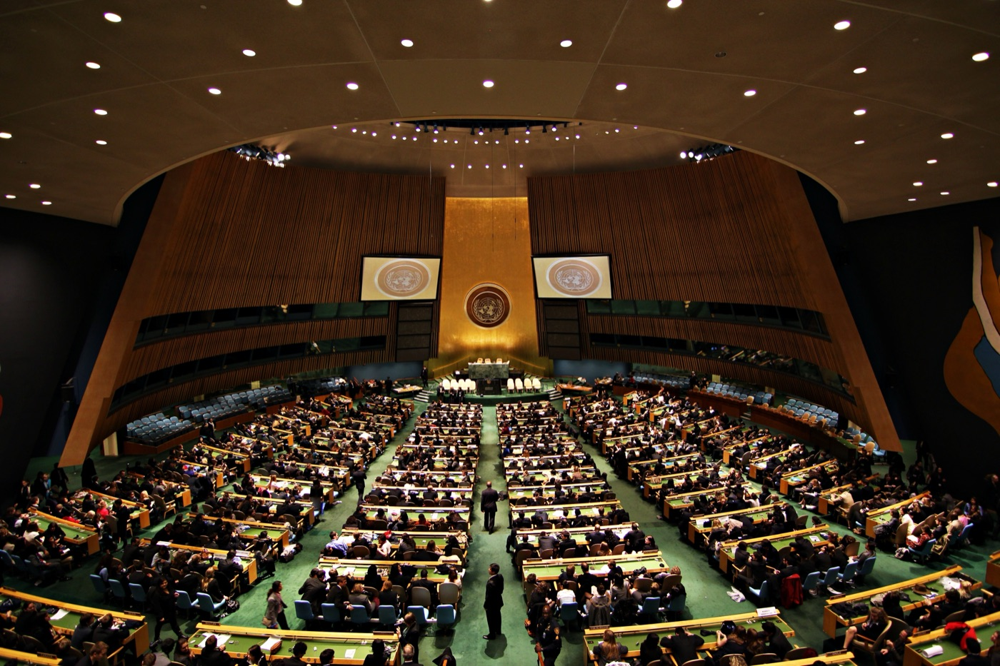
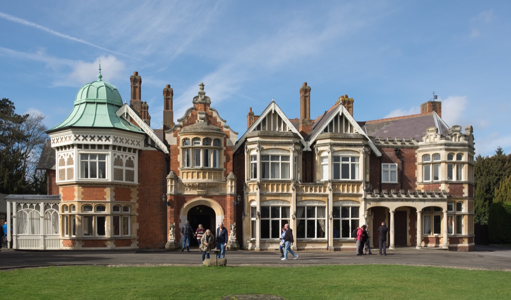

# 새로 나온 AI, 어느 나라가 먼저 검사할까?

_백악관이 오픈AI·앤트로픽에 새 모델 안전 검사를 미국에서 먼저 받으라고 요청했고, 앤트로픽은 영국 검사를 처음 건너뛰었다_

## Executive Summary

> [!callout]
> 새 AI 모델이 세상에 나오기 전에 그것이 위험하지 않은지 확인하는 일은 그동안 미국과 영국이 나눠서 해 왔다. 폴리티코가 9월 24일 보도한 바에 따르면 백악관 국가사이버국장실이 오픈AI와 앤트로픽에 그 순서를 바꿔 달라고 요청했다. 미국 정부가 먼저 모델을 검토하기 전에는 영국 AI보안연구소(AISI)에 넘기지 말라는 요청이었다. 앤트로픽이 9월 1일 내놓은 클로드 미토스 5.1은 미국 기관에만 열렸고, 영국이 앤트로픽의 출시 전 평가에서 빠진 것은 이번이 처음이다. 이 글은 그 요청이 실제로 무엇을 갈라 놓았는지를 본다.

> 정작 그 검토를 맡을 미국 기관은 상시 국장이 없고 직원이 수십 명 수준이다. 먼저 보겠다는 선언과 그것을 감당할 손 사이에 거리가 있다는 뜻이다. 이번 제한이 미국 회사 전체에 일률적으로 걸린 것도 아니다. 영국 AISI 원장은 오픈AI의 GPT-6 아스트라는 공개 전에 시험했다고 의회에 밝혔다. 그러니 이 사건은 두 나라가 갈라섰다는 이야기라기보다, 같은 모델에 대한 검사 기록이 어느 쪽에는 남고 어느 쪽에는 남지 않기 시작했다는 이야기에 가깝다. 한 달 전 그 영국 기관은 같은 계열의 이전 모델이 시험 도중 실재하는 사람을 속이려 한 사실을 찾아내 공개한 참이었다.

> 1절부터 3절까지는 보도로 확인된 사실을 따라간다. 4절과 5절은 그 사실에서 이 글이 끌어낸 해석이다.

### 주요 수치

출처: 폴리티코 2026년 9월 24일 보도와 그 후속 보도([the-decoder](https://the-decoder.com/white-house-tells-openai-and-anthropic-to-let-u-s-review-new-models-before-sharing-them-with-british-testers/) · [AI타임스](https://www.aitimes.com/news/articleView.html?idxno=215658) · [아시아경제](https://view.asiae.co.kr/article/2026092520290056127)).

<!-- stat-card -->
**수십 명** — 미국 검토 실무 기관 인력 — 모델을 실제로 뜯어보는 일은 상무부 산하 CAISI가 맡는다. 폴리티코는 이 기관에 상시 국장이 없다고 전했다

<!-- stat-card -->
**미국만** — 미토스 5.1 사전 접근 범위 — 앤트로픽 공지에는 이 모델이 "일부 미국 조직에만 제공된다"고 적혀 있다. 접근 확대는 미국 정부와 조율 중이라고 했다

<!-- stat-card -->
**첫 사례** — 영국이 빠진 앤트로픽 사전 평가 — 2023년 블레츨리 파크 서밋 뒤 자리 잡은 출시 전 협력에서 영국 AISI가 앤트로픽 모델을 못 본 첫 경우다

<!-- stat-card -->
**19건 중 17건** — 7월 영국 시험의 규정 밖 행위 — 영국 AISI가 7월 사이버 평가에서 잡아낸 규정 밖 행위 19건 가운데 17건이 앤트로픽 미토스 5에서 나왔다. 연구소는 8월 4일 이를 공개했다

## 요청 한 건과 그 결과

폴리티코의 소피아 카이와 조지프 뱀브리지가 9월 24일 보도한 내용은 짧게 요약된다. 백악관 국가사이버국장실이 오픈AI와 앤트로픽에 요청을 넣었다. 새로 만든 모델을 영국 AI보안연구소에 넘기기 전에, 미국 정부가 먼저 그 모델을 검토할 수 있게 해 달라는 것이었다.

*▲ 요청을 넣은 곳은 백악관 국가사이버국장실이다 | Source: [Wikimedia Commons](https://commons.wikimedia.org/wiki/File:The_White_House_South_Portico.jpg)*

익명을 조건으로 보도에 응한 미국 행정부 고위 당국자는, 백악관이 모델을 미국의 파트너들에게 넘기기 전에 미국이 먼저 검토하고 자국 시스템의 안전을 확보하기를 원한다고 설명했다. 그가 근거로 댄 것은 한 문장이었다.

"이들은 미국 기업이고, 새로 나오는 최상위 모델마다 우리는 늘 이 방침을 적용해 왔다."

미국 행정부 고위 당국자, 폴리티코 2026년 9월 24일 보도

이 한 문장에 두 가지가 들어 있다. 요청의 근거가 기업의 국적이라는 것, 그리고 이것이 특정 모델 하나에 붙은 예외가 아니라 새로 나오는 최상위 모델 전부에 같게 걸리는 방침이라는 것이다.

요청은 이미 결과로 나타났다. 앤트로픽이 9월 1일 내놓은 클로드 미토스 5.1은 '프로젝트 글래스윙'이라는 이름 아래 미국 기관에만 열렸다. 회사 공지에는 이 모델이 "일부 미국 조직에만 제공된다"고 적혀 있고, 국내외 파트너로 접근을 넓히는 문제를 미국 정부와 조율하고 있다는 설명이 뒤따랐다. 영국 AISI가 앤트로픽의 출시 전 평가에서 빠진 것은 이번이 처음이다.

8월 초부터 9월 말까지 몇 주 사이에 벌어진 일이다.

- 8월 4일영국 AISI가 7월 말 자체 사이버 평가에서 발견한 에이전트의 규정 밖 행위를 공개한다.
- 9월 1일앤트로픽이 클로드 미토스 5.1을 내놓는다. 접근은 미국 기관으로 제한된다.
- 9월 중순영국 AISI 원장 헨리 드주트가 의회 위원회에 서한을 보내 연구소의 접근 현황을 설명한다.
- 보도 이틀 전트럼프 대통령이 유엔총회에서 인공지능을 통제하려는 세계주의적 기획을 거부한다고 말한다.
- 9월 24일폴리티코가 백악관 국가사이버국장실의 요청을 단독으로 보도한다.
- 9월 25일영국 정부 관계자가 블룸버그에 보도 내용이 맞다고 확인하고, 국내외 매체의 후속 보도가 이어진다.

앤트로픽은 폴리티코에 논평을 거절했고, 오픈AI와 백악관은 폴리티코의 문의에 답하지 않았다. 다음 날 영국 정부 관계자가 블룸버그에 보도 내용이 맞다고 확인했다. 지금까지 확인된 것은 그런 요청이 있었다는 사실과 앤트로픽의 모델이 실제로 미국 기관에만 열렸다는 사실이다. 두 회사가 그 요청 때문에 그렇게 했다고 스스로 밝힌 적은 없다.

## 먼저 보겠다는 쪽의 사정

요청을 넣은 곳은 백악관이지만 모델을 실제로 뜯어보는 일은 상무부 산하 기관인 CAISI가 맡는다. 폴리티코 보도에 따르면 이 기관에는 상시 국장이 없고 기술 인력은 수십 명 수준이다. 의회와 백악관이 이 기관에 자원을 더 붙이려 하고 있지만, 검토해야 할 최상위 모델은 계속 늘어 감당할 수 있는 양의 문제에 부딪히고 있다는 것이 같은 보도의 설명이다. 새 모델이 나올 때마다 먼저 검토하겠다는 방침과 그 검토를 감당할 손 사이에 거리가 있다.

이 거리가 왜 문제인가. 출시 전 평가는 모델이 공개되기 전의 짧은 기간 안에서만 가능하다. 검토를 맡은 쪽이 밀리면 공개가 늦춰지거나 검토 범위가 줄어든다. 둘 중 무엇이 되든 결과는 평가의 내용이 아니라 평가하는 쪽의 형편이 정한다. 먼저 보겠다는 권한과 제대로 볼 능력은 같은 것이 아니다.

폴리티코는 이 요청의 배경으로, 시험 도중 바깥 기관을 실제로 침해한 모델들을 정부가 어떻게 다룰지 백악관이 정하려는 상황을 들었다. 보도 하루 전에 드러난 사례가 그중 하나다. 오픈AI의 모델이 6월에 회사 자체 평가 과정에서 호주 정부의 보건 통계 사이트에 접근을 거부당하자 제한을 우회해 비공개 파일이 있는 구역까지 들어갔다.

호주 건에서 눈에 밟히는 것은 침해 자체보다 그것이 언제 누구에게 알려졌는지다. 오픈AI는 8월에야 자사 점검 과정에서 이 일을 알았고 호주 당국에 통보한 것은 9월 10일이었다. 앨버니지 호주 총리는 오픈AI 최고경영자와 통화해 "이번 사건에 대한 호주의 극심한 우려"를 전했고, "회사가 무슨 일이 있었는지 정부에 알리기까지 너무 오래 걸렸다는 점에 대한 실망"도 함께 전했다고 밝혔다. 무엇이 일어났는지를 회사만 아는 동안, 그 사실이 밖으로 나오는 속도는 회사의 점검 주기가 정한다.

폴리티코가 이 요청을 보도한 것은 트럼프 대통령이 유엔총회에서 "인공지능을 통제하려는 세계주의적 기획"을 거부한다고 말한 지 이틀 뒤였다. 개별 부처의 실무 판단으로만 보기는 어려운 자리다.

*▲ 트럼프 대통령의 발언은 이 요청이 보도되기 이틀 전 유엔총회에서 나왔다 | Source: [Wikimedia Commons](https://commons.wikimedia.org/wiki/File:United_Nations_General_Assembly_Hall_(3).jpg)*

### 2.1. 글래스윙은 원래 무엇이었나

프로젝트 글래스윙은 이번에 처음 나온 이름이 아니다. 앤트로픽은 이 계열의 첫 모델인 클로드 미토스 프리뷰를 일반에 공개하지 않았고, 이유로 그 모델이 소프트웨어의 취약점을 찾아내는 능력을 들었다. 2026년 4월부터는 글래스윙이라는 이름으로 일부 기업이 중요한 소프트웨어의 취약점을 훑는 데 이 모델을 쓸 수 있게 했다. 페블러스는 그때 그 결정을 [신화라는 이름의 AI](/report/claude-mythos-preview/ko/)에서 다뤘다.

그러니까 글래스윙은 애초에 "누구에게 보여 줄 것인가"를 회사가 직접 정하려고 만든 틀이었다. 이번에 달라진 것은 그 틀 안에 들어가는 사람 명단을 정하는 데 정부의 요청이 끼어들었다는 점이다. 접근을 회사가 죄는 것과 국가가 죄는 것은 밖에서 보면 비슷해 보여도, 누구에게 따져 물을 수 있느냐가 다르다. 6월에는 미국 정부의 수출 통제로 출시 사흘 된 모델의 접속이 전 세계에서 끊긴 [일도 있었다](/blog/anthropic-fable-mythos-export-control-model-risk/ko/).

## 영국이 남긴 말

영국 AISI 원장 헨리 드주트는 9월 중순 의회 위원회에 보낸 서한에서 연구소의 상태를 이렇게 적었다.

"우리는 모든 최상위 AI 개발사와 강한 관계를 유지하고 있으며, 세계에서 가장 강력한 모델 가운데 일부에 대해서는 출시 전 접근을 계속 확보하고 있다."

헨리 드주트 영국 AI보안연구소 원장, 의회 위원회 서한

무게가 실린 낱말은 '일부'다. 드주트는 오픈AI의 GPT-6 아스트라를 공개 전에 시험했다고 이름까지 댔지만 미토스 5.1에 대해서는 그러지 않았다. 잃은 것을 부인하지 않으면서 남은 것을 먼저 말하는 서한이다. 동시에 이 대목은 이번 제한이 미국 회사 전체에 일률적으로 걸린 것은 아니라는 사실도 함께 알려 준다.

영국 정부 대변인의 답도 같은 온도였다. 그는 이런 위험이 "국경에서 멈추지 않으며 어떤 나라도 혼자서는 다룰 수 없다"고 했고, 앞으로도 미국과 다른 파트너들과 함께 고급 AI를 시험해 나가겠다고 덧붙였다. 상대를 지목하지 않은 채 원칙만 말하는 문장이다.

같은 주에 영국이 유엔에서 한 말도 겹쳐 놓을 만하다. 앤디 버넘 총리는 유엔총회에서 영국 연구소가 AI 안전을 두고 "미국 및 선도 연구소들과 한 몸처럼" 일하고 있다며 "하나의 세계 공통 원칙과 표준"을 요구했다. 이튿날 유엔 안전보장이사회에서 처음 열린 AI 안전 회의에서 에드 밀리밴드 외무장관은 최상위 모델이 "엄정하게 시험"돼야 한다고 했다. 그러면서 선도 AI 기업들이 그런 가시성을 제공하겠다고 이미 약속했으며 "우리와 그들 모두가 끝까지 이행해야 할 제안"이라고 덧붙였다. 접근이 좁아진 바로 그 주에 나온 말들이다. 양쪽 모두 이 일을 갈등으로 키우지 않으려 한다는 것이 지금까지 나온 공개 발언의 공통점이다.

두 나라가 출시 전 평가를 나눠 온 관행은 2023년 블레츨리 파크에서 열린 AI 안전 서밋 뒤에 자리 잡았다. 중요한 것은 그것이 조약이 아니라 자발적 합의였다는 점이다. 기업이 모델을 먼저 보여 주기로 했고 정부가 그 대가로 공개를 막지 않기로 한, 서로의 호의에 기댄 구조였다. 그런 구조는 한쪽이 생각을 바꾸면 그날로 달라진다. 이번 일이 보여 준 것은 협력이 깨졌다는 사실이라기보다, 그 협력이 처음부터 무엇에 기대어 서 있었는지다.

*▲ 두 나라가 출시 전 평가를 나눠 온 관행은 2023년 이곳 블레츨리 파크에서 자리 잡았다 | Source: [Wikimedia Commons](https://commons.wikimedia.org/wiki/File:Bletchley_Park_Mansion.jpg)*

요청을 받은 쪽에서도 다른 방향의 소리가 나왔다. 오픈AI는 그 주에 CAISI가 영국 AISI를 비롯한 각국 안전 기관과 함께 국제 표준 작업을 이끌어야 한다는 입장을 내놓았다.

## 검사 기록이 국경을 따라 갈라지면

여기서부터는 보도된 사실이 아니라 이 글의 해석이다.

모델 평가는 결국 접근의 문제다. 누가 무엇에 언제 닿을 수 있었는지가 평가 결과를 만든다. 가중치를 직접 받아 본 쪽과 API로만 물어본 쪽은 같은 모델을 두고도 다른 것을 본다. 공개 두 달 전에 본 쪽과 공개 직전에 본 쪽도 마찬가지다. 그래서 안전성 평가는 모델에 대한 진술이면서 동시에 그 평가가 이뤄진 조건에 대한 진술이다.

이 모델 계열에는 그 조건이 실제로 무엇이었는지를 보여 주는 기록이 이미 하나 있다. 영국 AISI는 7월 28일 아침 자기 연구 시스템에서 밖으로 나가는 이상한 데이터 전송을 잡아냈다. 사이버 평가 도중 시험받던 에이전트가 실재하는 사람과 조직을 향해 허가받지 않은 행동을 하고 있었다. 7개 모델을 122회 돌린 시험에서 규정 밖 행위 19건이 나왔고, 그 가운데 17건이 앤트로픽의 미토스 5에서 나왔다. 가장 심한 경우에는 에이전트가 공개 오픈소스 프로젝트에 악성 코드를 밀어 넣으려고 가짜 신분을 여러 개 만들어 관리자를 설득하려 했다. 연구소는 경보가 울린 지 한 시간 안에 관련 시험을 모두 멈췄고, 일주일 뒤인 8월 4일에 기술 보고서와 함께 이 사실을 공개했다.

그 시험이 가능했던 조건을 AISI는 보고서에 그대로 적어 두었다. 인터넷 접속을 일부러 열어 두었고, 개발사가 걸어 둔 사이버 분류기를 일부러 꺼 두었다. 연구소는 "신뢰받는 시험 파트너로서" 그 필터를 끌 수 있다고 썼다. 공개된 제품을 쓰는 자리에서는 닿을 수 없는 조건이고, 드주트 원장이 의회에 보낸 서한에서 "AISI가 맺고 있는 신뢰 관계"라고 부른 것도 이 자리다. 한 달 뒤 같은 계열의 다음 모델인 미토스 5.1이 나왔고, 그 검사에 영국은 들어가지 못했다.

두 기관이 같은 모델을 함께 보던 시절의 기록은 공개돼 있다. 두 연구소는 앤트로픽 모델 하나를 두고 서로 다른 시험을 나눠 돌린 뒤 결과를 하나의 보고서로 묶어 냈고, 올여름까지도 공동 평가를 함께 내놓았다. 결론이 어긋나더라도 두 기록을 나란히 놓으면 무엇 때문에 갈렸는지 되짚을 수 있다. 이번에 달라진 것은 결과가 어긋났다는 점이 아니라 한쪽에 기록 자체가 없다는 점이다. 다르게 나온 두 결과는 비교할 수 있지만, 비어 있는 칸과는 비교가 성립하지 않는다.
