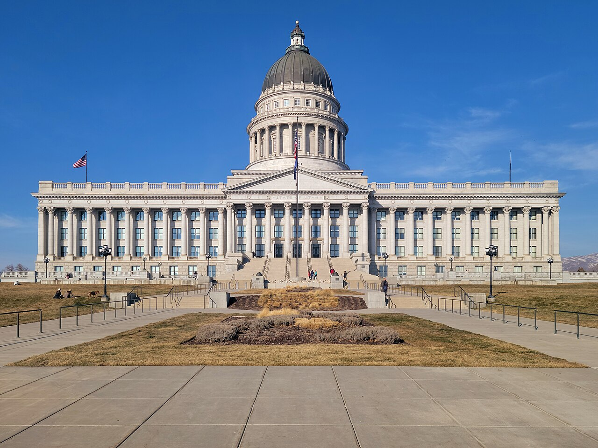

# Utah Lets AI Prescribe Acne Drugs Without a Doctor

_In the first US pilot to let AI issue new prescriptions, physician review falls from every case to a monthly 10% sample as patients add up_

## Executive Summary

> [!callout]
> This article reads one agreement, signed by the US state of Utah on 22 September 2026. Utah's Office of Artificial Intelligence Policy and its Division of Professional Licensing told the startup Nolla Health that an AI may issue acne prescriptions on its own, with no physician signature. The approval covers not only refills that continue a drug someone already prescribed but first-time prescriptions as well. That second part is what no US state had allowed in writing before.

> The part worth watching is not how accurate the AI is but how the oversight was designed. The agreement draws three stages in advance, and the share a human reads drops to a monthly 10% sample as patients add up. Moving up a stage requires physicians and the AI to agree on at least 95% of prescriptions. The number Nolla Health offers as safety evidence is roughly 96% across its last 1,000 real prescriptions, and the company did the counting.

> Sections 1 through 4 are facts from the agreement and from the reporting that quotes it. Section 5 reads those facts again through the eyes of people who work with data, and that reading is this article's own.

### Key Numbers

Four numbers carry this approval. The first is how the human share changes as the stages advance. The second is the distance between the gate that opens the next stage and the figure the company put forward as evidence. The third is how often the operation is reported to the state and how often any of it is disclosed outside. The fourth is how long the approval itself lasts.

Source: [unite.ai](https://www.unite.ai/nolla-health-launches-ai-issued-initial-acne-prescriptions-in-utah/), [runtimewire](https://runtimewire.com/article/utah-nolla-health-ai-acne-prescriptions) and [The Neuron](https://www.theneuron.ai/explainer-articles/utah-ai-acne-prescriptions-nolla-health/), quoting the regulatory mitigation agreement (RMA-Nolla-Health) released by the Utah Department of Commerce.

<!-- stat-card -->
**100% → 10%** — Share a physician reads — From full review before sending to a monthly sample

<!-- stat-card -->
**95% / 96%** — Stage gate and company figure — The gate is in the agreement; the 96% is Nolla Health's own

<!-- stat-card -->
**Monthly / Quarterly** — Reporting and disclosure — Detail to the state each month, a summary outside each quarter

<!-- stat-card -->
**12 months** — Term of the agreement — Extendable twice, and the state can cut it off at any time

## The Approval Is One Slot Wide: Topical Acne Drugs

"AI prescribes" is a sentence that hides a good deal of what was actually approved. The document Utah's Office of Artificial Intelligence Policy and Division of Professional Licensing signed with Magic Health, the entity that operates Nolla Health, is called a regulatory mitigation agreement. The document says in its own text that it is neither an endorsement nor an approval by the state. No rule was changed. Under set conditions, existing rules were stepped around for a limited time.

That stepping around has a name of its own. The Artificial Intelligence Policy Act that Utah's legislature passed in 2024 (SB 149) created the Office of Artificial Intelligence Policy inside the Department of Commerce, and with it a program called the Artificial Intelligence Learning Laboratory. A company files a proposal, and if it is accepted the company signs an agreement with the office and the relevant regulators and has specified rules relaxed for a set period. In exchange it keeps its activity within the bounds written in the proposal and hands operating information to the state. The statute cuts that period into twelve-month blocks and lets the office end an agreement at any time, for any reason. The Nolla Health agreement is not the first permission this program has issued.

Eligible patients are Utah residents aged 18 and over, and the condition runs from mild to moderate acne. Age and identity are screened by the payment company Stripe's identity verification service, which matches a government-issued photo ID against a selfie, and Utah residency is confirmed through phone location data and the shipping address. A patient answers an intake questionnaire in the app for ten to fifteen minutes and photographs their face, and the AI scores the severity. Above 3.5 on a five-point scale a physician looks at the case before any prescription, and at 4.0 or above the patient is sent to an in-person dermatologist. For a patient who passes, one topical drug is selected from a pre-approved list and the prescription goes to a pharmacy. The pharmacy has to be told that an AI issued it.

*▲ The AI scoring screen after intake and a face photo (Nolla Derm app) | Source: [Apple App Store](https://apps.apple.com/us/app/nolla-derm-acne-ai-skincare/id6741805934)*

The space outside that list is wide. Every oral drug is out, and isotretinoin, used for severe acne, is out as well. Anyone pregnant, planning a pregnancy or breastfeeding, anyone immunocompromised, anyone with severe kidney or liver disease, and anyone with a prior reaction to a drug on the list has the process halted on the spot. That also applies when identity verification fails or the patient lives outside Utah. The agreement calls these conditions hard stops. One of the criteria for advancing a stage is zero missed hard stops.

That the excluded column is wider than the permitted one tells you what kind of approval this is. Once the scope narrows to one condition and to topical drugs, the judgment the AI actually makes comes closer to picking one item off a short, predetermined list. No prescribing power was opened up. One closed slot was.

| Item | What the AI can do | What it cannot |
| --- | --- | --- |
| Prescription type | First prescriptions and repeats | Prescriptions for any other condition |
| Drugs | Topicals (tretinoin, adapalene, benzoyl peroxide, clindamycin combinations, azelaic acid and compounded formulations) | All oral drugs, isotretinoin |
| Patients | Utah residents 18 and over, mild to moderate | Minors, severe cases, pregnancy and breastfeeding, immunocompromise, severe kidney or liver disease |
| Cost | $4.99 a month during the pilot (list price $9.99), compounded drugs about $50 a month on top | Insurance coverage sits outside the agreement |

▲ Compiled from reporting that quotes the agreement | Source: unite.ai, The Neuron, SiliconANGLE

A line is drawn on liability too. Nolla Health has to carry professional liability insurance that covers AI-issued prescriptions, and it cannot put a clause in its terms disclaiming liability for harm caused by the approved AI output. Responsibility does not disappear because an AI wrote the prescription, and this is the clearest patient-facing provision in the agreement.

One premise belongs up front. The PDF of the agreement posted by the Utah Department of Commerce sits behind an access block, and this article did not open the original. The numbers and conditions below come from cross-checking several outlets that quote the agreement clause by clause, and where outlets differ, the article says so.

## The Human Share Is Written to Shrink from the Start

The most heavily designed part of this agreement is not the AI. It is the people. The agreement splits the way a human looks at prescriptions into three stages and pins the end of each stage to a patient count and a span of time. Stage 1 runs at least four weeks and at least 100 patients, and in that window two Utah-licensed physicians each independently review and approve every prescription before it goes to a pharmacy. Stage 2 runs at least eight weeks, up to 500 patients cumulative, and from here the AI issues the prescription first. Physicians re-review every case at least once a week. Stage 3 follows, and physicians read a sample of at least 10% of total volume once a month. Cases with a reported adverse event and cases escalated to a human are read in full, sample or no sample.

One point deserves to be stated precisely. The **share** a human reads is the same 100% in Stage 1 and in Stage 2. What changes is not the share but the timing. In Stage 1 the physician looks before the drug reaches the patient, and in Stage 2 the physician looks after it is already in the patient's hands. Oversight first loosens not at the drop to 10% but at the point where review moves from before to after. A review after the fact cannot stop a bad prescription. It only stops the same thing from happening to the next patient.

▲ Original Pebblous diagram | Source: unite.ai, The Neuron and runtimewire, quoting the regulatory mitigation agreement

That stages do not advance on their own is the sturdiest part of this design. Filling the patient count and the clock does not clear the bar. Written approval from the state AI office has to be obtained separately, and that approval carries performance conditions: a physician-AI agreement rate of at least 95%, zero hard stops missed in quality checks, and zero serious adverse events. Two of the three are zeros, which leaves almost nothing to interpret. The room for interpretation sits in the first condition.

Outlets differ on when Stage 3 begins. Some put it at 750 patients cumulative, and more of them put the start after the 500 that ends Stage 2. This article went with the version more outlets reported. The structure holds either way. From the moment the patient count passes a few hundred, the share a human reads settles at one prescription in ten.

## The Gate Is 95%, the Evidence Is a 96% the Company Counted

Nolla Health puts forward a single number as safety evidence. Across its last 1,000 real prescriptions, licensed clinicians agreed with the AI's treatment recommendation about 96% of the time. That proportion is what the agreement calls the agreement rate. The source of the number is the proposal the company filed with the state. The gate the agreement sets for moving up a stage is 95%. One percentage point separates the two.

A one-point margin is not a problem by itself. The problem is that nothing in the public record shows the two numbers were measured with the same ruler. The denominator behind the company's figure is "the last 1,000 cases," and the denominator the transition review looks at is the patients accumulated in this pilot. When the populations differ, the two numbers cannot be set side by side and read as already cleared.

The numerator is subtler. Nolla Health says most of the cases where clinicians did not agree were not disagreements about the direction of treatment but adjustments of strength, a step up or down within the same drug class. The explanation is reasonable on its face. But if it holds, then whether a one-step change in strength counts as agreement or as a mismatch produces different numbers out of the same 1,000 cases. Unless that definition is written down, 95% is a line that some people clear and others do not, depending on who does the measuring. This is the quietest design hole in the pilot.

> [!callout]
> When the condition that loosens oversight is one number, and the party counting that number is the party that gains from the loosening, what matters is not the size of the number but where the counting rule is written. The public summary of the agreement confirms the value 95%. What goes into the numerator is not confirmed.

The person who put this most precisely works inside the company. Zaid Fadul, Nolla Health's chief medical adviser, said this alongside the announcement.

The real test for AI in healthcare isn't how smart it is. It's whether someone other than the company can shut it off.

Fadul is also part of the physician team overseeing the pilot. The company's chief medical adviser occupies a seat that performs the human review the agreement requires. Apply his sentence to the place he stands in, and only one candidate is left for the "someone other than the company."

*▲ Nolla Health's Medical Advisory Board. Center: Zaid Fadul, who sits on the physician team overseeing this pilot | Source: [PR Newswire](https://www.prnewswire.com/news-releases/nolla-health-expands-medical-advisory-board-and-clinical-leadership-to-help-shape-the-future-of-ai-powered-healthcare-302851984.html)*

The agreement names that someone, and it is the state AI office. It can end the agreement whenever it chooses. The question left is not authority but input. What would the office have to see before it decides to stop? Where would that data come from?

## After the Sample Shrinks, What Data Catches the Errors

### 4.1. Monthly to the State, Quarterly to the Public

The agreement writes reporting duties fairly tightly. Nolla Health files a report with the state AI office by the 15th of each month. It carries the number of cases handled, prescriptions by drug, the clinician agreement rate, reasons for escalation to a human, and patient demographics. Adverse events have to be reported separately within 24 hours. A missed drug allergy, a contraindication let through, a drug interaction or dosing error, a skipped lab test or physician referral are all defined as reportable safety events.

*▲ The Utah State Capitol. The 2024 Artificial Intelligence Policy Act (SB 149) that created the Office of Artificial Intelligence Policy and the Learning Lab was passed here | Source: [Wikimedia Commons](https://commons.wikimedia.org/wiki/File:Utah_State_Capitol_Building_in_2022.jpg) (CC BY-SA 4.0, GyozaDumpling)*

What the outside sees is coarser. The public gets a de-identified summary each quarter, and individual-level data goes, de-identified, to an external auditor vetted by the state. The detailed monthly report stops at the office. So once the share a human reads drops to 10% in Stage 3, the first instrument that senses what happens in the remaining 90% is the company's own monthly self-report. The external auditor clause shores that structure up, but who the auditor is, how often they look and what they publish is not yet known.

Where the records themselves pile up is not visible at all. The clauses quoted so far say what has to be reported and when, but they do not say which server holds the face photos patients upload, their questionnaire answers and the scores the AI assigns, or for how long. Working out what went wrong after the sample shrinks means going back to those original records, and the party that holds them and the retention period are not in the published part of this approval.

The agreement rate travels the same path. The party that writes that very metric into the monthly report is Nolla Health. The measuring side and the measured side are the same. This does not amount to wrongdoing on its own. It is worth recording that in a structure like this, the route by which an outsider could notice a wrong number narrows to a single quarterly summary. The agreement itself runs twelve months, can be extended twice by twelve months each, and the office can cut it off at will.

### 4.2. This Is Not Utah's First AI Prescribing Experiment

In January 2026 the state approved a pilot for Doctronic that allowed prescription **renewals** only. The response came fast. Utah's medical licensing board sent an open letter asking for a review, and the American Medical Association criticized the pilot publicly. The association CEO's words ran in [Fortune](https://fortune.com/2026/01/08/ai-prescription-renewals-doctronic-utah-doctors-warn-puts-patients-at-risk/): "While AI has limitless opportunity to transform medicine for the better, without physician input it also poses serious risks to patients and physicians alike."

Nolla Health goes a step beyond that. A renewal continues a drug someone has already diagnosed for, while an initial prescription means the AI makes the first diagnostic call. AMA chief executive John Whyte told Bloomberg he was skeptical about this approval as well. Asked whether an autonomous system can meet the standard required of a human clinician, he said he does not believe it can carry that burden. This approval, though, is only days old. Whether the licensing authorities take a formal step the way they did with Doctronic remains to be seen.

## Why Pebblous Is Watching This Approval

Korea is meeting the same question through a different door. The amended Medical Service Act, promulgated on 23 December 2025, put telemedicine on a statutory footing and added Articles 34-2 through 34-9. Those provisions take effect a year after promulgation, on 24 December 2026. Two of the four principles the law sets out are that telemedicine is a supplementary means alongside in-person care and that it centers on follow-up patients; first visits are opened only as exceptions, limited by region and by prescribing scope. The party issuing a prescription is always a licensed clinician. The door Utah opened stays shut in Korea for now.

Meanwhile the Framework Act on Artificial Intelligence, in force since January 2026, classifies healthcare as a high-impact AI domain and requires operators to maintain a system of human management and oversight. The draft notification says that system has to include intervention methods such as an emergency stop, a plan for regular checks on performance degradation and errors, and documented evidence of compliance kept for five years with the main contents posted publicly. What this agreement gives Korea, then, is less a precedent to copy than a set of questions to answer first.

The first question is the share. "A human supervises" is a sentence that writes down no percentage. The Utah agreement wrote one down: 100%, 100%, 10%. And the moment a share is written down, the conditions under which it falls are recorded with it. This did not happen because Utah is lax. It happened because the number was put on paper. In a regime that declares only a principle, how much a human actually reviews is never measured at all. In that state, the share can fall and not even the fact of the fall is left in the record.

The second question is the data. Once the share a human reads has shrunk, catching errors becomes a problem of measurement rather than of watching. What counts as an event, who counts it, and who checks the count again all have to be settled in advance. Utah answered with a monthly self-report, a quarterly disclosure and an external auditor, and the company fills the first of those boxes. Korea's draft notification specifies five-year document retention and public posting. Both settle what gets kept. Neither answers whether the measuring side and the measured side may be the same party.

The premise Pebblous returns to when it talks about AI-Ready Data is that the context in which data is produced has to be recorded. This agreement moves that premise into oversight. The fact that a human reviewed an AI output is data as well, and it becomes a usable record only when it carries when they looked, what they disagreed with, and how the disagreement was classified. Setting the schema for that record belongs to institutional design as much as granting the approval does. What Utah wrote down first is not the AI's performance. It is that schema.

Thank you for reading this far. The conditions and figures cited here come from cross-checking reports that quote the Utah agreement clause by clause, and the original PDF was behind an access block that this article could not get past. If you have read the original and find something that does not line up, we would be glad to hear about it. And we would suggest checking what percentage of AI output your own organization puts in front of a human right now, and whether that percentage is recorded anywhere.

## References

### R.1. Official Documents

- 1.Utah Office of Artificial Intelligence Policy & Division of Professional Licensing. (2026-09-22). "[Regulatory Mitigation Agreement — Magic Health, Inc. (Nolla Health)](https://commerce.utah.gov/wp-content/uploads/2026/10/RMA-Nolla-Health.pdf)." Utah Department of Commerce. (Original PDF access-blocked — cross-checked via secondary coverage)
- 2.Utah Department of Commerce. "[AI Learning Lab](https://commerce.utah.gov/ai/learning-lab)."

### R.2. Industry & Press

- 3.Becker's Hospital Review. (2026-10). "[Utah approves 1st AI pilot to issue initial prescriptions](https://www.beckershospitalreview.com/healthcare-information-technology/ai/utah-approves-1st-ai-pilot-to-issue-initial-prescriptions/)."
- 4.Quartz. (2026-10-06). "[Nolla Health, Utah AI acne prescriptions](https://qz.com/nolla-health-ai-acne-prescriptions-utah-100626)."
- 5.SiliconANGLE. (2026-10-05). "[Utah gives startup Nolla Health permission to start issuing AI automated prescriptions for acne treatments](https://siliconangle.com/2026/10/05/utah-gives-startup-nolla-health-permission-to-start-issuing-ai-automated-prescriptions-for-acne-treatments/)."
- 6.unite.ai. (2026-10). "[Nolla Health Launches AI-Issued Initial Acne Prescriptions in Utah](https://www.unite.ai/nolla-health-launches-ai-issued-initial-acne-prescriptions-in-utah/)."
- 7.The Neuron. (2026-10). "[Explainer: Utah AI Acne Prescriptions (Nolla Health)](https://www.theneuron.ai/explainer-articles/utah-ai-acne-prescriptions-nolla-health/)."
- 8.runtimewire. (2026-10). "[Utah, Nolla Health, AI Acne Prescriptions](https://runtimewire.com/article/utah-nolla-health-ai-acne-prescriptions)."
- 9.Chief Healthcare Executive. (2026-10). "[AI prescribing gets a state-supervised test in Utah](https://www.chiefhealthcareexecutive.com/view/ai-prescribing-gets-a-state-supervised-test-in-utah)."
- 10.PR Newswire. (2026). "[Nolla Health Expands Medical Advisory Board and Clinical Leadership to Help Shape the Future of AI-Powered Healthcare](https://www.prnewswire.com/news-releases/nolla-health-expands-medical-advisory-board-and-clinical-leadership-to-help-shape-the-future-of-ai-powered-healthcare-302851984.html)."
- 11.Fortune. (2026-01-08). "[AI prescription renewals: Doctronic, Utah doctors warn it puts patients at risk](https://fortune.com/2026/01/08/ai-prescription-renewals-doctronic-utah-doctors-warn-puts-patients-at-risk/)."

### R.3. Company Statement

- 12.Nolla Health. (2026-10). "[AI Prescriptions in Utah](https://www.nollahealth.com/blog/ai-prescriptions-utah)." nollahealth.com.
