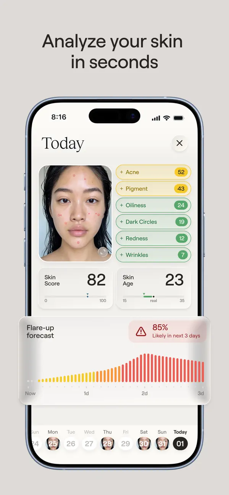
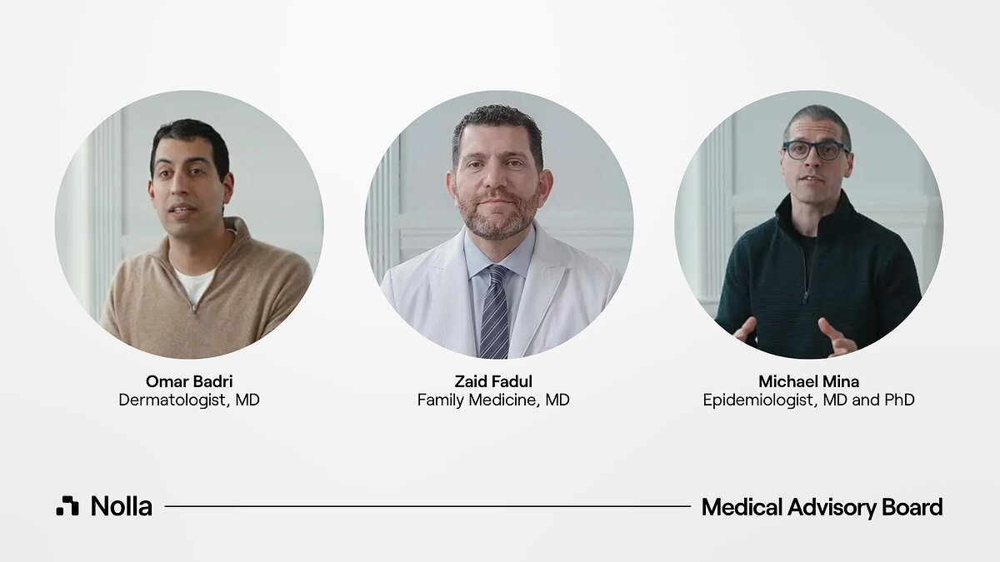

# 유타주, 의사 서명 없이 AI가 여드름 약을 처방한다

_유타주가 미국에서 처음 허가한 AI 신규 처방 시범사업에서는 환자가 늘면 의사 검토가 모든 건에서 월 10% 표본으로 줄어든다_

## Executive Summary

> [!callout]
> 이 글은 2026년 9월 22일 미국 유타주가 서명한 합의서 한 건을 읽는다. 유타주 인공지능정책국과 전문면허국은 스타트업 놀라헬스(Nolla Health)에게, 의사가 서명하지 않아도 AI가 여드름 약 처방을 직접 내도 좋다고 허가했다. 그 범위에는 전에 받던 약을 이어 주는 갱신만이 아니라 처음 내는 처방도 들어간다. 신규 처방을 주 정부가 문서로 허용한 것은 미국에서 이번이 처음이다.

> 눈여겨볼 대목은 AI가 얼마나 정확한가가 아니라 감독을 어떻게 설계했는가다. 합의서는 환자가 늘면 사람이 보는 몫이 월 10% 표본까지 내려가도록 세 단계를 미리 그어 두었다. 단계를 올리려면 의사와 AI의 처방 일치율이 95% 이상이어야 하는데, 놀라헬스가 안전성 근거로 내건 수치는 최근 실제 처방 1,000건의 약 96%이고 그 집계는 회사가 했다.

> 1절부터 4절까지는 합의서와 그것을 인용한 보도에 적힌 사실이다. 5절은 그 사실을 데이터를 다루는 사람의 눈으로 다시 읽은 이 글의 해석이다.

### 주요 수치

이 허가에 붙은 숫자는 네 개로 추릴 수 있다. 첫째는 단계가 오를 때 사람이 보는 몫이 어떻게 달라지는지이고, 둘째는 그 단계를 올려 주는 문턱과 회사가 내건 근거 사이의 거리다. 셋째는 운영 정보가 주 정부로 올라가는 주기와 바깥으로 공개되는 주기이고, 넷째는 이 허가 자체가 유효한 기간이다.

출처: 유타주 상무부가 공개한 규제 완화 합의서(RMA-Nolla-Health)를 인용한 [unite.ai](https://www.unite.ai/nolla-health-launches-ai-issued-initial-acne-prescriptions-in-utah/), [runtimewire](https://runtimewire.com/article/utah-nolla-health-ai-acne-prescriptions), [The Neuron](https://www.theneuron.ai/explainer-articles/utah-ai-acne-prescriptions-nolla-health/) 보도.

<!-- stat-card -->
**100% → 10%** — 의사가 보는 처방의 몫 — 사전 전수 검토에서 월간 표본 검토로 내려간다

<!-- stat-card -->
**95% / 96%** — 단계 문턱과 회사 발표치 — 문턱은 합의서가, 96%는 놀라헬스가 적었다

<!-- stat-card -->
**월간 / 분기** — 보고와 공개의 주기 — 상세는 매달 주 정부에만, 바깥에는 분기 요약

<!-- stat-card -->
**12개월** — 합의의 유효 기간 — 두 번까지 연장 가능, 주 정부는 언제든 끊는다

## 허가된 것은 바르는 여드름 약 한 칸이다

"AI가 처방한다"는 한 문장은 실제로 허가된 범위를 꽤 많이 가린다. 유타주 인공지능정책국(Office of Artificial Intelligence Policy)과 전문면허국이 놀라헬스의 운영법인 Magic Health와 맺은 문서의 이름은 규제 완화 합의서(Regulatory Mitigation Agreement)다. 문서는 자기가 주 정부의 승인이나 보증이 아니라고 직접 적어 둔다. 규칙을 바꾼 것이 아니라, 정해진 조건 아래에서 기존 규칙의 적용을 한시적으로 비켜 준 것이다.

이 비켜 주기에는 제도 이름이 따로 붙어 있다. 2024년 유타주 의회가 통과시킨 인공지능정책법(SB 149)은 상무부 안에 인공지능정책국을 두면서 인공지능 러닝랩이라는 프로그램을 함께 만들었다. 기업이 제안서를 내고 받아들여지면 정책국 및 관계 기관과 합의서를 맺고, 정해진 기간 동안 특정 규정의 적용을 완화받는다. 대신 활동 범위를 제안서에 적은 만큼으로 묶고 운영 정보를 주에 넘긴다. 법은 이 기간을 12개월 단위로 끊어 두었고, 정책국이 어떤 이유로든 언제든 합의를 끝낼 수 있게 해 두었다. 놀라헬스 건은 이 프로그램이 내준 첫 허가가 아니다.

대상은 만 18세 이상 유타 거주자이고, 증상은 가벼운 여드름부터 중간 정도까지다. 나이와 신원은 결제 회사 스트라이프의 신원확인 서비스가 정부 발행 신분증과 셀피를 대조해 거르고, 유타 거주 여부는 전화 위치정보와 배송 주소로 확인한다. 환자가 앱에서 10분에서 15분쯤 문진에 답하고 얼굴을 촬영하면 AI가 중증도에 점수를 매긴다. 점수가 다섯 단계 척도에서 3.5를 넘으면 처방 전에 의사가 들여다보고, 4.0 이상이면 대면 피부과로 안내한다. 통과한 환자에게는 사전에 승인된 목록 안에서 바르는 약 하나가 골라지고, 그 처방이 약국으로 전송된다. 약국에는 이 처방을 AI가 냈다는 사실을 알려야 한다.

*▲ 문진·얼굴 촬영 뒤 AI가 매기는 점수 화면(놀라헬스 앱 Nolla Derm) | Source: [Apple App Store](https://apps.apple.com/us/app/nolla-derm-acne-ai-skincare/id6741805934)*

목록 바깥은 꽤 넓다. 먹는 약은 전부 빠졌고, 중증 여드름에 쓰는 이소트레티노인도 빠졌다. 임신했거나 임신을 계획 중이거나 수유 중인 사람, 면역이 떨어진 사람, 신장이나 간이 심하게 나쁜 사람, 목록에 오른 약에 전에 반응을 보인 적이 있는 사람은 그 자리에서 절차가 멈춘다. 신원 확인에 실패하거나 유타 밖에 사는 경우도 같다. 합의서는 이런 조건을 즉시 정지(hard stop)라 부른다. 단계를 올리는 기준 가운데 하나가 "놓친 즉시 정지 0건"이다.

허용 칸보다 배제 칸이 넓다는 점이 이 허가의 성격을 말해 준다. 질환 하나와 바르는 약으로 범위를 좁히고 나면, AI가 실제로 내리는 판단은 미리 정해진 짧은 목록에서 하나를 고르는 선택에 가까워진다. 처방권을 열어 준 것이 아니라 닫혀 있던 칸 하나를 연 것이다.

| 항목 | AI가 할 수 있는 것 | 할 수 없는 것 |
| --- | --- | --- |
| 처방 종류 | 첫 처방과 재처방 | 다른 질환의 처방 |
| 약 | 바르는 약(트레티노인·아다팔렌·벤조일퍼옥사이드·클린다마이신 조합·아젤라산과 조제 제형) | 먹는 약 전부, 이소트레티노인 |
| 환자 | 만 18세 이상 유타 거주자, 경증~중등도 | 미성년자, 중증, 임신·수유, 면역저하, 중증 신·간질환 |
| 비용 | 시범 기간 월 4.99달러(정가 9.99달러), 조제약은 월 50달러 안팎 별도 | 보험 적용 여부는 합의서 바깥 |

▲ 합의서를 인용한 보도를 정리한 것 | 출처: unite.ai, The Neuron, SiliconANGLE

책임 쪽에도 선이 하나 그어져 있다. 놀라헬스는 AI가 낸 처방을 포함하는 전문직 배상책임보험을 들어야 하고, 허가된 AI 산출물로 생긴 피해에 대해 면책을 주장하는 조항을 약관에 두지 못한다. AI가 처방을 냈다고 해서 책임이 사라지지는 않는다는 뜻이고, 합의서에서 가장 분명하게 환자 쪽을 향한 조항이다.

한 가지 전제는 미리 밝혀 둔다. 유타주 상무부가 올린 합의서 원문 PDF는 접근이 막혀 있어 이 글은 원문을 직접 열어 보지 못했다. 아래 숫자와 조건은 합의서를 조항 단위로 인용한 복수의 보도를 교차 확인해 적은 것이고, 매체마다 다르게 적힌 대목은 그렇다고 표시해 두었다.

## 사람이 보는 몫은 처음부터 줄어들게 적혀 있다

이 합의서가 가장 공들여 설계한 쪽은 AI가 아니라 사람이다. 합의서는 사람이 처방을 들여다보는 방식을 세 단계로 나누고, 각 단계가 언제 끝나는지를 환자 수와 기간으로 못 박았다. 1단계는 최소 4주 동안 최소 100명이고, 이 구간에서는 유타 면허를 가진 의사 두 명이 모든 처방을 약국에 보내기 전에 각자 독립적으로 검토하고 승인한다. 2단계는 최소 8주 동안 누적 500명까지이고, 여기서부터 AI가 먼저 처방을 발급한다. 의사는 적어도 주 1회 모든 건을 다시 검토한다. 그 뒤가 3단계인데, 의사는 한 달에 한 번 전체 물량의 최소 10%를 표본으로 본다. 이상반응이 보고된 건과 사람에게 넘겨진 건은 표본과 무관하게 전부 본다.

사람이 보는 **비율**은 1단계와 2단계에서 똑같이 100%다. 달라지는 것은 비율이 아니라 시점이다. 1단계에서 의사는 약이 환자에게 가기 전에 보고, 2단계에서는 약이 이미 환자 손에 간 뒤에 본다. 감독이 처음 느슨해지는 자리는 10%로 떨어지는 지점이 아니라, 검토가 사전에서 사후로 넘어가는 지점이다. 사후 검토는 잘못된 처방을 막지 못한다. 다음 환자에게 같은 일이 반복되는 것을 막을 뿐이다.

▲ 페블러스 원본 도식 | 출처: 규제 완화 합의서를 인용한 unite.ai·The Neuron·runtimewire 보도

단계가 저절로 오르지 않는다는 점은 이 설계에서 가장 단단한 부분이다. 환자 수와 기간을 채웠다고 통과되는 것이 아니라 주 정책국의 서면 승인을 따로 받아야 하고, 그 승인에는 성과 조건이 붙는다. 의사와 AI의 처방 일치율 95% 이상, 품질 점검에서 놓친 즉시 정지 0건, 중대 이상반응 0건이다. 둘은 0건이라 해석의 여지가 거의 없다. 해석의 여지가 생기는 쪽은 첫 번째 조건이다.

3단계가 언제 시작되는지를 두고는 매체마다 적은 숫자가 갈린다. 누적 750명부터로 적은 보도가 있고, 2단계가 끝나는 500명 이후로 적은 보도가 더 많다. 이 글은 많은 쪽을 따랐다. 어느 쪽이든 구조는 바뀌지 않는다. 환자가 수백 명 단위를 넘어서는 순간부터, 사람이 보는 몫은 열에 아홉이 빠진 채로 유지된다.

## 문턱은 95%, 근거는 회사가 센 96%

놀라헬스가 안전성 근거로 내세우는 수치는 하나다. 최근 실제 처방 1,000건에서 면허를 가진 임상의가 AI의 치료 권고에 동의한 비율, 곧 합의서가 일치율이라 부르는 그 수가 약 96%였다는 것이다. 이 수치의 출처는 회사가 주 정부에 낸 제안서다. 그리고 합의서가 다음 단계로 올려 주는 문턱은 95%다. 두 수 사이는 1%p다.

1%p가 좁다는 것만으로 문제가 되지는 않는다. 문제는 두 수가 같은 자로 잰 것인지 확인할 길이 공개 자료에 없다는 점이다. 회사 수치의 분모는 "최근 1,000건"이고, 전환 심사가 보는 분모는 이 시범사업에서 누적된 환자다. 모집단이 다르면 두 수를 나란히 놓고 "이미 넘었다"고 읽을 수 없다.

분자 쪽은 더 미묘하다. 회사는 동의하지 않은 나머지도 대부분 치료 방향 자체가 갈린 것이 아니라 같은 약 계열 안에서 농도를 한 단계 올리거나 내린 조정이었다고 설명한다. 이 설명은 그 자체로는 납득이 간다. 다만 그 설명이 참이라면, 농도 한 단계 조정을 '동의'로 셀지 '불일치'로 셀지에 따라 같은 1,000건에서 다른 숫자가 나온다. 95%라는 문턱은 그 정의를 명시하지 않는 한 재는 사람에 따라 넘기도 하고 못 넘기도 하는 선이 된다. 이것이 이 시범사업에서 가장 조용한 설계 구멍이다.

> [!callout]
> 감독을 느슨하게 만드는 조건이 숫자 하나이고, 그 숫자를 세는 주체가 느슨해져서 이득을 보는 쪽과 같을 때, 중요한 것은 숫자의 크기가 아니라 세는 규칙이 어디에 적혀 있는가다. 공개된 합의서 요약에서 확인되는 것은 95%라는 값이고, 무엇을 분자에 넣는지는 확인되지 않는다.

흥미로운 점은 이 구도를 가장 정확하게 말한 사람이 회사 안에 있다는 것이다. 놀라헬스의 최고의료자문역 자이드 파둘(Zaid Fadul)은 이 발표에 붙여 이렇게 말했다.

의료에서 AI의 진짜 시험대는 얼마나 똑똑한가가 아니다. 회사 말고 다른 누군가가 그것을 멈출 수 있는가다.

파둘은 동시에 이 시범사업을 감독하는 의사 팀의 일원이다. 합의서가 요구하는 사람 검토를 실제로 수행하는 자리에 회사의 최고의료자문역이 들어가 있다는 뜻이다. 그의 문장을 그가 선 자리에 적용하면, 이 시범사업에서 회사 바깥의 "다른 누군가"로 남는 것은 하나뿐이다.

*▲ 놀라헬스 의학자문위원회. 가운데가 이 시범사업을 감독하는 의사 팀에 속한 자이드 파둘 | Source: [PR Newswire](https://www.prnewswire.com/news-releases/nolla-health-expands-medical-advisory-board-and-clinical-leadership-to-help-shape-the-future-of-ai-powered-healthcare-302851984.html)*

합의서는 그 "다른 누군가"를 주 정책국으로 지정해 두었다. 정책국은 언제든 합의를 끝낼 수 있다. 남는 질문은 권한이 아니라 입력이다. 정책국은 무엇을 보고 멈출 결심을 하게 되는가. 그 데이터는 어디서 오는가.

## 표본이 줄어든 뒤 오류는 어떤 데이터로 잡히나

### 4.1. 보고는 매달, 공개는 분기마다

합의서는 보고 의무를 꽤 촘촘하게 적는다. 놀라헬스는 매월 15일까지 주 정책국에 보고서를 낸다. 거기에는 처리한 케이스 수, 약물별 처방 건수, 임상의 일치율, 사람에게 넘긴 사유, 환자 인구통계가 들어간다. 이상반응은 24시간 안에 따로 알려야 한다. 약물 알레르기를 놓쳤거나, 금기에 해당하는데 통과시켰거나, 약물 상호작용이나 용량이 잘못됐거나, 필요한 검사나 의사 의뢰를 빠뜨린 경우는 모두 보고 대상 안전 사건으로 규정된다.

*▲ 유타주 의사당. 인공지능정책국과 러닝랩을 만든 2024년 인공지능정책법(SB 149)이 여기서 통과됐다 | Source: [Wikimedia Commons](https://commons.wikimedia.org/wiki/File:Utah_State_Capitol_Building_in_2022.jpg) (CC BY-SA 4.0, GyozaDumpling)*

바깥에서 보이는 것은 그보다 성기다. 공개되는 것은 분기마다 나오는 비식별 요약이고, 개인 단위 데이터는 비식별 처리를 거쳐 주가 심사한 외부 감사인에게 간다. 월간 상세 보고는 정책국까지만 간다. 그러니까 3단계에서 사람이 보는 몫이 10%로 내려간 뒤, 남은 90%에서 벌어지는 일을 1차로 감지하는 장치는 회사 자신의 월간 자기보고다. 외부 감사인 조항이 그 구조를 보완하지만, 감사인이 누구이고 얼마나 자주 보며 무엇을 공개하는지는 아직 알려져 있지 않다.

기록 자체가 어디에 쌓이는지는 아예 보이지 않는다. 지금까지 조항 단위로 인용된 합의서 내용에는 무엇을 언제 보고해야 하는지가 적혀 있지만, 환자가 올린 얼굴 사진과 문진 응답, AI가 매긴 점수가 어느 서버에 얼마나 오래 남는지는 그 안에 나오지 않는다. 표본이 줄어든 뒤 무엇이 잘못됐는지 다시 따져 보려면 결국 그 원본 기록으로 돌아가야 하는데, 기록을 쥐는 주체와 보관 기간은 이 허가의 공개된 부분에 들어 있지 않다.

일치율도 같은 경로를 탄다. 단계를 올려 주는 바로 그 지표를 월간 보고에 적어 내는 주체가 놀라헬스다. 재는 쪽과 재어지는 쪽이 같다. 이것이 곧 부정을 뜻하지는 않는다. 다만 이런 구조에서는 수치가 틀렸을 때 그것을 바깥에서 알아차릴 수 있는 경로가 분기 요약 하나로 좁아진다는 점을 기록해 둘 만하다. 합의 자체는 12개월짜리이고, 12개월씩 두 번까지 연장할 수 있으며, 정책국은 언제든 끊을 수 있다.

### 4.2. 이번이 유타주의 첫 AI 처방 실험은 아니다

2026년 1월, 주 정부는 닥트로닉(Doctronic)에 처방 **갱신**만 허용하는 시범사업을 허가했다. 반응은 빨랐다. 유타 의료위원회가 재검토를 요청하는 공개서한을 보냈고, 미국의사협회(AMA)는 공개적으로 비판했다. 협회 CEO의 말은 [포춘](https://fortune.com/2026/01/08/ai-prescription-renewals-doctronic-utah-doctors-warn-puts-patients-at-risk/)에 이렇게 실렸다. "AI가 의료를 더 낫게 바꿀 가능성은 무한하지만, 의사의 관여 없이는 환자와 의사 모두에게 심각한 위험이 된다."

놀라헬스 건은 그보다 한 걸음 더 나간다. 갱신은 이미 누군가 한 번 진단을 내린 약을 이어 주는 일이지만, 신규 처방은 진단의 첫 판단을 AI가 한다는 뜻이다. 미국의사협회 CEO 존 화이트는 이번 허가를 두고도 블룸버그에 회의적인 뜻을 밝혔다. 자율로 움직이는 시스템이 사람 의료인에게 요구되는 기준을 충족할 수 있겠느냐는 물음에, 그는 그 부담을 충족할 수 있다고 보지 않는다고 답했다. 다만 이 건은 발표가 나온 지 며칠밖에 되지 않았다. 닥트로닉 때처럼 면허 당국이 공식 절차를 밟을지는 아직 지켜볼 일이다.

## 페블러스가 이 허가를 주목하는 이유

한국은 지금 같은 질문을 다른 입구에서 만나는 중이다. 2025년 12월 23일 공포된 개정 의료법이 비대면진료를 제도화했고, 제34조의2부터 제34조의9까지 조문이 새로 생겼다. 해당 조항은 공포 1년 뒤인 2026년 12월 24일에 시행된다. 법이 내건 원칙 넷 가운데 둘이 "대면진료의 보완적 수단"과 "재진 환자 중심"이고, 초진은 지역과 처방 범위를 제한해 예외적으로만 열어 둔다. 처방을 내는 주체는 언제나 의료인이다. 유타가 연 문을 한국은 당분간 열지 않는다.

한편 2026년 1월에 시행된 인공지능기본법은 보건의료를 고영향 인공지능 영역으로 묶고, 사업자에게 사람에 의한 관리·감독 체계를 요구한다. 고시안은 그 체계 안에 긴급 정지 같은 개입 방법을 마련할 것, 성능 저하와 오류에 대한 정기 점검 계획을 둘 것, 이행 근거를 문서로 5년간 보관하고 주요 내용을 게시할 것을 적는다. 그러니 한국에 이 합의서가 주는 것은 따라 할 선례가 아니라 먼저 답해 봐야 할 질문지에 가깝다.

첫 번째 질문은 비율이다. "사람이 감독한다"는 문장은 비율을 적지 않는다. 유타 합의서는 적었다. 100%, 100%, 10%. 그리고 비율을 적는 순간 그 비율이 내려가는 조건도 같이 적힌다. 이것은 유타가 느슨해서 생긴 일이 아니라 숫자를 적었기 때문에 드러난 일이다. 원칙만 선언한 제도에서는 사람이 실제로 몇 퍼센트를 보고 있는지가 아예 측정되지 않는다. 그 상태에서는 비율이 낮아져도 낮아졌다는 사실조차 기록에 남지 않는다.

두 번째 질문은 데이터다. 사람이 보는 몫이 줄어든 뒤에 오류를 잡아내는 일은 감시가 아니라 계측의 문제가 된다. 무엇을 사건으로 셀지, 누가 셀지, 그 집계를 누가 다시 확인할지가 미리 정해져 있어야 한다. 유타는 월간 자기보고와 분기 공개, 외부 감사인으로 답했고, 그중 첫 번째 칸을 회사가 채운다. 한국의 고시안은 문서 5년 보관과 게시를 적는다. 둘 다 "무엇을 남길지"는 정하지만, "재는 쪽과 재어지는 쪽이 같아도 되는가"에는 아직 답이 없다.

페블러스가 AI-Ready Data를 말할 때 되풀이하는 전제는 데이터의 생성 맥락이 기록되어야 한다는 것이다. 이 합의서는 그 전제를 감독의 영역으로 옮겨 놓는다. 사람이 AI를 검토했다는 사실도 데이터이고, 언제 보았는지, 무엇에 동의하지 않았는지, 동의하지 않은 것을 어떻게 분류했는지가 함께 남아야 비로소 쓸 수 있는 기록이 된다. 그 기록의 스키마를 정하는 일은 AI를 허가하는 일만큼이나 제도 설계에 속한다. 유타가 먼저 적어 본 것은 AI의 성능이 아니라 바로 그 스키마다.

여기까지 읽어 주셔서 감사하다. 이 글이 인용한 조건과 수치는 유타주 합의서를 조항 단위로 인용한 보도들을 교차 확인한 것이고, 원문 PDF는 접근이 막혀 직접 열지 못했다. 원문을 확인한 독자가 계시면 어긋난 대목을 알려 주시면 좋겠다. 그리고 여러분의 조직에서 AI 산출물을 사람이 검토하는 비율이 지금 몇 퍼센트인지, 그 비율이 어딘가에 기록되고 있는지 한 번 확인해 보시기를 권한다.

## 참고문헌

### R.1. 공식 문서

- 1.Utah Office of Artificial Intelligence Policy & Division of Professional Licensing. (2026-09-22). "[Regulatory Mitigation Agreement — Magic Health, Inc. (Nolla Health)](https://commerce.utah.gov/wp-content/uploads/2026/10/RMA-Nolla-Health.pdf)." Utah Department of Commerce. (원문 PDF 접근 제한 — 2차 보도로 교차 확인)
- 2.Utah Department of Commerce. "[AI Learning Lab](https://commerce.utah.gov/ai/learning-lab)."

### R.2. 업계·보도

- 3.Becker's Hospital Review. (2026-10). "[Utah approves 1st AI pilot to issue initial prescriptions](https://www.beckershospitalreview.com/healthcare-information-technology/ai/utah-approves-1st-ai-pilot-to-issue-initial-prescriptions/)."
- 4.Quartz. (2026-10-06). "[Nolla Health, Utah AI acne prescriptions](https://qz.com/nolla-health-ai-acne-prescriptions-utah-100626)."
- 5.SiliconANGLE. (2026-10-05). "[Utah gives startup Nolla Health permission to start issuing AI automated prescriptions for acne treatments](https://siliconangle.com/2026/10/05/utah-gives-startup-nolla-health-permission-to-start-issuing-ai-automated-prescriptions-for-acne-treatments/)."
- 6.unite.ai. (2026-10). "[Nolla Health Launches AI-Issued Initial Acne Prescriptions in Utah](https://www.unite.ai/nolla-health-launches-ai-issued-initial-acne-prescriptions-in-utah/)."
- 7.The Neuron. (2026-10). "[Explainer: Utah AI Acne Prescriptions (Nolla Health)](https://www.theneuron.ai/explainer-articles/utah-ai-acne-prescriptions-nolla-health/)."
- 8.runtimewire. (2026-10). "[Utah, Nolla Health, AI Acne Prescriptions](https://runtimewire.com/article/utah-nolla-health-ai-acne-prescriptions)."
- 9.Chief Healthcare Executive. (2026-10). "[AI prescribing gets a state-supervised test in Utah](https://www.chiefhealthcareexecutive.com/view/ai-prescribing-gets-a-state-supervised-test-in-utah)."
- 10.PR Newswire. (2026). "[Nolla Health Expands Medical Advisory Board and Clinical Leadership to Help Shape the Future of AI-Powered Healthcare](https://www.prnewswire.com/news-releases/nolla-health-expands-medical-advisory-board-and-clinical-leadership-to-help-shape-the-future-of-ai-powered-healthcare-302851984.html)."
- 11.Fortune. (2026-01-08). "[AI prescription renewals: Doctronic, Utah doctors warn it puts patients at risk](https://fortune.com/2026/01/08/ai-prescription-renewals-doctronic-utah-doctors-warn-puts-patients-at-risk/)."

### R.3. 기업 발표

- 12.Nolla Health. (2026-10). "[AI Prescriptions in Utah](https://www.nollahealth.com/blog/ai-prescriptions-utah)." nollahealth.com.
