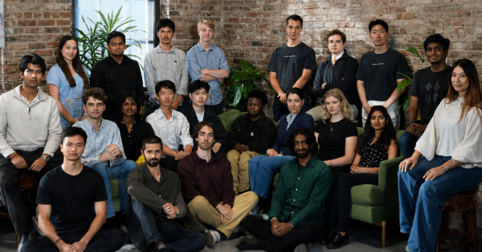

# A $400M Valuation for the Company That Grades AI on Real Work

_Vals AI closed a $40M Series A led by a16z as public benchmarks lose their power to tell top models apart_

## Executive Summary

> [!callout]
> A company that tests AI models has been given a price of $400 million. Vals AI closed a $40 million Series A led by a16z on August 13. What it sells is neither a model nor the data to train one. It sells exams built from the actual work done in law, finance, healthcare and software, along with the machinery that grades the answers against an expert standard.

> Behind that price is a collapse of trust in public benchmarks. Researchers at ETH Zurich and Stanford analyzed 60 widely used language model benchmarks and found that in 29 of them the top models could no longer be told apart. The interesting part is the prescription. The same paper reported that the private test sets the industry has been offering as the cure did not stop saturation. What held up was questions written by experts.

> So this round reads less as one benchmark's success story and more as a signal that the work of rewriting the scorecard has been priced. For an organization bringing agents inside, it translates into a single question. Forget the vendor leaderboard: do you have an exam built from your own work?

### Key Figures

Sources: [a16z](https://a16z.com/announcement/investing-in-vals/) (2026-08-13), [arXiv:2602.16763](https://arxiv.org/abs/2602.16763) §5, [Tech Times](https://www.techtimes.com/articles/324479/20260814/vals-ai-raises-40m-a16z-frontier-models-fail-52-real-finance-analyst-tasks.htm) (2026-08-14)

<!-- stat-card -->
**$400M** — Vals AI valuation — The amount raised was $40 million, a different figure from the valuation

<!-- stat-card -->
**29 of 60** — Public benchmarks that lost their edge — Rated highly saturated or worse, and 14 of those fell into the extreme band

<!-- stat-card -->
**52%** — Top accuracy on real finance tasks — On Finance Agent v2 as of May 2026, meaning about half of the analyst work still failed

<!-- stat-card -->
**8x** — Revenue growth in 2025 — Customers doubled over the same period, and the team has tripled in the past six months

## Turning Real Work Into Exams

What separates this company from other benchmarks is who writes the questions. Vals AI works with lawyers, financial analysts, software engineers and medical professionals to convert their actual working procedures into benchmarks, then attaches an automated system that grades the output against an expert standard. It asks not whether a legal model can pass the bar exam but whether it can actually carry out legal research, whether a finance model can analyze complex documents, and whether a coding model can produce an application that runs.

*▲ The people turning real work into benchmarks — the Vals AI team | Source: [TechFundingNews](https://techfundingnews.com/a16z-leads-40m-vals-ai-round-at-400m-valuation-to-test-ai-on-real-world-tasks/)*

The difference shows up most clearly in the shape of what gets graded. A typical benchmark checks whether the model picks the right option in a multiple-choice question or emits a particular string. A Vals task is a multi-step piece of analysis. The model has to retrieve the supporting material it needs, synthesize without inventing numbers, and keep reasoning without losing the context. Finance Agent v2, the company's flagship finance benchmark, is built from tasks such as constructing comparable company models and synthesizing sector catalysts into an investment view. As of May 2026 the best model scored 52%. Even a model near the top of the leaderboard failed to finish roughly half of the work of a professional analyst.

How the scorecard is held is also settled. For each benchmark the company splits the data into three layers. Published scores come only from a test set that is always kept private, a public validation set exists separately to show what kind of questions are used, and a larger private validation set is licensed to enterprises. That last layer carries a condition: the company proves statistically that results on the licensed set correlate with results on its own test set. It is the layer built so that a company can apply the same yardstick inside its own walls, and it connects directly to the question at the end of this piece.

Operating speed is part of what the company sells as well. Benchmark results come back within hours of getting model access. In a release cycle where frontier models arrive weekly, an evaluation that reports weeks later is a report card for a model that has already been superseded. Results accumulated this way are cited in model cards from OpenAI, Anthropic, Google, Meta and xAI. When a frontier lab writes an outside evaluator's numbers into its own official documentation, it is lending a piece of its credibility to that methodology.

The Series A that closed on August 13 was $40 million at a $400 million valuation. a16z led the round, existing investors 8VC, Pear VC and Bloomberg Beta returned, and HRT Ventures, the venture arm of Hudson River Trading, joined alongside Next Ladder Ventures as new investors. The founders are CEO Rayan Krishnan and CTO Langston Nashold, Stanford computer science alumni who had been working on measurement problems together before the company existed. Krishnan came through Palantir, and Nashold through Meta, NVIDIA and Hudson River Trading.

Three products arrived with the round: Vals Smith, which turns an internal GitHub repository into a coding benchmark; a frontier risk benchmark covering cybersecurity, mental health and AI safety; and Vals Index 2.0, which widens an index concentrated in finance and coding across the broader economy. Worth reading before the product list is the premise the founder put at the top of the announcement. Trillions have gone into generating intelligence, and comparatively little into measuring it.

## Public Exams Grow Old

Why benchmarks became hard to trust has come up on this blog several times. One thread is [contamination](/blog/llm-benchmark-contamination/en/), where test questions leak into training corpora and the model answers problems it has already seen; another is OpenAI [retiring the coding benchmark](/blog/swe-bench-verified-retired/en/) it had been using itself. What has changed this time is not the mechanism but the fact that the same problem has become a business with a price on it.

The study that measured the scale came out in February 2026. Researchers at ETH Zurich and Stanford analyzed 60 widely used language model benchmarks across 14 saturation-related properties, and 29 of them were rated highly saturated or worse, with 14 in the extreme band. Saturation describes a state where the scores of the leading models compress into measurement noise and stop being distinguishable from one another. The paper was updated in August as the ICML 2026 camera-ready version.

Saturation does not come from contamination alone. Even when not a single question leaks, top-end scores converge simply because labs tune their models against a metric everyone already knows. That is why a16z's announcement listed the failure modes of public datasets in three strands: saturation, leakage into training corpora, and becoming targets that models are explicitly optimized against.

A saturated benchmark does not give you a wrong answer. It gives you no answer. A leaderboard on which the top three models are statistically indistinguishable tells a buyer nothing about which model will do their work better. To borrow the phrasing a16z used in the announcement, a model can look excellent on a leaderboard and still flounder in the multi-step, messy work that actually matters.

## Secrecy Was Not the Defense

Evaluation companies mostly give the same answer to contamination. Do not publish the questions. Vals likewise explains that it keeps its test sets private and limits the number of runs to block contamination and abuse. The paper above aims squarely at that prescription. Designs commonly treated as safeguards, such as private test sets or closed-form answer formats, had limited effect on saturation, and the variables that strongly predicted it were the age and the size of the benchmark. Even if the questions have never been published, scores begin to compress the moment it becomes widely known what a benchmark asks and how.

What the paper rejects is not the usefulness of keeping questions private. Contamination and memorization are well-documented risks in their own right, and secrecy does work on those. It simply did not act as a shield against saturation.

Resistance came from a different condition. The paper concludes that resistance to saturation comes from expert curation rather than from whether the data is public, and its practical recommendation runs to benchmark lifecycle management: monitor saturation, report uncertainty alongside scores, and set the criteria for retirement and revision in advance.
