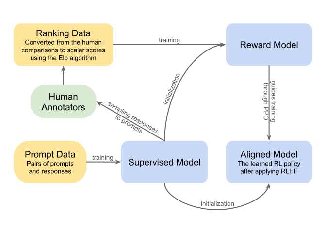

# Models Got Expensive. Data Gets More Expensive.

_Venture funding hit $300B in Q1 2026 — in the shadow of AI_

## Executive Summary

> [!callout]
> In Q1 2026, global venture funding hit $300 billion in a single quarter, an all-time record. Eighty percent of it, $242 billion, went to AI companies, and most of that was absorbed by just four mega-rounds: OpenAI, Anthropic, xAI, and Waymo. The headline is clear. Capital bet on frontier models.

> But the headline leaves one question unanswered. Who makes the data that feeds those models, and at what price? Over the same stretch, Meta poured $14.3 billion into the data-labeling company Scale AI to take a 49% stake (a $29 billion valuation), while the bootstrapped Surge AI overtook Scale on revenue and pushed for a $25 billion valuation. The more expensive models become, the more the price — and the power — of the data that feeds them rises alongside.

> This piece looks at the data layer that is quietly getting more expensive in the shadow of the mega-rounds. If the flashy half of the capital flow is the model, the other half is the fuel that runs it: the data.

### Key Figures

Source: [Crunchbase News, 2026](https://news.crunchbase.com/venture/record-breaking-funding-ai-global-q1-2026/) · data-layer figures from Bloomberg, Reuters, and others

These four numbers compress the whole quarter: a record total, an 80% tilt toward AI, a concentration into just four companies, and, in their shadow, one data company that Big Tech bought half of. The first three are the story the headline already told; the last one is the story this piece follows.

<!-- stat-card -->
**$300B** — Global VC funding, Q1 2026 — Record quarter, +150% YoY

<!-- stat-card -->
**80%** — Share captured by AI — $242B — up from 55% a year ago

<!-- stat-card -->
**$188B** — Sum of just 4 rounds — 65% of all global Q1 funding

<!-- stat-card -->
**$29B** — Scale AI valuation — Meta took 49% for $14.3B

## A Record Quarter, and One Missing Question

Start with the numbers. By Crunchbase's count, startups worldwide raised about $300 billion in venture funding in Q1 2026. That's up nearly 150% from both the prior quarter and the year-ago quarter, an all-time single-quarter record. This one quarter is roughly equal to 70% of all venture funding in the whole of 2025.

The concentration ran in two directions. The first is AI: 80% of the total, $242 billion, went to AI companies. A year earlier that share was 55%, so capital is being pulled toward AI faster than before. The second is a handful of late-stage companies. Late-stage investment alone reached $246.6 billion, up 205% year over year, and the U.S. took 83% of the global total ($250 billion). Capital wasn't spread wide. It rushed to a proven few.

At the apex of that few sit the mega-rounds. OpenAI $122 billion, Anthropic $30 billion, xAI $20 billion, Waymo $16 billion. Those four add up to $188 billion, 65% of global Q1 funding. The headline ends here: "AI swallowed venture capital."

But a Pebblous reader will naturally arrive at the next question. What did these models eat to get so expensive? OpenAI's $122 billion and Anthropic's steep valuation are, in the end, bets on better models. And a better model, by definition, demands better data. If the model stands on the stage the headline lit up, who is making the data that feeds it down below the stage — and at what price?

## Expensive Models Presume Expensive Data

Divide the mega-rounds' price tags by revenue and you can see what investors are actually buying. OpenAI's round was priced at roughly 34 times revenue, Anthropic's at about 20 times. That multiple is a bet not on today's revenue but on tomorrow's model performance. Investors paid for a future in which "this company keeps shipping better models."

So where do better models come from? Architecture and compute matter, but what sets the performance ceiling is, in the end, the quality and the rights of the training data. The era of scraping the open web has already hit its limits. High-quality text is running dry, and the remaining differentiation lies in domain-specific data, human-reviewed preference data, and legally licensed proprietary data. The next stretch of the model performance curve is drawn not by algorithms but by data.

*▲ RLHF (Reinforcement Learning from Human Feedback) overview — human-labeled preference data draws the performance ceiling of the model | Source: [Wikipedia / Wikimedia Commons](https://en.wikipedia.org/wiki/Reinforcement_learning_from_human_feedback)*

> [!callout]
> Model price and data price are not two separate markets. They are the top and bottom of the same curve. Model multiples climbing to 20–34x means demand for the data that makes those models that good is being pulled up with them. When an investor bets on a model, that bet is, invisibly, placed on data too.

This structure gives data companies and data teams a curious position. They aren't the protagonists of the headline, but the headline can't hold up without them. The higher model values climb, the more that position's bargaining power climbs with it.

## The Data Layer, Quietly Getting Pricier

While model mega-rounds took the front-page headline, something quieter but more structural was happening in the data layer. In June 2025, Meta invested $14.3 billion in the data-labeling company Scale AI to secure a 49% stake. The deal valued Scale at $29 billion. A company once filed under "outsourced labeling service you call when you need it" was redefined, in that moment, as a strategic asset Big Tech buys half of.

The more interesting signal came from a rival. Surge AI is a bootstrapped company that never took a dollar of venture money, yet in its first outside raise it pushed past $15 billion toward a $25 billion valuation. By reported figures, Surge's revenue runs around $1 billion a year, already overtaking Scale's roughly $870 million. It means a company that makes the data to feed models — not a flashy model company — is making that kind of money.

Zoom out to the whole market and the trend points one way. The data-labeling market is estimated, depending on definition, at $2.3–4.9 billion as of 2025, growing 21–29% a year. The AI training-dataset market is projected to grow from about $3.6 billion in 2025 to $23.2 billion by 2034, and the dataset-licensing market from $4.8 billion to $22.6 billion. Rounds of $100 million or more into data infrastructure are no longer rare. Encord, which handles multimodal data infrastructure, raised a $60 million Series C in March 2026.

> [!callout]
> The moment labeling shifted from "commodity service" to "strategic moat," the entire pricing system of the data layer was rewritten. If a mega-round is one piece of big news, the rising price of the data layer is a power shift that unfolds slowly — but irreversibly.

## 'Data Is an Asset,' Now Proven by Price

"Data is an asset" was long just a slogan, a somewhat abstract proposition that rarely showed up on the balance sheet. But by 2026 the proposition is being proven not by accounting, but by market price. There is an actual unit price at which data trades, and there are lawsuits and regulations surrounding that price.

Start with licensing prices. Enterprise NLP dataset licenses traded at an average of roughly $1.2 million per contract as of 2025, and high-value domains like medical imaging trade at around $2.4 million a year. Market analysis expects proprietary and custom data licenses to account for more than 55% of dataset-market revenue in 2026. The value of data is no longer priced as a "cost of collection" but as the "price of rights."

The most symbolic case is Reddit. Through data-licensing deals with Google, OpenAI, and others, Reddit secured contracts totaling $203 million in publicly disclosed value alone, at one point equal to 10% of company revenue. Reddit's leadership called its user-generated content "the oil of the modern era," and said AI models "would not exist as they do today" without this data. In the same vein, lawsuits aiming to end the era of scraping data for free have piled up: Reddit v. Anthropic, Reddit v. Perplexity, NYT v. OpenAI.

Regulation points the same way. The EU AI Act mandates transparency on the provenance and rights of training data. It means that if you can't prove "where the data came from," it becomes hard to bring a model to market. The shift from scraped data to licensed and curated data is no longer a choice. It's a flow the rules now enforce.

*▲ EU AI Act advocacy campaign at the Strasbourg European Parliament, May 2023 — training data provenance is now legally enforced | Source: [EKO / Wikimedia Commons (CC BY 2.0)](https://commons.wikimedia.org/wiki/File:EKO_-_AI_ACT_-_Strasbourg_Parliament_-_52886760084.jpg)*

And here lies a decisive contrast. A model mega-round is a one-time headline. Once it closes, it's done. The price of data, by contrast, repeats every quarter — as licensing fees, as lawsuit settlements, as compliance costs. That's just the nature of an asset. Once it gets expensive, it stays expensive.

## So What Should Data Teams Do?

There's an old saying on the ML floor: about 80% of the time an AI project takes goes not into modeling but into collecting, cleaning, and annotating data. For a long time that 80% was treated as "a cost you just have to pay." The Q1 2026 capital flow mirrors the saying. If 80% of capital went to AI, 80% of AI labor is tied up in data. The two numbers are not the same by accident.

If so, what those who hold the data must do is clear: treat data not as a cost center but as an asset. An asset has provenance, a quality grade, and a chain of rights. Only when you can trace and evaluate where data came from, who made it, and under what license it can be used can you safely use it for training — and, if needed, put a price on it and trade it.

This is exactly why Pebblous has long talked about 'AI-Ready Data.' Preparing data in a form ready to feed a model means managing its quality, provenance, and rights like an asset. [DataClinic](https://blog.pebblous.ai/), which diagnoses the quality and readiness of data, starts from the same concern. Now that the market has begun to put a price on data, if you don't know how much of an asset your own data is, you can't be the one naming the price at the negotiating table.

> [!callout]
> Capital bet on the model. But the fuel that runs that bet is data. A model you buy once; data you buy again and again — a recurring cost and a recurring power. Whoever treats that fuel as an asset takes the next cycle.

The $300 billion of Q1 2026 was unmistakably the model's moment. But look at the number long enough and you can see what is getting more expensive behind the headline — more slowly, but more surely. Models got expensive. Data gets more expensive.

## References

### Industry Coverage

- 1.Crunchbase News. (2026). "[Record-Breaking Funding For AI Drives Global Q1 2026 Venture Totals](https://news.crunchbase.com/venture/record-breaking-funding-ai-global-q1-2026/)." Crunchbase.
- 2.Bloomberg / Reuters. (2025). "Meta to Take 49% Stake in Scale AI at $29B Valuation," among others — reporting on the Meta–Scale AI deal.
- 3.Bloomberg / Reuters. (2025–2026). Reporting on Surge AI funding and revenue (first outside round pursuing a $25B valuation; ~$1.0B revenue run rate).
- 4.TechCrunch and others. (2024). Reporting on Reddit data-licensing deals (Google and OpenAI, $203M combined) and the "oil of the modern era" remark.
- 5.TechCrunch. (2026). Reporting on Encord's Series C ($60M, multimodal data infrastructure) and other data-infrastructure rounds.

### Market Research

- 6.Fortune Business Insights / dataintelo / Mordor Intelligence / Grand View Research. (2025). Market-size estimates for AI training datasets, data labeling, and dataset licensing.
