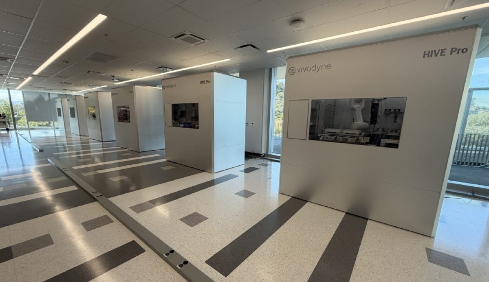

# The Robot Lab Growing 20 Human Tissue Types to Make Causal Data

_Vivodyne_

## Executive Summary

> [!callout]
> The promise that AI will cure cancer has started to sound like a cliché even inside the industry. Vivodyne, a company with labs in Philadelphia and San Francisco, looks for the reason in the data rather than the model. Not that the models are too small or the data too scarce, but that the cell data piled up so far does not carry what causes what inside a human body. And that diagnosis went straight into hardware. HIVE is a robotic lab that grows human tissue and doses it directly.

> The evidence the company offers is concordance with human trials. The headline figure is 94% in liver tissue, and there is one easy misreading here. That number is not a model's predictive accuracy. It measures how often this lab reached the same answer as an actual trial in people. It comes with a caveat, since the number was disclosed by the company and its founder to the press rather than validated and published by a third party.

> A study published in Nature Methods this June showed that single-cell foundation models stop improving as pretraining data keeps growing. The paper did not identify the absence of causality as the reason; that reading comes from the founder. Once the two claims are read apart, one question is left over. Is the data we have been gathering a record of states, or a record of interventions and their results?

### Key Numbers

The first two cards say what this company claims it can do; the last two say why the claim carries weight right now. The sources differ in kind, so company disclosures and outside findings should be read separately.

Sources: [TechCrunch](https://techcrunch.com/2026/08/19/ai-isnt-close-to-curing-cancer-this-startup-says-it-knows-what-it-will-take/) (2026-08-19), [Nature Methods](https://www.nature.com/articles/s41592-026-03120-y) (2026-06-09), [FDA roadmap](https://www.fda.gov/news-events/press-announcements/fda-announces-plan-phase-out-animal-testing-requirement-monoclonal-antibodies-and-other-drugs) (2025-04-10)

<!-- stat-card -->
**94% · 96% · 100%** — Concordance with human trials — 94% in liver tissue, 96% in airway tissue, and 100% in bone marrow across 20 cancer drugs, as disclosed by the company

<!-- stat-card -->
**10,000** — Tissues one HIVE tests at once — Culture, dosing, imaging, and data generation take one to two weeks, according to the company

<!-- stat-card -->
**22.2M cells** — Corpus where performance plateaued — The Nature Methods study pretrained 400 models on this corpus and found no clear scaling law

<!-- stat-card -->
**90%+** — Failure rate after animal testing — The figure the FDA cited in its animal-testing phase-out roadmap, noting predictivity is lowest in cancer and Alzheimer's

## Pointing at the Data, Not the Model

On August 16, in the middle of a public argument with an investor, Anthropic's Dario Amodei wrote that "saying that AI will cure cancer is more a cliché than it is inspiring, and most people think it is deceptive." The line that followed: "The thing that will work is actually curing cancer." Amodei had not turned pessimist. In the same post he restated a timeline of five to ten years for curing most human disease, and that part drew immediate pushback for being naive. The signal was not that optimism had gone out of fashion, but that the industry had grown tired of the way optimism gets sold.

Three days later, TechCrunch reported a concrete answer to that fatigue from Andrei Georgescu, Vivodyne's co-founder and CEO. "Absent human testing, what are these models going to do?" he asked, and answered himself: "They're going to cure cancer in mice." If what a model learned came out of animals and culture dishes, then what the model gets good at ends at exactly that boundary.

The contrast is not idle provocation. AlphaFold went all the way to a Nobel Prize for protein structure prediction and has yet to produce a single approved drug, and Isomorphic Labs, which carries that lineage forward, pushed its first clinical trial from 2025 to late 2026. Isomorphic itself acknowledged in February that real drug discovery requires high-accuracy prediction across the full range of biochemical properties. What models can do has grown quickly. The question of what those models were fed has not gone away.

## This Robot Does More Than Watch

The company describes this setup as compressing an entire animal vivarium into one system. That system runs three layers deep. At the base sits a microfluidic chip called the TissueDisk, on which hundreds of human tissues grow by self-assembly from a single disk. More than 20 tissue types are built on top of it, each tissue holding somewhere between 200,000 and 500,000 cells. Then comes HIVE, a robotic lab that carries culture, dosing, and observation through in sequence without human hands.

*▲ HIVE's robotic arm dispensing reagent onto a TissueDisk | Source: [Vivodyne](https://www.vivodyne.com/)*

The robot's job does not end at looking in. HIVE perturbs the tissue with a drug and then reads phenotype through 3D confocal imaging, the transcriptome through single-cell RNA sequencing, and the proteome through 1,000-plex protein profiling. The experiment is itself the intervention, and before and after stay connected in the same tissue. One HIVE tests 10,000 human tissues at a time and returns data within one to two weeks, according to the company. The stated application areas include lung tumors, cell therapies, fibrosis, and drug-induced liver injury, and Chief Biotechnology Officer Tony Bahinski summarized the purpose of the machine in one sentence: "Prediction means knowing what happens when you try something new."

The performance evidence the company puts forward is concordance with human trials. Toxicity responses in liver tissue matched actual human trial results 94% of the time, airway tissue reached 96%, and bone marrow matched 100% across a panel of 20 cancer drugs. These numbers measure how well a substitute testing platform stands in for people rather than how accurate a predictive model is, and they come from company statements to the press rather than from peer review. The human biological datacenter the company announced on August 12 is a disclosure of the same kind. Twelve HIVE units are said to handle 3.1 million large human tissue experiments a year, with eight large pharmaceutical companies paying for early access, though none of those companies were named.

*▲ A row of HIVE Pro units — what the company's human biological datacenter actually looks like | Source: [TechCrunch](https://techcrunch.com/2026/08/19/ai-isnt-close-to-curing-cancer-this-startup-says-it-knows-what-it-will-take/) (photo: Tim Fernholz)*

## There Was Plenty of Data, and It Was Snapshots

A study published in Nature Methods on June 9 measured head-on how far it pays to keep enlarging pretraining data for single-cell foundation models. Pretraining 400 models on a corpus of 22.2 million cells and evaluating them across 6,400 experiments, the authors found that performance plateaued once only a fraction of the training corpus had been used. The paper concludes that the data scaling laws familiar from language and image models do not appear clearly on the single-cell side, and it advises developers to balance model size, dataset size, and compute rather than scaling any one of them blindly.

Fact and interpretation need separating here. What the paper established is the plateau itself, not a statement that the cause is an absence of causality. Reading the cause that way is Georgescu's move. "All the training is done on static snapshots of these cells," he says, "and the models are not conditioned at all by the how — a cell got to that state." One sentence sums up his diagnosis: the model learns "this is cell state A" and "this is cell state B," but never "cell state B is the effect of inflaming cell state A."

Why the distinction matters in practice shows up in combination therapy. The moment two or more drugs are combined, the space to be searched explodes, and testing candidates one at a time stops being feasible. At that point the direction of the question reverses. You want a given effect to happen, so which cause do you have to invoke? Answering a question that runs backward from effect to cause requires that causes and effects sit paired inside the data.

The diagram below sets two ways of recording the same cells side by side. On the left is the data collected so far, where states measured separately in different samples each leave a trace of their own. What produced those states is not in the record. On the right is the data HIVE generates, where the same tissue before and after a drug is carried through as one continuous record. No amount of growing the cell count in the left-hand column turns it into the right-hand one.
