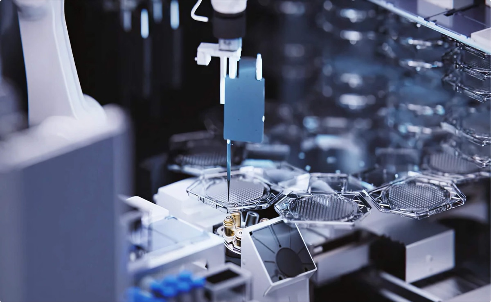

# 사람 조직 20종을 길러 인과 데이터를 만드는 로봇 실험실

_올해 6월 Nature Methods가 확인한 세포 데이터 스케일링 정체에 비보다인이 내놓은 답_

## Executive Summary

> [!callout]
> AI가 암을 정복한다는 말이 업계 안에서도 상투구로 취급되기 시작했습니다. 필라델피아와 샌프란시스코에 실험실을 둔 비보다인(Vivodyne)은 그 이유를 모델이 아니라 데이터에서 찾습니다. 모델이 작아서도 데이터가 모자라서도 아니라, 지금 쌓여 있는 세포 데이터가 인체에서 무엇이 무엇을 일으키는지를 담고 있지 않다는 진단입니다. 그리고 그 진단은 곧바로 설비가 됐습니다. 사람 조직을 길러 직접 약을 넣어 보는 HIVE라는 로봇 실험실입니다.

> 회사가 근거로 내건 것은 인체시험과의 일치도입니다. 간 조직에서 94%가 대표 수치인데, 여기서 오해하기 쉬운 지점이 하나 있습니다. 이 값은 AI 모델의 예측 정확도가 아니라, 이 실험실이 실제 사람 대상 시험과 얼마나 같은 답을 냈는지를 재는 값입니다. 다만 제3자가 검증해 발표한 값이 아니라 회사와 창업자가 언론에 밝힌 수치라는 단서가 붙습니다.

> 올해 6월 Nature Methods에 실린 연구는 단일세포 파운데이션 모델에서 학습 데이터를 계속 늘려도 성능이 더 오르지 않는다는 것을 실증했습니다. 논문은 그 원인을 인과의 부재라고 지목하지 않았고, 그 해석은 창업자 쪽에서 나왔습니다. 두 이야기를 구분해 읽고 나면 질문 하나가 남습니다. 우리가 모아 온 데이터는 상태의 기록입니까, 개입과 결과의 기록입니까.

### 주요 수치

앞의 두 카드는 이 회사가 무엇을 할 수 있다고 주장하는지를, 뒤의 두 카드는 그 주장이 왜 지금 설득력을 갖는지를 가리킵니다. 출처의 성격이 서로 다르므로 회사 발표와 외부 검증을 나눠 읽어야 합니다.

출처: [TechCrunch](https://techcrunch.com/2026/08/19/ai-isnt-close-to-curing-cancer-this-startup-says-it-knows-what-it-will-take/) (2026-08-19), [Nature Methods](https://www.nature.com/articles/s41592-026-03120-y) (2026-06-09), [FDA 로드맵](https://www.fda.gov/news-events/press-announcements/fda-announces-plan-phase-out-animal-testing-requirement-monoclonal-antibodies-and-other-drugs) (2025-04-10)

<!-- stat-card -->
**94%·96%·100%** — 인체시험과의 일치도 — 간 조직 94%, 기도 조직 96%, 골수는 항암제 20종 시험에서 100%라고 회사가 밝힌 값입니다

<!-- stat-card -->
**1만 개** — HIVE 한 대의 동시 시험 조직 수 — 배양부터 투약, 관찰, 데이터화까지 1~2주가 걸린다는 것이 회사 설명입니다

<!-- stat-card -->
**2,220만 세포** — 학습을 늘려도 정체한 코퍼스 규모 — Nature Methods 연구가 이 코퍼스로 400개 모델을 사전학습했지만 뚜렷한 스케일링 법칙은 나오지 않았습니다

<!-- stat-card -->
**90% 이상** — 동물시험 통과 후 승인 실패율 — FDA가 동물시험 축소 로드맵의 근거로 제시한 수치이며, 암과 알츠하이머에서 특히 예측력이 낮다고 적었습니다

## 모델이 아니라 데이터를 지목했다

8월 16일 앤트로픽의 다리오 아모데이는 투자자와의 공개 논쟁 중에 이렇게 적었습니다. AI가 암을 고칠 것이라는 말은 이제 영감을 주기보다 상투구에 가깝고, 많은 사람은 그 말을 기만으로 여긴다는 것입니다. 실제로 효과가 있는 것은 정말로 암을 고치는 일뿐이라는 문장이 뒤따랐습니다. 아모데이가 비관으로 돌아선 것은 아닙니다. 같은 글에서 그는 5년에서 10년 안에 대부분의 인간 질병을 고칠 수 있다는 시한을 다시 내놨고, 그 대목은 곧바로 순진하다는 반박을 받았습니다. 낙관이 아니라 낙관을 파는 화법에 업계가 지쳤다는 신호였습니다.

사흘 뒤 TechCrunch가 전한 비보다인 공동창업자 안드레이 게오르게스쿠의 말은 그 피로에 구체적인 답을 붙였습니다. 사람을 대상으로 한 시험이 없다면 이 모델들이 무엇을 할 수 있겠느냐고 그는 되물었습니다. 쥐의 암을 고칠 것이라는 대답이 이어졌습니다. 모델이 학습한 것이 동물과 배양접시에서 나온 데이터라면, 모델이 잘하게 되는 것도 딱 그 범위라는 지적입니다.

이 대비는 근거 없는 도발이 아닙니다. 단백질 구조 예측으로 노벨상까지 간 알파폴드는 아직 승인된 신약을 하나도 내놓지 못했고, 그 계보를 잇는 아이소모픽 랩스는 2025년으로 예고했던 첫 임상시험을 2026년 말로 미뤘습니다. 아이소모픽 자신도 올해 2월 진짜 신약 발견에는 생화학적 성질 전반에 걸친 고정확도 예측이 필요하다고 인정한 바 있습니다. 모델 쪽에서 할 수 있는 일은 빠르게 늘었는데, 그 모델을 무엇으로 먹였는가라는 질문은 남아 있습니다.

## 이 로봇은 관찰만 하지 않는다

회사는 이 설비가 동물 사육 시설 하나를 시스템 하나로 압축한다고 설명합니다. 그 시스템은 아래에서부터 세 층입니다. 바닥에는 티슈디스크(TissueDisk)라는 마이크로플루이딕 칩이 있고, 디스크 하나에서 수백 개의 인간 조직이 자가조립 방식으로 자랍니다. 그 위에서 20종 이상의 조직이 만들어지는데, 조직 하나당 세포 수는 20만에서 50만 개 수준입니다. 그리고 HIVE라는 로봇 실험실이 배양부터 투약, 관찰까지를 사람 손 없이 이어서 수행합니다.

*▲ HIVE의 로봇팔이 티슈디스크에 시약을 분주하는 모습 | Source: [Vivodyne](https://www.vivodyne.com/)*

로봇의 일은 들여다보는 데서 그치지 않습니다. HIVE는 조직에 약물을 넣어 자극을 준 다음 3D 공초점 이미징으로 표현형을, 단일세포 RNA 시퀀싱으로 전사체를, 1,000종 규모의 단백질 프로파일링으로 단백체를 읽습니다. 실험이 곧 개입이고, 개입 전후가 같은 조직에서 이어집니다. 한 대의 HIVE가 한 번에 1만 개의 인간 조직을 시험하고 1~2주 안에 데이터를 내놓는다는 것이 회사 설명입니다. 적용 범위로는 폐 종양과 세포치료제, 섬유증, 약물유발 간손상 등이 제시됐고, 최고생명공학책임자 토니 바힌스키는 예측이란 새로운 것을 시도했을 때 무슨 일이 일어나는지 아는 일이라는 문장으로 이 설비의 목적을 요약했습니다.

성능의 근거로 회사가 제시하는 값은 인체시험과의 일치도입니다. 간 조직의 독성 반응이 실제 사람 시험 결과와 94% 일치했고, 기도 조직은 96%, 골수는 항암제 20종을 대상으로 한 시험에서 100% 일치했다는 수치입니다. 이 숫자는 예측 모델의 정확도가 아니라 대체 실험 플랫폼이 사람을 얼마나 잘 대신하느냐를 재는 지표이며, 논문 심사를 거친 값이 아니라 회사가 언론에 밝힌 값입니다. 지난 8월 12일 회사가 발표한 인간 생물학 데이터센터도 같은 성격의 발표입니다. 12대의 HIVE로 연간 310만 건의 대형 인간 조직 실험을 처리하고 8개 대형 제약사가 조기 접근권에 비용을 지불하고 있다고 밝혔지만, 제약사 이름은 공개되지 않았습니다.

*▲ 나란히 늘어선 HIVE Pro 유닛들 — 회사가 밝힌 인간 생물학 데이터센터의 실제 모습 | Source: [TechCrunch](https://techcrunch.com/2026/08/19/ai-isnt-close-to-curing-cancer-this-startup-says-it-knows-what-it-will-take/) (사진: Tim Fernholz)*

## 데이터는 이미 많았고 문제는 스냅숏이었다

올해 6월 9일 Nature Methods에 실린 연구는 단일세포 파운데이션 모델에서 사전학습 데이터를 늘리는 일이 어디까지 유효한지를 정면으로 쟀습니다. 2,220만 개 세포로 구성된 코퍼스에서 400개 모델을 사전학습하고 6,400회의 실험으로 평가한 결과, 성능은 학습 코퍼스의 일부만 써도 곧 정체했습니다. 자연어나 이미지 모델에서 익숙한 데이터 스케일링 법칙이 단일세포 쪽에서는 뚜렷하게 나타나지 않았다는 것이 논문의 결론입니다. 개발자는 모델 크기와 데이터 크기, 연산을 무작정 키우기보다 균형을 맞추라는 권고가 붙었습니다.

여기서 사실과 해석을 갈라 둘 필요가 있습니다. 논문이 확인한 것은 정체 현상 자체이지 그 원인이 인과의 부재라는 진술이 아닙니다. 원인을 그렇게 읽는 쪽은 게오르게스쿠입니다. 학습이 전부 세포의 정지 스냅숏 위에서 이뤄지고, 모델은 그 세포가 어떻게 그 상태에 도달했는지를 조건으로 받지 못한다는 것이 그의 설명입니다. 모델은 이것이 세포 상태 A이고 저것이 세포 상태 B라는 것은 배우지만, 상태 B가 상태 A를 자극한 결과라는 것은 끝내 배우지 못한다는 문장이 그의 진단을 요약합니다.

왜 이 구분이 실용적으로 중요한지는 병용 요법에서 드러납니다. 두 개 이상의 약을 조합하는 순간 탐색해야 할 공간이 폭발하기 때문에 하나씩 시험해 보는 접근으로는 감당할 수 없습니다. 그럴 때 필요한 질문의 방향은 반대가 됩니다. 이 효과가 일어나기를 원하는데 그러려면 어떤 원인을 불러와야 하는가. 결과에서 원인으로 거슬러 올라가는 이 질문에 답하려면, 데이터 안에 원인과 결과가 짝지어 들어 있어야 합니다.

아래 도식은 같은 세포를 다루는 두 방식의 기록을 나란히 놓은 것입니다. 왼쪽은 지금까지 쌓여 온 데이터로, 서로 다른 시료에서 따로 측정한 상태들이 각각 남습니다. 무엇이 그 상태를 만들었는지는 기록에 없습니다. 오른쪽은 HIVE가 만드는 데이터로, 같은 조직에 약을 넣기 전과 후가 하나의 기록으로 이어집니다. 왼쪽 칸의 세포 수를 아무리 늘려도 오른쪽 칸이 되지는 않습니다.
