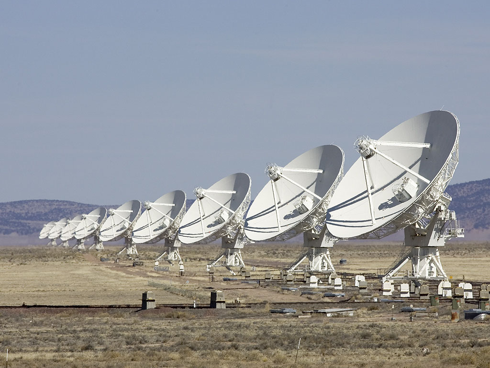

# Why the VLA Radio Telescope Lists Galaxies That Are Not There

_In the VLA_

## Executive Summary

> [!callout]
> This article looks at how objects that are not in the sky end up inside a galaxy catalog built by a radio telescope. The source is a paper posted to arXiv on October 1 by researchers at the Institute of Radio Astronomy of UNAM in Mexico and the US National Radio Astronomy Observatory. Their subject is the GOODS-N field as the VLA saw it at 10 gigahertz across 380 hours. No extragalactic radio continuum survey above 3 gigahertz goes deeper or sharper.

> Pixel noise fit a zero-centered Gaussian almost exactly. Yet the fakes counted in that same image came to nine times what the Gaussian allows. Swapping the imaging algorithm for five different recipes left the rate where it was. One explanation survived. Pushing the antennas apart to buy resolution leaves more of what the observation never samples, and those gaps tie the noise of neighboring pixels together.

> Sections 1 through 4 follow what the paper measured and the clues its authors left. Section 5 carries the finding over to AI training data, and that move is this article's reading rather than anything the paper claims.

### Key figures

Source: Jiménez-Andrade et al., [Spurious sources in high-resolution VLA surveys](https://arxiv.org/abs/2610.02028), arXiv:2610.02028 (2026-10-01), text and figures

<!-- stat-card -->
**9x** — Excess at the sharpest resolution — Per independent noise patch, a fake is nine times likelier than the Gaussian prediction

<!-- stat-card -->
**9x → 4x** — Going from 0.22 arcseconds to 1 arcsecond — A blurrier view shrinks the excess. Four times over still remains

<!-- stat-card -->
**7x** — Excess left in the image center alone — Keeping only the region the antennas receive best barely moves the number

<!-- stat-card -->
**0.25–0.40** — Spurious fraction across five imaging recipes — All five land in one band and cannot be told apart within the errors

## Objects That Never Belonged in the Catalog

A deep look at one patch of sky with a radio telescope does not end with a single image. Out of that image comes a catalog, in which every point brighter than its surroundings is written down with coordinates and a brightness. That catalog is where the next study starts. Counts of how fast a given galaxy forms stars, or of which galaxies hold an active black hole at the center, all begin there.

Some entries in that catalog have nothing in the sky behind them. A clump of noise happened to clear the brightness threshold and got written down as an object. Astronomers call these spurious sources. How many creep in is normally worked out on paper. If the noise is random, you count how many independent patches of noise the image holds, then use the Gaussian probability to find how many of them cross the line by chance. At a cut of five times the noise level, a single patch clears the line about three times in ten million.

The field this paper recounted is GOODS-N, as the VLA imaged it at 10 gigahertz. The VLA is a radio telescope made of 27 dish antennas laid out across the New Mexico desert, and its full name is the Karl G. Jansky Very Large Array. The antennas can be drawn closer together or pushed farther apart, and the wider the spread, the smaller the detail it can separate. The image the team worked from combines 380 hours across the A, B and C configurations at a resolution of 0.22 arcseconds. One arcsecond is a degree divided by 3,600, so 0.22 arcseconds is about a fifth of that.

*▲ VLA dish antennas lined up in the New Mexico desert. The spacing between antennas is widened or narrowed to change configuration | Source: [Mihaisiscanu, Wikimedia Commons (CC BY-SA 4.0)](https://commons.wikimedia.org/wiki/File:Karl_G._Jansky_Very_Large_Array.jpg)*

The patch itself is small. A single pointing sees only a narrow field, so 17 of them were overlapped to cover 297 square arcminutes, which leaves the sensitivity nearly flat across the middle. That area is less than half the sky a full moon covers. Staring at so small a patch for 380 hours produced this image, and the catalog drawn from it is what the fake-counting runs on.

The mismatch was first noticed by the same team. Working on this field in 2024, they saw that blurring the image to a coarser resolution left fewer points in the flipped version. If the noise patches had nothing to do with one another, changing resolution should leave the gap between calculation and measurement untouched. This paper is the follow-up that measured that hint again across eight resolutions.

The team checked the noise first. At all eight resolutions the pixel brightness distribution matched a zero-centered Gaussian well, with no stretch where the dark tail ran unusually heavy. By the textbook, then, the fakes should come out exactly as calculated. The fakes actually counted were far more numerous.

## Counting the Fakes by Flipping the Image

Deciding object by object which catalog entries are real would mean matching each one against observations from other telescopes. That takes a great deal of work, and faint objects the other telescopes missed get branded fake unfairly. Radio astronomy takes a different route. It multiplies the image brightness by minus one and runs over the flipped version the same detection program it ran over the real one.

A bright point found in the flipped image is a dip in the original. Nothing in the sky is a radio source darker than its surroundings, so every one of those points is noise. If the noise is symmetric about zero, their number is the number of fakes mixed into the original. Dividing the count from the flipped image by the count from the real one gives the spurious fraction. Every rate quoted in this article was measured that way.

The team took the 0.22-arcsecond image and smoothed it into seven more, from 0.25 arcseconds up to 1 arcsecond, then ran the same procedure at all eight resolutions. Detection used PyBDSF with the threshold set at five times the noise level. Switching the program to Blobcat changed nothing, and neither did lowering the resolution in the observation data instead of smoothing the image. The result pointed the same way at every resolution. Per independent noise patch, the chance of a fake exceeded the Gaussian prediction. At 0.22 arcseconds it ran nine times over, and blurring toward 1 arcsecond brought that multiple down to four. Most of the fakes sat among faint points with a signal-to-noise ratio of 6 or below.

## Three Suspects, and None of Them Explains the Excess

More fakes at higher resolution is not surprising on its own. Cutting the same stretch of sky into finer pieces raises the number of independent noise patches, and more patches mean more of them crossing the threshold by chance. That effect sits in the formula from the start. The nine-times figure is what remains once it has been divided out.

Next the team turned to the edge of the image. An antenna receives most sensitively along the direction it points and grows duller outward. Correcting for that difference amplifies the noise along with everything else at the edges, so fakes can pile up there. The team cut out the central region where antenna sensitivity stays above 80 percent and counted again. Nine times over came down to seven, and no further. The edge effect is real, and it accounts for little.

The leading suspect was the way the image gets made. A radio interferometer cannot use its observation data as an image directly, and reconstructs one through repeated computation instead; that algorithm offers several choices. The team picked one of the 17 pointings and reimaged it five different ways. Wide-field correction in and out, the multi-frequency approach against the classical one, and a version that splits the field into facets and treats them separately. The spurious fraction of all five landed between 0.25 and 0.40, and within the errors none could be told from another.

One of the five is the exact recipe used to build the actual GOODS-N catalog. The other four change that choice one piece at a time, and not one of them made fewer fakes. The 0.25 to 0.40 range comes from reimaging a single pointing and counting there, so it does not carry over as the rate for the whole survey catalog. What the number does show, on its own, is that the fakes are not a stray one or two.
