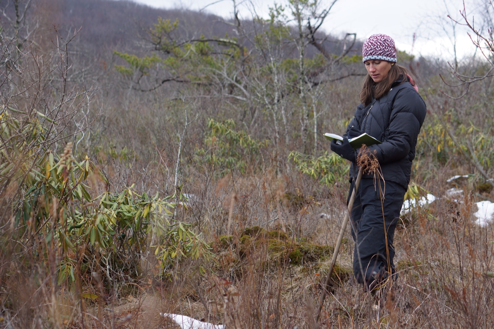
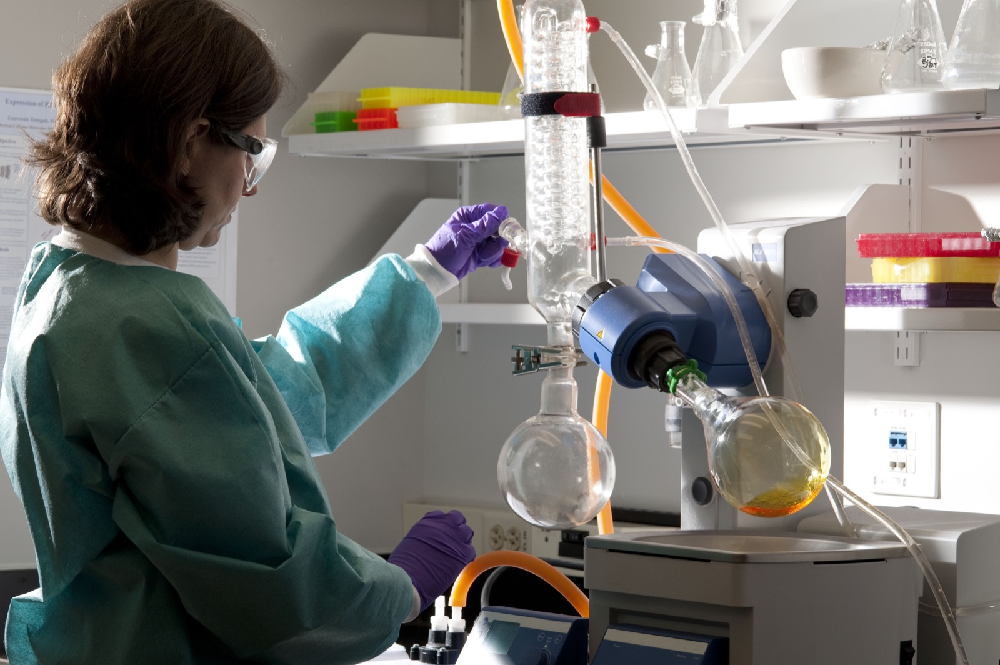
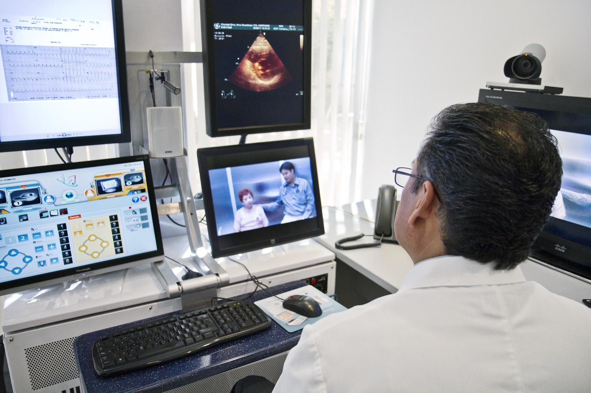

# 과학자들이 챗봇에게 끝내 넘기지 않은 일들

_현장 인터뷰와 글쓰기, 동료 심사를 지킨 이유는 AI가 못 만드는 데이터에 있다_

## Executive Summary

> [!callout]
> 네이처가 브리핑 독자인 과학자들에게 반대 방향의 질문을 던졌습니다. AI가 가설 세우기부터 분석과 집필까지 과학의 거의 모든 단계에 손을 뻗은 지금, 그럼에도 당신이 절대 넘기지 않을 일은 무엇이냐는 것이었습니다. 돌아온 대답들은 저마다 분야가 달랐지만 놀랍도록 같은 곳으로 모였습니다. 현장에서 직접 모으는 1차 데이터, 손으로 쓰는 글과 동료 심사, 그리고 호기심에서 출발한 실험 설계였습니다.

> 이 선택이 단순한 애착이 아니라는 근거는 같은 시기 다른 연구들이 채워 줍니다. 한쪽에서는 사람들이 챗봇의 문체와 사고를 닮아가며 표현이 균질해진다는 분석이, 다른 쪽에서는 AI에 기대다 실제로 역량을 잃는다는 초기 실측이 나왔습니다. 과학자들이 지키겠다고 한 목록은 정확히, 균질화가 파고들고 디스킬링이 앗아 가는 그 자리였습니다.

> 이 글은 그 목록을 데이터의 관점에서 다시 읽습니다. 사람이 자발적으로 남겨 둔 일은 AI가 대신 만들 수 없는 데이터가 태어나는 지점이고, 자동화가 넓어질수록 그 원천은 오히려 더 희소해집니다.

### 주요 수치

출처: [Nature — Is AI ruining our skills? (2026-06-18)](https://www.nature.com/articles/d41586-026-01947-1)

아래 세 수치는 "안 넘긴다"는 선택이 느낌에 그치지 않는다는 것을 보여 줍니다. 의료 현장에서는 역량 상실을 걱정하는 응답이 이미 다수였고, Anthropic은 같은 물음을 통제된 실험으로 옮겨 변화를 직접 재기 시작했습니다.

<!-- stat-card -->
**77%** — 스킬 상실을 우려한 의사 — AI 과의존이 자기 역량을 갉아먹는다고 답한 비율

<!-- stat-card -->
**70%** — 같은 우려의 간호사 — 의료 현장 전반에 걸친 디스킬링 불안의 크기

<!-- stat-card -->
**52명** — 디스킬링 실측 대상 — Anthropic이 무작위 대조로 역량 변화를 측정한 엔지니어 수

## 네이처가 거꾸로 던진 질문

AI가 과학에서 무엇을 대신할 수 있는지에 대한 논의는 이미 익숙합니다. 문헌을 요약하고, 코드를 짜고, 통계를 돌리고, 초록을 다듬는 일까지 챗봇이 파고든 지 오래입니다. 그런데 2026년 여름, 네이처는 질문의 방향을 뒤집었습니다. 브리핑을 읽는 과학자 독자들에게 "AI 도구가 과학의 점점 더 많은 단계를 대신하는 지금, 당신이 절대 넘기지 않을 일은 무엇인가"를 물은 것입니다.

무엇을 자동화할 수 있는지가 아니라 무엇을 자동화하지 않을 것인지를 묻는 질문입니다. 답하는 사람이 스스로 선을 그어야 하는 물음이라, 돌아온 대답에는 각자의 연구 인생에서 가장 지키고 싶은 것이 담겼습니다. 편집부는 그 응답들을 실명과 소속과 함께 추려 실었습니다.

> [!callout]
> 질문의 방향이 뒤집히자 드러난 것은 능력의 경계가 아니라 **가치의 경계**였습니다. "AI가 할 수 있는가"가 아니라 "그래도 내가 붙들겠는가"를 물었을 때, 과학자들은 자기 일 중 무엇이 대체 불가능한 원천인지 스스로 지목했습니다.

## 다섯 개의 대답, 세 갈래의 이유

응답자들의 배경은 브라질의 의사부터 베이징의 현장 연구자, 이스탄불의 대학원생, 심해를 연구하는 과학자까지 제각각이었습니다. 그런데 이들이 넘기지 않겠다고 꼽은 일은 세 갈래로 수렴했습니다. 현장에서 직접 모으는 1차 데이터, 사고를 훈련하는 글쓰기와 동료 심사, 그리고 호기심에서 나오는 실험 설계였습니다.

### 2.1. 현장에서 직접 모으는 1차 데이터

베이징의 랴오멍차오는 1차 데이터 수집과 현장 관찰, 대면 인터뷰만큼은 직접 하겠다고 답했습니다. 공감과 현장의 즉흥적 대응, 전문적인 대면 소통이 필요한 일이라는 이유였습니다. 알고리즘은 실제 현장에 발을 들여 진짜 1차 자료를 길어 올릴 수 없다는 것, 그래서 이 부분만은 절대 맡기지 않겠다는 것이 그의 선이었습니다.

*▲ 현장에서 직접 관찰하고 기록하는 일은 알고리즘이 대신할 수 없는 1차 데이터를 만든다 | Source: [Wikimedia Commons (Public Domain, U.S. Fish and Wildlife Service)](https://commons.wikimedia.org/wiki/File:Service_biologist_Sue_Cameron_making_field_notes_(8191308778).jpg)*

### 2.2. 사고를 훈련하는 글쓰기와 동료 심사

콜로라도의 애나 호드샤이어는 글쓰기와 동료 심사를 챗봇에 넘길 생각이 없다고 했습니다. 글을 쓰는 과정 자체가 자신이 아직 이해하지 못한 지점을 드러내 주고, 남의 논문을 심사하는 일은 비판적 사고를 벼리는 자리이며, 지루한 이메일 한 통조차 소통 능력을 유지하는 연습이 되기 때문입니다. 결과물이 아니라 그 일을 하는 동안 자기 안에서 벌어지는 사고를 지키려는 선택이었습니다.

*▲ 손으로 직접 쓰는 과정은 아직 이해하지 못한 지점을 스스로 드러내 준다 | Source: [Wikimedia Commons (CC BY 2.0, Shixart1985)](https://commons.wikimedia.org/wiki/File:Person_writing_in_a_notebook_while_sitting_at_a_desk.jpg)*

### 2.3. 호기심에서 나오는 실험 설계

이스탄불에서 AI와 의식을 연구하는 뮐레이케 외즈차크막은 연구에서 가장 짜릿한 순간을 호기심을 품고, 예기치 못한 연결을 발견하고, 기존 전제에 도전하는 데서 찾았습니다. 그런 순간은 멘토와의 대화와 동료와의 토론, 홀로 하는 성찰에서 나오지 알고리즘에서 나오지 않는다고 그는 말합니다.

같은 결의 대답이 이어집니다. 한 심해 과학자는 영감과 발견의 스릴, 실험을 설계하는 창의성을 끝내 넘기기 어려운 것으로 꼽았습니다. 브라질의 엔히키 팔세투 지 바후스는 의사로서 환자의 이익을 위해서라면 AI가 더 잘하는 일은 넘겨야 한다고 인정하면서도, 사람의 손길과 호기심 기반 연구, 함께 만드는 즐거움까지 내주지는 않기를 바랐습니다.

*▲ 호기심에서 시작한 실험 설계는 아무도 아직 묻지 않은 질문에서 새 관측을 만든다 | Source: [Wikimedia Commons (CC BY 2.0, National Eye Institute)](https://commons.wikimedia.org/wiki/File:Laboratory_scientist_conducts_an_experiment_with_a_Rotary_evaporator.jpg)*

> [!callout]
> 세 갈래는 따로 노는 목록이 아닙니다. **현장의 관찰, 사고의 훈련, 창의적 판단**은 모두 사람이 세계와 직접 부딪칠 때만 생겨나는 것들입니다. 과학자들은 자동화의 편의를 부정한 것이 아니라, 편의로 바꿀 수 없는 자리를 지목한 것입니다.

## 균질화가 노리는 바로 그 자리

왜 하필 이 세 갈래일까요. 다른 연구 하나가 그 답을 옆에서 비춥니다. 네이처가 같은 해에 다룬 균질화 연구입니다. 서던캘리포니아대의 지바르 소우라티를 비롯한 연구진은 사람들이 LLM과 오래 상호작용할수록 그 문체와 관점, 추론 방식을 닮아가고, 어느 순간 그렇게 수렴한 표현이 사회적으로 더 올바른 전달 방식처럼 느껴지는 현상을 지적했습니다.

추측만은 아닙니다. 연구진은 챗GPT가 등장한 2022년 전후의 레딧 게시물과 뉴스, 프리프린트를 분석해 텍스트가 문체적으로 덜 다양해졌음을 확인했습니다. 참가자가 특정 의견을 낸 LLM과 대화한 뒤 자기 의견이 그 LLM 쪽으로 옮겨 가는 실험 결과도 있었습니다. 표현만 닮는 게 아니라 판단까지 끌려간다는 뜻입니다.

여기서 두 목록이 포개집니다. 균질화가 가장 먼저 갉아먹는 것은 개인의 문체, 남과 다른 관점, 전제를 의심하는 사고입니다. 그런데 이것들은 과학자들이 지키겠다고 한 글쓰기, 동료 심사, 호기심 어린 실험 설계와 정확히 같은 능력입니다. 과학자들의 목록은 결국 균질화가 파고드는 자리를 미리 표시해 둔 지도인 셈입니다. 물론 반대 목소리도 있습니다. 모두가 균질화된다고 볼 수는 없다는 반론, AI가 오히려 글을 더 잘 쓰고 더 잘 이해되게 돕는다는 지적도 함께 실렸습니다. 균질화의 압력과 그에 저항하려는 선택이 지금 같은 시간에 맞물려 있는 것입니다.

> [!callout]
> 과학자들이 그은 경계선은 우연히 놓인 것이 아닙니다. 그것은 **균질화가 가장 먼저 지워 버리는 능력들**, 곧 나만의 문체와 관점과 의심을 지키려는 방어선과 겹칩니다.

## 넘기면 사라진다는 증거

"안 넘긴다"는 말이 감상이 아니라 계산이라는 근거는 세 번째 연구가 채웁니다. 넘겼을 때 실제로 무언가를 잃는다는 초기 실측입니다. 네이처가 정리한 디스킬링 연구들에 따르면, 미국 의료 종사자를 상대로 한 설문에서 간호사 70%와 의사 77%가 AI 과의존으로 인한 역량 상실을 우려했습니다. 걱정이 특정 직군에 국한된 게 아니라 현장 전반에 퍼져 있다는 신호입니다.

*▲ 의료 현장에서 간호사 70%, 의사 77%가 AI 과의존으로 인한 역량 상실을 우려했다 | Source: [Wikimedia Commons (CC BY-SA 2.0, Intel Free Press)](https://commons.wikimedia.org/wiki/File:Telemedicine_Consult.jpg)*

우려를 넘어선 실측도 있습니다. Anthropic은 소프트웨어 엔지니어 52명에게 기본 코딩 과제를 주고 전원에게 웹 검색과 설명서 열람을 허용하되, 절반에게만 AI 어시스턴트를 쓰게 하는 무작위 대조 실험을 진행했습니다. 편리함의 대가로 무엇이 무뎌지는지를 통제된 조건에서 들여다본 것입니다. 시러큐스대의 케빈 크로스턴은 이 현상을 인식하는 것만으로도 어떤 스킬을 지키고 어떤 걸 AI에 맡길지 스스로 성찰하게 된다고 말했습니다. 오슬로대의 유이치 모리는 더 신중했습니다. 확증 연구는 더 필요하지만 AI 사용자는 스킬 상실 위험을 반드시 인지해야 하며, 디스킬링에 대한 확립된 해법은 아직 없어 앞으로 10년간 가장 뜨거운 연구 주제가 될 것이라고 내다봤습니다.

여기서 과학자들의 목록이 왜 그렇게 구성됐는지가 분명해집니다. 그들이 지키겠다고 한 글쓰기, 심사, 현장 판단은 한번 손을 놓으면 되찾기 어려운 능력들입니다. 넘기는 순간 편해지지만, 그 편함이 쌓이면 나중에 직접 하려 해도 예전만큼 못 하게 됩니다. 자발적 경계 설정은 그 손실을 미리 막으려는 결정이었습니다.

> [!callout]
> 디스킬링 증거는 "안 넘긴다"를 감정에서 **전략**으로 끌어올립니다. 넘기면 실제로 잃고, 잃은 능력은 쉽게 돌아오지 않습니다. 무엇을 지킬지 미리 정해 두는 것은 그래서 사치가 아니라 관리입니다.

## 사람이 남긴 목록은 원천 데이터의 지도다

이제 이 목록을 데이터의 언어로 옮겨 봅니다. 현장에서 직접 한 관찰과 인터뷰는 세상 어디에도 아직 기록되지 않은 1차 데이터입니다. 사람이 직접 쓴 리뷰와 글에는 그 사람만의 판단 근거가 담깁니다. 호기심에서 출발한 실험 설계는 아무도 아직 물어보지 않은 질문에서 나온 새 관측을 만들어 냅니다. 세 갈래 모두, AI가 기존 데이터를 아무리 잘 조합해도 대신 생성할 수 없는 원천입니다.

AI는 이미 있는 데이터를 학습해 그 분포 안에서 답합니다. 분포 밖의 새 신호, 즉 아직 세상에 없던 관측과 판단은 사람이 세계와 직접 부딪쳐야 생겨납니다. 균질화가 위험한 이유가 여기에 있습니다. 모두가 같은 도구에 기대 같은 문체와 판단으로 수렴하면, 모델이 다음에 배울 데이터마저 서로 닮아 갑니다. 다양성을 잃은 데이터는 새 발견을 낳을 힘을 잃습니다. 과학자들이 자기 손으로 지킨 자리는 그 다양성의 마지막 공급원인 셈입니다.

그래서 이 목록은 자동화의 반대편에 남겨진 잔여물이 아니라, 가장 희소하고 값진 데이터가 태어나는 지점의 지도로 읽어야 합니다. 무엇을 자동화할지 고르는 일만큼이나, 무엇을 사람의 손에 남겨 그 원천 데이터를 계속 만들어 낼지를 정하는 일이 중요해집니다. 데이터의 품질과 다양성이 결국 AI의 상한을 정한다면, 그 원천을 지키는 결정은 감상이 아니라 인프라의 문제입니다.

> [!callout]
> **마무리**: 과학자들이 챗봇에게 넘기지 않은 일의 목록은 곧 AI가 대신 만들 수 없는 데이터의 목록입니다. 자동화가 넓어질수록 그 원천은 더 희소해지고, 그것을 어디에 남겨 둘지를 정하는 것이 다음 시대 데이터 전략의 핵심입니다.

## 참고문헌

- 1.Wilson, S. (2026). "[Don't let AI steal all the joy: what scientists won't give up to chatbots](https://www.nature.com/articles/d41586-026-02213-0)." _Nature_ (2026-07-21). — 네이처 브리핑 독자 설문. 과학자들이 AI에 넘기지 않겠다고 꼽은 일이 현장 1차 데이터 수집, 글쓰기·동료 심사, 호기심·실험 설계로 수렴.
- 2."[AI can 'same-ify' human expression — can some brains resist its pull?](https://www.nature.com/articles/d41586-026-00781-9)" _Nature_ (2026-03-11). — LLM과 오래 상호작용할수록 문체·관점·추론이 수렴하는 균질화. ChatGPT 출시 전후 텍스트 분석에서 문체 다양성 감소 확인.
- 3.Sourati, Z., Ziabari, A. S., & Dehghani, M. (2026). "The homogenizing effect of large language models on human expression." _Trends in Cognitive Sciences_. — 네이처 균질화 기사의 근거 오피니언 논문. 사람이 LLM의 표현·추론을 닮아가며 그것을 더 올바른 전달 방식으로 느끼게 되는 수렴 메커니즘.
- 4."[Is AI ruining our skills? Early results are in — and they're not good](https://www.nature.com/articles/d41586-026-01947-1)." _Nature_ (2026-06-18). — AI 과의존이 역량을 저하시킨다는 초기 연구 모음. 의사 77%·간호사 70%가 스킬 상실 우려, Anthropic이 엔지니어 52명 대상 무작위 대조 실험 수행.
