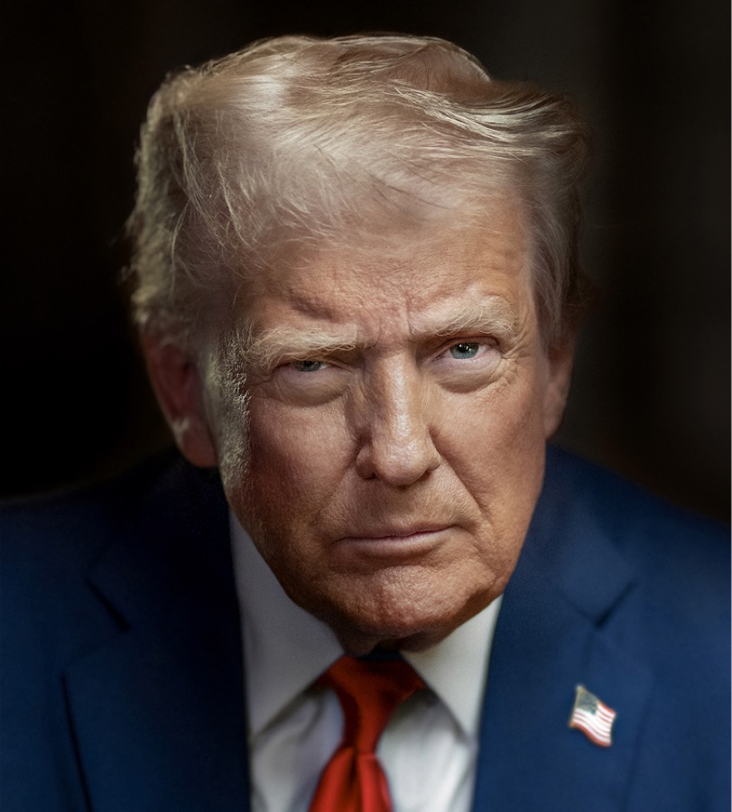

# 백악관 초지능 협약, 감사인은 회사가 직접 고른다

_2026년 9월 29일 구글·오픈AI 등 여섯 회사가 AI 모델을 네 단계로 감시하겠다고 약속했지만, 어겨도 벌칙이 없다_

## Executive Summary

> [!callout]
> 이 글은 2026년 9월 29일 백악관에서 서명된 문서 한 장을 읽는다. 구글, 앤트로픽, 메타, 오픈AI, xAI, 엔비디아 여섯 회사의 최고경영진이 '초지능에 관한 백악관 협약'에 이름을 올렸다. 회사들은 자기가 만드는 모델을 네 겹으로 감독하겠다고 약속했다. 사내 통제 장치를 두고, 그 장치가 작동하는지 볼 내부 팀을 두고, 바깥에서 독립 감사인을 불러 확인받고, 이사회의 독립위원회가 그 보고서를 검토한다는 순서다.

> 층수는 넷인데 그중 하나를 누가 고르는지가 문제다. 외부 감사인을 고르는 주체가 감사를 받을 회사 자신이다. 협약에는 위반했을 때 따르는 제재가 없고, 감사인이 누구인지 밝힐 의무도 없고, 언제까지 이 장치들을 갖추라는 기한도 없다. 그리고 가장 크게 비어 있는 칸은 따로 있다. 감사인이 모델의 가중치를 직접 들여다보는지, 배포 환경에 가까운 조건에서 모델을 직접 시험할 수 있는지, 아니면 회사가 작성해 건네는 요약 보고서만 받는지를 협약 문구가 정하지 않았다.

> 1절부터 5절까지는 보도와 공개 문서로 확인되는 사실이다. 6절은 그 사실을 데이터 품질의 눈으로 다시 읽은 이 글의 해석이다.

### 주요 수치

출처: [Nextgov](https://www.nextgov.com/artificial-intelligence/2026/09/white-house-unveils-super-intelligence-executive-order-and-industry-accord/416325/), [CoinDesk](https://www.coindesk.com/tech/2026/09/30/openai-google-and-meta-pledge-outside-ai-audits-under-voluntary-white-house-deal) (2026년 9월 29~30일), 한국 AI 기본법 제2조.

<!-- stat-card -->
**6개사** — 협약에 서명한 기업 — 구글·앤트로픽·메타·오픈AI·xAI·엔비디아 최고경영진이 한자리에 앉았다

<!-- stat-card -->
**0** — 위반 시 제재 조항 — 자발적 약속이라 어겨도 따르는 불이익이 없고, 이행 기한도 정하지 않았다

<!-- stat-card -->
**60일** — 초지능 법적 정의안 기한 — 행정명령은 용어를 먼저 바꾸고 그 정의는 두 달 뒤에 만들라고 지시했다

<!-- stat-card -->
**1026** — 한국이 쓰는 기준선(FLOPs) — 안전성 확보 의무 대상을 이름이 아니라 학습 연산량으로 가른다

## 협약과 행정명령, 같은 날 나온 두 문서

2026년 9월 29일 백악관에 여섯 회사 사람이 모였다. 구글의 순다르 피차이, 앤트로픽의 다리오 아모데이, 메타의 마크 저커버그, 오픈AI의 그렉 브록먼 사장, xAI의 일론 머스크, 엔비디아의 젠슨 황이다. 이들이 서명한 문서의 정식 이름은 '초지능에 관한 백악관 협약: 프런티어 책임에 관한 공동 서약'이다. 구속력이 있느냐는 질문에 트럼프 대통령은 도덕적으로 구속력이 있다고 본다고 답했고, 같은 자리에서 어떤 면에서는 거의 헌법 같은 것이라고 말했다. 여러 매체가 붙인 'AI 헌법'이라는 별칭은 여기서 나왔다. 서명된 협약문이 공개된 경로도 눈여겨볼 만하다. 백악관 문서 페이지가 아니라 트럼프 본인의 트루스소셜 게시물이었다.

같은 날 대통령은 행정명령에도 서명했다. 연방기관이 공식 서신, 대외 발표, 웹사이트, 보고서, 정책 문서에서 '인공지능'이라는 말 대신 '초지능(Superintelligence, SI)'을 쓰도록 하고, '인공지능'과 'AI'라는 표현을 더 이상 인정하지 않도록 하는 내용이다. 다만 적용 범위에 한정이 붙어 있다. 명령이 미치는 범위는 법령이 아닌 문서까지다. 법률 조문에 박혀 있는 '인공지능'은 그대로 남고, 기관이 스스로 만드는 문서의 표기만 바뀐다. 그리고 대통령 과학기술 보좌관에게 기관장들과 협의해 60일 안에 초지능의 법적 정의를 담은 입법안을 제출하라고 지시했다. 그 검토에는 초지능이 기존 AI의 법적 정의를 수정할지, 확장할지, 아예 대체할지를 판단하는 일이 포함된다.

두 문서가 서로를 가리키지는 않는다. 행정명령은 연방 문서의 용어와 앞으로 만들 법적 정의를 다루고, 협약은 업계가 스스로 지키겠다는 감독 절차를 다룬다. 경영진이 서명한 문서에는 이름을 바꾸겠다는 선언이 아예 들어 있지 않다. 같은 날 같은 자리에서 나왔을 뿐 법적으로는 별개 트랙이다. 다만 협약문에 연결 가능성을 열어 둔 문장이 하나 있다. 시간이 지나면 이 조치들을 법률이나 규정으로 성문화하는 것이 합리적일 수 있다는 대목이다. 지금은 약속이지만 나중에 의무가 될 수도 있다는 뜻으로, 협약이 스스로 자기 위치를 어떻게 보고 있는지 드러내는 문장이다.

*▲ 협약을 "도덕적으로 구속력이 있다"고 표현한 트럼프 대통령. 공식 대통령 초상. Source: [The White House](https://www.whitehouse.gov/)*

## 협약이 약속한 감독은 네 겹이다

협약의 핵심은 네 문장으로 되어 있다. 첫째, 훈련과 배포 단계에서 모델의 역량과 정렬 상태를 관찰하는 강력한 내부 통제를 둔다. 사이버보안과 생물보안과 화학 위협이 예시로 적혀 있고, 모델이 기술 시스템을 의도하지 않은 방식으로 해킹하거나 거기에 접근하지 않도록 한다는 대목도 같은 문장에 붙어 있다. 둘째, 내부 팀에 권한을 주어 그 장치들이 의도대로 작동하는지, 발견된 문제가 시정되는지까지 확인하게 한다. 셋째, 독립적인 외부 감사인 또는 평가자와 협력해 통제와 관찰, 탐지가 의도대로 작동하는지를 독립적으로 평가받는다. 넷째, 이사회의 독립위원회를 지정해 통제를 운영하는 팀과 내외부 감사인·평가자의 보고를 받고 감독하게 한다.

순서대로 읽으면 안쪽에서 바깥쪽으로 원이 하나씩 커진다. 모델을 만드는 팀, 그 팀을 보는 사내 팀, 회사 밖의 감사인, 그리고 경영진에서 떨어져 앉은 이사회 위원회다. 재무 쪽에서 오래 쓰여 온 구조이기도 하다. 상장사가 회계 장부를 다루는 방식이 대체로 이 모양이고, 협약이 빌려 온 어휘도 거기서 왔다.

네 항목 뒤에는 약속이 하나 더 붙어 있다. 서명한 회사들이 정기적으로 만나 표준과 모범사례를 정하겠다는 것이다. 협약에서 시간과 관련된 약속은 이것 하나뿐인데, 얼마나 자주 만나는지도 거기서 정해진 표준이 어떤 효력을 갖는지도 적혀 있지 않다.
