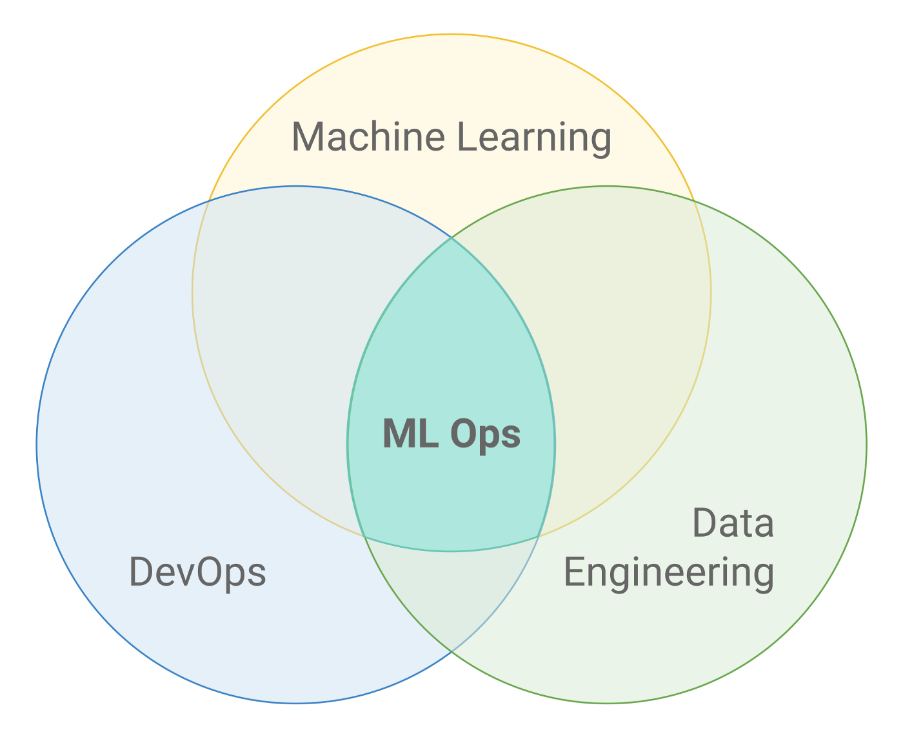
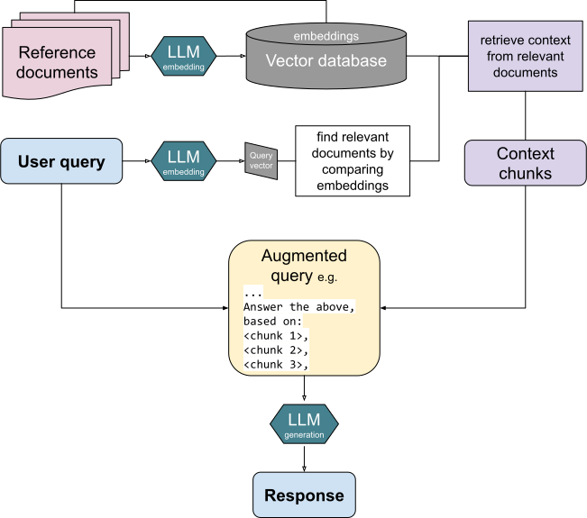

# The Model Was Never the Problem

_Why 88% of AI pilots never reach production — a convergent reading of 2025 IDC, MIT, and Gartner data_

## Executive Summary

> [!callout]
> What companies bought was a smarter model. Yet 88% of the pilots built on those models never clear the threshold into production — a figure from IDC and Lenovo's joint research. Swapping in GPT-5 didn't change the outcome. The demo ran smoothly, then collapsed the moment it moved to real operations, and what collapsed in between was never the model's intelligence. This article traces where that 88% leaked out, and why, using 2025 data from IDC, MIT, and Gartner.

> The hardest evidence came from MIT: 80% of the work involved in moving a pilot to production is data engineering, governance, and integration. In other words, it's data readiness, not model selection, that decides success or failure. Gartner went a step further, attributing 85% of failed AI projects to data quality problems. The model was fine; what wasn't ready was the data.

> So the question to ask isn't "which model should we buy?" but "is our data ready to go to production?" This article translates the places where failure leaked into money, and closes with a five-question self-assessment your organization can answer directly.

The scale of the wreckage and its cause sit together in four numbers: the share of pilots that never reached production, the share of generative-AI pilots that produced no ROI, the investment that vanished in a single year without results, and the one thing most often named as the root of that failure.

<!-- stat-card -->
**88%** — never reach production — Most AI pilots fail the move to operations (IDC·Lenovo)

<!-- stat-card -->
**95%** — generative AI miss ROI — Share producing no measurable return (MIT GenAI Divide)

<!-- stat-card -->
**$547B** — spent without results — Of 2025's $684B AI investment, the part that led nowhere

<!-- stat-card -->
**85%** — root cause is data — Share of failed AI projects undone by data quality (Gartner)

## Seven of Every Eight Vanish

The number 88% is abstract. Put another way: of every eight AI pilots that drew applause in the boardroom, seven disappear without ever entering an operational system. The same IDC analysis reports that the few that did land in production returned an average ROI of 171%. The problem isn't that the model is incompetent. With the very same model, someone makes 171% while most make zero. The fork in the road came after the model.

Convert the scale into money and it gets sharper. Pulling industry analyses together, the world spent roughly $684B on AI in 2025 alone, and $547B of that never translated into measurable results. S&P Global counted the share of companies abandoning AI initiatives at 42% in 2025, a sharp jump from 17% the year before. Large enterprises scrapped an average of 2.3 initiatives each, with an average sunk cost of $7.2M per cancellation.

The interesting part is the shape of the failure. Most didn't blow up spectacularly. Neither cancelled nor successful, projects piled up frozen at the pilot stage. The industry calls this "pilot purgatory" — the demo works, so it's too valuable to kill, but it can't be promoted to operations, so it can't be saved either. It's a zombie state. Budget keeps flowing while value never comes out. A large portion of that 88% is trapped right here, in purgatory.

It's worth noting this isn't one institution's pessimistic tally. A 2025 RAND study analyzing more than 2,400 companies found that 80.3% of AI projects failed to deliver business value. IDC's 88%, MIT's 95%, and RAND's 80% rest on different samples and definitions, yet they point in the same direction. And the trend shows no sign of letting up. Gartner projects that over 40% of agentic AI projects will be cancelled by 2027, and warns that without AI-Ready data, a substantial number of projects risk being scrapped by 2026. The models get better every year, while the scale of failure barely shrinks.

> [!callout]
> Here's the crux: the 88% failure rate, the 42% abandonment, and the $547B that evaporated all moved almost independently of the model-performance curve. Models improved year after year, but the production-conversion rate didn't climb with them. That's the signal that the bottleneck sits outside the model, not inside it.

## The Culprit Was Never the Model

If the bottleneck is outside the model, where exactly is it? One sentence from MIT's 2025 report "The GenAI Divide" compresses the answer: 80% of the work needed to move a pilot into production is data engineering, governance, workflow integration, and measurement infrastructure. Choosing the model and tuning the prompt fall into the remaining 20%. The part we talked about most turned out to carry the least weight.

*▲ Production AI (ML Ops) sits at the intersection of Machine Learning, DevOps, and Data Engineering — the model is just one part | Source: [Wikimedia Commons (CC BY-SA 4.0)](https://commons.wikimedia.org/wiki/File:MLOps_venn_diagram.png)*

Gartner's diagnosis is blunter still. In 85% of failed AI projects, the root cause was data quality. In the same analysis, only 12% of organizations were confident they held data of sufficient quality for AI. That means roughly nine in ten bought the model first, while the data sat unprepared.

So why did everyone invest in the model first? Because the model is visible and easy to measure. Benchmark scores rise, demos run smoothly, and it all shows well to executives. Data infrastructure, by contrast, is dull and invisible. Fixing pipelines and standing up governance is hard to boast about on a single slide. IDC described this dynamic as "panic-driven thinking born at the board level" — competitors are doing it, we can't fall behind, so pilots get pushed through even if the very definition of ROI has to be bent to make them look good.

A single line from Composio's 2025 agent report sums up the paradox most concisely: "Even the best model is useless if it's fed bad data or can't execute actions reliably." The era when the model's ceiling was the problem is over. The place that breaks now is below the model — the pathway by which data reaches it.

> [!callout]
> Flip the perspective for a moment. Frame AI adoption as a question of "which model should we buy," and you've already started by skipping 80% of the work. The real outcome is decided by "is the data we'll feed that model trustworthy in production?"

## A Third of Failures Never Reached the Data

Even within the data problem, there's a place where things trip first: when the agent can't reach the data and tools at all. Composio and Anar Solutions each sort pilot failures into three categories, and in both, "no access to data and tools" occupies one axis. Being one of three categories, it's reasonable to read roughly a third of failures as originating here. (This is not a precise figure from a single source, but a proportion that converges across multiple analyses.)

Composio calls this the "brittle connectors" problem. In a pilot, the demo runs on one neatly organized CSV. In production, though, the same agent faces undocumented internal APIs, legacy ERPs buried under custom fields, and rate limits that hit without warning. Regardless of the model's reasoning ability, the wiring that reaches the data is simply severed. Without reliable connections to CRMs, ERPs, databases, and external APIs, even the smartest agent stops empty-handed.

*▲ Enterprise integration structure. The one clean CSV in the pilot demo hides this entire network of connections | Source: [Wikimedia Commons](https://commons.wikimedia.org/wiki/File:Concept_of_Enterprise_Integration.png)*

Field surveys back this up. In Fivetran's 2025 study, 41% of companies said their AI models' performance was hampered by a lack of access to real-time data, and 29% said data silos were blocking AI success. Nearly half (42%) reported having delayed or failed a substantial number of AI projects because of data-readiness problems.

Being connected isn't the end of it, either. Composio names a third trap: the "polling tax." Without an event-driven architecture, an agent that hammers APIs nonstop to check for changes burns a large share of its call quota for nothing. What it actually needs is fresh data flowing in real time, but the connected infrastructure only refreshes on a batch cycle. The path by which data reaches the model is either severed entirely, or, even when connected, fails to arrive on time. This is exactly the same spot where that earlier 41% pointed to the absence of real-time access as the cause of degraded performance.

Fixing this pathway isn't glamorous. It's the work of knowing what data lives where, how fresh it is, and who can access it. That's precisely why Pebblous has consistently emphasized [data freshness](/blog/data-freshness-checklist/en/) and [data lineage](/blog/data-lineage-ai-pipeline/en/). Only when the data the model must reach is alive and traceable in production does the agent stop coming up empty-handed.

## The Rest Is a Data Problem Too

If access to data and tools is one axis when failure is split in three, are the other two axes any different? Look closely and they're branches from the same root. The remaining two categories Anar Solutions lists are governance gaps and poor use-case selection.

### 4.1. The Governance Gap

Fewer than one in five companies have a formal data-governance framework in place. No governance means no mechanism to control the quality, provenance, and permissions of data. The model doesn't question the data that comes in — it just uses it. When unvalidated data flows in, you get plausible but wrong answers, and the moment those go into operations, trust collapses. This is exactly why [agentic content verification](/blog/agentic-content-pipeline-verification/en/) matters.

### 4.2. The Wrong Use Case, and Poisoned RAG

Why did organizations pick impressive demo-friendly tasks first? Because demo data comes ready and clean. The operational data, meanwhile, is messy — and so use cases that succeed in a demo collapse in production. The criterion for selection wasn't "which problem matters most" but "which data is already clean."

The trap Composio calls "dumb RAG" runs along the same grain. Dump internal documents into a vector DB indiscriminately, with no preprocessing, and the context flows into the model already poisoned. The result is the "high-confidence hallucination" — wrong, but stated with total assurance. The model isn't lying; poisoned data has simply borrowed its mouth.

*▲ Full RAG pipeline. Feed documents in without preprocessing and the context is already poisoned — producing high-confidence hallucinations | Source: [Wikimedia Commons (CC BY-SA 4.0)](https://commons.wikimedia.org/wiki/File:RAG_diagram.svg)*

> [!callout]
> The three categories differ only in name; they point to the same place — data that can't be accessed, can't be controlled, or has been poisoned. Swapping the model won't fix it; making the data production-ready will. It wasn't a third of failures that were a data problem — it was effectively all of them.

## What the Winners Did Differently

So what did the few that landed in production and returned 171% ROI do differently? McKinsey's 2025 analysis names the clearest distinction: organizations that produced meaningful financial results were twice as likely to have redesigned their end-to-end data workflows before choosing modeling techniques. The order was reversed. Instead of picking the model first and fitting the data to it, they fixed the data first and laid the model on top.

The difference shows up in budget allocation, too. Organizations that delivered results put 50–70% of their AI budget into data preparation. That means money went first to data pipelines, evaluation infrastructure, monitoring, and operations staff — not model licenses or fine-tuning. More was spent keeping data alive in production than on flashy model demos.

*▲ The ML pipeline starts with training data. Winning organizations finished this first box before touching the model | Source: [Wikimedia Commons (CC BY-SA 4.0)](https://commons.wikimedia.org/wiki/File:Supervised_machine_learning_in_a_nutshell.svg)*

Success tends to look modest. One case that automated back-office document review saved $2–10M a year — not from a headline-grabbing giant agent, but from a narrow task where the data was well prepared. Another striking point in MIT's analysis: success rates were 33% for systems built in-house, versus 67% (double) for those built with specialized vendors. The know-how to make data production-ready is scarcer than the model itself, so those who brought that know-how in from outside succeeded more often.

- →Design with deployment as the starting assumption — treat production, not the demo, as a given from day one.
- →Redesign the data workflow before selecting the model.
- →Allocate more than half the budget to data preparation, evaluation, and monitoring.
- →Win first on a narrow task where the data is ready, rather than a sprawling one.

If you want a more concrete view of what "AI-Ready Data" actually is, Pebblous's [conditions for AI-Ready Data](/blog/ai-ready-data-conditions/en/) and [5 signals that separate AI-Ready Data](/blog/ai-ready-data-5-signals/en/) are a starting point. They translate what the winning 5% did by instinct into items you can actually diagnose.

## Is Your Organization Ready?

Everything so far converges on a single question: before you buy the next model, is your data ready to go to production? Answer the five questions below honestly and you'll get a rough fix on where you stand. They ask about data, not the model.

<!-- stat-card -->
****1. Same source?** Is the data you used in the pilot the same source as the data you'll use in production — or is it data refined separately just for the demo?**

<!-- stat-card -->
****2. Can you reach it?** Are the interfaces of the systems the model must connect to (CRM, ERP, DB, external APIs) documented and reliably accessible?**

<!-- stat-card -->
****3. Is it fresh?** Do you have a production pipeline that accesses real-time, or sufficiently up-to-date, data?**

<!-- stat-card -->
****4. Do you watch it?** Is there a mechanism that continuously monitors data quality in production and catches anomalies when they appear?**

<!-- stat-card -->
****5. Do you control it?** Do you have data governance and a hallucination-mitigation system that can stop unvalidated data from flowing into the model?**

If three or more of the five draw a "no," that's a signal your next investment should go to data, not the model. Upgrading the model a notch will barely move the production-conversion rate. The place to plug first is the pathway where data is leaking out.

> [!callout]
> **Editor's Note.** Pebblous has been doing the work of translating these five questions into diagnosable metrics — measuring what data lives where, how fresh it is, who accesses it, and how its quality changes over time. Whether it's Physical AI or an in-house agent, confirming your data is production-ready before laying the model on top is the starting point the $547B lesson points to. One example of the related work can be seen in our [Physical AI data pipeline](/project/PhysicalAI/data-pipeline-for-physical-ai-01/en/).

## References

### Industry & Press

- 1.CIO.com. (2025). "[88% of AI Pilots Fail to Reach Production — But That's Not All on IT](https://www.cio.com/article/3850763/88-of-ai-pilots-fail-to-reach-production-but-thats-not-all-on-it.html)." — IDC·Lenovo partnership research. 88% of pilots never reach production; 171% ROI when they land.
- 2.Legal.io. (2025). "[MIT Report Finds 95% of AI Pilots Fail to Deliver ROI, Exposing GenAI Divide](https://www.legal.io/articles/5719519/MIT-Report-Finds-95-of-AI-Pilots-Fail-to-Deliver-ROI-Exposing-GenAI-Divide)." — MIT "The GenAI Divide: State of AI in Business 2025." 80% of the conversion work is data engineering, governance, and integration.
- 3.Composio. (2025). "[The 2025 AI Agent Report: Why AI Pilots Fail in Production and the 2026 Integration Roadmap](https://composio.dev/blog/why-ai-agent-pilots-fail-2026-integration-roadmap)." — The three traps: brittle connectors, dumb RAG, and the polling tax.
- 4.Anar Solutions. (2026). "[Why Agentic AI Pilots Fail Production](https://anarsolutions.com/why-agentic-ai-pilots-fail-production/)." — A three-category failure taxonomy: integration, governance, and use-case selection.
- 5.Fivetran. (2025). "[Fivetran Report Finds Nearly Half of Enterprise AI Projects Fail Due to Poor Data Readiness](https://www.fivetran.com/press/fivetran-report-finds-nearly-half-of-enterprise-ai-projects-fail-due-to-poor-data-readiness)." — 41% lack real-time data access; 29% blocked by data silos.
- 6.RAND Corporation. (2025). "[The Root Causes of Failure for Artificial Intelligence Projects](https://www.rand.org/pubs/research_reports/RRA2680-1.html)." — Analysis of 2,400+ companies; 80.3% of AI projects fell short of business value.

### Official Sources

- 7.Gartner. (2025-02-26). "[Lack of AI-Ready Data Puts AI Projects at Risk](https://www.gartner.com/en/newsroom/press-releases/2025-02-26-lack-of-ai-ready-data-puts-ai-projects-at-risk)." — 85% of failed projects trace to data quality; only 12% hold data of sufficient quality.
