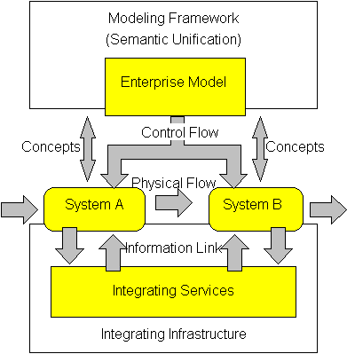

# 모델은 멀쩡했다

_AI 파일럿 88%가 production에 못 가는 진짜 이유 — 2025 IDC·MIT·Gartner 수렴 분석_

## Executive Summary

> [!callout]
> 기업이 산 것은 똑똑한 모델이었습니다. 그런데 그 모델로 만든 파일럿의 88%가 production 문턱을 넘지 못합니다. IDC와 Lenovo가 함께 본 수치입니다. 모델을 GPT-5로 바꾼다고 달라지지 않았습니다. 데모는 매끈하게 돌아가는데 실제 운영으로 넘어가는 순간 무너졌고, 그 사이에서 무너진 것은 모델의 지능이 아니었습니다. 이 글은 그 88%가 어디서, 왜 새어 나갔는지를 IDC·MIT·Gartner의 2025년 데이터로 따라가 봅니다.

> 가장 단단한 증거는 MIT가 내놓았습니다. 파일럿을 production으로 옮기는 데 드는 일의 80%가 데이터 엔지니어링, 거버넌스, 통합이라는 것입니다. 모델 선택이 아니라 데이터 준비가 성패를 가르는 구간이라는 뜻입니다. Gartner는 한발 더 나아가, 실패한 AI 프로젝트의 85%가 데이터 품질 문제로 무너졌다고 짚었습니다. 모델은 멀쩡했고, 준비되지 않은 것은 데이터였습니다.

> 그래서 던져야 할 질문은 "어떤 모델을 살까"가 아니라 "우리 데이터는 production으로 갈 준비가 됐는가"입니다. 이 글은 실패가 돈으로 새어 나간 자리를 수치로 옮기고, 마지막에 조직이 직접 답해 볼 5문항 자가진단을 둡니다.

파국의 규모와 원인은 네 개의 숫자에 함께 담겨 있습니다. production에 닿지 못한 파일럿의 비율, ROI를 만들지 못한 생성형 AI 파일럿의 비율, 한 해 동안 성과 없이 사라진 투자액, 그리고 그 실패의 뿌리로 가장 자주 지목된 한 가지입니다.

<!-- stat-card -->
**88%** — production 미도달 — AI 파일럿 대부분이 운영 전환 실패 (IDC·Lenovo)

<!-- stat-card -->
**95%** — 생성형 AI ROI 미달 — 측정 가능한 수익을 못 낸 비율 (MIT GenAI Divide)

<!-- stat-card -->
**$547B** — 성과 없이 소진 — 2025년 AI 투자 $684B 중 결과로 잇지 못한 몫

<!-- stat-card -->
**85%** — 데이터가 근본 원인 — 실패한 AI 프로젝트가 데이터 품질로 무너진 비율 (Gartner)

## 여덟 개 중 일곱은 사라진다

88%라는 숫자는 추상적입니다. 다르게 말하면 이렇습니다. 회의실에서 박수를 받은 AI 파일럿 여덟 개 중 일곱 개가 운영 시스템에 들어가지 못하고 사라집니다. 같은 IDC 분석은 그래도 production에 안착한 소수가 평균 171%의 ROI를 냈다고 보고합니다. 문제는 모델이 무능해서가 아닙니다. 같은 모델로도 누군가는 171%를 만들고 대부분은 0을 만듭니다. 갈림길은 모델 이후에 있었습니다.

규모를 돈으로 환산하면 더 또렷해집니다. 업계 분석을 종합하면 2025년 한 해에만 전 세계가 AI에 약 $684B을 썼고, 그중 $547B이 측정 가능한 성과로 이어지지 못했습니다. S&P Global은 2025년에 AI 이니셔티브를 폐기한 기업 비율이 42%로, 전년의 17%에서 급증했다고 집계했습니다. 대기업은 평균 2.3건의 이니셔티브를 접었고, 폐기 한 건당 평균 매몰비용은 $7.2M이었습니다.

흥미로운 점은 실패의 모양입니다. 대부분은 화려하게 폭발하지 않았습니다. 취소도 성공도 아닌 채로, 파일럿 단계에 멈춰 선 프로젝트들이 쌓였습니다. 업계는 이를 '파일럿 연옥(pilot purgatory)'이라고 부릅니다. 데모는 동작하니 죽이기 아깝고, 운영에는 못 올리니 살릴 수도 없는 좀비 상태입니다. 예산은 계속 흐르는데 가치는 나오지 않습니다. 88%의 상당수가 바로 이 연옥에 갇혀 있습니다.

이것이 한 기관의 비관적 집계가 아니라는 점도 짚어 둘 만합니다. RAND가 2,400곳 넘는 기업을 분석한 2025년 연구에서도 AI 프로젝트의 80.3%가 비즈니스 가치를 만들지 못한 것으로 나타났습니다. IDC의 88%, MIT의 95%, RAND의 80%는 표본과 정의가 서로 다른데도 같은 방향을 가리킵니다. 게다가 흐름은 잦아들 기미가 없습니다. Gartner는 에이전트형 AI 프로젝트의 40% 이상이 2027년까지 취소될 것으로 내다봤고, AI-Ready 데이터가 갖춰지지 않으면 2026년까지 상당수 프로젝트가 폐기될 위험이 크다고 경고했습니다. 모델은 해마다 좋아지는데, 실패의 규모는 좀처럼 줄지 않습니다.

> [!callout]
> 핵심은 이것입니다. 실패율 88%, 폐기 42%, 그리고 $547B의 증발은 모델 성능 곡선과 거의 무관하게 움직였습니다. 모델은 해마다 좋아졌는데 production 전환율은 따라 오르지 않았습니다. 병목이 모델이 아니라 그 바깥에 있다는 신호입니다.

## 범인은 모델이 아니었다

병목이 모델 바깥에 있다면, 정확히 어디일까요. MIT가 2025년 「The GenAI Divide」에서 내놓은 한 문장이 답을 압축합니다. 파일럿을 production으로 옮기는 데 필요한 작업의 80%가 데이터 엔지니어링, 거버넌스, 워크플로우 통합, 측정 인프라라는 것입니다. 모델을 고르고 프롬프트를 다듬는 일은 나머지 20%에 들어갑니다. 우리가 가장 많이 이야기한 부분이 가장 적은 비중을 차지하고 있었습니다.

*▲ Production AI(ML Ops)는 머신러닝·DevOps·데이터 엔지니어링 세 영역의 교차점이다. 모델은 그 중 하나 | Source: [Wikimedia Commons (CC BY-SA 4.0)](https://commons.wikimedia.org/wiki/File:MLOps_venn_diagram.png)*

Gartner의 진단은 더 단호합니다. 실패한 AI 프로젝트의 85%에서 근본 원인은 데이터 품질이었습니다. 같은 분석에서, AI에 쓸 만큼 충분한 품질의 데이터를 보유했다고 자신한 조직은 12%에 그쳤습니다. 열 곳 중 아홉 곳은 데이터가 준비되지 않은 채로 모델부터 샀다는 뜻입니다.

그렇다면 왜 모두 모델에 먼저 투자했을까요. 모델은 눈에 보이고 측정하기 쉽기 때문입니다. 벤치마크 점수가 오르고, 데모가 매끈하게 돌아가고, 경영진에게 보여 주기 좋습니다. 반면 데이터 인프라는 지루하고 비가시적입니다. 파이프라인을 정비하고 거버넌스를 세우는 일은 슬라이드 한 장으로 자랑하기 어렵습니다. IDC는 이 흐름을 "이사회 차원에서 태어난 패닉 주도 사고(panic-driven thinking)"라고 표현했습니다. 경쟁사가 한다니까, 뒤처지면 안 되니까, ROI의 정의까지 구부려 가며 파일럿을 밀어붙인 것입니다.

Composio가 2025년 에이전트 리포트에서 남긴 한 줄이 이 역설을 가장 짧게 요약합니다. "아무리 좋은 모델도 나쁜 데이터를 받거나 동작을 안정적으로 실행하지 못하면 쓸모가 없다." 모델의 천장이 문제였던 시대는 지났습니다. 지금 무너지는 자리는 모델 아래, 데이터가 모델에게 닿는 길목입니다.

> [!callout]
> 관점을 한 번 뒤집어 봅니다. AI 도입을 "어떤 모델을 살 것인가"의 문제로 보면, 이미 80%의 일을 빠뜨린 채 시작하는 셈입니다. 실제 성패는 "그 모델에게 먹일 데이터가 production에서 신뢰할 만한가"에서 갈립니다.

## 실패의 1/3은 데이터에 닿지 못했다

데이터 문제 안에서도 가장 먼저 발이 걸리는 곳이 있습니다. 에이전트가 데이터와 도구에 아예 닿지 못하는 경우입니다. Composio와 Anar Solutions의 분석은 각각 파일럿 실패를 세 가지 범주로 나누는데, 양쪽 모두에서 '데이터·도구 접근 불가'가 한 축을 차지합니다. 세 범주 중 하나라는 점에서, 실패의 약 3분의 1이 여기서 비롯한다고 읽을 수 있습니다. (단일 출처의 정밀 수치가 아니라 복수 분석에서 수렴하는 비중입니다.)

Composio는 이를 '깨지기 쉬운 커넥터(brittle connectors)' 문제라고 부릅니다. 파일럿에서는 깔끔하게 정리된 CSV 한 장으로 데모가 돌아갑니다. 그런데 production에서 같은 에이전트가 마주하는 것은 문서화되지 않은 사내 API, 커스텀 필드로 뒤덮인 레거시 ERP, 예고 없이 걸리는 레이트 리밋입니다. 모델의 추론 능력과는 상관없이, 데이터에 닿는 배선 자체가 끊겨 있습니다. CRM·ERP·데이터베이스·외부 API에 신뢰할 수 있는 연결이 없으면, 아무리 똑똑한 에이전트도 빈손으로 멈춥니다.

*▲ 엔터프라이즈 통합 구조. 파일럿의 깔끔한 CSV 한 장은 이 연결망 전체를 숨기고 있다 | Source: [Wikimedia Commons](https://commons.wikimedia.org/wiki/File:Concept_of_Enterprise_Integration.png)*

현장 설문이 이를 뒷받침합니다. Fivetran의 2025년 조사에서 기업의 41%가 "실시간 데이터에 접근하지 못해 AI 모델의 성과가 방해받는다"고 답했고, 29%는 데이터 사일로가 AI 성공을 막는다고 답했습니다. 절반 가까운 42%는 데이터 준비 문제로 AI 프로젝트의 상당수를 지연시키거나 실패시킨 경험이 있다고 밝혔습니다.

연결이 됐다고 해서 끝나는 것도 아닙니다. Composio는 세 번째 함정으로 '폴링 세금(polling tax)'을 듭니다. 이벤트 기반 구조 없이 에이전트가 변화를 확인하려고 쉴 새 없이 API를 두드리면, 호출 할당량의 상당 부분이 의미 없이 소모됩니다. 정작 필요한 것은 실시간으로 흘러드는 최신 데이터인데, 연결된 인프라는 배치 주기로만 갱신되는 식입니다. 데이터가 모델에게 닿는 길이 아예 끊겨 있거나, 닿더라도 제때 닿지 못하는 것입니다. 앞의 41%가 실시간 접근의 부재를 성과 저하의 원인으로 지목한 것과 정확히 같은 자리입니다.

이 길목을 정비하는 일은 화려하지 않습니다. 어떤 데이터가 어디에 있고, 얼마나 신선하며, 누가 접근할 수 있는지를 알아 두는 작업입니다. 페블러스가 [데이터 신선도](/blog/data-freshness-checklist/ko/)와 [데이터 계보](/blog/data-lineage-ai-pipeline/ko/)를 줄곧 강조해 온 이유도 여기에 있습니다. 모델이 닿아야 할 데이터가 production에서 살아 있고 추적 가능해야, 에이전트가 빈손으로 멈추지 않습니다.

## 나머지도 결국 데이터 문제다

실패를 셋으로 나눴을 때 데이터·도구 접근이 한 축이라면, 나머지 두 축은 다를까요. 자세히 보면 같은 뿌리에서 갈라진 가지입니다. Anar Solutions가 든 나머지 두 범주는 거버넌스 공백과 잘못된 유스케이스 선택입니다.

### 4.1. 거버넌스 공백

정식 데이터 거버넌스 체계를 갖춘 기업은 다섯 곳 중 한 곳도 되지 않습니다. 거버넌스가 없다는 것은 데이터의 품질·출처·권한을 통제할 장치가 없다는 뜻입니다. 모델은 들어온 데이터를 의심하지 않고 그대로 씁니다. 검증되지 않은 데이터가 들어오면 그럴듯하지만 틀린 답이 나오고, 이를 운영에 올리는 순간 신뢰가 무너집니다. [에이전트 콘텐츠 검증](/blog/agentic-content-pipeline-verification/ko/)이 필요한 이유가 여기에 있습니다.

### 4.2. 잘못된 유스케이스, 그리고 오염된 RAG

조직들은 왜 인상적인 데모용 과제부터 골랐을까요. 데모용 데이터는 깨끗하게 준비되어 있기 때문입니다. 정작 운영 데이터는 지저분하고, 그래서 데모에서 성공한 유스케이스가 production에서 무너집니다. 선택의 기준이 "어느 문제가 중요한가"가 아니라 "어느 데이터가 이미 깨끗한가"였던 셈입니다.

Composio가 '멍청한 RAG(dumb RAG)'라고 부른 함정도 같은 결입니다. 사내 문서를 전처리 없이 벡터 DB에 무차별로 쏟아부으면, 컨텍스트가 오염된 채 모델에게 흘러 들어갑니다. 그 결과가 자신만만하게 틀리는 '고신뢰 환각(high-confidence hallucination)'입니다. 모델이 거짓말을 하는 게 아니라, 오염된 데이터가 모델의 입을 빌렸을 뿐입니다.

*▲ RAG 아키텍처 전체 흐름. 문서를 전처리 없이 그대로 넣으면 컨텍스트가 오염되어 '고신뢰 환각'이 생긴다 | Source: [Wikimedia Commons (CC BY-SA 4.0)](https://commons.wikimedia.org/wiki/File:RAG_diagram.svg)*

> [!callout]
> 세 범주는 이름만 다를 뿐 같은 곳을 가리킵니다. 접근하지 못하거나, 통제하지 못하거나, 오염된 데이터입니다. 모델을 바꿔도 풀리지 않고, 데이터를 production-ready로 만들어야 풀립니다. 실패의 1/3이 아니라 사실상 전부가 데이터 문제였던 셈입니다.

## 성공한 쪽이 다르게 한 것

그렇다면 production에 안착해 171%의 ROI를 낸 소수는 무엇을 달리했을까요. McKinsey의 2025년 분석이 가장 또렷한 차이를 짚습니다. 의미 있는 재무 성과를 낸 조직은, 모델링 기법을 고르기 전에 엔드투엔드 데이터 워크플로우를 다시 설계했을 가능성이 두 배 높았습니다. 순서가 반대였던 것입니다. 모델을 먼저 고르고 데이터를 맞춘 게 아니라, 데이터를 먼저 정비하고 모델을 얹었습니다.

예산 배분에서도 차이가 드러납니다. 성과를 낸 조직은 AI 예산의 50~70%를 데이터 준비에 투입했습니다. 모델 라이선스나 파인튜닝이 아니라, 데이터 파이프라인·평가 인프라·모니터링·운영 인력에 돈을 먼저 썼다는 뜻입니다. 화려한 모델 데모에 쓰는 돈보다, 데이터가 production에서 살아 있게 만드는 데 쓰는 돈이 더 컸습니다.

*▲ 머신러닝 파이프라인의 출발점은 훈련 데이터다. 성공한 조직은 이 첫 번째 박스를 먼저 완성했다 | Source: [Wikimedia Commons (CC BY-SA 4.0)](https://commons.wikimedia.org/wiki/File:Supervised_machine_learning_in_a_nutshell.svg)*

성공의 모양은 소박합니다. 백오피스 문서 검토를 자동화한 한 사례는 연간 $2~10M을 절감했습니다. 화제가 되는 거대한 에이전트가 아니라, 데이터가 잘 준비된 좁은 과제에서 나온 성과입니다. MIT 분석에서 또 하나 눈에 띄는 대목은, 내부에서 직접 구축한 경우 성공률이 33%였던 반면 전문 벤더와 함께한 경우 67%로 두 배였다는 점입니다. 데이터를 production-ready로 만드는 노하우는 모델보다 희소하고, 그래서 그 노하우를 외부에서 들여온 쪽이 더 자주 성공했습니다.

- →배포를 출발 가정으로 설계한다. 데모가 아니라 production을 첫날부터 전제로 삼는다.
- →모델 선택보다 데이터 워크플로우 재설계를 먼저 한다.
- →예산의 절반 이상을 데이터 준비·평가·모니터링에 배정한다.
- →거대한 과제 대신, 데이터가 준비된 좁은 과제에서 먼저 성과를 낸다.

무엇이 'AI-Ready Data'인지 더 구체적으로 보고 싶다면, 페블러스가 정리한 [AI-Ready Data의 조건](/blog/ai-ready-data-conditions/ko/)과 [AI-Ready Data를 가르는 5가지 신호](/blog/ai-ready-data-5-signals/ko/)가 출발점이 됩니다. 성공한 5%가 직관으로 한 일을, 진단 가능한 항목으로 옮겨 둔 글들입니다.

## 우리 조직은 준비됐는가

지금까지의 데이터는 하나의 질문으로 모입니다. 다음 모델을 사기 전에, 우리 데이터는 production으로 갈 준비가 됐는가. 아래 다섯 문항에 솔직하게 답해 보면 대략의 위치가 잡힙니다. 모델이 아니라 데이터를 기준으로 묻는 질문들입니다.

<!-- stat-card -->
****1. 같은 소스인가.** 파일럿에서 쓴 데이터와 production에서 쓸 데이터가 같은 소스인가, 아니면 데모용으로 따로 정제한 데이터인가?**

<!-- stat-card -->
****2. 닿을 수 있는가.** 모델이 연결해야 할 시스템(CRM·ERP·DB·외부 API)의 인터페이스가 문서화되어 있고 안정적으로 접근 가능한가?**

<!-- stat-card -->
****3. 신선한가.** 실시간 또는 충분히 최신인 데이터에 접근하는 파이프라인이 production에 갖춰져 있는가?**

<!-- stat-card -->
****4. 감시하는가.** 데이터 품질을 production에서 지속적으로 모니터링하고, 이상이 생기면 잡아내는 장치가 있는가?**

<!-- stat-card -->
****5. 통제하는가.** 데이터 거버넌스와 환각 완화 체계가 있어, 검증되지 않은 데이터가 모델로 흘러드는 것을 막을 수 있는가?**

다섯 문항 중 세 개 이상에서 "아니오"가 나온다면, 다음 투자는 모델이 아니라 데이터에 해야 한다는 신호입니다. 모델을 한 단계 업그레이드해도 production 전환율은 거의 움직이지 않습니다. 먼저 막아야 할 곳은 데이터가 새어 나가는 길목입니다.

> [!callout]
> **Editor's Note.** 페블러스는 이 다섯 질문을 진단 가능한 지표로 옮기는 일을 해 왔습니다. 어떤 데이터가 어디에 있고, 얼마나 신선하며, 누가 접근하고, 품질이 어떻게 변하는지를 측정하는 것입니다. Physical AI든 사내 에이전트든, 모델을 얹기 전에 데이터가 production-ready인지부터 확인하는 것이 $547B의 교훈이 가리키는 출발점입니다. 관련된 작업의 한 사례는 [Physical AI 데이터 파이프라인](/project/PhysicalAI/data-pipeline-for-physical-ai-01/ko/)에서 볼 수 있습니다.

## 참고문헌

### 업계·보도

- 1.CIO.com. (2025). "[88% of AI Pilots Fail to Reach Production — But That's Not All on IT](https://www.cio.com/article/3850763/88-of-ai-pilots-fail-to-reach-production-but-thats-not-all-on-it.html)." — IDC·Lenovo 파트너십 연구. 파일럿 88% production 미도달, 안착 시 171% ROI.
- 2.Legal.io. (2025). "[MIT Report Finds 95% of AI Pilots Fail to Deliver ROI, Exposing GenAI Divide](https://www.legal.io/articles/5719519/MIT-Report-Finds-95-of-AI-Pilots-Fail-to-Deliver-ROI-Exposing-GenAI-Divide)." — MIT 「The GenAI Divide: State of AI in Business 2025」. 전환 작업의 80%가 데이터 엔지니어링·거버넌스·통합.
- 3.Composio. (2025). "[The 2025 AI Agent Report: Why AI Pilots Fail in Production and the 2026 Integration Roadmap](https://composio.dev/blog/why-ai-agent-pilots-fail-2026-integration-roadmap)." — 깨지기 쉬운 커넥터·멍청한 RAG·폴링 세금의 3대 함정.
- 4.Anar Solutions. (2026). "[Why Agentic AI Pilots Fail Production](https://anarsolutions.com/why-agentic-ai-pilots-fail-production/)." — 통합·거버넌스·유스케이스 선택의 3범주 실패 분류.
- 5.Fivetran. (2025). "[Fivetran Report Finds Nearly Half of Enterprise AI Projects Fail Due to Poor Data Readiness](https://www.fivetran.com/press/fivetran-report-finds-nearly-half-of-enterprise-ai-projects-fail-due-to-poor-data-readiness)." — 실시간 데이터 접근 부재 41%, 데이터 사일로 29%.
- 6.RAND Corporation. (2025). "[The Root Causes of Failure for Artificial Intelligence Projects](https://www.rand.org/pubs/research_reports/RRA2680-1.html)." — 2,400곳 이상 분석, AI 프로젝트의 80.3%가 비즈니스 가치 미달.

### 공식 자료

- 7.Gartner. (2025-02-26). "[Lack of AI-Ready Data Puts AI Projects at Risk](https://www.gartner.com/en/newsroom/press-releases/2025-02-26-lack-of-ai-ready-data-puts-ai-projects-at-risk)." — 실패 프로젝트의 85%가 데이터 품질 문제, 충분한 품질의 데이터 보유는 12%.
